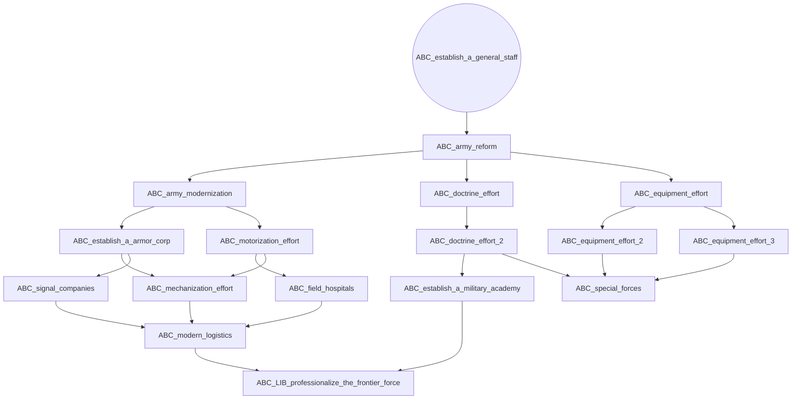

# ABC_establish_a_general_staff

```mermaid
flowchart TD
    n1["ABC_LIB_professionalize_the_frontier_force"]
    n2["ABC_army_modernization"]
    n3["ABC_army_reform"]
    n4["ABC_doctrine_effort"]
    n5["ABC_doctrine_effort_2"]
    n6["ABC_equipment_effort"]
    n7["ABC_equipment_effort_2"]
    n8["ABC_equipment_effort_3"]
    n9["ABC_establish_a_armor_corp"]
    n10(("ABC_establish_a_general_staff"))
    n11["ABC_establish_a_military_academy"]
    n12["ABC_field_hospitals"]
    n13["ABC_mechanization_effort"]
    n14["ABC_modern_logistics"]
    n15["ABC_motorization_effort"]
    n16["ABC_signal_companies"]
    n17["ABC_special_forces"]
    n11 --> n1
    n14 --> n1
    n3 --> n2
    n10 --> n3
    n3 --> n4
    n4 --> n5
    n3 --> n6
    n6 --> n7
    n6 --> n8
    n2 --> n9
    n5 --> n11
    n15 --> n12
    n9 --> n13
    n15 --> n13
    n12 --> n14
    n13 --> n14
    n16 --> n14
    n2 --> n15
    n9 --> n16
    n8 --> n17
    n5 --> n17
    n7 --> n17
```
