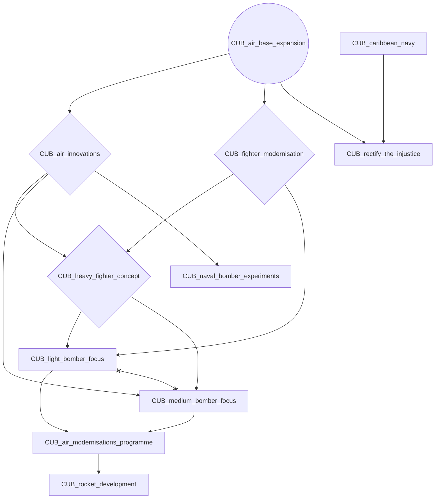
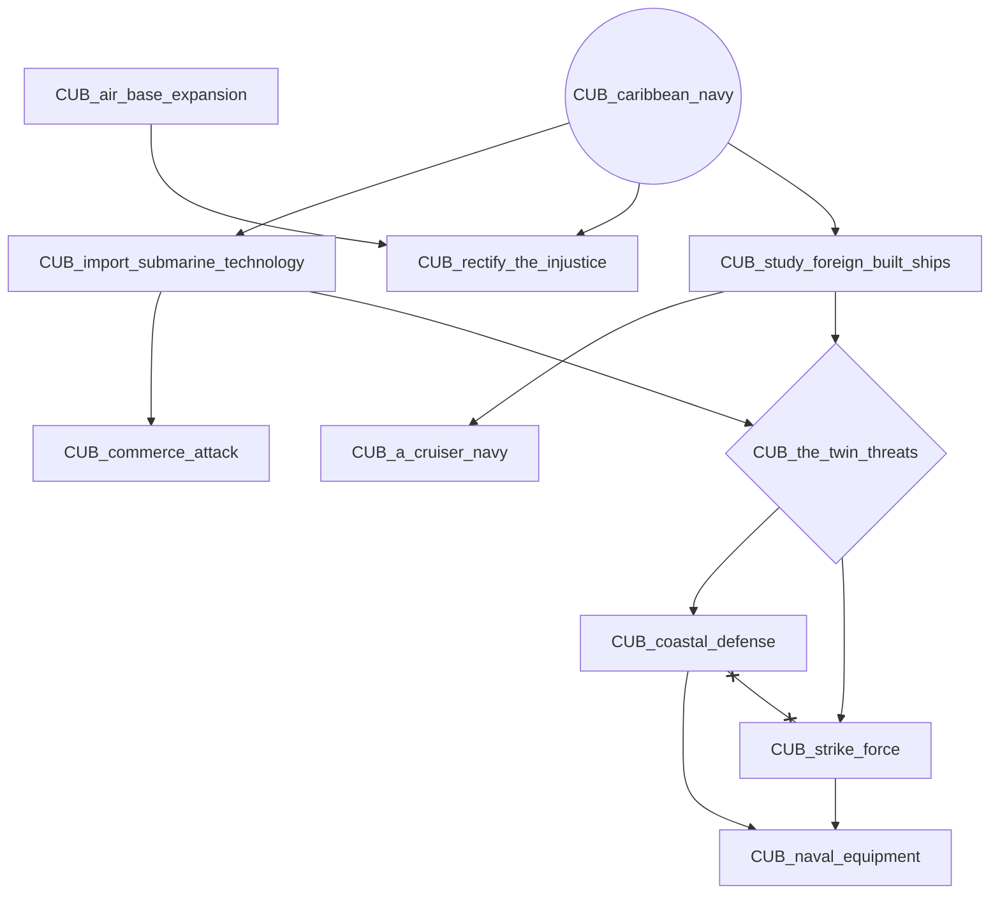
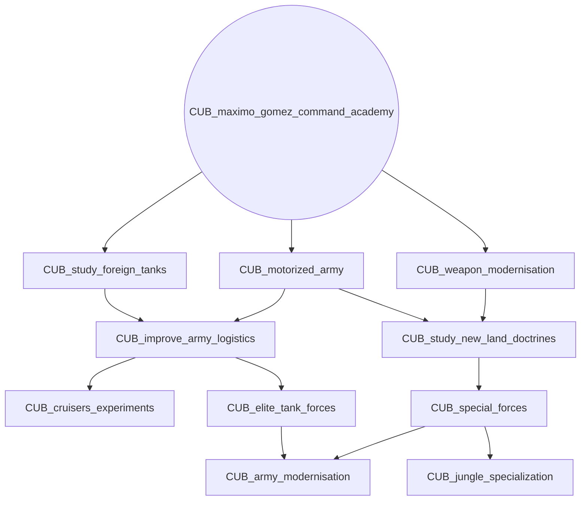
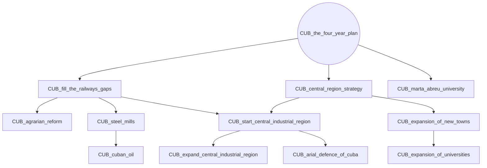

# CUB_air_base_expansion

```mermaid
flowchart TD
    n1(("CUB_air_base_expansion"))
    n2{"CUB_air_innovations"}
    n3["CUB_air_modernisations_programme"]
    n4["CUB_caribbean_navy"]
    n5{"CUB_fighter_modernisation"}
    n6{"CUB_heavy_fighter_concept"}
    n7["CUB_light_bomber_focus"]
    n8["CUB_medium_bomber_focus"]
    n9["CUB_naval_bomber_experiments"]
    n10["CUB_rectify_the_injustice"]
    n11["CUB_rocket_development"]
    n1 --> n2
    n7 --> n3
    n8 --> n3
    n1 --> n5
    n2 --> n6
    n5 --> n6
    n6 --> n7
    n5 --> n7
    n6 --> n8
    n2 --> n8
    n2 --> n9
    n1 --> n10
    n4 --> n10
    n3 --> n11
    n7 x--x n8
```

# CUB_caribbean_navy

```mermaid
flowchart TD
    n12["CUB_a_cruiser_navy"]
    n1["CUB_air_base_expansion"]
    n4(("CUB_caribbean_navy"))
    n13["CUB_coastal_defense"]
    n14["CUB_commerce_attack"]
    n15["CUB_import_submarine_technology"]
    n16["CUB_naval_equipment"]
    n10["CUB_rectify_the_injustice"]
    n17["CUB_strike_force"]
    n18["CUB_study_foreign_built_ships"]
    n19{"CUB_the_twin_threats"}
    n18 --> n12
    n19 --> n13
    n15 --> n14
    n4 --> n15
    n17 --> n16
    n13 --> n16
    n1 --> n10
    n4 --> n10
    n19 --> n17
    n4 --> n18
    n15 --> n19
    n18 --> n19
    n13 x--x n17
```

# CUB_maximo_gomez_command_academy

```mermaid
flowchart TD
    n20["CUB_army_modernisation"]
    n21["CUB_cruisers_experiments"]
    n22["CUB_elite_tank_forces"]
    n23["CUB_improve_army_logistics"]
    n24["CUB_jungle_specialization"]
    n25(("CUB_maximo_gomez_command_academy"))
    n26["CUB_motorized_army"]
    n27["CUB_special_forces"]
    n28["CUB_study_foreign_tanks"]
    n29["CUB_study_new_land_doctrines"]
    n30["CUB_weapon_modernisation"]
    n22 --> n20
    n27 --> n20
    n23 --> n21
    n23 --> n22
    n28 --> n23
    n26 --> n23
    n27 --> n24
    n25 --> n26
    n29 --> n27
    n25 --> n28
    n26 --> n29
    n30 --> n29
    n25 --> n30
```

# CUB_results_of_the_presidential_election

```mermaid
flowchart TD
    n31["CUB_adapt_the_five_year_plan"]
    n32["CUB_american_air_bases"]
    n33["CUB_american_sugar_investments"]
    n34["CUB_amphibious_invasion_preparation"]
    n35["CUB_army_expansion"]
    n36{"CUB_caribbean_dominance"}
    n37["CUB_caribbean_unity"]
    n38["CUB_collectivize_the_sugar_plantations"]
    n39["CUB_command_the_caribbean"]
    n40["CUB_communism_in_the_caribbean"]
    n41["CUB_conduct_joint_military_excercises"]
    n42["CUB_confederation_of_cuban_workers"]
    n43["CUB_create_a_central_committee"]
    n44["CUB_ctc_recruitment"]
    n45["CUB_deal_with_batista"]
    n46["CUB_deal_with_haitian_oppressors"]
    n47["CUB_deal_with_the_mafia"]
    n48["CUB_demand_jamaica_and_the_bahamas"]
    n49["CUB_demand_the_eastern_isles"]
    n50["CUB_education_for_the_masses"]
    n51["CUB_encourage_anti_communist_violence"]
    n52["CUB_end_american_imperialism"]
    n53["CUB_establish_rural_hospitals"]
    n54["CUB_establish_soviet_diplomatic_relations"]
    n55["CUB_establish_the_dgi"]
    n56["CUB_exert_influence_over_the_military"]
    n57["CUB_expand_the_plantations"]
    n58["CUB_external_interests"]
    n59["CUB_falangist_ideas_in_schools"]
    n60["CUB_fuel_the_south_american_revolution"]
    n61["CUB_galvanize_the_ctc"]
    n62["CUB_gather_political_support"]
    n63["CUB_government_reshuffle"]
    n64["CUB_implement_a_new_constitution"]
    n65["CUB_increase_education_funding"]
    n66["CUB_industrialize_the_islands"]
    n67["CUB_intervene_ACW"]
    n68["CUB_invite_NKVD_officers"]
    n69["CUB_invite_american_corporations"]
    n70["CUB_invite_german_companies"]
    n71["CUB_invite_our_spanish_brothers"]
    n72["CUB_island_development_plan"]
    n73["CUB_island_fortification_project"]
    n74["CUB_issue_amnesties"]
    n75["CUB_join_the_allies"]
    n76["CUB_join_the_reich"]
    n77["CUB_join_with_japan"]
    n78["CUB_law_of_sugar_coordination"]
    n79["CUB_lay_claim_to_curacao_and_trinidad"]
    n80["CUB_liberate_the_dominican_republic"]
    n81["CUB_military_coup"]
    n82["CUB_military_improvements"]
    n83["CUB_military_pensions"]
    n84["CUB_minimum_wage_laws"]
    n85["CUB_modernize_medical_care"]
    n86["CUB_nationalize_foreign_sugar_mills"]
    n87["CUB_one_caribbean_policy"]
    n88["CUB_oppose_the_presidency"]
    n89["CUB_overthrow_the_menocal_government"]
    n90["CUB_panhispanic_diplomacy"]
    n91["CUB_radio_mil_diez"]
    n92["CUB_reach_out_to_trujillo"]
    n93["CUB_recruit_civilian_informants"]
    n94["CUB_reduce_american_influence"]
    n95["CUB_repeal_liberal_policies"]
    n96{"CUB_results_of_the_presidential_election"}
    n97["CUB_retirement_pensions"]
    n98["CUB_rewrite_the_constitution"]
    n99["CUB_secure_power"]
    n100["CUB_secure_united_states_political_support"]
    n101["CUB_seek_falangist_support"]
    n102["CUB_seek_soviet_support"]
    n103["CUB_seize_foreign_sugar_mills"]
    n104["CUB_seize_venezuela"]
    n105["CUB_soviet_tank_factories"]
    n106["CUB_spanish_civil_war_involvement"]
    n107["CUB_special_amphibious_training"]
    n108["CUB_stabilize_internal_politics"]
    n109["CUB_state_visit_to_the_soviet_union"]
    n110["CUB_strengthen_catholic_identity"]
    n111["CUB_study_soviet_tactics"]
    n112["CUB_subjugate_hispaniola"]
    n113["CUB_subvert_american_influence"]
    n114["CUB_sugar_for_oil"]
    n115["CUB_support_communist_china"]
    n116["CUB_taxation_reforms"]
    n117["CUB_the_caribbean_guard"]
    n118["CUB_the_cuban_politburo"]
    n119["CUB_the_nine_cent_law"]
    n120["CUB_unionize_the_sugar_mills"]
    n121["CUB_unite_hispaniola"]
    n122{"CUB_victory_for_garcia_menocal"}
    n123{"CUB_victory_for_gomez"}
    n124["CUB_winning_the_battle_of_the_caribbean"]
    n89 --> n31
    n75 --> n32
    n69 --> n33
    n36 --> n34
    n36 --> n35
    n99 --> n36
    n58 --> n36
    n121 --> n37
    n103 --> n38
    n36 --> n39
    n46 --> n40
    n80 --> n40
    n92 --> n41
    n78 --> n42
    n89 --> n43
    n88 --> n44
    n99 --> n45
    n87 --> n46
    n69 --> n47
    n112 --> n48
    n112 --> n49
    n38 --> n50
    n62 --> n51
    n40 --> n52
    n85 --> n53
    n98 --> n54
    n118 --> n55
    n101 --> n56
    n38 --> n57
    n63 --> n58
    n113 --> n59
    n40 --> n60
    n88 --> n61
    n95 --> n62
    n56 --> n62
    n100 --> n63
    n63 --> n64
    n98 --> n65
    n57 --> n66
    n99 --> n67
    n58 --> n67
    n109 --> n68
    n100 --> n69
    n113 --> n70
    n39 --> n71
    n79 --> n72
    n79 --> n73
    n119 --> n74
    n94 --> n75
    n33 --> n75
    n70 --> n76
    n36 --> n77
    n84 --> n78
    n49 --> n79
    n48 --> n79
    n87 --> n80
    n123 --> n81
    n85 --> n82
    n81 --> n83
    n119 --> n84
    n98 --> n85
    n59 --> n86
    n43 --> n87
    n122 --> n88
    n120 --> n89
    n113 --> n90
    n118 --> n91
    n100 --> n92
    n55 --> n93
    n91 --> n93
    n97 --> n94
    n101 --> n95
    n84 --> n97
    n42 --> n98
    n94 --> n98
    n51 --> n99
    n81 --> n100
    n122 --> n101
    n61 --> n102
    n31 --> n103
    n79 --> n104
    n111 --> n105
    n68 --> n105
    n99 --> n106
    n58 --> n106
    n34 --> n107
    n99 --> n108
    n63 --> n108
    n43 --> n109
    n59 --> n110
    n109 --> n111
    n36 --> n112
    n108 --> n113
    n57 --> n114
    n40 --> n115
    n119 --> n116
    n81 --> n116
    n35 --> n117
    n43 --> n118
    n123 --> n119
    n44 --> n120
    n61 --> n120
    n92 --> n121
    n96 --> n122
    n96 --> n123
    n75 --> n124
    n39 x--x n77
    n81 x--x n119
    n88 x--x n101
    n122 x--x n123
```

# CUB_the_four_year_plan

```mermaid
flowchart TD
    n125["CUB_agrarian_reform"]
    n126["CUB_arial_defence_of_cuba"]
    n127["CUB_central_region_strategy"]
    n128["CUB_cuban_oil"]
    n129["CUB_expand_central_industrial_region"]
    n130["CUB_expansion_of_new_towns"]
    n131["CUB_expansion_of_universities"]
    n132["CUB_fill_the_railways_gaps"]
    n133["CUB_marta_abreu_university"]
    n134["CUB_start_central_industrial_region"]
    n135["CUB_steel_mills"]
    n136(("CUB_the_four_year_plan"))
    n132 --> n125
    n134 --> n126
    n136 --> n127
    n135 --> n128
    n134 --> n129
    n127 --> n130
    n130 --> n131
    n136 --> n132
    n136 --> n133
    n132 --> n134
    n127 --> n134
    n132 --> n135
```
