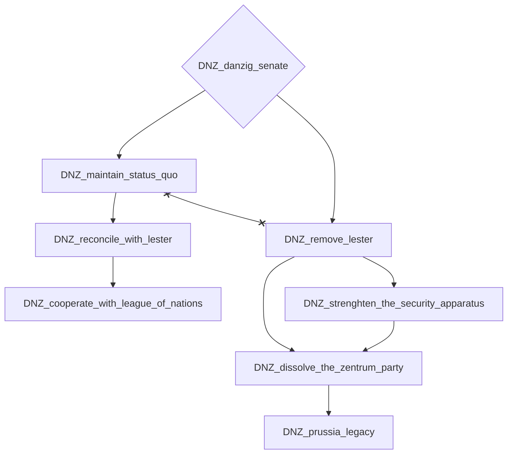
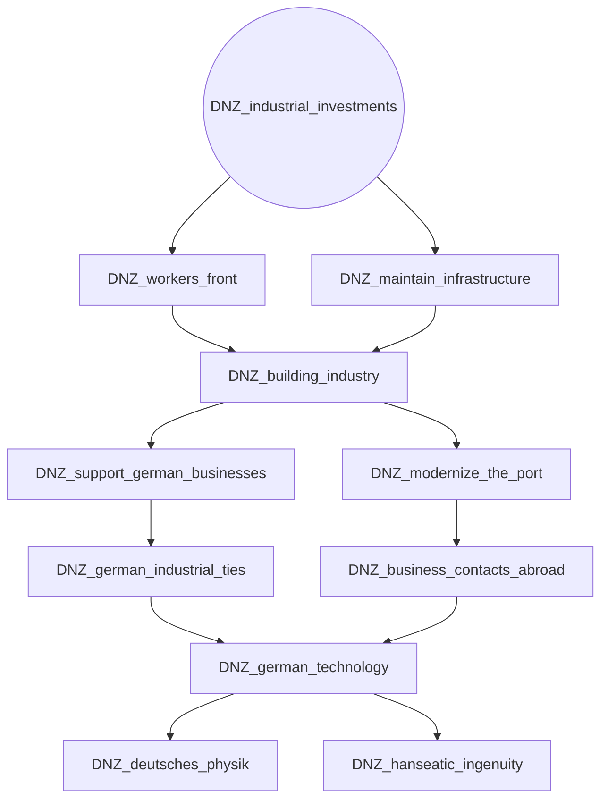
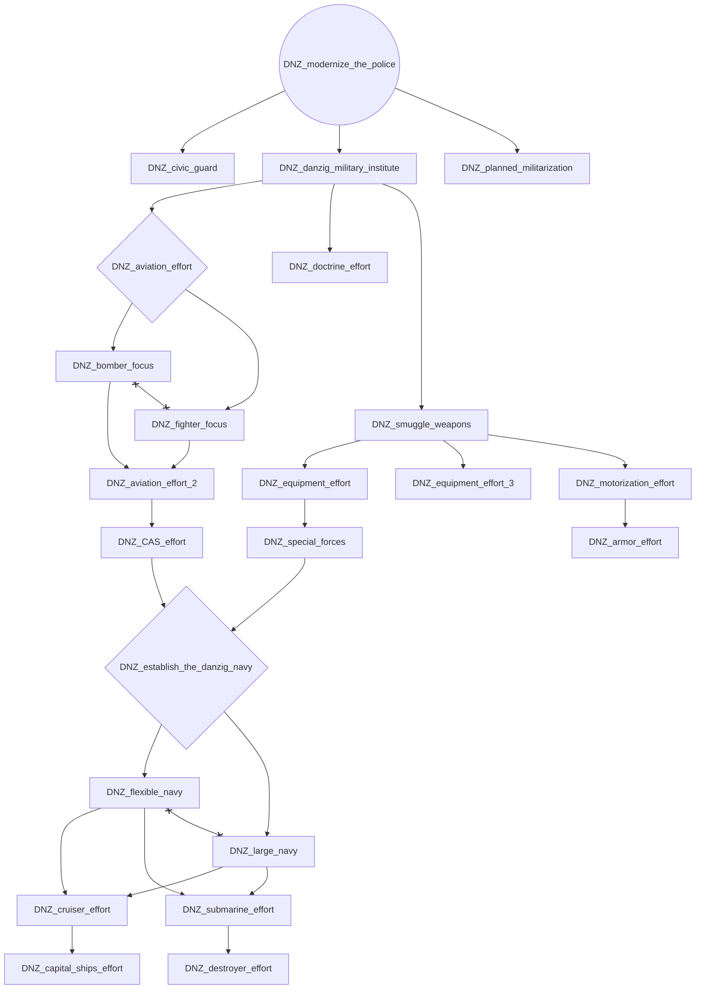

# DNZ_danzig_senate

```mermaid
flowchart TD
    n1["DNZ_cooperate_with_league_of_nations"]
    n2{"DNZ_danzig_senate"}
    n3["DNZ_dissolve_the_zentrum_party"]
    n4["DNZ_maintain_status_quo"]
    n5["DNZ_prussia_legacy"]
    n6["DNZ_reconcile_with_lester"]
    n7["DNZ_remove_lester"]
    n8["DNZ_strenghten_the_security_apparatus"]
    n6 --> n1
    n7 --> n3
    n8 --> n3
    n2 --> n4
    n3 --> n5
    n4 --> n6
    n2 --> n7
    n7 --> n8
    n4 x--x n7
```

# DNZ_industrial_investments

```mermaid
flowchart TD
    n9["DNZ_building_industry"]
    n10["DNZ_business_contacts_abroad"]
    n11["DNZ_deutsches_physik"]
    n12["DNZ_german_industrial_ties"]
    n13["DNZ_german_technology"]
    n14["DNZ_hanseatic_ingenuity"]
    n15(("DNZ_industrial_investments"))
    n16["DNZ_maintain_infrastructure"]
    n17["DNZ_modernize_the_port"]
    n18["DNZ_support_german_businesses"]
    n19["DNZ_workers_front"]
    n19 --> n9
    n16 --> n9
    n17 --> n10
    n13 --> n11
    n18 --> n12
    n12 --> n13
    n10 --> n13
    n13 --> n14
    n15 --> n16
    n9 --> n17
    n9 --> n18
    n15 --> n19
```

# DNZ_modernize_the_police

```mermaid
flowchart TD
    n20["DNZ_CAS_effort"]
    n21["DNZ_armor_effort"]
    n22{"DNZ_aviation_effort"}
    n23["DNZ_aviation_effort_2"]
    n24["DNZ_bomber_focus"]
    n25["DNZ_capital_ships_effort"]
    n26["DNZ_civic_guard"]
    n27["DNZ_cruiser_effort"]
    n28["DNZ_danzig_military_institute"]
    n29["DNZ_destroyer_effort"]
    n30["DNZ_doctrine_effort"]
    n31["DNZ_equipment_effort"]
    n32["DNZ_equipment_effort_3"]
    n33{"DNZ_establish_the_danzig_navy"}
    n34["DNZ_fighter_focus"]
    n35["DNZ_flexible_navy"]
    n36["DNZ_large_navy"]
    n37(("DNZ_modernize_the_police"))
    n38["DNZ_motorization_effort"]
    n39["DNZ_planned_militarization"]
    n40["DNZ_smuggle_weapons"]
    n41["DNZ_special_forces"]
    n42["DNZ_submarine_effort"]
    n23 --> n20
    n38 --> n21
    n28 --> n22
    n24 --> n23
    n34 --> n23
    n22 --> n24
    n27 --> n25
    n37 --> n26
    n36 --> n27
    n35 --> n27
    n37 --> n28
    n42 --> n29
    n28 --> n30
    n40 --> n31
    n40 --> n32
    n41 --> n33
    n20 --> n33
    n22 --> n34
    n33 --> n35
    n33 --> n36
    n40 --> n38
    n37 --> n39
    n28 --> n40
    n31 --> n41
    n35 --> n42
    n36 --> n42
    n24 x--x n34
    n35 x--x n36
```
