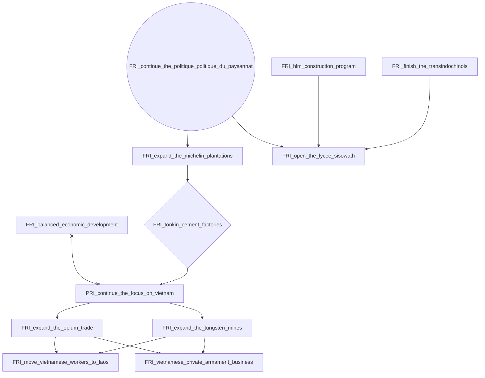
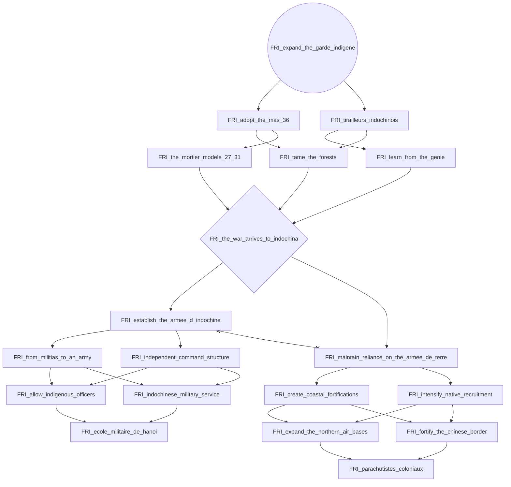
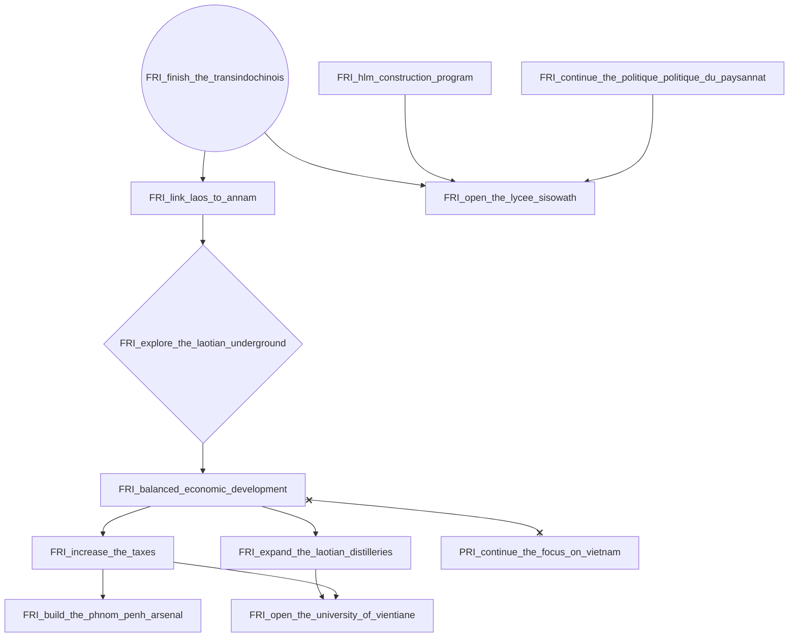
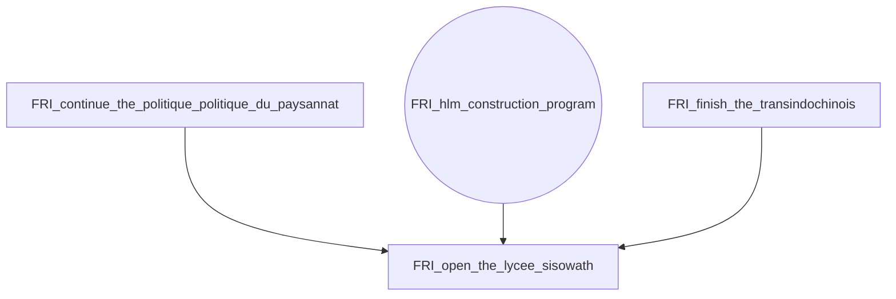
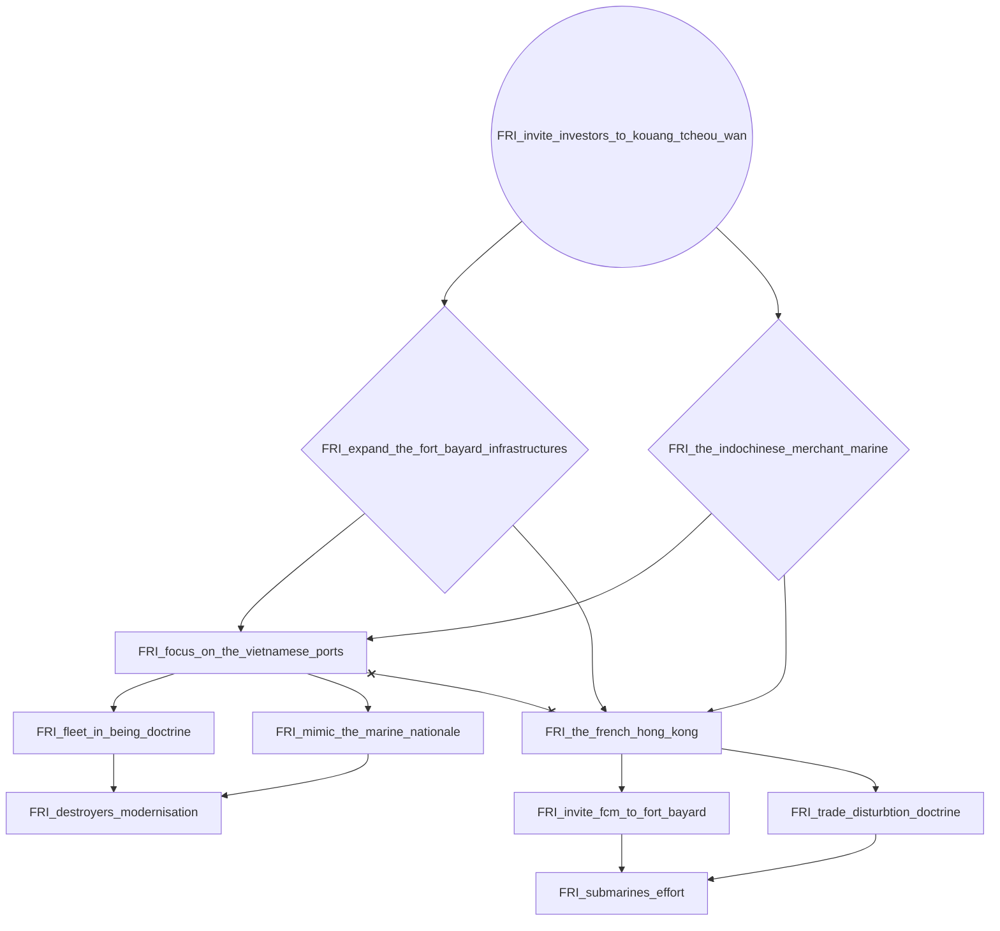

# FRI_continue_the_politique_politique_du_paysannat

# FRI_expand_the_garde_indigene

# FRI_finish_the_transindochinois

# FRI_gouverneur_jules_brevie

```mermaid
flowchart TD
    n38["FRI_allow_political_parties"]
    n39["FRI_amnesty_law"]
    n40["FRI_concessions_to_the_strikers"]
    n41["FRI_crackdown_on_communists_organisations"]
    n42["FRI_decret_moutet"]
    n43["FRI_expand_the_surete_generale_indochinoise"]
    n44["FRI_freedom_of_speech_and_association"]
    n45["FRI_fuelling_the_metropole"]
    n46(("FRI_gouverneur_jules_brevie"))
    n47["FRI_plan_mandel"]
    n48["FRI_the_second_yen_bai_mutiny"]
    n39 --> n38
    n40 --> n39
    n46 --> n40
    n43 --> n41
    n38 --> n41
    n40 --> n42
    n39 --> n43
    n42 --> n43
    n42 --> n44
    n43 --> n45
    n44 --> n45
    n41 --> n47
    n45 --> n47
    n46 --> n48
```

# FRI_hlm_construction_program

# FRI_invite_investors_to_kouang_tcheou_wan

