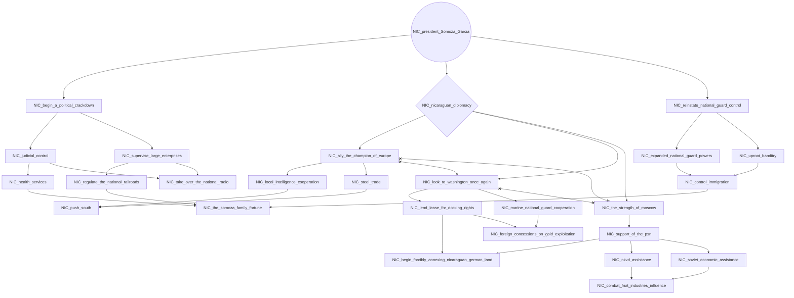

# NIC_president_Somoza_Garcia

```mermaid
flowchart TD
    n1["NIC_ally_the_champion_of_europe"]
    n2["NIC_begin_a_political_crackdown"]
    n3["NIC_begin_forcibly_annexing_nicaraguan_german_land"]
    n4["NIC_combat_fruit_industries_influence"]
    n5["NIC_control_immigration"]
    n6["NIC_expanded_national_guard_powers"]
    n7["NIC_foreign_concessions_on_gold_exploitation"]
    n8["NIC_health_services"]
    n9["NIC_judicial_control"]
    n10["NIC_lend_lease_for_docking_rights"]
    n11["NIC_local_intelligence_cooperation"]
    n12["NIC_look_to_washington_once_again"]
    n13["NIC_marine_national_guard_cooperation"]
    n14{"NIC_nicaraguan_diplomacy"}
    n15["NIC_nkvd_assistance"]
    n16(("NIC_president_Somoza_Garcia"))
    n17["NIC_push_south"]
    n18["NIC_regulate_the_national_railroads"]
    n19["NIC_reinstate_national_guard_control"]
    n20["NIC_soviet_economic_assistance"]
    n21["NIC_steel_trade"]
    n22["NIC_supervise_large_enterprises"]
    n23["NIC_support_of_the_psn"]
    n24["NIC_take_over_the_national_radio"]
    n25["NIC_the_somoza_family_fortune"]
    n26["NIC_the_strength_of_moscow"]
    n27["NIC_uproot_banditry"]
    n14 --> n1
    n16 --> n2
    n23 --> n3
    n10 --> n3
    n15 --> n4
    n20 --> n4
    n27 --> n5
    n6 --> n5
    n19 --> n6
    n10 --> n7
    n13 --> n7
    n9 --> n8
    n2 --> n9
    n12 --> n10
    n1 --> n11
    n14 --> n12
    n12 --> n13
    n16 --> n14
    n23 --> n15
    n11 --> n17
    n21 --> n17
    n22 --> n18
    n16 --> n19
    n23 --> n20
    n1 --> n21
    n2 --> n22
    n26 --> n23
    n9 --> n24
    n22 --> n24
    n5 --> n25
    n18 --> n25
    n8 --> n25
    n14 --> n26
    n19 --> n27
    n1 x--x n12
    n1 x--x n26
    n12 x--x n26
```
