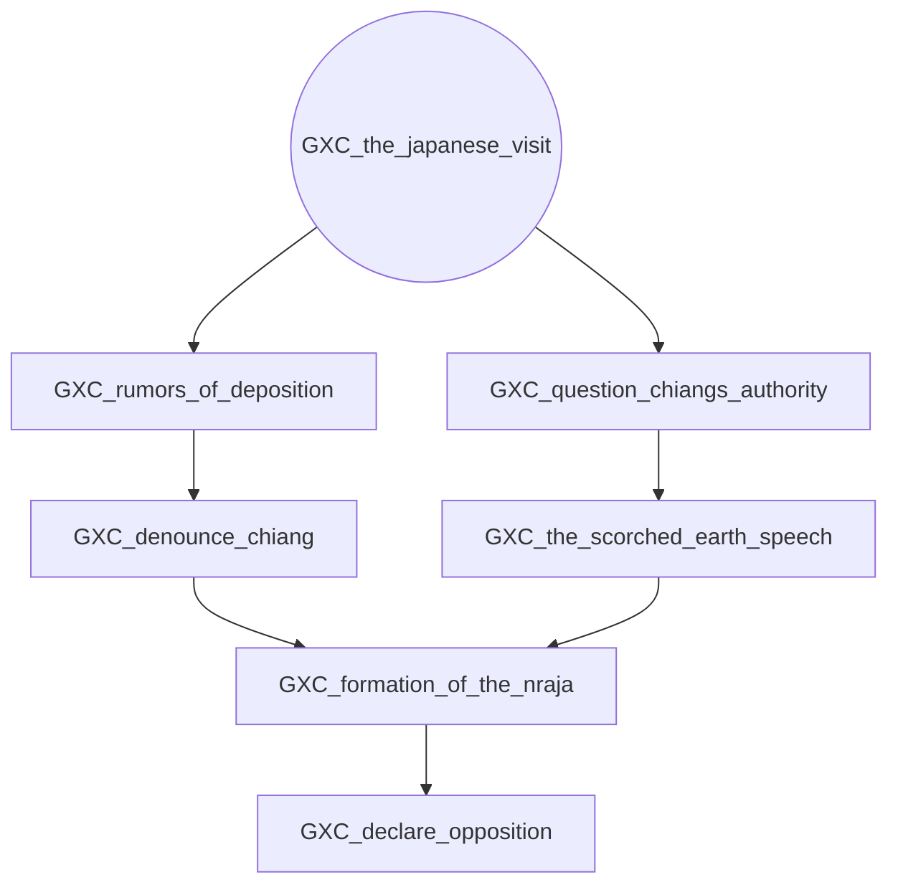

# GXC_the_japanese_visit

```mermaid
flowchart TD
    n1["GXC_declare_opposition"]
    n2["GXC_denounce_chiang"]
    n3["GXC_formation_of_the_nraja"]
    n4["GXC_question_chiangs_authority"]
    n5["GXC_rumors_of_deposition"]
    n6(("GXC_the_japanese_visit"))
    n7["GXC_the_scorched_earth_speech"]
    n3 --> n1
    n5 --> n2
    n2 --> n3
    n7 --> n3
    n6 --> n4
    n6 --> n5
    n4 --> n7
```
