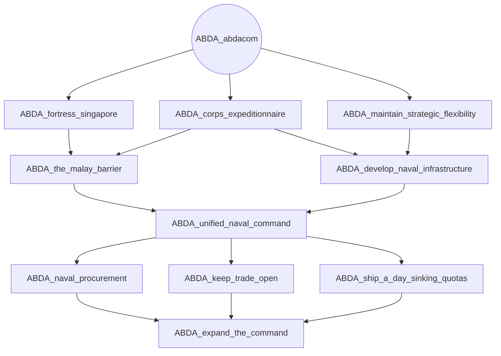

# ABDA_abdacom

```mermaid
flowchart TD
    n1(("ABDA_abdacom"))
    n2["ABDA_corps_expeditionnaire"]
    n3["ABDA_develop_naval_infrastructure"]
    n4["ABDA_expand_the_command"]
    n5["ABDA_fortress_singapore"]
    n6["ABDA_keep_trade_open"]
    n7["ABDA_maintain_strategic_flexibility"]
    n8["ABDA_naval_procurement"]
    n9["ABDA_ship_a_day_sinking_quotas"]
    n10["ABDA_the_malay_barrier"]
    n11["ABDA_unified_naval_command"]
    n1 --> n2
    n2 --> n3
    n7 --> n3
    n8 --> n4
    n6 --> n4
    n9 --> n4
    n1 --> n5
    n11 --> n6
    n1 --> n7
    n11 --> n8
    n11 --> n9
    n5 --> n10
    n2 --> n10
    n10 --> n11
    n3 --> n11
```
