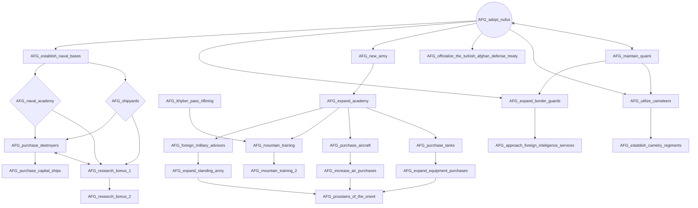
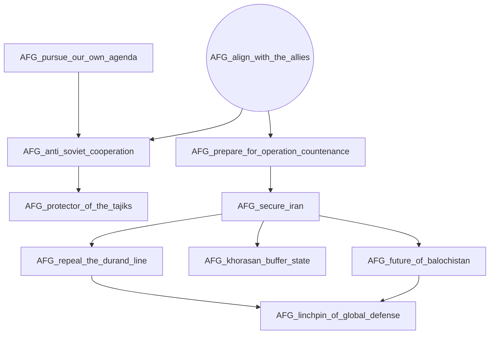
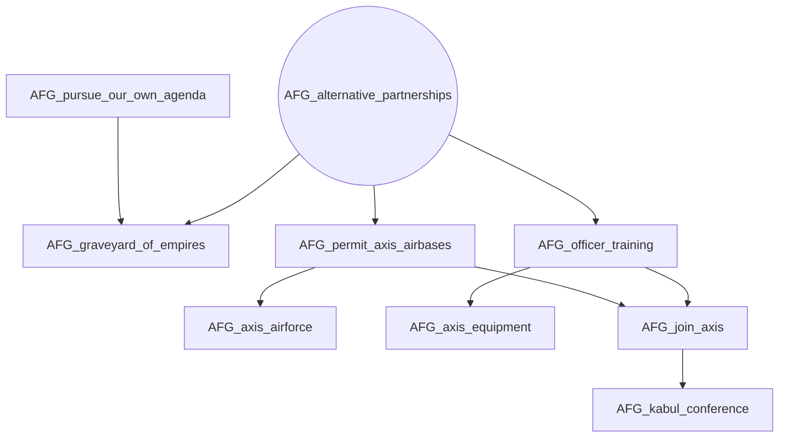
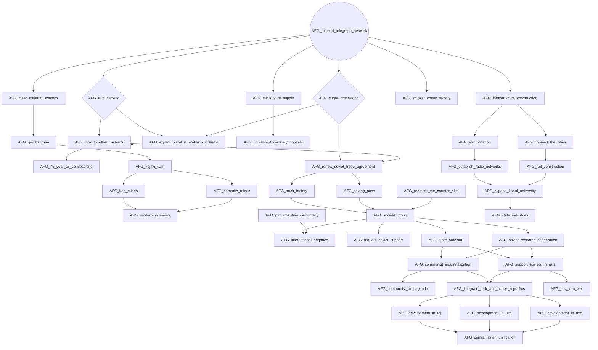
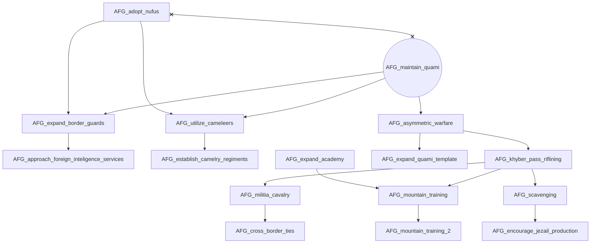
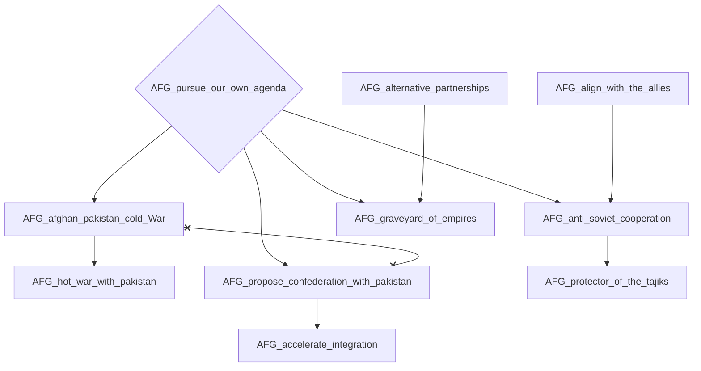
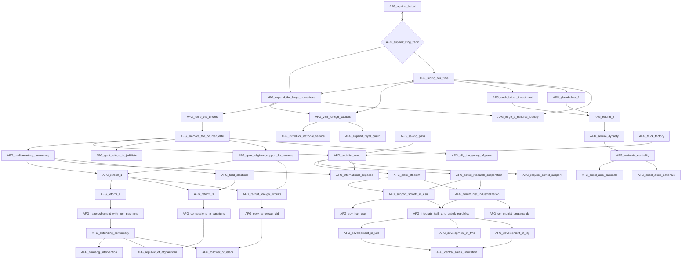

# AFG_adopt_nufus

# AFG_against_kabul

```mermaid
flowchart TD
    n27{"AFG_against_kabul"}
    n28["AFG_agreement_with_germany"]
    n29["AFG_alliance_with_turkik_peoples"]
    n30["AFG_ally_basmachi_remnants"]
    n31["AFG_ally_the_brahui_khanate"]
    n32["AFG_ally_the_sikhs"]
    n33["AFG_appraoch_anti_communist_theologians"]
    n34["AFG_contact_amanullah_loyalists"]
    n35["AFG_contact_rural_loyalists"]
    n36["AFG_crown_the_bukharan_emir"]
    n37["AFG_crown_the_golden_emir"]
    n38["AFG_custail_pashtunwali_primacy"]
    n39["AFG_darulaman_university"]
    n40["AFG_education_for_women_and_girls"]
    n41["AFG_enforce_the_pashtunwali"]
    n42["AFG_enforce_western_attire"]
    n43["AFG_establish_darulaman"]
    n44["AFG_expand_state_run_factories"]
    n45["AFG_expand_the_madrasas"]
    n46["AFG_exploit_turko_persian_heritage"]
    n47["AFG_extend_a_hand_to_tokyo"]
    n48["AFG_eyes_on_the_north"]
    n49["AFG_form_the_khuddamul_furqan"]
    n50["AFG_form_the_turkestan_legion"]
    n51["AFG_fortify_pakistan"]
    n52{"AFG_from_the_ashes"}
    n53["AFG_hold_a_loya_jirga"]
    n54["AFG_hone_the_shamshir"]
    n55["AFG_increase_land_and_animal_taxes"]
    n56["AFG_instate_a_compulsory_jizya"]
    n57["AFG_integrate_the_basmachi_movement"]
    n58["AFG_into_the_plains_of_india"]
    n59["AFG_invite_the_mughal_prince"]
    n60["AFG_invite_waziristan_rebels"]
    n61["AFG_pashtun_empire"]
    n62["AFG_prepare_the_war_industries"]
    n63["AFG_proclaim_a_new_caliphate"]
    n64["AFG_proclaim_the_second_afghan_empire"]
    n65["AFG_promote_muslim_work_ethic"]
    n66["AFG_raise_lashkar_regiments"]
    n67["AFG_rebuild_the_silk_road"]
    n68["AFG_reclaim_moghulistan"]
    n69["AFG_reclaim_the_emperors_lost_domain"]
    n70["AFG_reclaim_transoxiana"]
    n71["AFG_red_threat"]
    n72["AFG_rehabilitate_the_saqqawists"]
    n73["AFG_reinforce_the_royal_guard"]
    n74["AFG_reintroduce_heavy_cavalry"]
    n75["AFG_reintroduce_war_elephants"]
    n76["AFG_remember_the_khost_rebellion"]
    n77["AFG_renounce_the_durand_line"]
    n78["AFG_reorganize_the_royal_guard"]
    n79["AFG_request_german_support"]
    n80["AFG_request_japanese_support"]
    n81["AFG_restore_herat"]
    n82["AFG_restore_the_timurid_empire"]
    n83["AFG_return_of_the_emir"]
    n84["AFG_return_to_delhi"]
    n85["AFG_revive_the_1923_constitution"]
    n86["AFG_revive_the_workshop_of_the_world"]
    n87["AFG_savior_of_the_holy_lands"]
    n88["AFG_secure_army_support"]
    n89["AFG_secure_baghdad"]
    n90["AFG_stir_unrest_in_the_east"]
    n91["AFG_support_king_zahir"]
    n92["AFG_support_nort_west_frontier_rebels"]
    n93["AFG_the_amu_darya_plan"]
    n94["AFG_the_conquerors_of_persia"]
    n95["AFG_the_crown_and_the_world"]
    n96["AFG_the_echoes_of_panipat"]
    n97{"AFG_the_faqirs_revolt"}
    n98["AFG_timurid_bureaucracy"]
    n99["AFG_topple_iran"]
    n100["AFG_ulugh_beg_academy"]
    n101["AFG_unify_the_islamic_world"]
    n102["AFG_unite_pashtunistan"]
    n103["AFG_work_with_gestapo"]
    n38 --> n28
    n48 --> n29
    n38 --> n30
    n57 --> n31
    n98 --> n32
    n92 --> n33
    n27 --> n34
    n34 --> n35
    n76 --> n35
    n97 --> n36
    n97 --> n37
    n73 --> n38
    n43 --> n39
    n85 --> n40
    n37 --> n41
    n85 --> n42
    n40 --> n43
    n42 --> n44
    n97 --> n45
    n52 --> n46
    n97 --> n47
    n38 --> n48
    n37 --> n49
    n33 --> n50
    n77 --> n51
    n38 --> n52
    n35 --> n53
    n59 --> n54
    n36 --> n54
    n44 --> n55
    n49 --> n56
    n81 --> n57
    n51 --> n58
    n97 --> n59
    n76 --> n60
    n58 --> n61
    n71 --> n61
    n72 --> n62
    n65 --> n62
    n102 --> n63
    n81 --> n64
    n54 --> n64
    n45 --> n65
    n37 --> n66
    n84 --> n67
    n59 --> n68
    n93 --> n69
    n84 --> n70
    n29 --> n71
    n45 --> n72
    n40 --> n73
    n42 --> n73
    n78 --> n74
    n78 --> n75
    n27 --> n76
    n38 --> n77
    n45 --> n78
    n34 --> n79
    n76 --> n79
    n76 --> n80
    n36 --> n81
    n67 --> n82
    n88 --> n83
    n98 --> n84
    n54 --> n84
    n83 --> n85
    n62 --> n86
    n100 --> n86
    n89 --> n87
    n34 --> n88
    n46 --> n89
    n99 --> n89
    n76 --> n90
    n49 --> n92
    n41 --> n92
    n96 --> n93
    n64 --> n94
    n84 --> n94
    n82 --> n95
    n64 --> n96
    n57 --> n96
    n90 --> n97
    n60 --> n97
    n59 --> n98
    n52 --> n99
    n72 --> n100
    n65 --> n100
    n97 --> n101
    n33 --> n102
    n28 --> n103
    n27 x--x n91
    n34 x--x n76
    n36 x--x n37
    n36 x--x n59
    n37 x--x n59
    n46 x--x n99
    n47 x--x n101
```

# AFG_align_with_the_allies

# AFG_alternative_partnerships

# AFG_expand_telegraph_network

# AFG_maintain_quami

# AFG_pursue_our_own_agenda

# AFG_support_king_zahir

