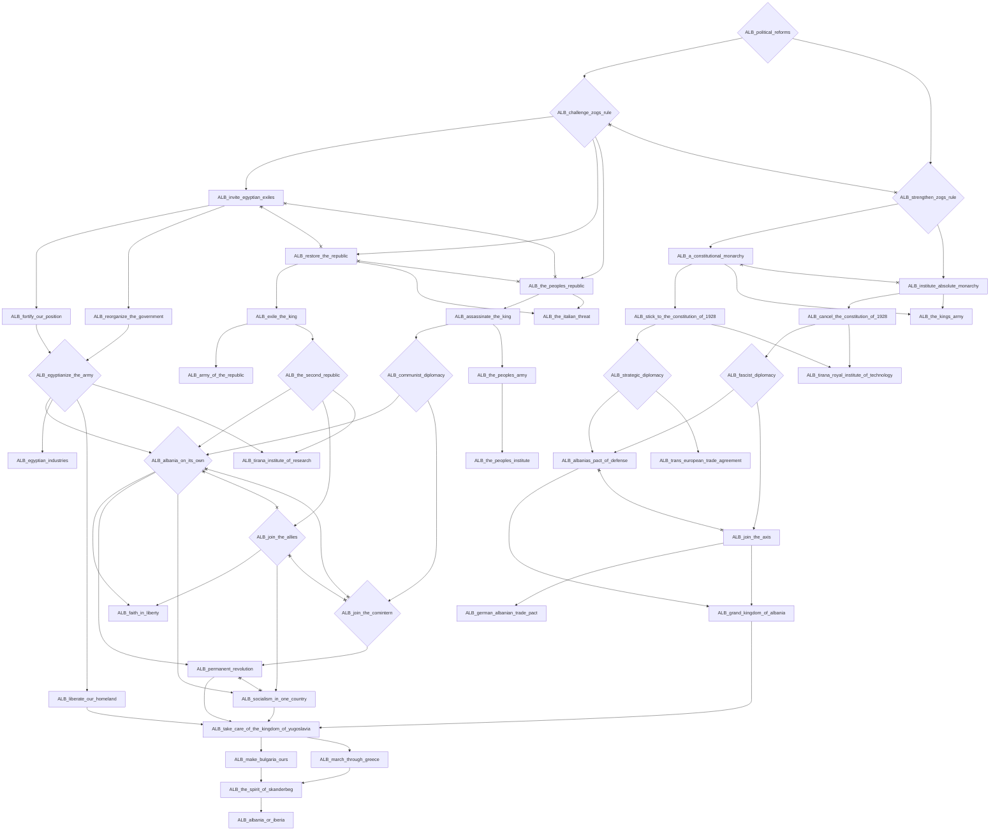
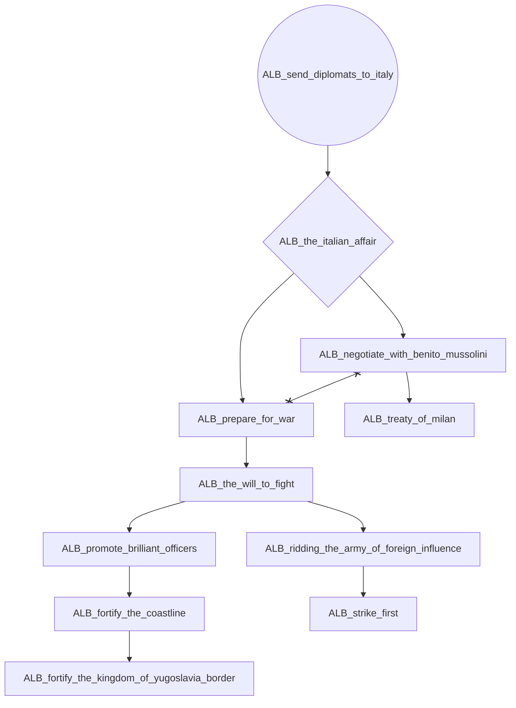

# ALB_political_reforms

```mermaid
flowchart TD
    n1["ALB_a_constitutional_monarchy"]
    n2{"ALB_albania_on_its_own"}
    n3["ALB_albania_or_iberia"]
    n4["ALB_albanias_pact_of_defense"]
    n5["ALB_army_of_the_republic"]
    n6["ALB_assassinate_the_king"]
    n7["ALB_cancel_the_constitution_of_1928"]
    n8{"ALB_challenge_zogs_rule"}
    n9{"ALB_communist_diplomacy"}
    n10["ALB_egyptian_industries"]
    n11{"ALB_egyptianize_the_army"}
    n12["ALB_exile_the_king"]
    n13["ALB_faith_in_liberty"]
    n14{"ALB_fascist_diplomacy"}
    n15["ALB_fortify_our_position"]
    n16["ALB_german_albanian_trade_pact"]
    n17["ALB_grand_kingdom_of_albania"]
    n18["ALB_institute_absolute_monarchy"]
    n19["ALB_invite_egyptian_exiles"]
    n20{"ALB_join_the_allies"}
    n21["ALB_join_the_axis"]
    n22{"ALB_join_the_comintern"}
    n23["ALB_liberate_our_homeland"]
    n24["ALB_make_bulgaria_ours"]
    n25["ALB_march_through_greece"]
    n26["ALB_permanent_revolution"]
    n27{"ALB_political_reforms"}
    n28["ALB_reorganize_the_government"]
    n29["ALB_restore_the_republic"]
    n30["ALB_socialism_in_one_country"]
    n31["ALB_stick_to_the_constitution_of_1928"]
    n32{"ALB_strategic_diplomacy"}
    n33{"ALB_strengthen_zogs_rule"}
    n34["ALB_take_care_of_the_kingdom_of_yugoslavia"]
    n35["ALB_the_italian_threat"]
    n36["ALB_the_kings_army"]
    n37["ALB_the_peoples_army"]
    n38["ALB_the_peoples_institute"]
    n39["ALB_the_peoples_republic"]
    n40{"ALB_the_second_republic"}
    n41["ALB_the_spirit_of_skanderbeg"]
    n42["ALB_tirana_institute_of_research"]
    n43["ALB_tirana_royal_institute_of_technology"]
    n44["ALB_trans_european_trade_agreement"]
    n33 --> n1
    n40 --> n2
    n9 --> n2
    n11 --> n2
    n41 --> n3
    n32 --> n4
    n14 --> n4
    n12 --> n5
    n39 --> n6
    n18 --> n7
    n27 --> n8
    n6 --> n9
    n11 --> n10
    n28 --> n11
    n15 --> n11
    n29 --> n12
    n20 --> n13
    n2 --> n13
    n7 --> n14
    n19 --> n15
    n21 --> n16
    n21 --> n17
    n4 --> n17
    n33 --> n18
    n8 --> n19
    n40 --> n20
    n14 --> n21
    n9 --> n22
    n11 --> n23
    n34 --> n24
    n34 --> n25
    n22 --> n26
    n2 --> n26
    n19 --> n28
    n8 --> n29
    n20 --> n30
    n2 --> n30
    n1 --> n31
    n31 --> n32
    n27 --> n33
    n17 --> n34
    n26 --> n34
    n30 --> n34
    n23 --> n34
    n39 --> n35
    n29 --> n35
    n18 --> n36
    n1 --> n36
    n6 --> n37
    n37 --> n38
    n8 --> n39
    n12 --> n40
    n25 --> n41
    n24 --> n41
    n40 --> n42
    n11 --> n42
    n31 --> n43
    n7 --> n43
    n32 --> n44
    n1 x--x n18
    n2 x--x n20
    n2 x--x n22
    n4 x--x n21
    n8 x--x n33
    n19 x--x n29
    n19 x--x n39
    n20 x--x n22
    n26 x--x n30
    n29 x--x n39
```

# ALB_send_diplomats_to_italy

```mermaid
flowchart TD
    n45["ALB_fortify_the_coastline"]
    n46["ALB_fortify_the_kingdom_of_yugoslavia_border"]
    n47["ALB_negotiate_with_benito_mussolini"]
    n48["ALB_prepare_for_war"]
    n49["ALB_promote_brilliant_officers"]
    n50["ALB_ridding_the_army_of_foreign_influence"]
    n51(("ALB_send_diplomats_to_italy"))
    n52["ALB_strike_first"]
    n53{"ALB_the_italian_affair"}
    n54["ALB_the_will_to_fight"]
    n55["ALB_treaty_of_milan"]
    n49 --> n45
    n45 --> n46
    n53 --> n47
    n53 --> n48
    n54 --> n49
    n54 --> n50
    n50 --> n52
    n51 --> n53
    n48 --> n54
    n47 --> n55
    n47 x--x n48
```
