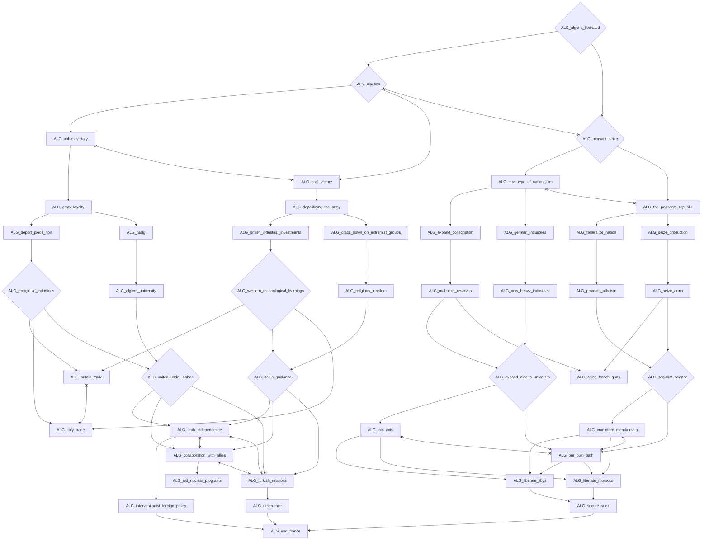
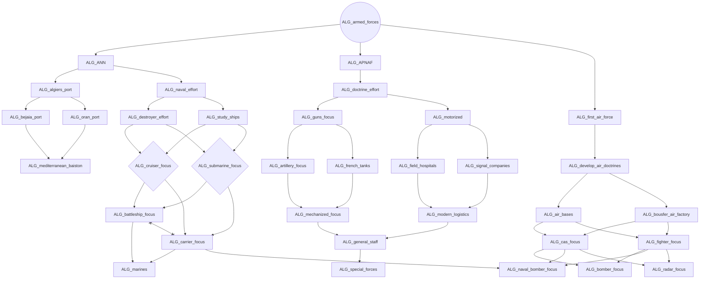
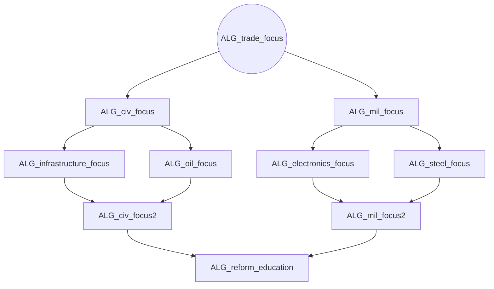

# ALG_algeria_liberated

```mermaid
flowchart TD
    n1["ALG_abbas_victory"]
    n2["ALG_aid_nuclear_programs"]
    n3{"ALG_algeria_liberated"}
    n4["ALG_algiers_university"]
    n5["ALG_arab_independence"]
    n6["ALG_army_loyalty"]
    n7["ALG_britain_trade"]
    n8["ALG_british_industrial_investments"]
    n9["ALG_collaboration_with_allies"]
    n10["ALG_comintern_membership"]
    n11["ALG_crack_down_on_extremist_groups"]
    n12["ALG_depoliticize_the_army"]
    n13["ALG_deport_pieds_noir"]
    n14["ALG_deterrence"]
    n15{"ALG_election"}
    n16["ALG_end_france"]
    n17{"ALG_expand_algeirs_university"}
    n18["ALG_expand_conscription"]
    n19["ALG_federalize_nation"]
    n20["ALG_german_industries"]
    n21["ALG_hadj_victory"]
    n22{"ALG_hadjs_guidance"}
    n23["ALG_interventionist_foreign_policy"]
    n24["ALG_italy_trade"]
    n25["ALG_join_axis"]
    n26["ALG_liberate_libya"]
    n27["ALG_liberate_morocco"]
    n28["ALG_malg"]
    n29["ALG_mobolize_reserves"]
    n30["ALG_new_heavy_industries"]
    n31["ALG_new_type_of_nationalism"]
    n32["ALG_our_own_path"]
    n33{"ALG_peasant_strike"}
    n34["ALG_promote_atheism"]
    n35["ALG_religious_freedom"]
    n36{"ALG_reorginize_industries"}
    n37["ALG_secure_suez"]
    n38["ALG_seize_arms"]
    n39["ALG_seize_french_guns"]
    n40["ALG_seize_production"]
    n41{"ALG_socialist_science"}
    n42["ALG_the_peasants_republic"]
    n43["ALG_turkish_relations"]
    n44{"ALG_united_under_abbas"}
    n45{"ALG_western_technological_learnings"}
    n15 --> n1
    n9 --> n2
    n28 --> n4
    n22 --> n5
    n44 --> n5
    n1 --> n6
    n36 --> n7
    n45 --> n7
    n12 --> n8
    n22 --> n9
    n44 --> n9
    n41 --> n10
    n12 --> n11
    n21 --> n12
    n6 --> n13
    n43 --> n14
    n3 --> n15
    n37 --> n16
    n23 --> n16
    n14 --> n16
    n30 --> n17
    n29 --> n17
    n31 --> n18
    n42 --> n19
    n31 --> n20
    n15 --> n21
    n35 --> n22
    n45 --> n22
    n5 --> n23
    n36 --> n24
    n45 --> n24
    n17 --> n25
    n10 --> n26
    n25 --> n26
    n32 --> n26
    n10 --> n27
    n25 --> n27
    n32 --> n27
    n6 --> n28
    n18 --> n29
    n20 --> n30
    n33 --> n31
    n41 --> n32
    n17 --> n32
    n3 --> n33
    n19 --> n34
    n11 --> n35
    n13 --> n36
    n27 --> n37
    n26 --> n37
    n40 --> n38
    n38 --> n39
    n29 --> n39
    n42 --> n40
    n38 --> n41
    n34 --> n41
    n33 --> n42
    n22 --> n43
    n44 --> n43
    n36 --> n44
    n4 --> n44
    n8 --> n45
    n1 x--x n21
    n5 x--x n9
    n5 x--x n43
    n7 x--x n24
    n9 x--x n43
    n10 x--x n32
    n15 x--x n33
    n25 x--x n32
    n31 x--x n42
```

# ALG_armed_forces

```mermaid
flowchart TD
    n46["ALG_ANN"]
    n47["ALG_APNAF"]
    n48["ALG_air_bases"]
    n49["ALG_algiers_port"]
    n50(("ALG_armed_forces"))
    n51["ALG_artillery_focus"]
    n52["ALG_battleship_focus"]
    n53["ALG_bejaia_port"]
    n54["ALG_bomber_focus"]
    n55["ALG_bousfer_air_factory"]
    n56["ALG_carrier_focus"]
    n57["ALG_cas_focus"]
    n58{"ALG_cruiser_focus"}
    n59["ALG_destroyer_effort"]
    n60["ALG_develop_air_doctrines"]
    n61["ALG_doctrine_effort"]
    n62["ALG_field_hospitals"]
    n63["ALG_fighter_focus"]
    n64["ALG_first_air_force"]
    n65["ALG_french_tanks"]
    n66["ALG_general_staff"]
    n67["ALG_guns_focus"]
    n68["ALG_marines"]
    n69["ALG_mechanized_focus"]
    n70["ALG_mediterranean_baiston"]
    n71["ALG_modern_logistics"]
    n72["ALG_motorized"]
    n73["ALG_naval_bomber_focus"]
    n74["ALG_naval_effort"]
    n75["ALG_oran_port"]
    n76["ALG_radar_focus"]
    n77["ALG_signal_companies"]
    n78["ALG_special_forces"]
    n79["ALG_study_ships"]
    n80{"ALG_submarine_focus"}
    n50 --> n46
    n50 --> n47
    n60 --> n48
    n46 --> n49
    n67 --> n51
    n80 --> n52
    n58 --> n52
    n49 --> n53
    n57 --> n54
    n63 --> n54
    n60 --> n55
    n80 --> n56
    n58 --> n56
    n55 --> n57
    n48 --> n57
    n59 --> n58
    n79 --> n58
    n74 --> n59
    n64 --> n60
    n47 --> n61
    n72 --> n62
    n55 --> n63
    n48 --> n63
    n50 --> n64
    n67 --> n65
    n71 --> n66
    n69 --> n66
    n61 --> n67
    n56 --> n68
    n52 --> n68
    n65 --> n69
    n51 --> n69
    n75 --> n70
    n53 --> n70
    n77 --> n71
    n62 --> n71
    n61 --> n72
    n57 --> n73
    n63 --> n73
    n56 --> n73
    n46 --> n74
    n49 --> n75
    n57 --> n76
    n63 --> n76
    n72 --> n77
    n66 --> n78
    n74 --> n79
    n79 --> n80
    n59 --> n80
    n52 x--x n56
```

# ALG_trade_focus

```mermaid
flowchart TD
    n81["ALG_civ_focus"]
    n82["ALG_civ_focus2"]
    n83["ALG_electronics_focus"]
    n84["ALG_infrastructure_focus"]
    n85["ALG_mil_focus"]
    n86["ALG_mil_focus2"]
    n87["ALG_oil_focus"]
    n88["ALG_reform_education"]
    n89["ALG_steel_focus"]
    n90(("ALG_trade_focus"))
    n90 --> n81
    n84 --> n82
    n87 --> n82
    n85 --> n83
    n81 --> n84
    n90 --> n85
    n83 --> n86
    n89 --> n86
    n81 --> n87
    n82 --> n88
    n86 --> n88
    n85 --> n89
```
