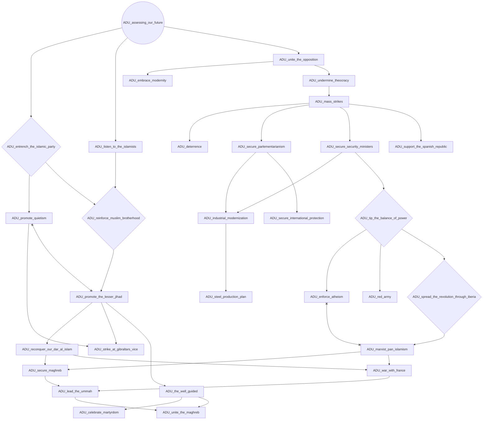

# ADU_assessing_our_future

```mermaid
flowchart TD
    n1(("ADU_assessing_our_future"))
    n2["ADU_celebrate_martyrdom"]
    n3["ADU_deterrence"]
    n4["ADU_embrace_modernity"]
    n5["ADU_enforce_atheism"]
    n6{"ADU_entrench_the_islamic_party"}
    n7["ADU_industrial_modernization"]
    n8["ADU_lead_the_ummah"]
    n9["ADU_listen_to_the_islamists"]
    n10["ADU_marxist_pan_islamism"]
    n11["ADU_mass_strikes"]
    n12["ADU_promote_quietism"]
    n13["ADU_promote_the_lesser_jihad"]
    n14["ADU_reconquer_our_dar_al_islam"]
    n15["ADU_red_army"]
    n16{"ADU_reinforce_muslim_brotherhood"}
    n17["ADU_secure_international_protection"]
    n18["ADU_secure_maghreb"]
    n19["ADU_secure_parlementarianism"]
    n20["ADU_secure_security_ministers"]
    n21{"ADU_spread_the_revolution_through_iberia"}
    n22["ADU_steel_production_plan"]
    n23["ADU_strike_at_gibraltars_vice"]
    n24["ADU_support_the_spanish_republic"]
    n25["ADU_the_well_guided"]
    n26{"ADU_tip_the_balance_of_power"}
    n27["ADU_undermine_theocracy"]
    n28["ADU_unite_the_maghreb"]
    n29["ADU_unite_the_opposition"]
    n30["ADU_war_with_france"]
    n25 --> n2
    n11 --> n3
    n29 --> n4
    n26 --> n5
    n1 --> n6
    n20 --> n7
    n19 --> n7
    n18 --> n8
    n30 --> n8
    n1 --> n9
    n21 --> n10
    n27 --> n11
    n6 --> n12
    n16 --> n13
    n13 --> n14
    n26 --> n15
    n9 --> n16
    n6 --> n16
    n19 --> n17
    n14 --> n18
    n10 --> n18
    n11 --> n19
    n11 --> n20
    n26 --> n21
    n7 --> n22
    n13 --> n23
    n12 --> n23
    n11 --> n24
    n13 --> n25
    n20 --> n26
    n29 --> n27
    n8 --> n28
    n25 --> n28
    n1 --> n29
    n14 --> n30
    n10 --> n30
    n5 x--x n10
    n12 x--x n13
```
