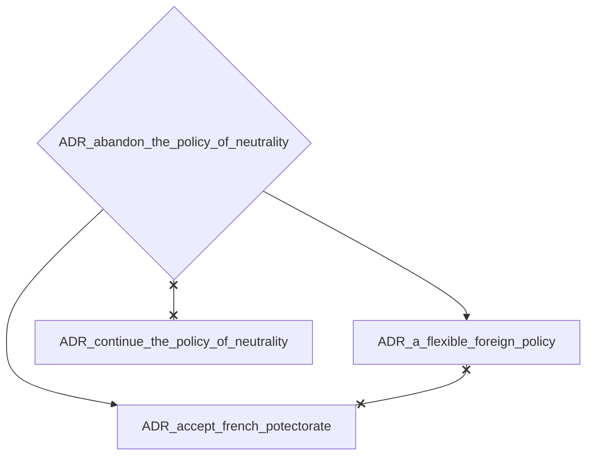
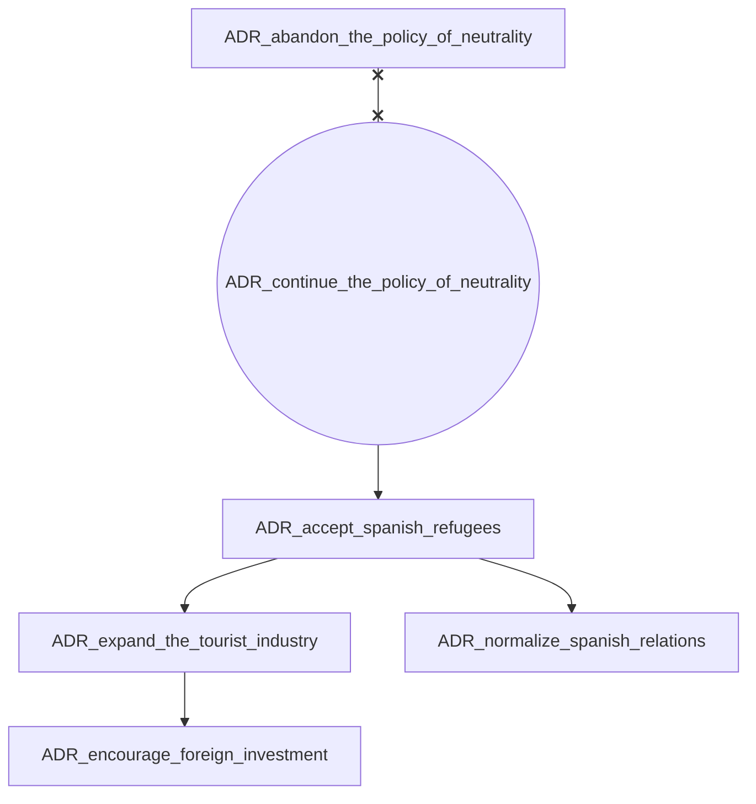

# ADR_abandon_the_policy_of_neutrality

```mermaid
flowchart TD
    n1["ADR_a_flexible_foreign_policy"]
    n2{"ADR_abandon_the_policy_of_neutrality"}
    n3["ADR_accept_french_potectorate"]
    n4["ADR_continue_the_policy_of_neutrality"]
    n2 --> n1
    n2 --> n3
    n1 x--x n3
    n2 x--x n4
```

# ADR_continue_the_policy_of_neutrality

```mermaid
flowchart TD
    n2["ADR_abandon_the_policy_of_neutrality"]
    n5["ADR_accept_spanish_refugees"]
    n4(("ADR_continue_the_policy_of_neutrality"))
    n6["ADR_encourage_foreign_investment"]
    n7["ADR_expand_the_tourist_industry"]
    n8["ADR_normalize_spanish_relations"]
    n4 --> n5
    n7 --> n6
    n5 --> n7
    n5 --> n8
    n2 x--x n4
```
