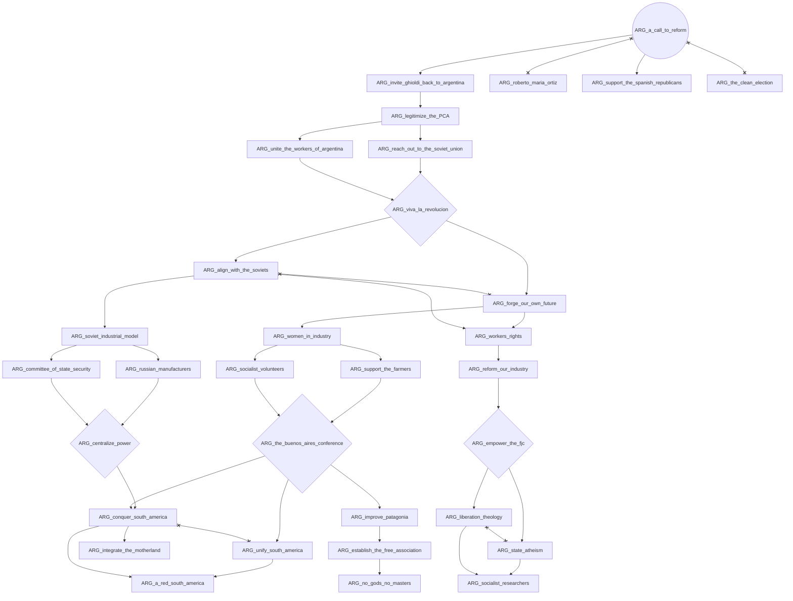
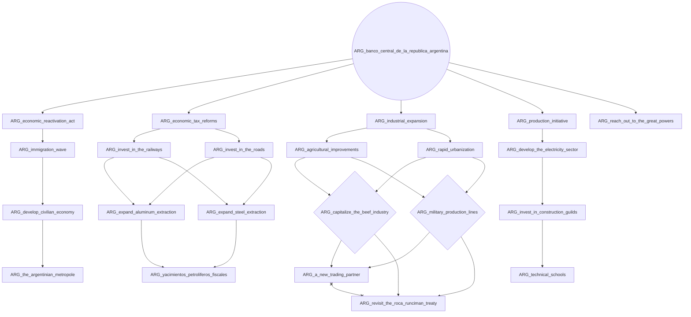
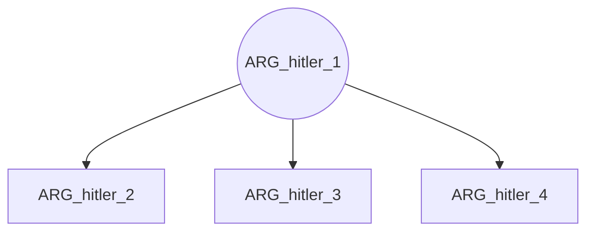
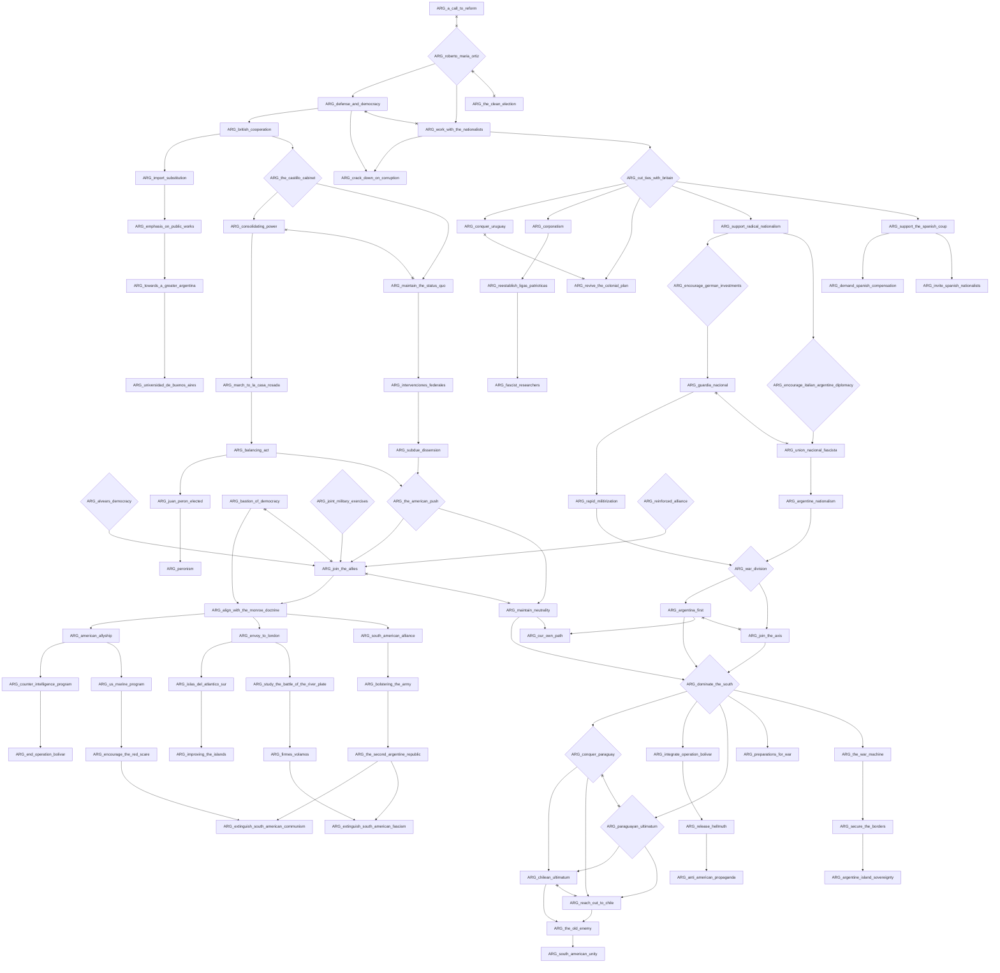
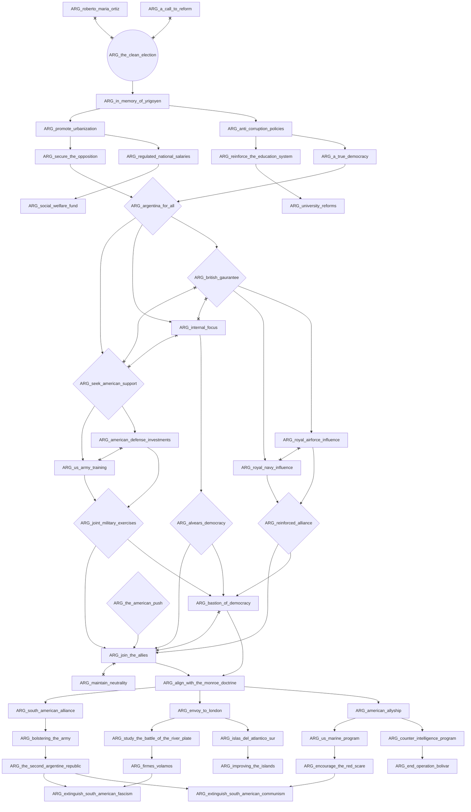

# ARG_a_call_to_reform

```mermaid
flowchart TD
    n1(("ARG_a_call_to_reform"))
    n2["ARG_a_red_south_america"]
    n3["ARG_align_with_the_soviets"]
    n4{"ARG_centralize_power"}
    n5["ARG_committee_of_state_security"]
    n6["ARG_conquer_south_america"]
    n7{"ARG_empower_the_fjc"}
    n8["ARG_establish_the_free_association"]
    n9["ARG_forge_our_own_future"]
    n10["ARG_improve_patagonia"]
    n11["ARG_integrate_the_motherland"]
    n12["ARG_invite_ghioldi_back_to_argentina"]
    n13["ARG_legitimize_the_PCA"]
    n14["ARG_liberation_theology"]
    n15["ARG_no_gods_no_masters"]
    n16["ARG_reach_out_to_the_soviet_union"]
    n17["ARG_reform_our_industry"]
    n18["ARG_roberto_maria_ortiz"]
    n19["ARG_russian_manufacturers"]
    n20["ARG_socialist_researchers"]
    n21["ARG_socialist_volunteers"]
    n22["ARG_soviet_industrial_model"]
    n23["ARG_state_atheism"]
    n24["ARG_support_the_farmers"]
    n25["ARG_support_the_spanish_republicans"]
    n26{"ARG_the_buenos_aires_conference"}
    n27["ARG_the_clean_election"]
    n28["ARG_unify_south_america"]
    n29["ARG_unite_the_workers_of_argentina"]
    n30{"ARG_viva_la_revolucion"}
    n31["ARG_women_in_industry"]
    n32["ARG_workers_rights"]
    n28 --> n2
    n6 --> n2
    n30 --> n3
    n19 --> n4
    n5 --> n4
    n22 --> n5
    n4 --> n6
    n26 --> n6
    n17 --> n7
    n10 --> n8
    n30 --> n9
    n26 --> n10
    n6 --> n11
    n1 --> n12
    n12 --> n13
    n7 --> n14
    n8 --> n15
    n13 --> n16
    n32 --> n17
    n22 --> n19
    n23 --> n20
    n14 --> n20
    n31 --> n21
    n3 --> n22
    n7 --> n23
    n31 --> n24
    n1 --> n25
    n24 --> n26
    n21 --> n26
    n26 --> n28
    n13 --> n29
    n16 --> n30
    n29 --> n30
    n9 --> n31
    n9 --> n32
    n3 --> n32
    n1 x--x n18
    n1 x--x n27
    n3 x--x n9
    n6 x--x n28
    n14 x--x n23
```

# ARG_banco_central_de_la_republica_argentina

```mermaid
flowchart TD
    n33["ARG_a_new_trading_partner"]
    n34["ARG_agricultural_improvements"]
    n35(("ARG_banco_central_de_la_republica_argentina"))
    n36{"ARG_capitalize_the_beef_industry"}
    n37["ARG_develop_civilian_economy"]
    n38["ARG_develop_the_electricity_sector"]
    n39["ARG_economic_reactivation_act"]
    n40["ARG_economic_tax_reforms"]
    n41["ARG_expand_aluminum_extraction"]
    n42["ARG_expand_steel_extraction"]
    n43["ARG_immigration_wave"]
    n44["ARG_industrial_expansion"]
    n45["ARG_invest_in_construction_guilds"]
    n46["ARG_invest_in_the_railways"]
    n47["ARG_invest_in_the_roads"]
    n48{"ARG_military_production_lines"}
    n49["ARG_production_initiative"]
    n50["ARG_rapid_urbanization"]
    n51["ARG_reach_out_to_the_great_powers"]
    n52["ARG_revisit_the_roca_runciman_treaty"]
    n53["ARG_technical_schools"]
    n54["ARG_the_argentinian_metropole"]
    n55["ARG_yacimientos_petroliferos_fiscales"]
    n36 --> n33
    n48 --> n33
    n44 --> n34
    n34 --> n36
    n50 --> n36
    n43 --> n37
    n49 --> n38
    n35 --> n39
    n35 --> n40
    n46 --> n41
    n47 --> n41
    n47 --> n42
    n46 --> n42
    n39 --> n43
    n35 --> n44
    n38 --> n45
    n40 --> n46
    n40 --> n47
    n50 --> n48
    n34 --> n48
    n35 --> n49
    n44 --> n50
    n35 --> n51
    n36 --> n52
    n48 --> n52
    n45 --> n53
    n37 --> n54
    n41 --> n55
    n42 --> n55
    n33 x--x n52
```

# ARG_hitler_1

```mermaid
flowchart TD
    n56(("ARG_hitler_1"))
    n57["ARG_hitler_2"]
    n58["ARG_hitler_3"]
    n59["ARG_hitler_4"]
    n56 --> n57
    n56 --> n58
    n56 --> n59
```

# ARG_roberto_maria_ortiz

```mermaid
flowchart TD
    n1["ARG_a_call_to_reform"]
    n60["ARG_align_with_the_monroe_doctrine"]
    n61{"ARG_alvears_democracy"}
    n62["ARG_american_allyship"]
    n63["ARG_anti_american_propaganda"]
    n64["ARG_argentina_first"]
    n65["ARG_argentine_island_sovereignty"]
    n66["ARG_argentine_nationalism"]
    n67["ARG_balancing_act"]
    n68["ARG_bastion_of_democracy"]
    n69["ARG_bolstering_the_army"]
    n70["ARG_british_cooperation"]
    n71["ARG_chilean_ultimatum"]
    n72{"ARG_conquer_paraguay"}
    n73["ARG_conquer_uruguay"]
    n74["ARG_consolidating_power"]
    n75["ARG_corporatism"]
    n76["ARG_counter_intelligence_program"]
    n77["ARG_crack_down_on_corruption"]
    n78{"ARG_cut_ties_with_britain"}
    n79["ARG_defense_and_democracy"]
    n80["ARG_demand_spanish_compensation"]
    n81{"ARG_dominate_the_south"}
    n82["ARG_emphasis_on_public_works"]
    n83{"ARG_encourage_german_investments"}
    n84{"ARG_encourage_italian_argentine_diplomacy"}
    n85["ARG_encourage_the_red_scare"]
    n86["ARG_end_operation_bolivar"]
    n87["ARG_envoy_to_london"]
    n88["ARG_extinguish_south_american_communism"]
    n89["ARG_extinguish_south_american_fascism"]
    n90["ARG_fascist_researchers"]
    n91["ARG_firmes_volamos"]
    n92["ARG_guardia_nacional"]
    n93["ARG_import_substitution"]
    n94["ARG_improving_the_islands"]
    n95["ARG_integrate_operation_bolivar"]
    n96["ARG_intervenciones_federales"]
    n97["ARG_invite_spanish_nationalists"]
    n98["ARG_islas_del_atlantico_sur"]
    n99["ARG_join_the_allies"]
    n100["ARG_join_the_axis"]
    n101{"ARG_joint_military_exercises"}
    n102["ARG_juan_peron_elected"]
    n103["ARG_maintain_neutrality"]
    n104["ARG_maintain_the_status_quo"]
    n105["ARG_march_to_la_casa_rosada"]
    n106["ARG_our_own_path"]
    n107{"ARG_paraguayan_ultimatum"}
    n108["ARG_peronism"]
    n109["ARG_preparations_for_war"]
    n110["ARG_rapid_militirization"]
    n111["ARG_reach_out_to_chile"]
    n112["ARG_reestablish_ligas_patrioticas"]
    n113{"ARG_reinforced_alliance"}
    n114["ARG_release_hellmuth"]
    n115["ARG_revive_the_colonial_plan"]
    n18{"ARG_roberto_maria_ortiz"}
    n116["ARG_secure_the_borders"]
    n117["ARG_south_american_alliance"]
    n118["ARG_south_american_unity"]
    n119["ARG_study_the_battle_of_the_river_plate"]
    n120["ARG_subdue_dissension"]
    n121["ARG_support_radical_nationalism"]
    n122["ARG_support_the_spanish_coup"]
    n123{"ARG_the_american_push"}
    n124{"ARG_the_castillo_cabinet"}
    n27["ARG_the_clean_election"]
    n125["ARG_the_old_enemy"]
    n126["ARG_the_second_argentine_republic"]
    n127["ARG_the_war_machine"]
    n128["ARG_towards_a_greater_argentina"]
    n129["ARG_union_nacional_fascista"]
    n130["ARG_universidad_de_buenos_aires"]
    n131["ARG_us_marine_program"]
    n132{"ARG_war_division"}
    n133["ARG_work_with_the_nationalists"]
    n99 --> n60
    n68 --> n60
    n60 --> n62
    n114 --> n63
    n132 --> n64
    n116 --> n65
    n129 --> n66
    n105 --> n67
    n117 --> n69
    n79 --> n70
    n72 --> n71
    n107 --> n71
    n81 --> n72
    n78 --> n73
    n124 --> n74
    n78 --> n75
    n62 --> n76
    n79 --> n77
    n133 --> n77
    n133 --> n78
    n18 --> n79
    n122 --> n80
    n64 --> n81
    n100 --> n81
    n103 --> n81
    n93 --> n82
    n121 --> n83
    n121 --> n84
    n131 --> n85
    n76 --> n86
    n60 --> n87
    n85 --> n88
    n126 --> n88
    n91 --> n89
    n126 --> n89
    n112 --> n90
    n119 --> n91
    n83 --> n92
    n70 --> n93
    n98 --> n94
    n81 --> n95
    n104 --> n96
    n122 --> n97
    n87 --> n98
    n101 --> n99
    n113 --> n99
    n61 --> n99
    n123 --> n99
    n132 --> n100
    n67 --> n102
    n123 --> n103
    n124 --> n104
    n74 --> n105
    n103 --> n106
    n64 --> n106
    n81 --> n107
    n102 --> n108
    n81 --> n109
    n92 --> n110
    n72 --> n111
    n107 --> n111
    n75 --> n112
    n95 --> n114
    n78 --> n115
    n127 --> n116
    n60 --> n117
    n125 --> n118
    n87 --> n119
    n96 --> n120
    n78 --> n121
    n78 --> n122
    n67 --> n123
    n120 --> n123
    n70 --> n124
    n111 --> n125
    n71 --> n125
    n69 --> n126
    n81 --> n127
    n82 --> n128
    n84 --> n129
    n128 --> n130
    n62 --> n131
    n110 --> n132
    n66 --> n132
    n18 --> n133
    n1 x--x n18
    n64 x--x n100
    n68 x--x n99
    n71 x--x n111
    n72 x--x n107
    n73 x--x n115
    n74 x--x n104
    n79 x--x n133
    n92 x--x n129
    n99 x--x n103
    n18 x--x n27
```

# ARG_the_clean_election

```mermaid
flowchart TD
    n1["ARG_a_call_to_reform"]
    n134["ARG_a_true_democracy"]
    n60["ARG_align_with_the_monroe_doctrine"]
    n61{"ARG_alvears_democracy"}
    n62["ARG_american_allyship"]
    n135["ARG_american_defense_investments"]
    n136["ARG_anti_corruption_policies"]
    n137{"ARG_argentina_for_all"}
    n68["ARG_bastion_of_democracy"]
    n69["ARG_bolstering_the_army"]
    n138{"ARG_british_gaurantee"}
    n76["ARG_counter_intelligence_program"]
    n85["ARG_encourage_the_red_scare"]
    n86["ARG_end_operation_bolivar"]
    n87["ARG_envoy_to_london"]
    n88["ARG_extinguish_south_american_communism"]
    n89["ARG_extinguish_south_american_fascism"]
    n91["ARG_firmes_volamos"]
    n94["ARG_improving_the_islands"]
    n139["ARG_in_memory_of_yrigoyen"]
    n140["ARG_internal_focus"]
    n98["ARG_islas_del_atlantico_sur"]
    n99["ARG_join_the_allies"]
    n101{"ARG_joint_military_exercises"}
    n103["ARG_maintain_neutrality"]
    n141["ARG_promote_urbanization"]
    n142["ARG_regulated_national_salaries"]
    n143["ARG_reinforce_the_education_system"]
    n113{"ARG_reinforced_alliance"}
    n18["ARG_roberto_maria_ortiz"]
    n144["ARG_royal_airforce_influence"]
    n145["ARG_royal_navy_influence"]
    n146["ARG_secure_the_opposition"]
    n147{"ARG_seek_american_support"}
    n148["ARG_social_welfare_fund"]
    n117["ARG_south_american_alliance"]
    n119["ARG_study_the_battle_of_the_river_plate"]
    n123{"ARG_the_american_push"}
    n27(("ARG_the_clean_election"))
    n126["ARG_the_second_argentine_republic"]
    n149["ARG_university_reforms"]
    n150["ARG_us_army_training"]
    n131["ARG_us_marine_program"]
    n136 --> n134
    n99 --> n60
    n68 --> n60
    n140 --> n61
    n60 --> n62
    n147 --> n135
    n139 --> n136
    n134 --> n137
    n146 --> n137
    n101 --> n68
    n113 --> n68
    n61 --> n68
    n117 --> n69
    n137 --> n138
    n62 --> n76
    n131 --> n85
    n76 --> n86
    n60 --> n87
    n85 --> n88
    n126 --> n88
    n91 --> n89
    n126 --> n89
    n119 --> n91
    n98 --> n94
    n27 --> n139
    n137 --> n140
    n87 --> n98
    n101 --> n99
    n113 --> n99
    n61 --> n99
    n123 --> n99
    n150 --> n101
    n135 --> n101
    n139 --> n141
    n141 --> n142
    n136 --> n143
    n145 --> n113
    n144 --> n113
    n138 --> n144
    n138 --> n145
    n141 --> n146
    n137 --> n147
    n142 --> n148
    n60 --> n117
    n87 --> n119
    n69 --> n126
    n143 --> n149
    n147 --> n150
    n62 --> n131
    n1 x--x n27
    n135 x--x n150
    n68 x--x n99
    n138 x--x n140
    n138 x--x n147
    n140 x--x n147
    n99 x--x n103
    n18 x--x n27
    n144 x--x n145
```
