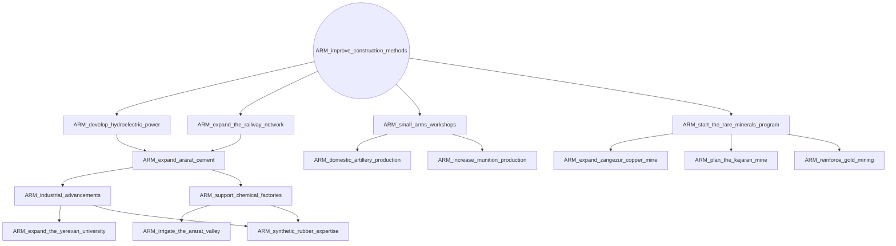
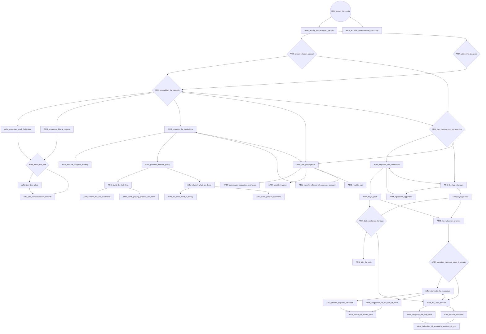
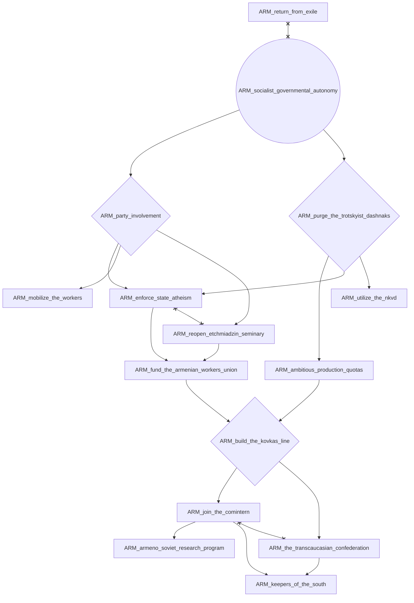

# ARM_improve_construction_methods

```mermaid
flowchart TD
    n1["ARM_develop_hydroelectric_power"]
    n2["ARM_domestic_artillery_production"]
    n3["ARM_expand_ararat_cement"]
    n4["ARM_expand_the_railway_network"]
    n5["ARM_expand_the_yerevan_university"]
    n6["ARM_expand_zangezur_copper_mine"]
    n7(("ARM_improve_construction_methods"))
    n8["ARM_increase_munition_production"]
    n9["ARM_industrial_advancements"]
    n10["ARM_irrigate_the_ararat_valley"]
    n11["ARM_plan_the_kajaran_mine"]
    n12["ARM_reinforce_gold_mining"]
    n13["ARM_small_arms_workshops"]
    n14["ARM_start_the_rare_minerals_program"]
    n15["ARM_support_chemical_factories"]
    n16["ARM_synthetic_rubber_expertise"]
    n7 --> n1
    n13 --> n2
    n4 --> n3
    n1 --> n3
    n7 --> n4
    n9 --> n5
    n14 --> n6
    n13 --> n8
    n3 --> n9
    n15 --> n10
    n14 --> n11
    n14 --> n12
    n7 --> n13
    n7 --> n14
    n3 --> n15
    n15 --> n16
    n9 --> n16
```

# ARM_return_from_exile

```mermaid
flowchart TD
    n17["ARM_acquire_diaspora_funding"]
    n18["ARM_an_open_hand_to_turkey"]
    n19["ARM_armenian_youth_federation"]
    n20["ARM_build_the_bek_line"]
    n21["ARM_cherish_what_we_have"]
    n22["ARM_crush_the_soviet_yoke"]
    n23["ARM_defenders_of_jersualem_servants_of_god"]
    n24["ARM_dominate_the_caucasus"]
    n25["ARM_empower_the_nationalists"]
    n26{"ARM_ensure_church_support"}
    n27["ARM_extend_the_line_eastwards"]
    n28{"ARM_faith_resilience_heritage"}
    n29["ARM_hayk_youth"]
    n30["ARM_implement_liberal_reforms"]
    n31["ARM_irano_persian_diplomats"]
    n32["ARM_join_the_allies"]
    n33["ARM_join_the_axis"]
    n34["ARM_liberate_nagorno_karabakh"]
    n35{"ARM_mend_the_split"}
    n36["ARM_nakhchivan_population_exchange"]
    n37{"ARM_operation_nemesis_wasn_t_enough"}
    n38["ARM_organize_the_institutions"]
    n39["ARM_planned_defense_policy"]
    n40["ARM_recapture_the_holy_land"]
    n41["ARM_reclaim_antiochia"]
    n42{"ARM_reestablish_the_republic"}
    n43["ARM_repression_apparatus"]
    n44["ARM_resettle_trabzon"]
    n45["ARM_resettle_van"]
    n46(("ARM_return_from_exile"))
    n47["ARM_reunify_the_armenian_people"]
    n48["ARM_royal_guards"]
    n49["ARM_saint_gregory_protects_our_skies"]
    n50["ARM_socialist_governmental_autonomy"]
    n51["ARM_the_10th_crusade"]
    n52["ARM_the_last_claimant"]
    n53["ARM_the_transcaucasian_accords"]
    n54{"ARM_the_triumph_over_communism"}
    n55["ARM_the_wilsonian_promise"]
    n56["ARM_transfer_officers_of_armenian_descent"]
    n57{"ARM_utilize_the_diaspora"}
    n58["ARM_vengeance_for_the_war_of_1918"]
    n59["ARM_war_propaganda"]
    n38 --> n17
    n21 --> n18
    n42 --> n19
    n39 --> n20
    n39 --> n21
    n58 --> n22
    n34 --> n22
    n41 --> n23
    n40 --> n23
    n37 --> n24
    n54 --> n25
    n47 --> n26
    n20 --> n27
    n48 --> n28
    n29 --> n28
    n25 --> n29
    n42 --> n30
    n21 --> n31
    n35 --> n32
    n28 --> n33
    n24 --> n34
    n19 --> n35
    n30 --> n35
    n59 --> n36
    n55 --> n37
    n42 --> n38
    n38 --> n39
    n51 --> n40
    n51 --> n41
    n57 --> n42
    n26 --> n42
    n52 --> n43
    n25 --> n43
    n59 --> n44
    n59 --> n45
    n46 --> n47
    n52 --> n48
    n20 --> n49
    n37 --> n51
    n28 --> n51
    n54 --> n52
    n35 --> n53
    n26 --> n54
    n48 --> n55
    n29 --> n55
    n38 --> n56
    n59 --> n56
    n47 --> n57
    n24 --> n58
    n42 --> n59
    n54 --> n59
    n24 x--x n51
    n25 x--x n52
    n32 x--x n53
    n38 x--x n59
    n42 x--x n54
    n46 x--x n50
```

# ARM_socialist_governmental_autonomy

```mermaid
flowchart TD
    n60["ARM_ambitious_production_quotas"]
    n61["ARM_armeno_soviet_research_program"]
    n62{"ARM_build_the_kovkas_line"}
    n63["ARM_enforce_state_atheism"]
    n64["ARM_fund_the_armenian_workers_union"]
    n65["ARM_join_the_comintern"]
    n66["ARM_keepers_of_the_south"]
    n67["ARM_mobilize_the_workers"]
    n68{"ARM_party_involvement"}
    n69{"ARM_purge_the_trotskyist_dashnaks"}
    n70["ARM_reopen_etchmiadzin_seminary"]
    n46["ARM_return_from_exile"]
    n50(("ARM_socialist_governmental_autonomy"))
    n71["ARM_the_transcaucasian_confederation"]
    n72["ARM_utilize_the_nkvd"]
    n69 --> n60
    n65 --> n61
    n60 --> n62
    n64 --> n62
    n68 --> n63
    n69 --> n63
    n63 --> n64
    n70 --> n64
    n62 --> n65
    n65 --> n66
    n71 --> n66
    n68 --> n67
    n50 --> n68
    n50 --> n69
    n68 --> n70
    n62 --> n71
    n69 --> n72
    n63 x--x n70
    n65 x--x n71
    n46 x--x n50
```
