# AST_R56_appeal_to_the_labour_dissidents

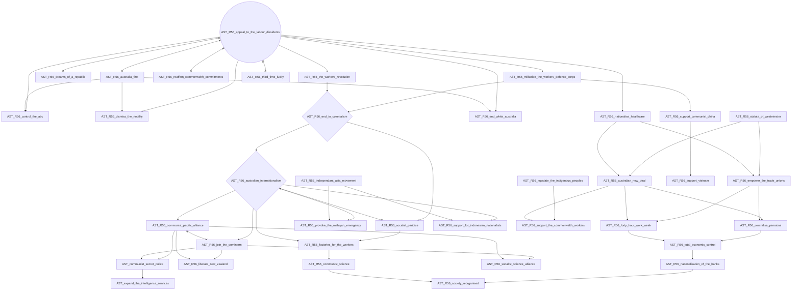

# AST_R56_australia_first

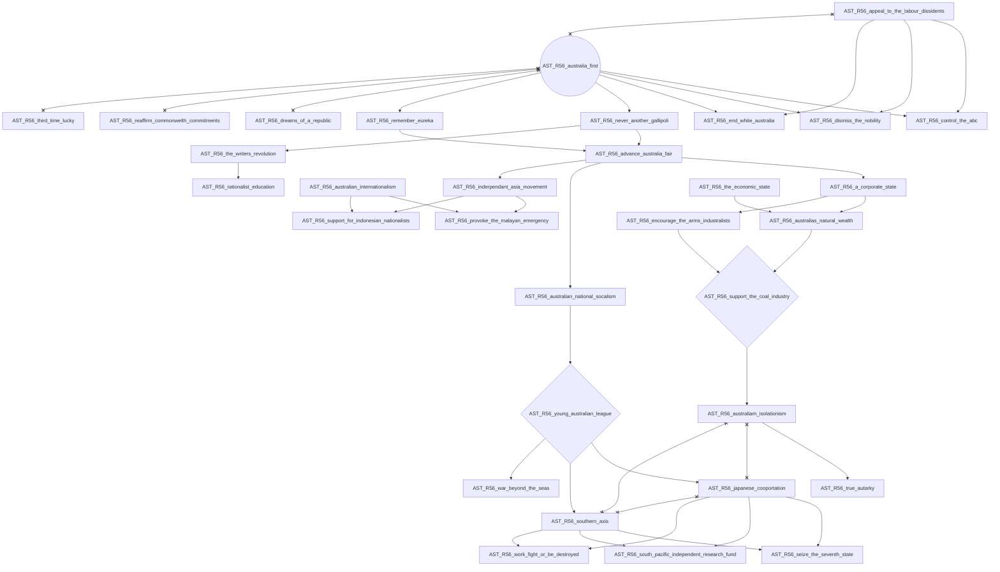

# AST_R56_citizen_military_forces

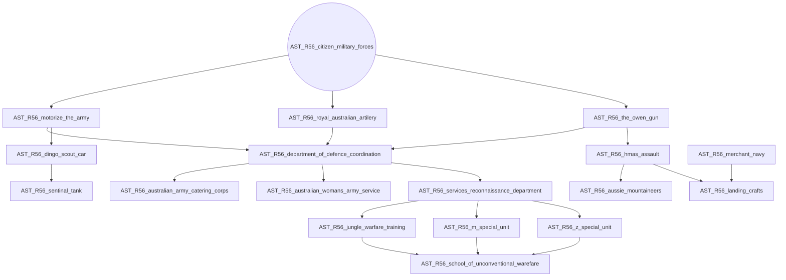

# AST_R56_commonwealth_aricraft_corporation

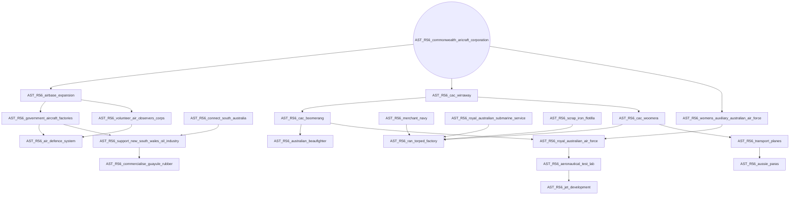

# AST_R56_dreams_of_a_republic

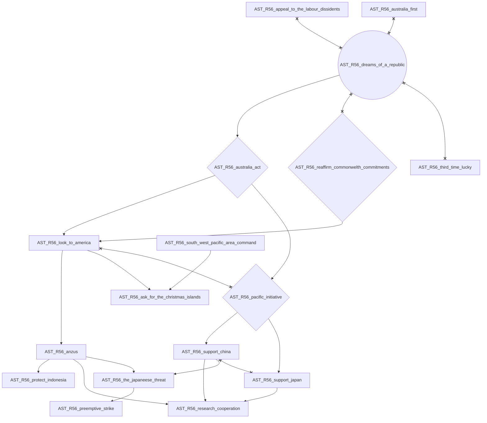

# AST_R56_finish_railway_gauge_standardisation

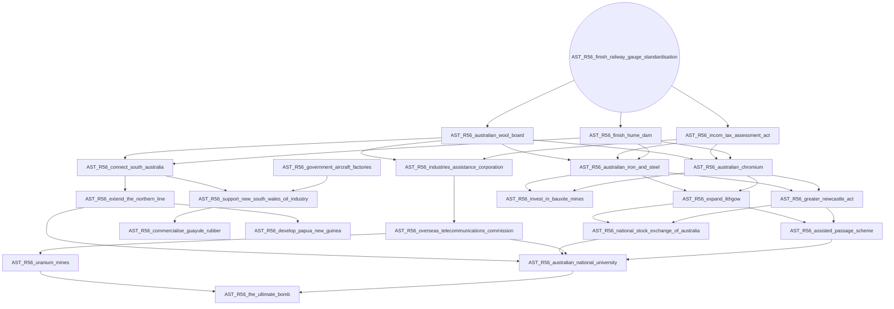

# AST_R56_reaffirm_commonwelth_commitments

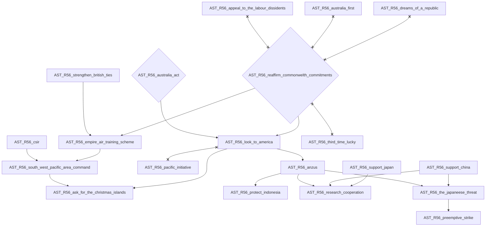

# AST_R56_rebuild_cockatoo_island

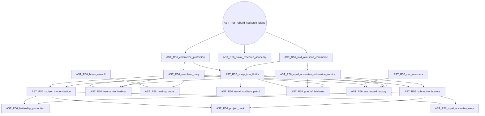

# AST_R56_strengthen_british_ties

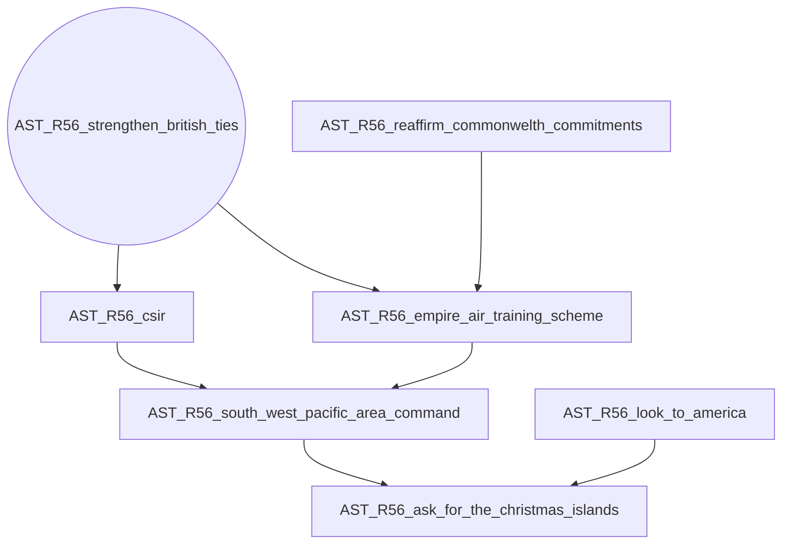

# AST_R56_strengthen_the_coalition

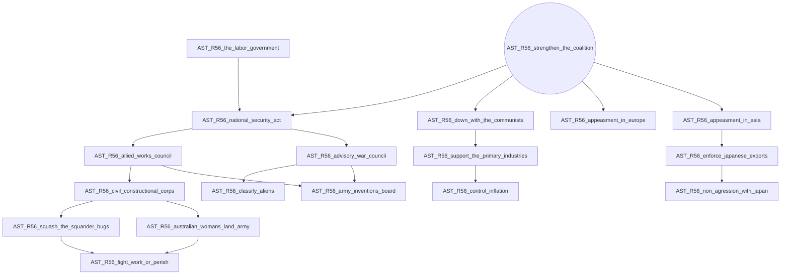

# AST_R56_the_labor_government

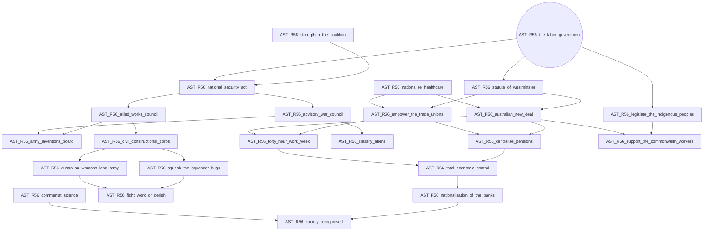

# AST_R56_third_time_lucky

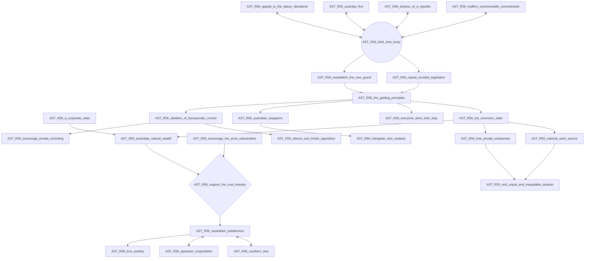
