# AST_against_war_and_fascism

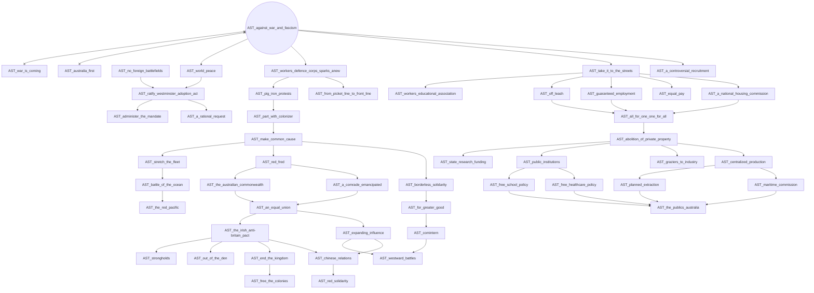

# AST_australia_first

```mermaid
flowchart TD
    n51["AST_a_domestic_supply_chain"]
    n52["AST_a_growing_womens_guild"]
    n53["AST_absorb_the_uap"]
    n7["AST_against_war_and_fascism"]
    n54["AST_at_the_gates"]
    n10{"AST_australia_first"}
    n55["AST_australia_first_party_focus"]
    n56["AST_australian_culture_investments"]
    n57["AST_autarky"]
    n58["AST_big_business_pact"]
    n59["AST_bring_home_the_farmers"]
    n60["AST_britain_supplying_ships"]
    n61["AST_british_pact"]
    n62["AST_broken_hill_propietary_company"]
    n63["AST_claim_french_indochina"]
    n64["AST_council_for_scientific_and_industrial_research"]
    n65["AST_crush_the_gates"]
    n66["AST_defying_american_interference"]
    n67["AST_devalued_currency"]
    n68["AST_dividing_the_pacific"]
    n69["AST_done_meddling"]
    n70["AST_energy_independence"]
    n71["AST_eureka_stockade_monument_rally"]
    n72["AST_expand_the_fort"]
    n73["AST_expanding_into_new_markets"]
    n74["AST_exports_for_economic_recovery"]
    n75["AST_for_the_southern_cross"]
    n76["AST_foreign_competition"]
    n77["AST_goods_standard"]
    n78["AST_hand_in_glove"]
    n79["AST_in_from_the_cold"]
    n80["AST_income_tax_assessment_act"]
    n81["AST_industrial_expansion"]
    n82["AST_integrate_the_fort"]
    n83["AST_lang_is_right"]
    n84["AST_lang_plan"]
    n85{"AST_nauru_pact"}
    n86["AST_naurus_return_to_german_hands"]
    n87["AST_northern_advancement"]
    n88["AST_pankhurst_walsh"]
    n89{"AST_public_works"}
    n90["AST_radium_hill"]
    n91["AST_realize_the_value_of_british_citizenship"]
    n92["AST_recovery"]
    n93["AST_refuse_british_wars"]
    n94["AST_resist_western_intruders"]
    n95["AST_reverse_industry_tariffs"]
    n96["AST_reverse_wage_cuts"]
    n97["AST_rile_up_veterans"]
    n98["AST_soothing_australian_fears"]
    n99["AST_standard_gauge_line_to_darwin"]
    n100["AST_stephensen"]
    n101["AST_the_bolsheviks_counterforce"]
    n102["AST_the_guild_for_the_war_effort"]
    n103["AST_the_manpower_directorate"]
    n104["AST_the_pacific_garrison"]
    n105["AST_the_phosphate_commision"]
    n106["AST_the_winner_takes_it_all"]
    n107["AST_through_the_gates"]
    n108["AST_toe_the_line"]
    n109["AST_undeniably_ours"]
    n110["AST_vichy_out_of_africa"]
    n111["AST_walls_like_uluru"]
    n46["AST_war_is_coming"]
    n112["AST_well-being_of_the_community"]
    n113["AST_within_reach"]
    n83 --> n51
    n96 --> n51
    n88 --> n52
    n79 --> n53
    n111 --> n54
    n88 --> n55
    n100 --> n55
    n100 --> n56
    n58 --> n57
    n55 --> n58
    n81 --> n59
    n104 --> n60
    n91 --> n61
    n113 --> n62
    n104 --> n63
    n110 --> n63
    n81 --> n64
    n107 --> n65
    n68 --> n66
    n72 --> n66
    n74 --> n67
    n87 --> n68
    n94 --> n68
    n104 --> n69
    n110 --> n69
    n58 --> n70
    n100 --> n71
    n87 --> n72
    n94 --> n72
    n76 --> n73
    n89 --> n74
    n56 --> n75
    n67 --> n76
    n95 --> n76
    n84 --> n77
    n104 --> n78
    n55 --> n79
    n84 --> n80
    n74 --> n80
    n84 --> n81
    n74 --> n81
    n86 --> n82
    n106 --> n82
    n77 --> n83
    n89 --> n84
    n71 --> n85
    n85 --> n86
    n86 --> n87
    n106 --> n87
    n10 --> n88
    n10 --> n89
    n46 --> n89
    n113 --> n90
    n88 --> n91
    n59 --> n92
    n96 --> n92
    n97 --> n93
    n71 --> n93
    n86 --> n94
    n106 --> n94
    n74 --> n95
    n80 --> n96
    n88 --> n97
    n100 --> n97
    n63 --> n98
    n84 --> n99
    n74 --> n99
    n10 --> n100
    n88 --> n101
    n100 --> n101
    n91 --> n102
    n101 --> n102
    n59 --> n103
    n61 --> n104
    n84 --> n105
    n85 --> n106
    n54 --> n107
    n111 --> n108
    n110 --> n109
    n61 --> n110
    n55 --> n111
    n52 --> n112
    n99 --> n113
    n7 x--x n10
    n10 x--x n46
    n74 x--x n84
    n86 x--x n106
    n88 x--x n100
```

# AST_australian_military_forces

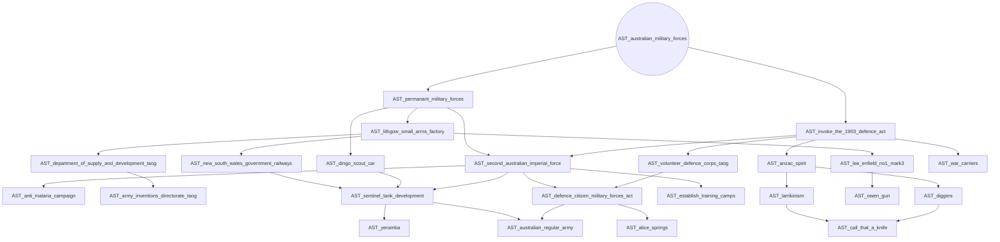

# AST_bring_on_the_giant

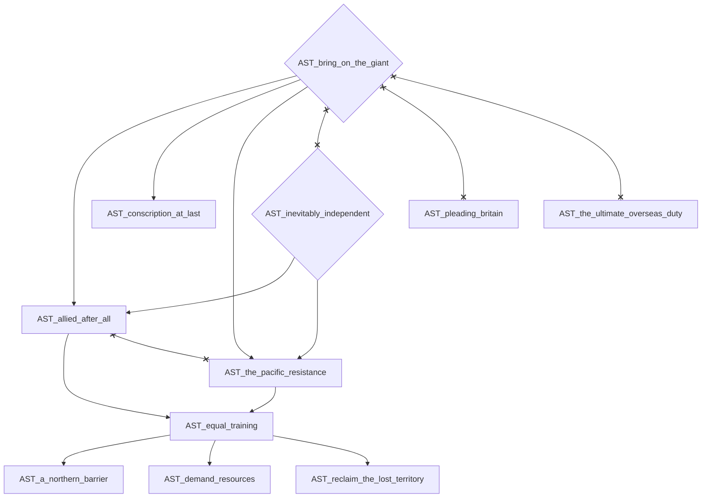

# AST_british_war_cabinet

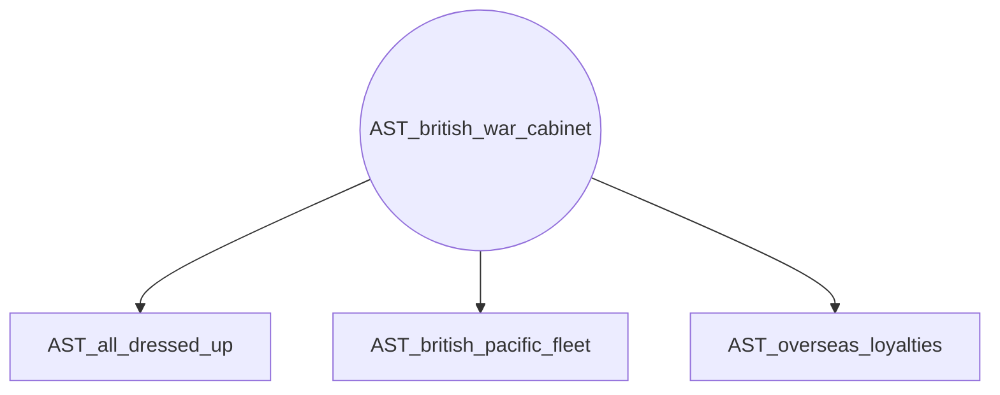

# AST_inevitably_independent

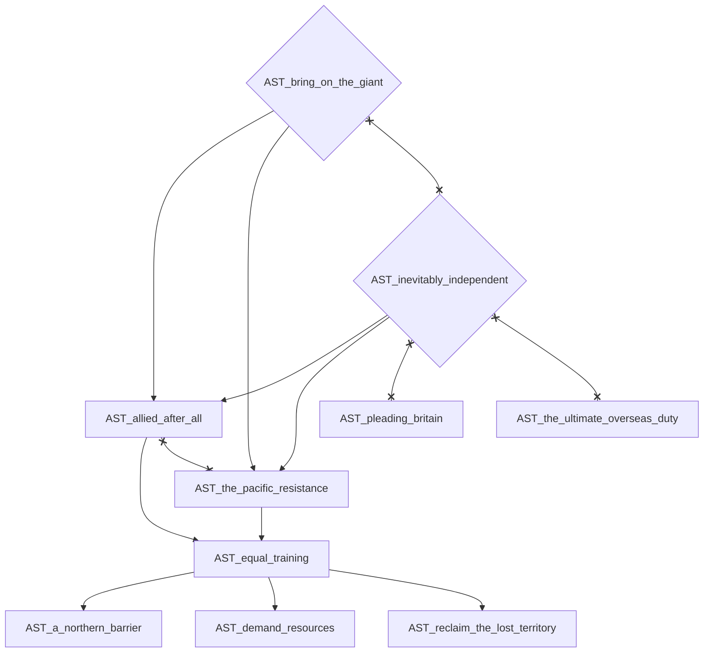

# AST_no1_flying_training_school

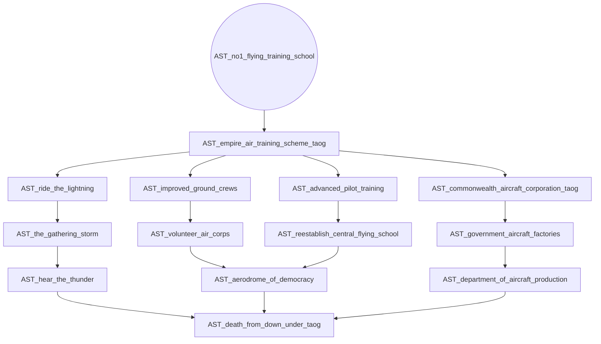

# AST_no_foreign_battlefields

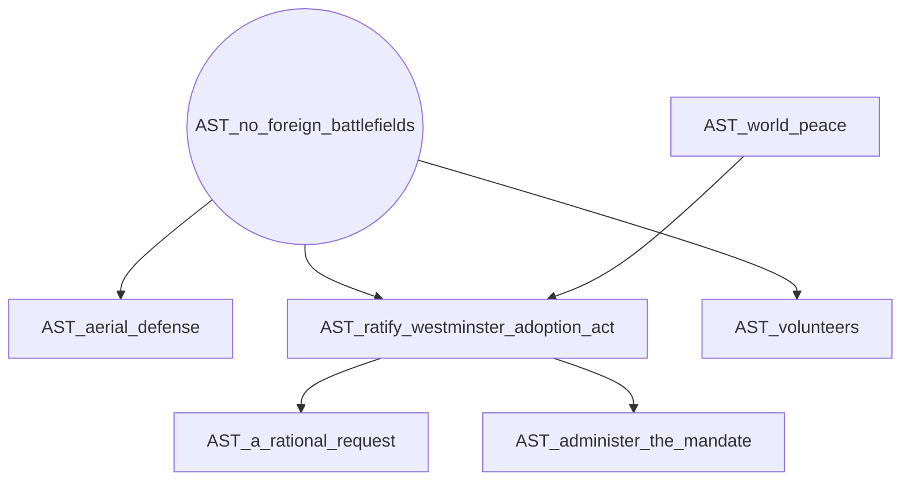

# AST_pleading_britain

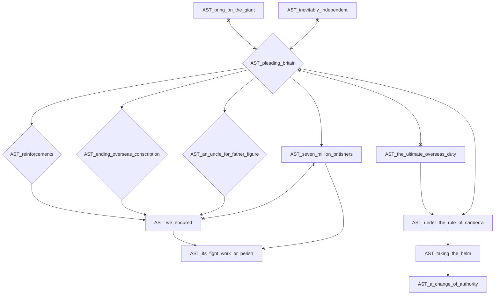

# AST_populate_or_perish

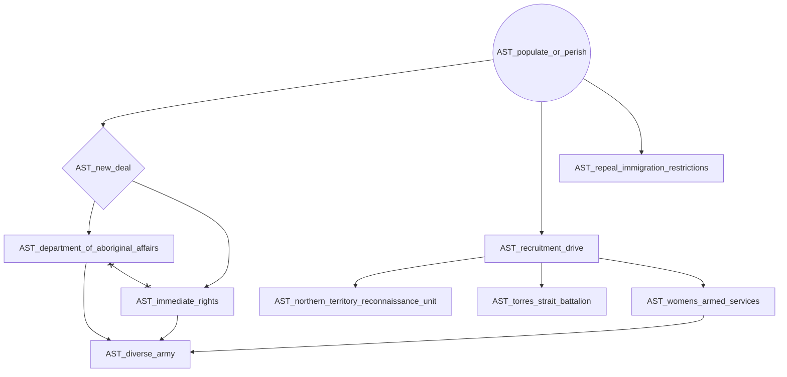

# AST_royal_australian_navy

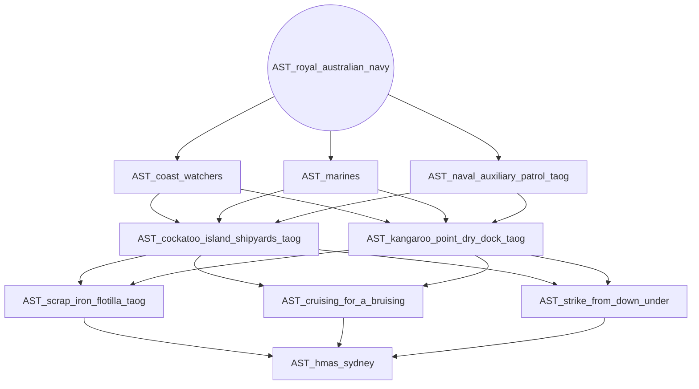

# AST_solidarity_by_the_empire

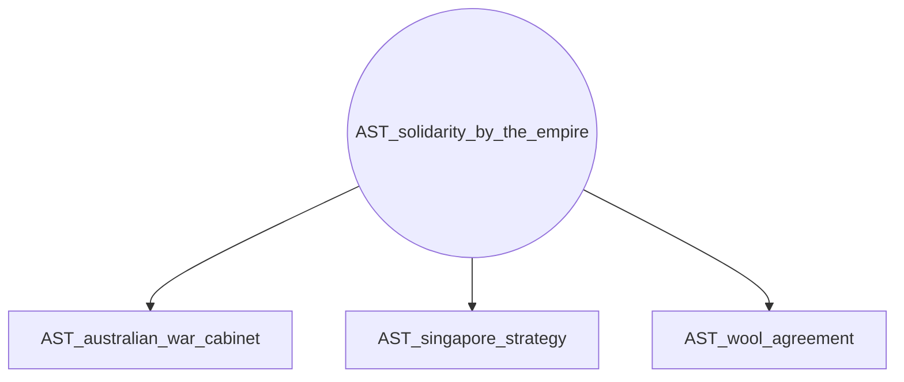

# AST_the_ultimate_overseas_duty

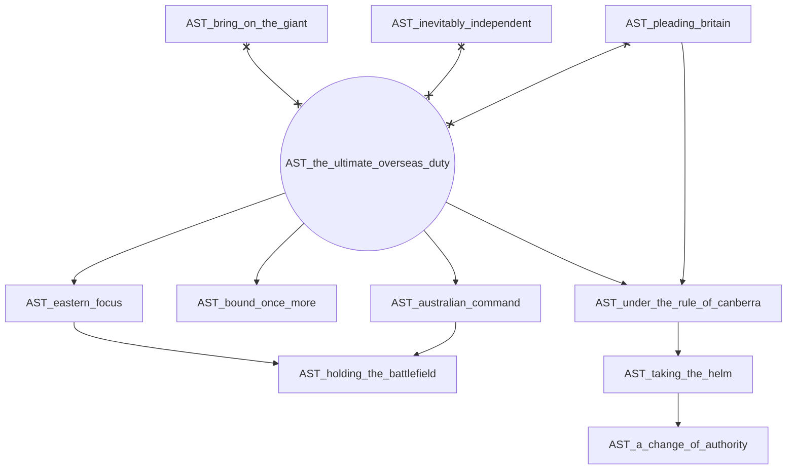

# AST_until_the_tide_of_battle_swings

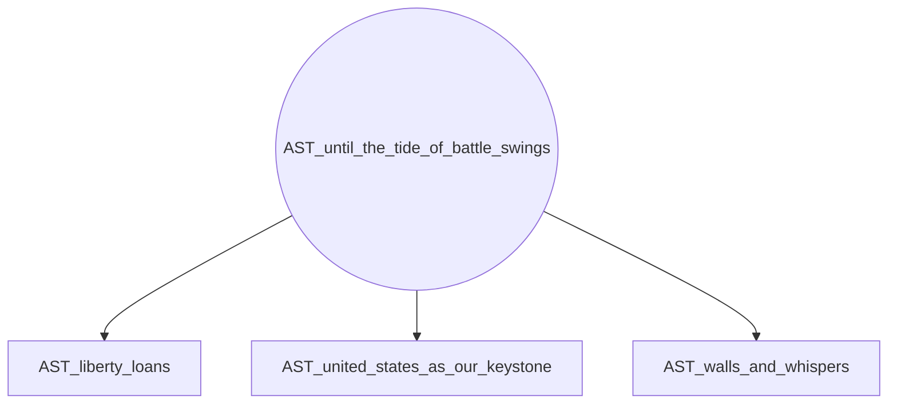

# AST_war_is_coming

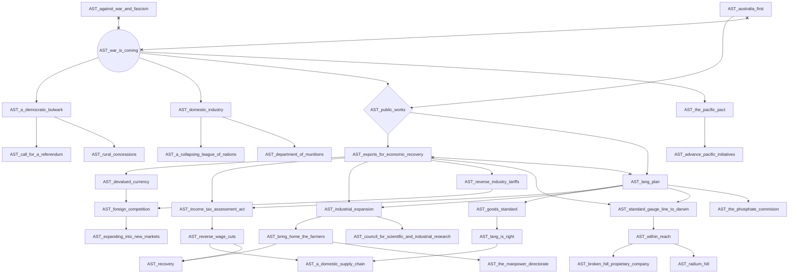
