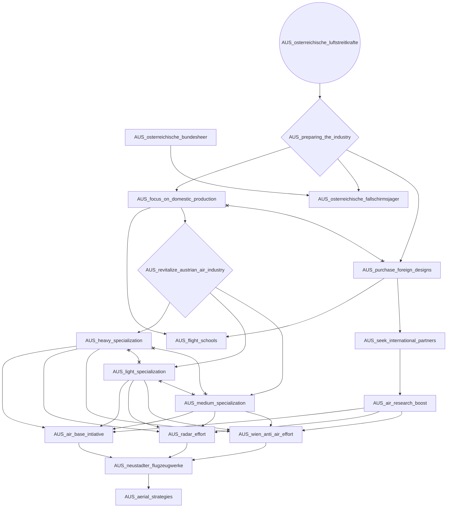
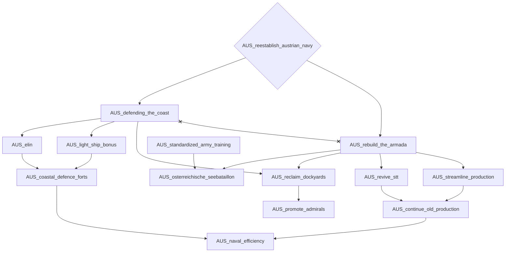
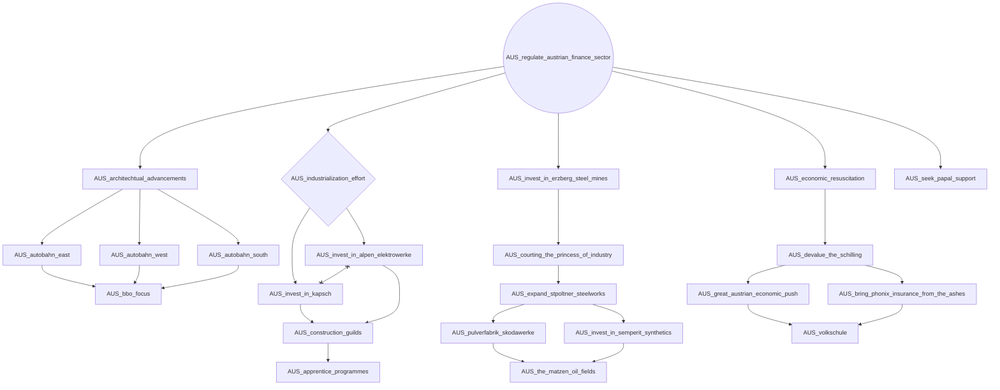
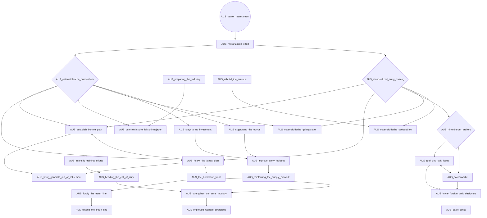
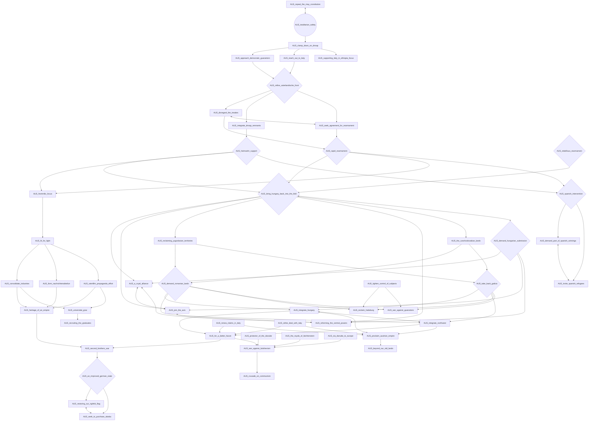

# AUS_osterreichische_luftstreitkrafte

# AUS_reestablish_austrian_navy

# AUS_regulate_austrian_finance_sector

# AUS_repeal_the_may_constitution

```mermaid
flowchart TD
    n56{"AUS_a_new_beginning"}
    n57{"AUS_a_new_constitution"}
    n58["AUS_a_royal_alliance"]
    n59{"AUS_a_safe_harbor_for_dissidents"}
    n60{"AUS_align_with_ussr"}
    n61["AUS_alpine_federation_focus"]
    n62{"AUS_an_improved_german_state"}
    n63["AUS_at_the_ready"]
    n64{"AUS_austria_against_fascism"}
    n65["AUS_austrian_aggression"]
    n66["AUS_austromarxism_focus"]
    n67["AUS_ban_dnsap"]
    n68["AUS_beyond_our_old_lands"]
    n69["AUS_bring_back_the_habsburg_rule"]
    n70{"AUS_bring_hungary_back_into_the_fold"}
    n71["AUS_celebrate_spanish_victory"]
    n72["AUS_centralize_the_industrial_sector"]
    n73["AUS_crusade_on_communism"]
    n74["AUS_cut_ties_with_the_church"]
    n75["AUS_danubian_socialist_communes"]
    n76["AUS_danubian_unity"]
    n77["AUS_deal_with_the_german_threat"]
    n78["AUS_defence_of_the_homeland"]
    n79{"AUS_demand_hungarian_submission"}
    n80["AUS_demand_liberation_of_workers"]
    n81{"AUS_demand_romanian_lands"}
    n82{"AUS_diplomatic_effort"}
    n83["AUS_eiserne_legion"]
    n84["AUS_emergency_measaures"]
    n85["AUS_empowering_the_chancellor"]
    n86["AUS_end_european_fascism"]
    n87["AUS_establish_rote_hilfe"]
    n88["AUS_extend_italian_claims"]
    n89["AUS_for_a_better_future"]
    n90["AUS_form_evidenzburo"]
    n91{"AUS_heimwehr_support"}
    n92["AUS_heritage_of_an_empire"]
    n93{"AUS_hold_elections"}
    n94["AUS_industrial_exchange"]
    n95["AUS_integrate_hungary"]
    n96["AUS_integrate_northwest"]
    n97{"AUS_intervention_in_spain"}
    n98["AUS_invite_danubian_countries"]
    n99["AUS_invite_spanish_exiles"]
    n100["AUS_invite_the_entente"]
    n101["AUS_inviting_the_observers"]
    n102["AUS_join_comintern"]
    n103["AUS_join_the_allies"]
    n104["AUS_join_the_axis"]
    n105["AUS_join_the_research_program"]
    n106["AUS_lawmaking_leniency"]
    n107["AUS_legacy_of_the_empire"]
    n108["AUS_legitimistische_jugend"]
    n109["AUS_legitimistische_studentenverbindung"]
    n110["AUS_meticulous_preparations"]
    n111["AUS_offensive_on_the_fascists"]
    n112["AUS_osterreichische_akademie"]
    n113["AUS_our_brothers_in_the_east"]
    n114["AUS_outlaw_the_radicals"]
    n115["AUS_pardon_political_exiles"]
    n116["AUS_politicized_general_staff"]
    n117["AUS_proclaim_austrian_empire"]
    n118["AUS_promote_the_worthy"]
    n119["AUS_properly_trained_militias"]
    n120["AUS_protector_of_the_danube"]
    n121["AUS_raid_military_storages"]
    n122["AUS_rally_the_people"]
    n123{"AUS_rapid_rearmament"}
    n124["AUS_rapid_revolutions"]
    n125{"AUS_rebellious_rearmament"}
    n126{"AUS_rebuild_democratic_systems"}
    n127["AUS_reclaim_habsburg"]
    n128["AUS_reclaiming_yugoslavian_territories"]
    n129["AUS_reforming_the_central_powers"]
    n130{"AUS_reinstate_the_imperial_council"}
    n131{"AUS_release_imprisoned_leaders"}
    n132["AUS_renew_claims_in_italy"]
    n133["AUS_renounce_the_treaties"]
    n134["AUS_repeal_the_adelsaufhebungsgesetz"]
    n135["AUS_repeal_the_habsburgergesetz"]
    n136(("AUS_repeal_the_may_constitution"))
    n137["AUS_restoring_our_rightful_flag"]
    n138{"AUS_revolution"}
    n139["AUS_royal_scientific_grants"]
    n140["AUS_schutzbund_support"]
    n141["AUS_scientific_grants"]
    n142["AUS_second_brothers_war"]
    n143["AUS_seek_soviet_support"]
    n144{"AUS_seek_support_from_guarantors"}
    n145["AUS_seek_to_purchase_alaska"]
    n146["AUS_seize_galicia"]
    n147{"AUS_spur_the_communist_resistance"}
    n148["AUS_stabilize_the_political_climate"]
    n149["AUS_strengthen_legitimistische_corps"]
    n150{"AUS_strengthen_the_cabinet"}
    n151["AUS_strike_deal_with_italy"]
    n152["AUS_sturmscharen_support"]
    n153["AUS_subjugate_lands_of_old"]
    n154{"AUS_take_back_galicia"}
    n155["AUS_the_correct_communism"]
    n156["AUS_the_czechoslovakian_lands"]
    n157["AUS_the_danubian_federation"]
    n158["AUS_the_evidenzburo"]
    n159["AUS_the_peoples_army"]
    n160["AUS_the_political_front"]
    n161{"AUS_the_right_to_rearm"}
    n162["AUS_the_right_to_self_determination"]
    n163["AUS_the_royals_of_liechtenstein"]
    n164["AUS_the_silesian_question"]
    n165{"AUS_tighten_control_of_subjects"}
    n166["AUS_totalitarian_safety"]
    n167["AUS_unexpected_alliances"]
    n168{"AUS_union_of_danubian_socialist_republics"}
    n169["AUS_universitat_wien"]
    n170["AUS_via_danube_to_europe"]
    n171["AUS_war_against_bolshevism"]
    n172["AUS_war_against_guarantors"]
    n173["AUS_womens_education_initiative"]
    n143 --> n56
    n121 --> n56
    n93 --> n57
    n79 --> n58
    n70 --> n58
    n119 --> n59
    n159 --> n59
    n118 --> n60
    n116 --> n60
    n150 --> n61
    n142 --> n62
    n65 --> n63
    n136 --> n64
    n161 --> n65
    n131 --> n66
    n64 --> n66
    n122 --> n67
    n117 --> n68
    n107 --> n69
    n125 --> n70
    n123 --> n70
    n91 --> n70
    n97 --> n71
    n56 --> n72
    n60 --> n72
    n171 --> n73
    n56 --> n74
    n56 --> n75
    n59 --> n75
    n98 --> n76
    n168 --> n77
    n162 --> n77
    n120 --> n77
    n170 --> n77
    n161 --> n78
    n125 --> n79
    n110 --> n80
    n124 --> n80
    n128 --> n81
    n156 --> n81
    n167 --> n82
    n101 --> n82
    n152 --> n83
    n67 --> n84
    n133 --> n84
    n106 --> n85
    n77 --> n86
    n59 --> n87
    n132 --> n88
    n151 --> n89
    n132 --> n89
    n95 --> n89
    n96 --> n89
    n63 --> n90
    n160 --> n90
    n131 --> n93
    n64 --> n93
    n103 --> n94
    n81 --> n95
    n154 --> n95
    n81 --> n96
    n154 --> n96
    n84 --> n97
    n144 --> n97
    n157 --> n98
    n97 --> n99
    n61 --> n100
    n76 --> n101
    n60 --> n102
    n56 --> n102
    n150 --> n103
    n79 --> n104
    n70 --> n104
    n106 --> n105
    n100 --> n106
    n94 --> n106
    n130 --> n107
    n109 --> n108
    n125 --> n109
    n147 --> n110
    n100 --> n111
    n163 --> n112
    n162 --> n113
    n144 --> n114
    n103 --> n115
    n61 --> n115
    n143 --> n116
    n95 --> n117
    n96 --> n117
    n132 --> n117
    n151 --> n117
    n143 --> n118
    n121 --> n119
    n82 --> n120
    n138 --> n121
    n66 --> n122
    n147 --> n124
    n135 --> n125
    n69 --> n125
    n93 --> n126
    n165 --> n127
    n154 --> n127
    n81 --> n127
    n70 --> n128
    n79 --> n129
    n70 --> n129
    n64 --> n130
    n136 --> n131
    n165 --> n132
    n122 --> n133
    n109 --> n134
    n149 --> n134
    n107 --> n135
    n62 --> n137
    n84 --> n138
    n112 --> n139
    n122 --> n140
    n126 --> n140
    n57 --> n140
    n169 --> n141
    n92 --> n142
    n89 --> n142
    n138 --> n143
    n57 --> n144
    n126 --> n144
    n62 --> n145
    n168 --> n146
    n74 --> n147
    n72 --> n147
    n144 --> n148
    n125 --> n149
    n114 --> n150
    n148 --> n150
    n165 --> n151
    n149 --> n152
    n79 --> n153
    n128 --> n154
    n156 --> n154
    n168 --> n155
    n70 --> n156
    n93 --> n157
    n130 --> n157
    n134 --> n158
    n121 --> n159
    n78 --> n160
    n144 --> n161
    n157 --> n161
    n105 --> n162
    n85 --> n162
    n158 --> n163
    n108 --> n163
    n152 --> n163
    n153 --> n164
    n153 --> n165
    n76 --> n167
    n80 --> n168
    n56 --> n169
    n103 --> n169
    n61 --> n169
    n82 --> n170
    n163 --> n171
    n120 --> n171
    n89 --> n171
    n170 --> n171
    n165 --> n172
    n154 --> n172
    n81 --> n172
    n169 --> n173
    n58 x--x n104
    n58 x--x n129
    n61 x--x n103
    n65 x--x n78
    n66 x--x n93
    n66 x--x n130
    n70 x--x n79
    n71 x--x n99
    n75 x--x n102
    n93 x--x n130
    n95 x--x n96
    n104 x--x n129
    n107 x--x n144
    n107 x--x n157
    n109 x--x n149
    n110 x--x n124
    n114 x--x n148
    n120 x--x n170
    n121 x--x n143
    n132 x--x n151
    n136 x--x n166
    n137 x--x n145
    n144 x--x n157
    n146 x--x n155
```

# AUS_secret_rearmament

# AUS_totalitarian_safety

