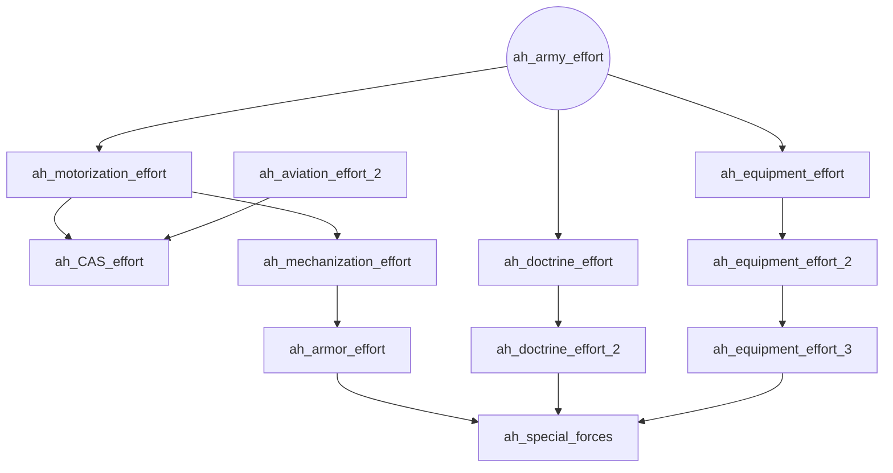
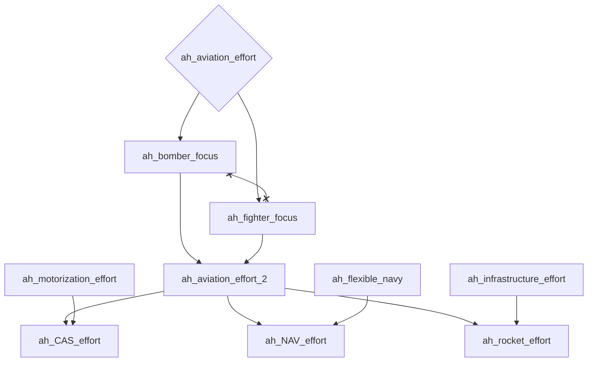
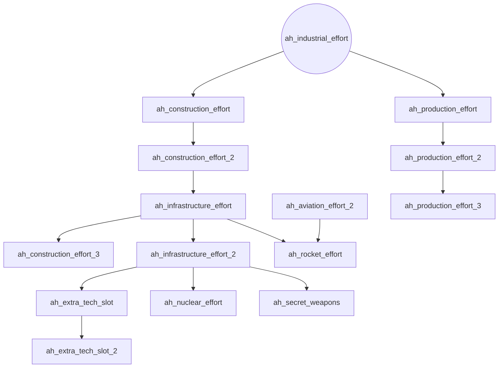
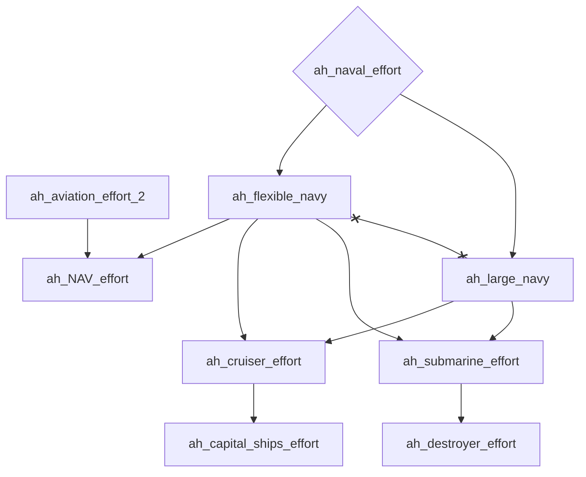
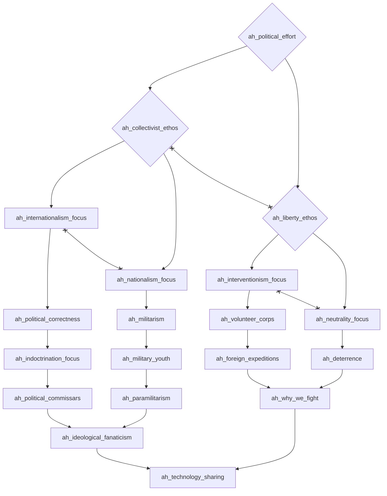

# ah_army_effort

```mermaid
flowchart TD
    n1["ah_CAS_effort"]
    n2["ah_armor_effort"]
    n3(("ah_army_effort"))
    n4["ah_aviation_effort_2"]
    n5["ah_doctrine_effort"]
    n6["ah_doctrine_effort_2"]
    n7["ah_equipment_effort"]
    n8["ah_equipment_effort_2"]
    n9["ah_equipment_effort_3"]
    n10["ah_mechanization_effort"]
    n11["ah_motorization_effort"]
    n12["ah_special_forces"]
    n4 --> n1
    n11 --> n1
    n10 --> n2
    n3 --> n5
    n5 --> n6
    n3 --> n7
    n7 --> n8
    n8 --> n9
    n11 --> n10
    n3 --> n11
    n9 --> n12
    n6 --> n12
    n2 --> n12
```

# ah_aviation_effort

```mermaid
flowchart TD
    n1["ah_CAS_effort"]
    n13["ah_NAV_effort"]
    n14{"ah_aviation_effort"}
    n4["ah_aviation_effort_2"]
    n15["ah_bomber_focus"]
    n16["ah_fighter_focus"]
    n17["ah_flexible_navy"]
    n18["ah_infrastructure_effort"]
    n11["ah_motorization_effort"]
    n19["ah_rocket_effort"]
    n4 --> n1
    n11 --> n1
    n4 --> n13
    n17 --> n13
    n15 --> n4
    n16 --> n4
    n14 --> n15
    n14 --> n16
    n4 --> n19
    n18 --> n19
    n15 x--x n16
```

# ah_industrial_effort

```mermaid
flowchart TD
    n4["ah_aviation_effort_2"]
    n20["ah_construction_effort"]
    n21["ah_construction_effort_2"]
    n22["ah_construction_effort_3"]
    n23["ah_extra_tech_slot"]
    n24["ah_extra_tech_slot_2"]
    n25(("ah_industrial_effort"))
    n18["ah_infrastructure_effort"]
    n26["ah_infrastructure_effort_2"]
    n27["ah_nuclear_effort"]
    n28["ah_production_effort"]
    n29["ah_production_effort_2"]
    n30["ah_production_effort_3"]
    n19["ah_rocket_effort"]
    n31["ah_secret_weapons"]
    n25 --> n20
    n20 --> n21
    n18 --> n22
    n26 --> n23
    n23 --> n24
    n21 --> n18
    n18 --> n26
    n26 --> n27
    n25 --> n28
    n28 --> n29
    n29 --> n30
    n4 --> n19
    n18 --> n19
    n26 --> n31
```

# ah_naval_effort

```mermaid
flowchart TD
    n13["ah_NAV_effort"]
    n4["ah_aviation_effort_2"]
    n32["ah_capital_ships_effort"]
    n33["ah_cruiser_effort"]
    n34["ah_destroyer_effort"]
    n17["ah_flexible_navy"]
    n35["ah_large_navy"]
    n36{"ah_naval_effort"}
    n37["ah_submarine_effort"]
    n4 --> n13
    n17 --> n13
    n33 --> n32
    n35 --> n33
    n17 --> n33
    n37 --> n34
    n36 --> n17
    n36 --> n35
    n17 --> n37
    n35 --> n37
    n17 x--x n35
```

# ah_political_effort

```mermaid
flowchart TD
    n38{"ah_collectivist_ethos"}
    n39["ah_deterrence"]
    n40["ah_foreign_expeditions"]
    n41["ah_ideological_fanaticism"]
    n42["ah_indoctrination_focus"]
    n43["ah_internationalism_focus"]
    n44["ah_interventionism_focus"]
    n45{"ah_liberty_ethos"}
    n46["ah_militarism"]
    n47["ah_military_youth"]
    n48["ah_nationalism_focus"]
    n49["ah_neutrality_focus"]
    n50["ah_paramilitarism"]
    n51["ah_political_commissars"]
    n52["ah_political_correctness"]
    n53{"ah_political_effort"}
    n54["ah_technology_sharing"]
    n55["ah_volunteer_corps"]
    n56["ah_why_we_fight"]
    n53 --> n38
    n49 --> n39
    n55 --> n40
    n50 --> n41
    n51 --> n41
    n52 --> n42
    n38 --> n43
    n45 --> n44
    n53 --> n45
    n48 --> n46
    n46 --> n47
    n38 --> n48
    n45 --> n49
    n47 --> n50
    n42 --> n51
    n43 --> n52
    n41 --> n54
    n56 --> n54
    n44 --> n55
    n40 --> n56
    n39 --> n56
    n38 x--x n45
    n43 x--x n48
    n44 x--x n49
```
