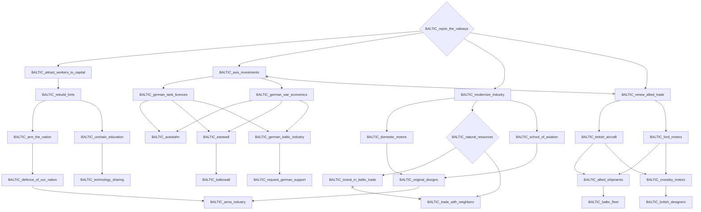
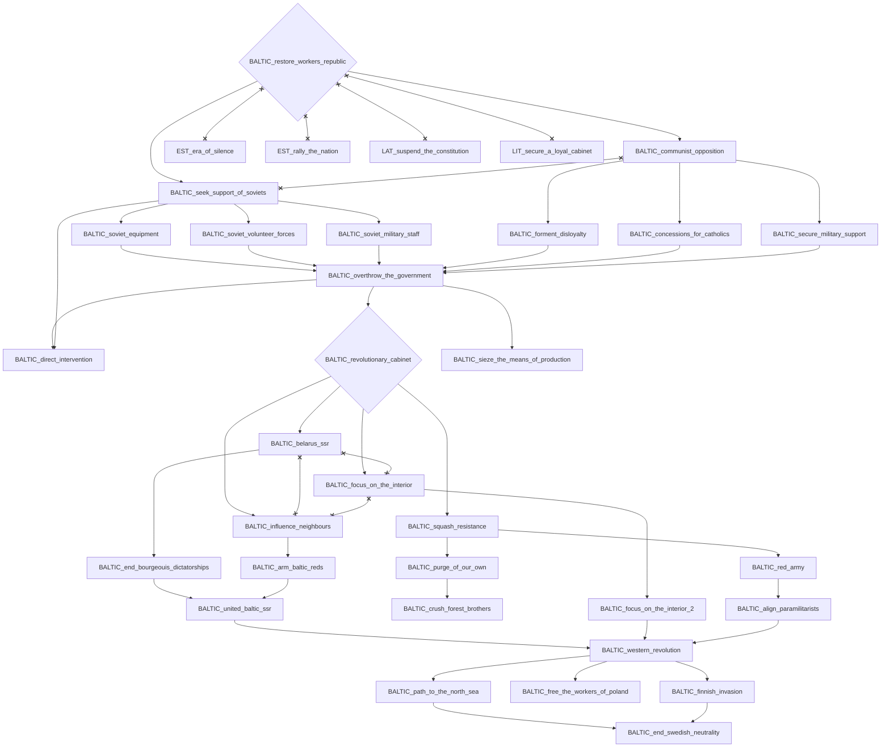

# BALTIC_rejoin_the_railways

```mermaid
flowchart TD
    n1["BALTIC_allied_shipments"]
    n2["BALTIC_arm_the_nation"]
    n3["BALTIC_arms_industry"]
    n4["BALTIC_attract_workers_to_capital"]
    n5["BALTIC_autobahn"]
    n6["BALTIC_axis_investments"]
    n7["BALTIC_baltic_fleet"]
    n8["BALTIC_balticwall"]
    n9["BALTIC_british_aircraft"]
    n10["BALTIC_british_designers"]
    n11["BALTIC_crossley_motors"]
    n12["BALTIC_defence_of_our_nation"]
    n13["BALTIC_domestic_motors"]
    n14["BALTIC_eastwall"]
    n15["BALTIC_ford_motors"]
    n16["BALTIC_german_baltic_industry"]
    n17["BALTIC_german_tank_licences"]
    n18["BALTIC_german_war_economics"]
    n19["BALTIC_invest_in_baltic_trade"]
    n20["BALTIC_modernize_industry"]
    n21{"BALTIC_natural_resources"}
    n22["BALTIC_original_designs"]
    n23["BALTIC_rebuild_forts"]
    n24{"BALTIC_rejoin_the_railways"}
    n25["BALTIC_renew_allied_trade"]
    n26["BALTIC_request_german_support"]
    n27["BALTIC_school_of_aviation"]
    n28["BALTIC_technology_sharing"]
    n29["BALTIC_trade_with_neighbors"]
    n30["BALTIC_unchain_education"]
    n9 --> n1
    n15 --> n1
    n23 --> n2
    n22 --> n3
    n12 --> n3
    n24 --> n4
    n18 --> n5
    n17 --> n5
    n24 --> n6
    n1 --> n7
    n14 --> n8
    n25 --> n9
    n11 --> n10
    n15 --> n11
    n9 --> n11
    n2 --> n12
    n20 --> n13
    n18 --> n14
    n17 --> n14
    n25 --> n15
    n17 --> n16
    n18 --> n16
    n6 --> n17
    n6 --> n18
    n21 --> n19
    n24 --> n20
    n20 --> n21
    n13 --> n22
    n27 --> n22
    n4 --> n23
    n24 --> n25
    n16 --> n26
    n20 --> n27
    n30 --> n28
    n21 --> n29
    n23 --> n30
    n6 x--x n25
    n19 x--x n29
```

# BALTIC_restore_workers_republic

```mermaid
flowchart TD
    n31["BALTIC_align_paramilitarists"]
    n32["BALTIC_arm_baltic_reds"]
    n33["BALTIC_belarus_ssr"]
    n34["BALTIC_communist_opposition"]
    n35["BALTIC_concessions_for_catholics"]
    n36["BALTIC_crush_forest_brothers"]
    n37["BALTIC_direct_intervention"]
    n38["BALTIC_end_bourgeouis_dictatorships"]
    n39["BALTIC_end_swedish_neutrality"]
    n40["BALTIC_finnish_invasion"]
    n41["BALTIC_focus_on_the_interior"]
    n42["BALTIC_focus_on_the_interior_2"]
    n43["BALTIC_forment_disloyalty"]
    n44["BALTIC_free_the_workers_of_poland"]
    n45["BALTIC_influence_neighbours"]
    n46["BALTIC_overthrow_the_government"]
    n47["BALTIC_path_to_the_north_sea"]
    n48["BALTIC_purge_of_our_own"]
    n49["BALTIC_red_army"]
    n50{"BALTIC_restore_workers_republic"}
    n51{"BALTIC_revolutionary_cabinet"}
    n52["BALTIC_secure_military_support"]
    n53["BALTIC_seek_support_of_soviets"]
    n54["BALTIC_sieze_the_means_of_production"]
    n55["BALTIC_soviet_equipment"]
    n56["BALTIC_soviet_military_staff"]
    n57["BALTIC_soviet_volunteer_forces"]
    n58["BALTIC_squash_resistance"]
    n59["BALTIC_united_baltic_ssr"]
    n60["BALTIC_western_revolution"]
    n61["EST_era_of_silence"]
    n62["EST_rally_the_nation"]
    n63["LAT_suspend_the_constitution"]
    n64["LIT_secure_a_loyal_cabinet"]
    n49 --> n31
    n45 --> n32
    n51 --> n33
    n50 --> n34
    n34 --> n35
    n48 --> n36
    n46 --> n37
    n53 --> n37
    n33 --> n38
    n47 --> n39
    n40 --> n39
    n60 --> n40
    n51 --> n41
    n41 --> n42
    n34 --> n43
    n60 --> n44
    n51 --> n45
    n55 --> n46
    n57 --> n46
    n56 --> n46
    n43 --> n46
    n35 --> n46
    n52 --> n46
    n60 --> n47
    n58 --> n48
    n58 --> n49
    n46 --> n51
    n34 --> n52
    n50 --> n53
    n46 --> n54
    n53 --> n55
    n53 --> n56
    n53 --> n57
    n51 --> n58
    n38 --> n59
    n32 --> n59
    n59 --> n60
    n42 --> n60
    n31 --> n60
    n33 x--x n41
    n33 x--x n45
    n34 x--x n53
    n41 x--x n45
    n50 x--x n61
    n50 x--x n62
    n50 x--x n63
    n50 x--x n64
```
