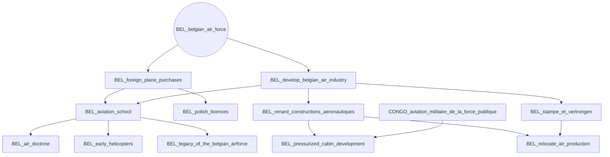
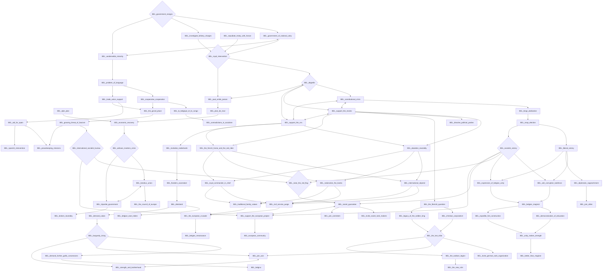
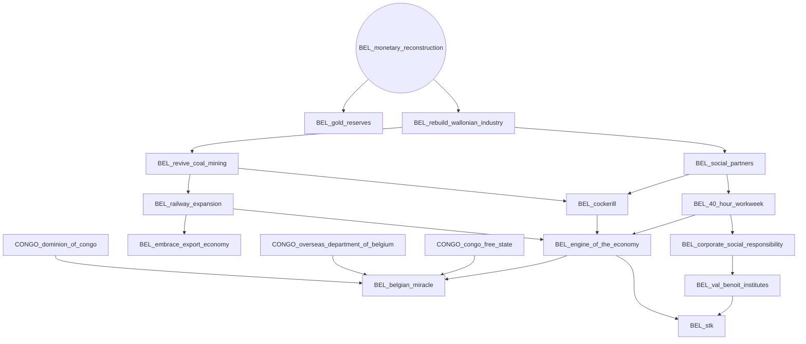
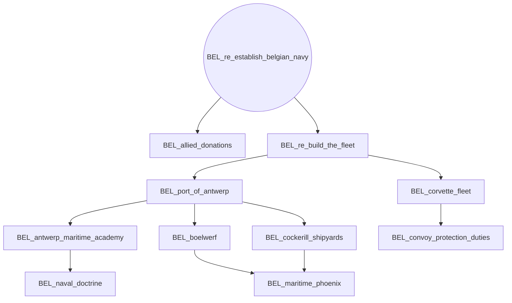
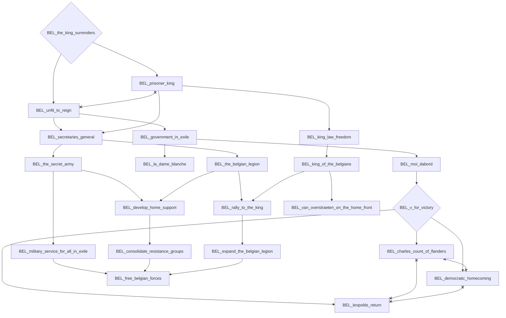

# BEL_belgian_air_force

```mermaid
flowchart TD
    n1["BEL_air_doctrine"]
    n2["BEL_aviation_school"]
    n3(("BEL_belgian_air_force"))
    n4["BEL_develop_belgian_air_industry"]
    n5["BEL_early_helicopters"]
    n6["BEL_foreign_plane_purchases"]
    n7["BEL_legacy_of_the_belgian_airforce"]
    n8["BEL_polish_licences"]
    n9["BEL_pressurized_cabin_development"]
    n10["BEL_relocate_air_production"]
    n11["BEL_renard_constructions_aeronautiques"]
    n12["BEL_stampe_et_vertrongen"]
    n13["CONGO_aviation_militaire_de_la_force_publique"]
    n2 --> n1
    n6 --> n2
    n4 --> n2
    n3 --> n4
    n2 --> n5
    n3 --> n6
    n2 --> n7
    n6 --> n8
    n11 --> n9
    n13 --> n9
    n11 --> n10
    n12 --> n10
    n4 --> n11
    n4 --> n12
```

# BEL_government_resigns

```mermaid
flowchart TD
    n14["BEL_abandon_neutrality"]
    n15{"BEL_adriaan_martens_crisis"}
    n16["BEL_aid_for_spain"]
    n17["BEL_anti_corruption_taskforce"]
    n18["BEL_belgian_east_indies"]
    n19["BEL_belgian_maginot"]
    n20["BEL_belgian_renaissance"]
    n21["BEL_belgica"]
    n22["BEL_benelux_union"]
    n23["BEL_better_than_maginot"]
    n24["BEL_broken_neutrality"]
    n25{"BEL_burgundy_rising"}
    n26["BEL_christian_corporatism"]
    n27["BEL_civil_service_purge"]
    n28["BEL_constitutional_crisis"]
    n29["BEL_contradictions_in_socialism"]
    n30["BEL_cooperative_cooperation"]
    n31{"BEL_degrelle"}
    n32["BEL_demand_calais"]
    n33["BEL_demand_further_gallic_concessions"]
    n34["BEL_democratization_of_education"]
    n35["BEL_dietsland"]
    n36["BEL_diplomatic_rapprochment"]
    n37["BEL_dissolve_political_parties"]
    n38["BEL_dyle_plan"]
    n39["BEL_economic_recovery"]
    n40["BEL_european_community"]
    n41["BEL_expedite_fort_construction"]
    n42["BEL_expression_of_belgian_unity"]
    n43["BEL_flanders_ascendant"]
    n44["BEL_government_of_national_unity"]
    n45{"BEL_government_resigns"}
    n46["BEL_growing_threat_of_fascism"]
    n47{"BEL_international_socialist_bureau"}
    n48["BEL_international_stipend"]
    n49["BEL_investigate_bribery_charges"]
    n50["BEL_invite_german_tank_organization"]
    n51["BEL_invite_soviet_tank_makers"]
    n52["BEL_join_allies"]
    n53["BEL_join_axis"]
    n54["BEL_join_comintern"]
    n55["BEL_kings_abdication"]
    n56["BEL_la_belgique_et_le_congo"]
    n57["BEL_legacy_of_the_soldier_king"]
    n58["BEL_liberal_victory"]
    n59["BEL_nationalize_the_banks"]
    n60["BEL_paul_emile_janson"]
    n61["BEL_peacekeeping_missions"]
    n62["BEL_plan_de_man"]
    n63["BEL_problem_of_language"]
    n64{"BEL_raise_the_red_flag"}
    n65["BEL_repudiate_treaty_with_france"]
    n66["BEL_revitalize_nederlands"]
    n67["BEL_royal_commander_in_chief"]
    n68{"BEL_royal_intervention"}
    n69["BEL_snap_election"]
    n70{"BEL_socialist_victory"}
    n71["BEL_soviet_guarantee"]
    n72["BEL_spanish_intervention"]
    n73["BEL_strength_and_brotherhood"]
    n74["BEL_support_the_european_project"]
    n75["BEL_support_the_rexists"]
    n76["BEL_support_the_vnv"]
    n77["BEL_the_council_of_europe"]
    n78["BEL_the_european_crusade"]
    n79["BEL_the_flemish_question"]
    n80["BEL_the_french_horse_and_the_red_rider"]
    n81["BEL_the_grand_place"]
    n82{"BEL_the_lost_tribe"}
    n83["BEL_the_new_ruhr"]
    n84["BEL_the_walloon_legion"]
    n85["BEL_trade_union_support"]
    n86["BEL_traditional_family_values"]
    n87["BEL_tripartite_government"]
    n88["BEL_unity_makes_strength"]
    n89["BEL_vandervelde_minority"]
    n75 --> n14
    n76 --> n14
    n39 --> n15
    n85 --> n16
    n58 --> n17
    n70 --> n17
    n35 --> n18
    n42 --> n19
    n17 --> n19
    n78 --> n20
    n33 --> n21
    n15 --> n22
    n88 --> n23
    n87 --> n24
    n32 --> n25
    n79 --> n26
    n59 --> n27
    n67 --> n27
    n48 --> n27
    n31 --> n28
    n56 --> n29
    n63 --> n30
    n68 --> n31
    n35 --> n32
    n25 --> n33
    n19 --> n34
    n43 --> n35
    n58 --> n36
    n75 --> n37
    n62 --> n39
    n38 --> n39
    n74 --> n40
    n19 --> n41
    n58 --> n42
    n70 --> n42
    n66 --> n43
    n45 --> n44
    n81 --> n46
    n46 --> n47
    n14 --> n48
    n80 --> n48
    n45 --> n49
    n82 --> n50
    n71 --> n51
    n36 --> n52
    n25 --> n53
    n82 --> n53
    n71 --> n54
    n28 --> n55
    n30 --> n56
    n79 --> n57
    n69 --> n58
    n14 --> n59
    n80 --> n59
    n68 --> n60
    n46 --> n61
    n16 --> n61
    n60 --> n62
    n89 --> n63
    n70 --> n64
    n47 --> n64
    n76 --> n66
    n14 --> n67
    n80 --> n67
    n49 --> n68
    n44 --> n68
    n65 --> n68
    n55 --> n69
    n69 --> n70
    n70 --> n71
    n64 --> n71
    n16 --> n72
    n25 --> n73
    n47 --> n74
    n70 --> n74
    n31 --> n75
    n31 --> n76
    n22 --> n77
    n27 --> n78
    n86 --> n78
    n75 --> n79
    n75 --> n80
    n76 --> n80
    n85 --> n81
    n30 --> n81
    n26 --> n82
    n57 --> n82
    n84 --> n83
    n82 --> n84
    n63 --> n85
    n59 --> n86
    n67 --> n86
    n48 --> n86
    n15 --> n87
    n41 --> n88
    n34 --> n88
    n45 --> n89
    n22 x--x n87
    n28 x--x n75
    n28 x--x n76
    n31 x--x n60
    n44 x--x n89
    n53 x--x n73
    n71 x--x n74
    n75 x--x n76
```

# BEL_monetary_reconstruction

```mermaid
flowchart TD
    n90["BEL_40_hour_workweek"]
    n91["BEL_belgian_miracle"]
    n92["BEL_cockerill"]
    n93["BEL_corporate_social_responsibility"]
    n94["BEL_embrace_export_economy"]
    n95["BEL_engine_of_the_economy"]
    n96["BEL_gold_reserves"]
    n97(("BEL_monetary_reconstruction"))
    n98["BEL_railway_expansion"]
    n99["BEL_rebuild_wallonian_industry"]
    n100["BEL_revive_coal_mining"]
    n101["BEL_social_partners"]
    n102["BEL_stk"]
    n103["BEL_val_benoit_institutes"]
    n104["CONGO_congo_free_state"]
    n105["CONGO_dominion_of_congo"]
    n106["CONGO_overseas_department_of_belgium"]
    n101 --> n90
    n95 --> n91
    n104 --> n91
    n106 --> n91
    n105 --> n91
    n101 --> n92
    n100 --> n92
    n90 --> n93
    n98 --> n94
    n90 --> n95
    n92 --> n95
    n98 --> n95
    n97 --> n96
    n100 --> n98
    n97 --> n99
    n99 --> n100
    n99 --> n101
    n103 --> n102
    n95 --> n102
    n93 --> n103
```

# BEL_perpetual_neutrality

```mermaid
flowchart TD
    n14["BEL_abandon_neutrality"]
    n15{"BEL_adriaan_martens_crisis"}
    n17["BEL_anti_corruption_taskforce"]
    n107["BEL_anti_tank_guns"]
    n18["BEL_belgian_east_indies"]
    n108["BEL_belgian_gates"]
    n19["BEL_belgian_maginot"]
    n20["BEL_belgian_renaissance"]
    n109["BEL_belgian_special_forces"]
    n110["BEL_belgian_tank_development"]
    n21["BEL_belgica"]
    n22["BEL_benelux_union"]
    n23["BEL_better_than_maginot"]
    n24["BEL_broken_neutrality"]
    n25{"BEL_burgundy_rising"}
    n111["BEL_center_for_advanced_military_studies"]
    n112["BEL_center_of_nuclear_chemistry"]
    n26["BEL_christian_corporatism"]
    n27["BEL_civil_service_purge"]
    n28["BEL_constitutional_crisis"]
    n113["BEL_dam_the_consequences"]
    n114["BEL_defense_bill"]
    n115["BEL_defensive_neutrality"]
    n116["BEL_defensive_reorganization"]
    n31{"BEL_degrelle"}
    n32["BEL_demand_calais"]
    n33["BEL_demand_further_gallic_concessions"]
    n34["BEL_democratization_of_education"]
    n117["BEL_department_of_ballistic_metrology"]
    n118["BEL_department_of_telecommunications"]
    n35["BEL_dietsland"]
    n36["BEL_diplomatic_rapprochment"]
    n37["BEL_dissolve_political_parties"]
    n119["BEL_doctrinal_innovations"]
    n38["BEL_dyle_plan"]
    n120["BEL_eben_emael_fortress"]
    n39["BEL_economic_recovery"]
    n40["BEL_european_community"]
    n41["BEL_expedite_fort_construction"]
    n42["BEL_expression_of_belgian_unity"]
    n43["BEL_flanders_ascendant"]
    n121["BEL_flooded_tank_barriers"]
    n122["BEL_fn_herstal"]
    n123["BEL_fonderie_royale_de_canons_liege"]
    n124["BEL_fortify_liege"]
    n44["BEL_government_of_national_unity"]
    n125["BEL_increased_length_of_service"]
    n126["BEL_independent_neutral_and_loyal"]
    n47{"BEL_international_socialist_bureau"}
    n48["BEL_international_stipend"]
    n127["BEL_interpreters"]
    n49["BEL_investigate_bribery_charges"]
    n50["BEL_invite_german_tank_organization"]
    n51["BEL_invite_soviet_tank_makers"]
    n128["BEL_iron_wall"]
    n52["BEL_join_allies"]
    n53["BEL_join_axis"]
    n54["BEL_join_comintern"]
    n129["BEL_junior_officer_training"]
    n55["BEL_kings_abdication"]
    n130["BEL_koningshooikt_wavre_line"]
    n131["BEL_legacy_of_the_great_war"]
    n57["BEL_legacy_of_the_soldier_king"]
    n58["BEL_liberal_victory"]
    n132["BEL_minerva_imperia"]
    n133["BEL_mobilize_the_nation"]
    n134["BEL_modernized_army"]
    n135["BEL_multi_language_courses"]
    n136["BEL_national_redoubt_at_antwerp"]
    n59["BEL_nationalize_the_banks"]
    n137["BEL_our_southern_neighbour"]
    n60["BEL_paul_emile_janson"]
    n138(("BEL_perpetual_neutrality"))
    n62["BEL_plan_de_man"]
    n139["BEL_poudreries_reunies_de_belgique"]
    n140["BEL_protect_against_france"]
    n64{"BEL_raise_the_red_flag"}
    n65["BEL_repudiate_treaty_with_france"]
    n141["BEL_resist_and_bite"]
    n66["BEL_revitalize_nederlands"]
    n67["BEL_royal_commander_in_chief"]
    n68{"BEL_royal_intervention"}
    n142["BEL_royal_military_academy"]
    n143["BEL_senior_officer_training"]
    n69["BEL_snap_election"]
    n70{"BEL_socialist_victory"}
    n71["BEL_soviet_guarantee"]
    n144["BEL_strategic_doctrine_development"]
    n73["BEL_strength_and_brotherhood"]
    n74["BEL_support_the_european_project"]
    n75["BEL_support_the_rexists"]
    n76["BEL_support_the_vnv"]
    n77["BEL_the_council_of_europe"]
    n78["BEL_the_european_crusade"]
    n79["BEL_the_flemish_question"]
    n80["BEL_the_french_horse_and_the_red_rider"]
    n82{"BEL_the_lost_tribe"}
    n83["BEL_the_new_ruhr"]
    n84["BEL_the_walloon_legion"]
    n86["BEL_traditional_family_values"]
    n87["BEL_tripartite_government"]
    n88["BEL_unity_makes_strength"]
    n75 --> n14
    n76 --> n14
    n39 --> n15
    n58 --> n17
    n70 --> n17
    n117 --> n107
    n35 --> n18
    n115 --> n108
    n42 --> n19
    n17 --> n19
    n78 --> n20
    n141 --> n109
    n144 --> n110
    n123 --> n110
    n33 --> n21
    n15 --> n22
    n88 --> n23
    n87 --> n24
    n32 --> n25
    n135 --> n111
    n118 --> n111
    n111 --> n112
    n79 --> n26
    n59 --> n27
    n67 --> n27
    n48 --> n27
    n31 --> n28
    n121 --> n113
    n126 --> n114
    n126 --> n115
    n133 --> n116
    n130 --> n116
    n68 --> n31
    n35 --> n32
    n25 --> n33
    n19 --> n34
    n142 --> n117
    n142 --> n118
    n43 --> n35
    n58 --> n36
    n75 --> n37
    n144 --> n119
    n65 --> n38
    n124 --> n120
    n62 --> n39
    n38 --> n39
    n74 --> n40
    n19 --> n41
    n58 --> n42
    n70 --> n42
    n66 --> n43
    n130 --> n121
    n114 --> n122
    n117 --> n123
    n136 --> n124
    n114 --> n125
    n138 --> n126
    n14 --> n48
    n80 --> n48
    n109 --> n127
    n82 --> n50
    n71 --> n51
    n108 --> n128
    n36 --> n52
    n25 --> n53
    n82 --> n53
    n71 --> n54
    n142 --> n129
    n28 --> n55
    n120 --> n130
    n128 --> n130
    n132 --> n131
    n79 --> n57
    n69 --> n58
    n122 --> n132
    n38 --> n132
    n137 --> n133
    n130 --> n133
    n116 --> n134
    n143 --> n134
    n119 --> n134
    n142 --> n135
    n115 --> n136
    n14 --> n59
    n80 --> n59
    n128 --> n137
    n68 --> n60
    n60 --> n62
    n122 --> n139
    n137 --> n140
    n70 --> n64
    n47 --> n64
    n126 --> n65
    n135 --> n141
    n76 --> n66
    n14 --> n67
    n80 --> n67
    n49 --> n68
    n44 --> n68
    n65 --> n68
    n114 --> n142
    n111 --> n143
    n55 --> n69
    n69 --> n70
    n70 --> n71
    n64 --> n71
    n129 --> n144
    n25 --> n73
    n47 --> n74
    n70 --> n74
    n31 --> n75
    n31 --> n76
    n22 --> n77
    n27 --> n78
    n86 --> n78
    n75 --> n79
    n75 --> n80
    n76 --> n80
    n26 --> n82
    n57 --> n82
    n84 --> n83
    n82 --> n84
    n59 --> n86
    n67 --> n86
    n48 --> n86
    n15 --> n87
    n41 --> n88
    n34 --> n88
    n22 x--x n87
    n28 x--x n75
    n28 x--x n76
    n31 x--x n60
    n53 x--x n73
    n71 x--x n74
    n75 x--x n76
```

# BEL_re_establish_belgian_navy

```mermaid
flowchart TD
    n145["BEL_allied_donations"]
    n146["BEL_antwerp_maritime_academy"]
    n147["BEL_boelwerf"]
    n148["BEL_cockerill_shipyards"]
    n149["BEL_convoy_protection_duties"]
    n150["BEL_corvette_fleet"]
    n151["BEL_maritime_phoenix"]
    n152["BEL_naval_doctrine"]
    n153["BEL_port_of_antwerp"]
    n154["BEL_re_build_the_fleet"]
    n155(("BEL_re_establish_belgian_navy"))
    n155 --> n145
    n153 --> n146
    n153 --> n147
    n153 --> n148
    n150 --> n149
    n154 --> n150
    n147 --> n151
    n148 --> n151
    n146 --> n152
    n154 --> n153
    n155 --> n154
```

# BEL_the_king_surrenders

```mermaid
flowchart TD
    n156["BEL_charles_count_of_flanders"]
    n157["BEL_consolidate_resistance_groups"]
    n158["BEL_democratic_homecoming"]
    n159["BEL_develop_home_support"]
    n160["BEL_expand_the_belgian_legion"]
    n161["BEL_free_belgian_forces"]
    n162["BEL_government_in_exile"]
    n163["BEL_king_law_freedom"]
    n164["BEL_king_of_the_belgians"]
    n165["BEL_la_dame_blanche"]
    n166["BEL_leopolds_return"]
    n167["BEL_military_service_for_all_in_exile"]
    n168["BEL_moi_dabord"]
    n169["BEL_prisoner_king"]
    n170["BEL_rally_to_the_king"]
    n171["BEL_secretaries_general"]
    n172["BEL_the_belgian_legion"]
    n173{"BEL_the_king_surrenders"}
    n174["BEL_the_secret_army"]
    n175["BEL_unfit_to_reign"]
    n176{"BEL_v_for_victory"}
    n177["BEL_van_overstraeten_on_the_home_front"]
    n176 --> n156
    n159 --> n157
    n176 --> n158
    n174 --> n159
    n172 --> n159
    n170 --> n160
    n167 --> n161
    n157 --> n161
    n160 --> n161
    n175 --> n162
    n169 --> n163
    n163 --> n164
    n162 --> n165
    n176 --> n166
    n174 --> n167
    n162 --> n168
    n173 --> n169
    n172 --> n170
    n164 --> n170
    n175 --> n171
    n169 --> n171
    n171 --> n172
    n171 --> n174
    n173 --> n175
    n168 --> n176
    n164 --> n177
    n156 x--x n158
    n156 x--x n166
    n158 x--x n166
    n169 x--x n175
```
