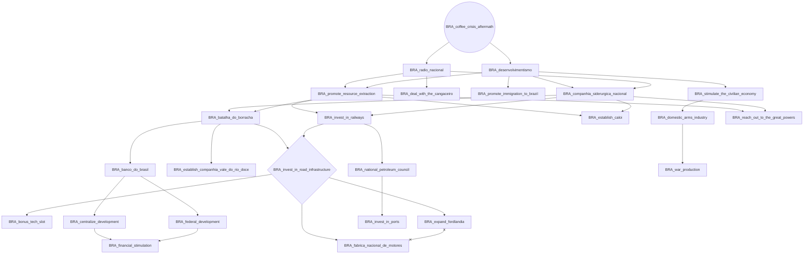
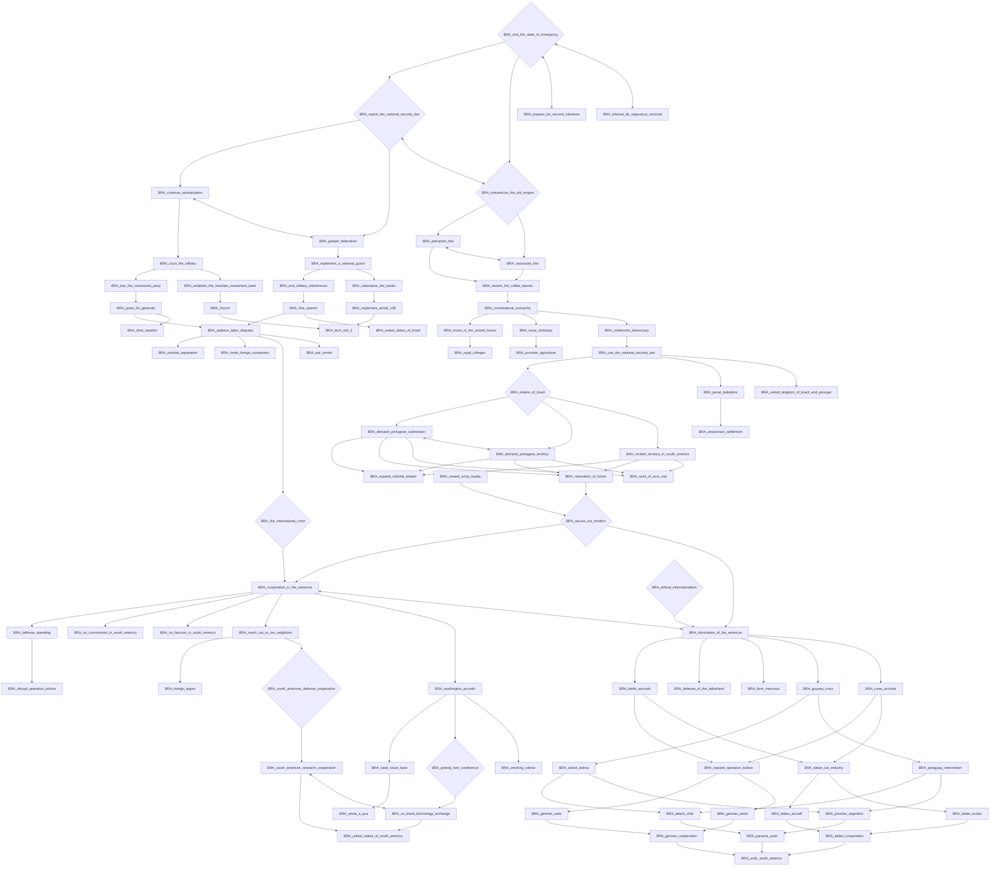
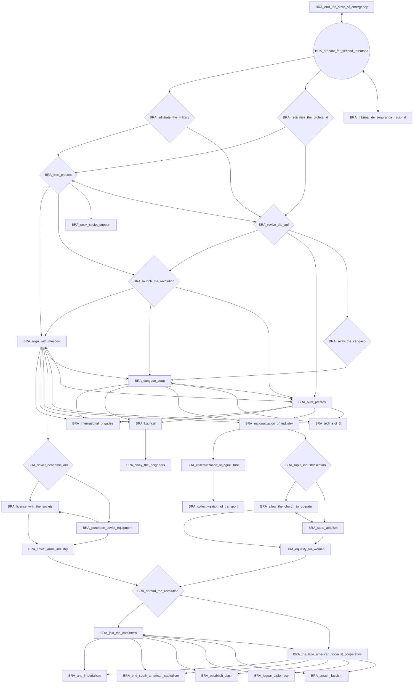
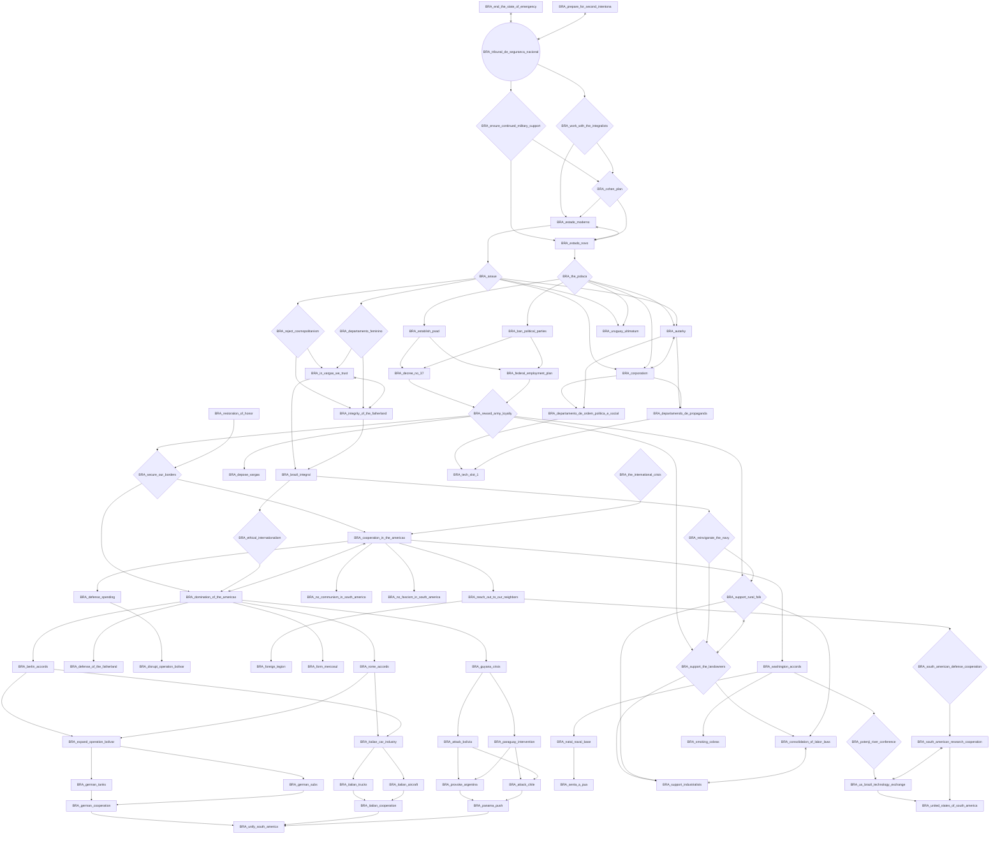

# BRA_coffee_crisis_aftermath

```mermaid
flowchart TD
    n1["BRA_banco_do_brasil"]
    n2["BRA_batalha_do_borracha"]
    n3["BRA_bonus_tech_slot"]
    n4["BRA_centralize_development"]
    n5(("BRA_coffee_crisis_aftermath"))
    n6["BRA_companhia_siderurgica_nacional"]
    n7["BRA_deal_with_the_cangaceiro"]
    n8["BRA_desenvolvimentismo"]
    n9["BRA_domestic_arms_industry"]
    n10["BRA_establish_caloi"]
    n11["BRA_establish_companhia_vale_do_rio_doce"]
    n12["BRA_expand_fordlandia"]
    n13["BRA_fabrica_nacional_de_motores"]
    n14["BRA_federal_development"]
    n15["BRA_financial_stimulation"]
    n16["BRA_invest_in_ports"]
    n17["BRA_invest_in_railways"]
    n18{"BRA_invest_in_road_infrastructure"}
    n19["BRA_national_petroleum_council"]
    n20["BRA_promote_immigration_to_brazil"]
    n21["BRA_promote_resource_extraction"]
    n22["BRA_radio_nacional"]
    n23["BRA_reach_out_to_the_great_powers"]
    n24["BRA_stimulate_the_civilian_economy"]
    n25["BRA_war_production"]
    n2 --> n1
    n6 --> n2
    n21 --> n2
    n18 --> n3
    n1 --> n4
    n8 --> n6
    n22 --> n6
    n22 --> n7
    n5 --> n8
    n24 --> n9
    n21 --> n10
    n6 --> n10
    n2 --> n11
    n18 --> n12
    n18 --> n13
    n1 --> n14
    n4 --> n15
    n14 --> n15
    n19 --> n16
    n21 --> n17
    n6 --> n17
    n2 --> n18
    n17 --> n18
    n17 --> n19
    n8 --> n20
    n22 --> n21
    n8 --> n21
    n5 --> n22
    n21 --> n23
    n6 --> n23
    n8 --> n24
    n9 --> n25
    n12 x--x n13
```

# BRA_end_the_state_of_emergency

```mermaid
flowchart TD
    n26["BRA_address_labor_disputes"]
    n27["BRA_amazonian_settlement"]
    n28["BRA_attack_bolivia"]
    n29["BRA_attack_chile"]
    n30["BRA_ban_the_communist_party"]
    n31["BRA_berlin_accords"]
    n32["BRA_church"]
    n33["BRA_combat_separatism"]
    n34["BRA_constitutional_monarchy"]
    n35["BRA_continue_centralization"]
    n36["BRA_cooperation_in_the_americas"]
    n37["BRA_court_the_military"]
    n38["BRA_defense_of_the_fatherland"]
    n39["BRA_defense_spending"]
    n40["BRA_demand_portugese_submission"]
    n41["BRA_demand_portugese_territory"]
    n42["BRA_disrupt_operation_bolivar"]
    n43["BRA_domination_of_the_americas"]
    n44{"BRA_empire_of_brazil"}
    n45["BRA_end_military_interference"]
    n46{"BRA_end_the_state_of_emergency"}
    n47["BRA_establish_the_brazilian_investment_bank"]
    n48{"BRA_ethical_internationalism"}
    n49["BRA_expand_colonial_empire"]
    n50["BRA_expand_operation_bolivar"]
    n51["BRA_foreign_legion"]
    n52["BRA_form_mercosul"]
    n53["BRA_free_speech"]
    n54["BRA_german_cooperation"]
    n55["BRA_german_subs"]
    n56["BRA_german_tanks"]
    n57["BRA_greater_federalism"]
    n58["BRA_guyana_crisis"]
    n59["BRA_implement_a_national_guard"]
    n60["BRA_implement_article_138"]
    n61["BRA_invest_in_the_armed_forces"]
    n62["BRA_invite_foreign_companies"]
    n63["BRA_issue_lordships"]
    n64["BRA_italian_aircraft"]
    n65["BRA_italian_car_industry"]
    n66["BRA_italian_cooperation"]
    n67["BRA_italian_trucks"]
    n68["BRA_natal_naval_base"]
    n69["BRA_nationalize_the_banks"]
    n70["BRA_no_communism_in_south_america"]
    n71["BRA_no_fascism_in_south_america"]
    n72["BRA_panama_push"]
    n73["BRA_paraguay_intervention"]
    n74["BRA_penal_battalions"]
    n75["BRA_petropolis_line"]
    n76["BRA_posts_for_generals"]
    n77{"BRA_potenji_river_conference"}
    n78["BRA_prepare_for_second_intentona"]
    n79["BRA_promote_agriculture"]
    n80["BRA_provoke_argentina"]
    n81["BRA_reach_out_to_our_neighbors"]
    n82["BRA_reclaim_territory_in_south_america"]
    n83{"BRA_repeal_the_national_security_law"}
    n84["BRA_restoration_of_honor"]
    n85["BRA_restore_the_coffee_barons"]
    n86["BRA_reward_army_loyalty"]
    n87{"BRA_romanticize_the_old_empire"}
    n88["BRA_rome_accords"]
    n89["BRA_royal_colleges"]
    n90{"BRA_secure_our_borders"}
    n91["BRA_senta_a_pua"]
    n92["BRA_smoking_cobras"]
    n93{"BRA_south_american_defense_cooperation"}
    n94["BRA_south_american_research_cooperation"]
    n95["BRA_spirit_of_acre_war"]
    n96["BRA_tech_slot_2"]
    n97{"BRA_the_international_crisis"}
    n98["BRA_third_republic"]
    n99["BRA_tribunal_de_seguranca_nacional"]
    n100["BRA_undermine_democracy"]
    n101["BRA_unify_south_america"]
    n102["BRA_united_kingdom_of_brazil_and_portugal"]
    n103["BRA_united_states_of_brazil"]
    n104["BRA_united_states_of_south_america"]
    n105["BRA_us_brazil_technology_exchange"]
    n106["BRA_use_the_national_security_law"]
    n107["BRA_vassouras_line"]
    n108["BRA_war_bonds"]
    n109["BRA_washington_accords"]
    n53 --> n26
    n76 --> n26
    n74 --> n27
    n58 --> n28
    n73 --> n29
    n28 --> n29
    n37 --> n30
    n43 --> n31
    n47 --> n32
    n26 --> n33
    n85 --> n34
    n83 --> n35
    n90 --> n36
    n97 --> n36
    n35 --> n37
    n43 --> n38
    n36 --> n39
    n44 --> n40
    n44 --> n41
    n39 --> n42
    n90 --> n43
    n48 --> n43
    n106 --> n44
    n59 --> n45
    n37 --> n47
    n41 --> n49
    n40 --> n49
    n82 --> n49
    n31 --> n50
    n88 --> n50
    n81 --> n51
    n43 --> n52
    n45 --> n53
    n56 --> n54
    n55 --> n54
    n50 --> n55
    n50 --> n56
    n83 --> n57
    n43 --> n58
    n57 --> n59
    n69 --> n60
    n34 --> n61
    n26 --> n62
    n34 --> n63
    n65 --> n64
    n88 --> n65
    n31 --> n65
    n67 --> n66
    n64 --> n66
    n65 --> n67
    n109 --> n68
    n59 --> n69
    n36 --> n70
    n36 --> n71
    n80 --> n72
    n29 --> n72
    n58 --> n73
    n106 --> n74
    n87 --> n75
    n30 --> n76
    n109 --> n77
    n63 --> n79
    n28 --> n80
    n73 --> n80
    n36 --> n81
    n44 --> n82
    n46 --> n83
    n41 --> n84
    n40 --> n84
    n82 --> n84
    n107 --> n85
    n75 --> n85
    n46 --> n87
    n43 --> n88
    n61 --> n89
    n86 --> n90
    n84 --> n90
    n68 --> n91
    n109 --> n92
    n81 --> n93
    n93 --> n94
    n41 --> n95
    n40 --> n95
    n82 --> n95
    n60 --> n96
    n32 --> n96
    n26 --> n97
    n76 --> n98
    n34 --> n100
    n54 --> n101
    n66 --> n101
    n72 --> n101
    n106 --> n102
    n53 --> n103
    n105 --> n104
    n94 --> n104
    n77 --> n105
    n100 --> n106
    n87 --> n107
    n26 --> n108
    n36 --> n109
    n35 x--x n57
    n36 x--x n43
    n40 x--x n41
    n46 x--x n78
    n46 x--x n99
    n75 x--x n107
    n83 x--x n87
    n94 x--x n105
```

# BRA_prepare_for_second_intentona

```mermaid
flowchart TD
    n110["BRA_align_with_moscow"]
    n111["BRA_allow_the_church_to_operate"]
    n112["BRA_anti_imperialism"]
    n113["BRA_cangaco_coup"]
    n114["BRA_collectivization_of_agriculture"]
    n115["BRA_collectivization_of_transport"]
    n116["BRA_end_south_american_capitalism"]
    n46["BRA_end_the_state_of_emergency"]
    n117["BRA_equality_for_women"]
    n118["BRA_establish_ulasr"]
    n119{"BRA_free_prestes"}
    n120{"BRA_infilitrate_the_military"}
    n121["BRA_international_brigades"]
    n122["BRA_jaguar_diplomacy"]
    n123["BRA_join_the_comintern"]
    n124["BRA_kgbrazil"]
    n125{"BRA_launch_the_revolution"}
    n126["BRA_license_with_the_soviets"]
    n127["BRA_nationalization_of_industry"]
    n128["BRA_oust_prestes"]
    n78(("BRA_prepare_for_second_intentona"))
    n129["BRA_purchase_soviet_equipment"]
    n130{"BRA_radicalize_the_proletariat"}
    n131{"BRA_rapid_industrialization"}
    n132{"BRA_revive_the_anl"}
    n133["BRA_seek_soviet_support"]
    n134["BRA_smash_fascism"]
    n135["BRA_soviet_arms_industry"]
    n136{"BRA_soviet_economic_aid"}
    n137{"BRA_spread_the_revolution"}
    n138["BRA_state_atheism"]
    n139{"BRA_sway_the_cangaco"}
    n140["BRA_sway_the_neighbors"]
    n141["BRA_tech_slot_3"]
    n142["BRA_the_latin_american_socialist_cooperative"]
    n99["BRA_tribunal_de_seguranca_nacional"]
    n125 --> n110
    n119 --> n110
    n131 --> n111
    n123 --> n112
    n142 --> n112
    n125 --> n113
    n139 --> n113
    n127 --> n114
    n114 --> n115
    n123 --> n116
    n142 --> n116
    n138 --> n117
    n111 --> n117
    n142 --> n118
    n123 --> n118
    n120 --> n119
    n130 --> n119
    n78 --> n120
    n110 --> n121
    n128 --> n121
    n113 --> n121
    n142 --> n122
    n123 --> n122
    n137 --> n123
    n110 --> n124
    n128 --> n124
    n113 --> n124
    n119 --> n125
    n132 --> n125
    n136 --> n126
    n110 --> n127
    n128 --> n127
    n113 --> n127
    n125 --> n128
    n132 --> n128
    n136 --> n129
    n78 --> n130
    n127 --> n131
    n130 --> n132
    n120 --> n132
    n119 --> n133
    n123 --> n134
    n142 --> n134
    n126 --> n135
    n129 --> n135
    n110 --> n136
    n135 --> n137
    n117 --> n137
    n131 --> n138
    n132 --> n139
    n124 --> n140
    n110 --> n141
    n128 --> n141
    n113 --> n141
    n137 --> n142
    n110 x--x n113
    n110 x--x n128
    n111 x--x n138
    n113 x--x n128
    n46 x--x n78
    n119 x--x n132
    n123 x--x n142
    n126 x--x n129
    n78 x--x n99
```

# BRA_tribunal_de_seguranca_nacional

```mermaid
flowchart TD
    n143{"BRA_anaue"}
    n28["BRA_attack_bolivia"]
    n29["BRA_attack_chile"]
    n144["BRA_autarky"]
    n145["BRA_ban_political_parties"]
    n31["BRA_berlin_accords"]
    n146["BRA_brazil_integral"]
    n147{"BRA_cohen_plan"}
    n148["BRA_consolidation_of_labor_laws"]
    n36["BRA_cooperation_in_the_americas"]
    n149["BRA_corporatism"]
    n150["BRA_decree_no_37"]
    n38["BRA_defense_of_the_fatherland"]
    n39["BRA_defense_spending"]
    n151["BRA_departamendo_de_propaganda"]
    n152["BRA_departamento_de_ordem_politica_e_social"]
    n153{"BRA_departamento_feminino"}
    n154["BRA_depose_vargas"]
    n42["BRA_disrupt_operation_bolivar"]
    n43["BRA_domination_of_the_americas"]
    n46["BRA_end_the_state_of_emergency"]
    n155{"BRA_ensure_continued_military_support"}
    n156["BRA_establish_psad"]
    n157["BRA_estado_moderno"]
    n158["BRA_estado_novo"]
    n48{"BRA_ethical_internationalism"}
    n50["BRA_expand_operation_bolivar"]
    n159["BRA_federal_employment_plan"]
    n51["BRA_foreign_legion"]
    n52["BRA_form_mercosul"]
    n54["BRA_german_cooperation"]
    n55["BRA_german_subs"]
    n56["BRA_german_tanks"]
    n58["BRA_guyana_crisis"]
    n160["BRA_in_vargas_we_trust"]
    n161["BRA_integrity_of_the_fatherland"]
    n64["BRA_italian_aircraft"]
    n65["BRA_italian_car_industry"]
    n66["BRA_italian_cooperation"]
    n67["BRA_italian_trucks"]
    n68["BRA_natal_naval_base"]
    n70["BRA_no_communism_in_south_america"]
    n71["BRA_no_fascism_in_south_america"]
    n72["BRA_panama_push"]
    n73["BRA_paraguay_intervention"]
    n77{"BRA_potenji_river_conference"}
    n78["BRA_prepare_for_second_intentona"]
    n80["BRA_provoke_argentina"]
    n81["BRA_reach_out_to_our_neighbors"]
    n162{"BRA_reinvigorate_the_navy"}
    n163{"BRA_reject_cosmopolitanism"}
    n84["BRA_restoration_of_honor"]
    n86{"BRA_reward_army_loyalty"}
    n88["BRA_rome_accords"]
    n90{"BRA_secure_our_borders"}
    n91["BRA_senta_a_pua"]
    n92["BRA_smoking_cobras"]
    n93{"BRA_south_american_defense_cooperation"}
    n94["BRA_south_american_research_cooperation"]
    n164["BRA_support_industrialists"]
    n165{"BRA_support_rural_folk"}
    n166{"BRA_support_the_landowners"}
    n167["BRA_tech_slot_1"]
    n97{"BRA_the_international_crisis"}
    n168{"BRA_the_polaca"}
    n99(("BRA_tribunal_de_seguranca_nacional"))
    n101["BRA_unify_south_america"]
    n104["BRA_united_states_of_south_america"]
    n169["BRA_uruguay_ultimatum"]
    n105["BRA_us_brazil_technology_exchange"]
    n109["BRA_washington_accords"]
    n170{"BRA_work_with_the_integralists"}
    n157 --> n143
    n58 --> n28
    n73 --> n29
    n28 --> n29
    n168 --> n144
    n143 --> n144
    n168 --> n145
    n43 --> n31
    n160 --> n146
    n161 --> n146
    n155 --> n147
    n170 --> n147
    n166 --> n148
    n165 --> n148
    n90 --> n36
    n97 --> n36
    n143 --> n149
    n168 --> n149
    n156 --> n150
    n145 --> n150
    n43 --> n38
    n36 --> n39
    n144 --> n151
    n149 --> n151
    n149 --> n152
    n144 --> n152
    n143 --> n153
    n86 --> n154
    n39 --> n42
    n90 --> n43
    n48 --> n43
    n99 --> n155
    n168 --> n156
    n170 --> n157
    n147 --> n157
    n155 --> n158
    n147 --> n158
    n146 --> n48
    n31 --> n50
    n88 --> n50
    n156 --> n159
    n145 --> n159
    n81 --> n51
    n43 --> n52
    n56 --> n54
    n55 --> n54
    n50 --> n55
    n50 --> n56
    n43 --> n58
    n163 --> n160
    n153 --> n160
    n163 --> n161
    n153 --> n161
    n65 --> n64
    n88 --> n65
    n31 --> n65
    n67 --> n66
    n64 --> n66
    n65 --> n67
    n109 --> n68
    n36 --> n70
    n36 --> n71
    n80 --> n72
    n29 --> n72
    n58 --> n73
    n109 --> n77
    n28 --> n80
    n73 --> n80
    n36 --> n81
    n146 --> n162
    n143 --> n163
    n150 --> n86
    n159 --> n86
    n43 --> n88
    n86 --> n90
    n84 --> n90
    n68 --> n91
    n109 --> n92
    n81 --> n93
    n93 --> n94
    n166 --> n164
    n165 --> n164
    n86 --> n165
    n162 --> n165
    n86 --> n166
    n162 --> n166
    n152 --> n167
    n151 --> n167
    n158 --> n168
    n54 --> n101
    n66 --> n101
    n72 --> n101
    n105 --> n104
    n94 --> n104
    n143 --> n169
    n168 --> n169
    n77 --> n105
    n36 --> n109
    n99 --> n170
    n144 x--x n149
    n148 x--x n164
    n36 x--x n43
    n46 x--x n99
    n157 x--x n158
    n160 x--x n161
    n78 x--x n99
    n94 x--x n105
    n165 x--x n166
```
