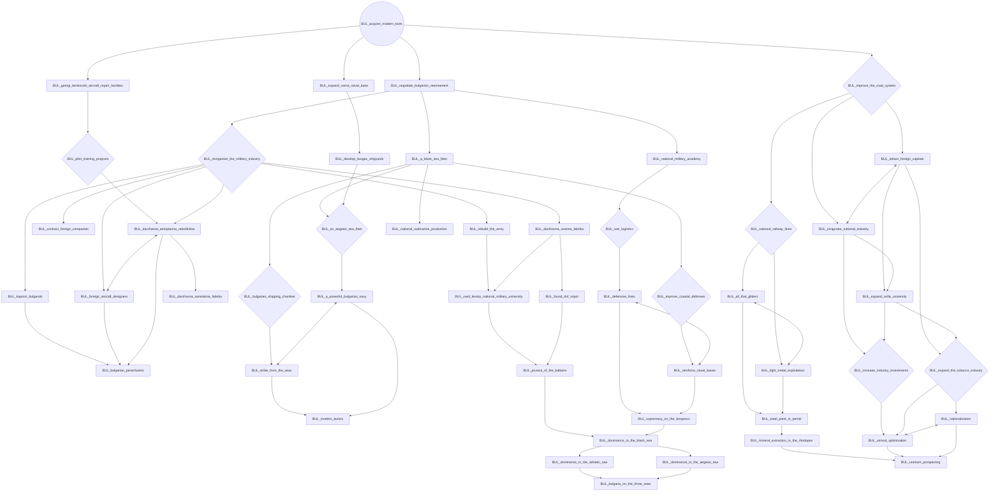
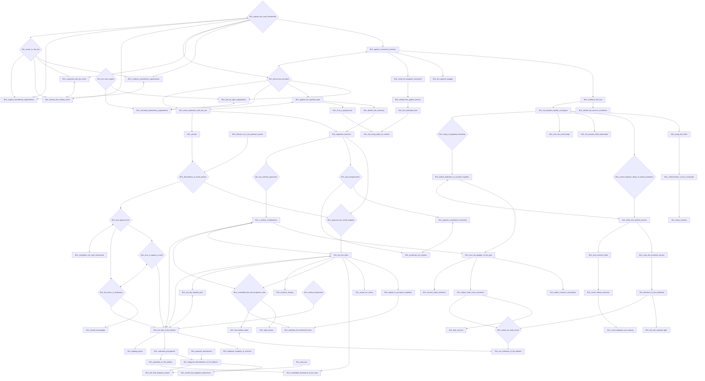
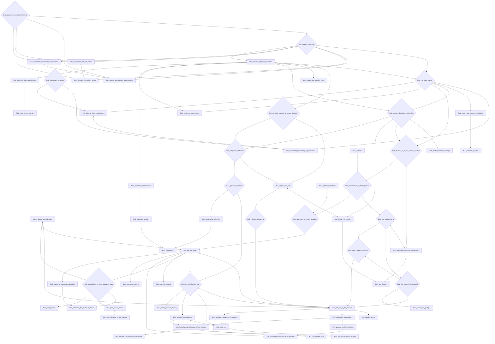

# BUL_acquire_modern_tools

```mermaid
flowchart TD
    n1["BUL_a_black_sea_fleet"]
    n2["BUL_a_powerful_bulgarian_navy"]
    n3(("BUL_acquire_modern_tools"))
    n4["BUL_all_that_glitters"]
    n5{"BUL_an_aegean_sea_fleet"}
    n6["BUL_attract_foreign_capitals"]
    n7["BUL_bulgaria_on_the_three_seas"]
    n8["BUL_bulgarian_parachutists"]
    n9{"BUL_bulgarian_shipping_chamber"}
    n10["BUL_contract_foreign_companies"]
    n11["BUL_darzhavna_aeroplanna_rabotilnitsa"]
    n12["BUL_darzhavna_samoletna_fabrika"]
    n13["BUL_darzhavna_voenna_fabrika"]
    n14["BUL_defensive_lines"]
    n15["BUL_develop_burgas_shipyards"]
    n16["BUL_dominance_in_the_adriatic_sea"]
    n17["BUL_dominance_in_the_aegean_sea"]
    n18["BUL_dominance_in_the_black_sea"]
    n19["BUL_expand_sofia_university"]
    n20{"BUL_expand_the_tobacco_industry"}
    n21["BUL_expand_varna_naval_base"]
    n22["BUL_foreign_aircraft_designers"]
    n23["BUL_found_dvf_sopot"]
    n24["BUL_georgi_benkovski_aircraft_repair_facilities"]
    n25{"BUL_improve_coastal_defenses"}
    n26{"BUL_improve_the_road_system"}
    n27{"BUL_increase_industry_investments"}
    n28["BUL_invigorate_national_industry"]
    n29["BUL_kaproni_bulgarski"]
    n30["BUL_light_metal_exploitation"]
    n31["BUL_mineral_extraction_in_the_rhodopes"]
    n32["BUL_modern_tactics"]
    n33["BUL_national_military_academy"]
    n34{"BUL_national_railway_lines"}
    n35["BUL_national_submarine_production"]
    n36["BUL_nationalization"]
    n37["BUL_negotiate_bulgarian_rearmament"]
    n38{"BUL_pilot_training_program"}
    n39["BUL_prussia_of_the_balkans"]
    n40["BUL_rebuild_the_army"]
    n41["BUL_reinforce_naval_bases"]
    n42{"BUL_reorganize_the_military_industry"}
    n43["BUL_steel_plant_in_pernik"]
    n44["BUL_strike_from_the_seas"]
    n45["BUL_supremacy_on_the_bosporus"]
    n46["BUL_uranium_prospecting"]
    n47["BUL_utmost_optimization"]
    n48["BUL_vasil_levsky_national_military_university"]
    n49{"BUL_war_logistics"}
    n37 --> n1
    n5 --> n2
    n34 --> n4
    n1 --> n5
    n15 --> n5
    n26 --> n6
    n16 --> n7
    n17 --> n7
    n29 --> n8
    n22 --> n8
    n11 --> n8
    n1 --> n9
    n42 --> n10
    n38 --> n11
    n42 --> n11
    n11 --> n12
    n42 --> n13
    n49 --> n14
    n21 --> n15
    n18 --> n16
    n18 --> n17
    n39 --> n18
    n45 --> n18
    n6 --> n19
    n28 --> n19
    n6 --> n20
    n19 --> n20
    n3 --> n21
    n42 --> n22
    n13 --> n23
    n3 --> n24
    n1 --> n25
    n3 --> n26
    n28 --> n27
    n19 --> n27
    n26 --> n28
    n42 --> n29
    n34 --> n30
    n43 --> n31
    n44 --> n32
    n2 --> n32
    n37 --> n33
    n26 --> n34
    n1 --> n35
    n20 --> n36
    n3 --> n37
    n24 --> n38
    n48 --> n39
    n23 --> n39
    n42 --> n40
    n25 --> n41
    n37 --> n42
    n4 --> n43
    n30 --> n43
    n9 --> n44
    n14 --> n45
    n41 --> n45
    n31 --> n46
    n47 --> n46
    n36 --> n46
    n27 --> n47
    n20 --> n47
    n40 --> n48
    n13 --> n48
    n33 --> n49
    n2 x--x n44
    n4 x--x n30
    n6 x--x n28
    n11 x--x n22
    n14 x--x n41
    n36 x--x n47
```

# BUL_oppose_the_royal_dictatorship

```mermaid
flowchart TD
    n50["BUL_a_balkan_confederation"]
    n51["BUL_abolish_the_monarchy"]
    n52["BUL_abolish_the_tarnovo_constitution"]
    n53["BUL_agrarian_cooperative_movement"]
    n54["BUL_amend_old_grudges"]
    n55["BUL_appeal_to_european_capitalists"]
    n56["BUL_appoint_communist_ministers"]
    n57{"BUL_approach_the_united_kingdom"}
    n58["BUL_assert_our_claims"]
    n59["BUL_balkan_federation_of_socialist_republics"]
    n60["BUL_balkan_research_cooperation"]
    n61["BUL_balkan_trade_union_secretariat"]
    n62["BUL_ban_far_right_organizations"]
    n63["BUL_bulgarian_academy_of_sciences"]
    n64["BUL_bulgarian_administration_of_the_balkans"]
    n65["BUL_bury_the_grudges_of_the_past"]
    n66["BUL_carry_the_revolution_abroad"]
    n67["BUL_collectivization_of_the_countryside"]
    n68["BUL_condemn_macedonian_organizations"]
    n69["BUL_consolidate_dominance_of_the_seas"]
    n70{"BUL_consolidate_the_third_bulgarian_state"}
    n71["BUL_cooperate_with_the_zveno"]
    n72["BUL_defy_moscow"]
    n73{"BUL_democratic_principles"}
    n74["BUL_dissolve_the_military_union"]
    n75["BUL_fight_tyranny"]
    n76["BUL_follow_the_stalinist_doctrine"]
    n77["BUL_form_a_popular_bloc"]
    n78{"BUL_form_a_regency_council"}
    n79["BUL_free_balkan_states"]
    n80["BUL_full_voting_rights_for_women"]
    n81["BUL_guardians_of_the_balkans"]
    n82["BUL_heavy_industry"]
    n83["BUL_illusions_of_a_non_partisan_system"]
    n84["BUL_join_the_allies"]
    n85["BUL_join_the_tripartite_pact"]
    n86["BUL_joint_research_effort"]
    n87{"BUL_land_reorganization"}
    n88["BUL_legalize_the_agrarian_party"]
    n89["BUL_legislative_elections"]
    n90{"BUL_liberalization_of_trade_policies"}
    n91["BUL_liberation_of_the_proletariat"]
    n92{"BUL_military_dictatorship"}
    n93["BUL_modernize_the_industry"]
    n94["BUL_nationalist_propaganda"]
    n95["BUL_obliterate_the_bolshevik_threat"]
    n96{"BUL_oppose_the_royal_dictatorship"}
    n97["BUL_overthrow_the_tsar"]
    n98["BUL_peaceful_development"]
    n99["BUL_petorka"]
    n100{"BUL_plot_against_boris"}
    n101{"BUL_power_to_the_tsar"}
    n102["BUL_purge_the_elites"]
    n103["BUL_recover_italian_territories"]
    n104["BUL_research_sharing"]
    n105["BUL_restore_the_bulgarian_patriarchate"]
    n106["BUL_restrained_paramilitary_organizations"]
    n107["BUL_seek_cooperation_with_the_tsar"]
    n108{"BUL_soviet_bulgarian_treaty_of_mutual_assistance"}
    n109["BUL_soviet_bulgarian_war_industry"]
    n110["BUL_soviet_military_exercises"]
    n111["BUL_strengthen_the_royal_dictatorship"]
    n112["BUL_support_macedonian_organizations"]
    n113["BUL_the_anti_capitalist_fight"]
    n114["BUL_the_fate_of_the_balkans"]
    n115["BUL_the_fatherland_front"]
    n116["BUL_the_peoples_militia_directorate"]
    n117["BUL_the_peoples_republic_of_bulgaria"]
    n118{"BUL_the_return_of_ferdinand_i"}
    n119{"BUL_the_salonika_agreement"}
    n120["BUL_the_spanish_struggle"]
    n121["BUL_the_third_bulgarian_empire"]
    n122{"BUL_the_tsars_regime"}
    n123["BUL_the_unification_of_the_balkans"]
    n124["BUL_toppling_giants"]
    n125["BUL_total_war"]
    n126["BUL_train_the_youth_wings"]
    n127{"BUL_treaty_of_perpetual_friendship"}
    n128["BUL_unify_the_bourgeois_movement"]
    n129["BUL_united_front_against_fascism"]
    n130{"BUL_united_we_shall_prevail"}
    n119 --> n50
    n88 --> n51
    n97 --> n52
    n87 --> n53
    n118 --> n54
    n84 --> n55
    n96 --> n56
    n89 --> n57
    n90 --> n57
    n84 --> n58
    n127 --> n59
    n65 --> n60
    n65 --> n61
    n122 --> n62
    n73 --> n62
    n114 --> n63
    n98 --> n64
    n94 --> n64
    n59 --> n65
    n50 --> n65
    n76 --> n66
    n102 --> n67
    n101 --> n68
    n96 --> n68
    n81 --> n69
    n84 --> n69
    n84 --> n70
    n50 --> n70
    n101 --> n71
    n96 --> n71
    n61 --> n72
    n96 --> n73
    n101 --> n74
    n96 --> n74
    n70 --> n75
    n108 --> n76
    n88 --> n77
    n100 --> n78
    n70 --> n79
    n115 --> n80
    n77 --> n80
    n94 --> n81
    n67 --> n82
    n57 --> n84
    n76 --> n86
    n89 --> n87
    n73 --> n88
    n51 --> n89
    n107 --> n89
    n83 --> n90
    n99 --> n90
    n66 --> n91
    n87 --> n93
    n114 --> n94
    n55 --> n95
    n70 --> n95
    n56 --> n97
    n107 --> n99
    n90 --> n100
    n117 --> n102
    n65 --> n103
    n84 --> n104
    n64 --> n105
    n122 --> n106
    n73 --> n106
    n73 --> n107
    n117 --> n108
    n110 --> n109
    n86 --> n110
    n101 --> n112
    n96 --> n112
    n91 --> n113
    n78 --> n114
    n118 --> n114
    n92 --> n114
    n129 --> n115
    n117 --> n116
    n97 --> n117
    n100 --> n118
    n89 --> n119
    n56 --> n120
    n125 --> n121
    n64 --> n121
    n130 --> n123
    n114 --> n124
    n117 --> n126
    n117 --> n127
    n56 --> n128
    n128 --> n129
    n91 --> n130
    n61 --> n130
    n50 x--x n84
    n50 x--x n114
    n53 x--x n93
    n56 x--x n73
    n59 x--x n76
    n62 x--x n106
    n68 x--x n112
    n71 x--x n74
    n78 x--x n118
    n79 x--x n123
    n84 x--x n85
    n84 x--x n114
    n85 x--x n114
    n88 x--x n107
    n96 x--x n101
    n100 x--x n111
```

# BUL_power_to_the_tsar

```mermaid
flowchart TD
    n50["BUL_a_balkan_confederation"]
    n131["BUL_allow_far_right_organizations"]
    n54["BUL_amend_old_grudges"]
    n55["BUL_appeal_to_european_capitalists"]
    n132["BUL_appoint_right_wing_ministers"]
    n133{"BUL_approach_germany"}
    n57{"BUL_approach_the_united_kingdom"}
    n58["BUL_assert_our_claims"]
    n62["BUL_ban_far_right_organizations"]
    n63["BUL_bulgarian_academy_of_sciences"]
    n64["BUL_bulgarian_administration_of_the_balkans"]
    n134{"BUL_bulgarian_irredentism"}
    n68["BUL_condemn_macedonian_organizations"]
    n69["BUL_consolidate_dominance_of_the_seas"]
    n70{"BUL_consolidate_the_third_bulgarian_state"}
    n71["BUL_cooperate_with_the_zveno"]
    n135["BUL_cooperation_with_italy"]
    n136["BUL_corporatism"]
    n137["BUL_crush_the_communists"]
    n73{"BUL_democratic_principles"}
    n138["BUL_depose_the_tsar"]
    n74["BUL_dissolve_the_military_union"]
    n139["BUL_economic_protectionism"]
    n75["BUL_fight_tyranny"]
    n78{"BUL_form_a_regency_council"}
    n140["BUL_found_the_brannik"]
    n79["BUL_free_balkan_states"]
    n141["BUL_freedom_of_press"]
    n81["BUL_guardians_of_the_balkans"]
    n83{"BUL_illusions_of_a_non_partisan_system"}
    n142["BUL_industrial_autarky"]
    n143["BUL_integrate_the_ratniks"]
    n84["BUL_join_the_allies"]
    n85{"BUL_join_the_tripartite_pact"}
    n89["BUL_legislative_elections"]
    n90{"BUL_liberalization_of_trade_policies"}
    n144["BUL_limited_womens_suffrage"]
    n92{"BUL_military_dictatorship"}
    n145["BUL_military_secrets_sharing"]
    n94["BUL_nationalist_propaganda"]
    n95["BUL_obliterate_the_bolshevik_threat"]
    n96{"BUL_oppose_the_royal_dictatorship"}
    n98["BUL_peaceful_development"]
    n99["BUL_petorka"]
    n100{"BUL_plot_against_boris"}
    n101{"BUL_power_to_the_tsar"}
    n146{"BUL_promote_bulgarian_nationalism"}
    n104["BUL_research_sharing"]
    n105["BUL_restore_the_bulgarian_patriarchate"]
    n147["BUL_restore_the_tarnovo_constitution"]
    n106["BUL_restrained_paramilitary_organizations"]
    n111["BUL_strengthen_the_royal_dictatorship"]
    n112["BUL_support_macedonian_organizations"]
    n148["BUL_support_the_spanish_coup"]
    n149["BUL_the_eastern_front"]
    n114["BUL_the_fate_of_the_balkans"]
    n150{"BUL_the_path_towards_a_greater_bulgaria"}
    n118{"BUL_the_return_of_ferdinand_i"}
    n121["BUL_the_third_bulgarian_empire"]
    n122{"BUL_the_tsars_regime"}
    n123["BUL_the_unification_of_the_balkans"]
    n124["BUL_toppling_giants"]
    n125["BUL_total_war"]
    n151["BUL_war_industry"]
    n132 --> n131
    n118 --> n54
    n84 --> n55
    n101 --> n132
    n134 --> n133
    n89 --> n57
    n90 --> n57
    n84 --> n58
    n122 --> n62
    n73 --> n62
    n114 --> n63
    n98 --> n64
    n94 --> n64
    n146 --> n134
    n150 --> n134
    n101 --> n68
    n96 --> n68
    n81 --> n69
    n84 --> n69
    n84 --> n70
    n50 --> n70
    n101 --> n71
    n96 --> n71
    n133 --> n135
    n142 --> n136
    n135 --> n136
    n122 --> n137
    n132 --> n137
    n150 --> n138
    n134 --> n138
    n101 --> n74
    n96 --> n74
    n132 --> n139
    n70 --> n75
    n100 --> n78
    n146 --> n140
    n70 --> n79
    n147 --> n141
    n94 --> n81
    n122 --> n83
    n146 --> n83
    n139 --> n142
    n131 --> n143
    n57 --> n84
    n133 --> n85
    n83 --> n90
    n99 --> n90
    n146 --> n144
    n138 --> n92
    n85 --> n145
    n114 --> n94
    n55 --> n95
    n70 --> n95
    n85 --> n98
    n90 --> n100
    n122 --> n146
    n132 --> n146
    n84 --> n104
    n64 --> n105
    n122 --> n147
    n122 --> n106
    n73 --> n106
    n83 --> n111
    n101 --> n112
    n96 --> n112
    n132 --> n148
    n125 --> n149
    n78 --> n114
    n118 --> n114
    n92 --> n114
    n132 --> n150
    n100 --> n118
    n125 --> n121
    n64 --> n121
    n101 --> n122
    n114 --> n124
    n85 --> n125
    n111 --> n151
    n140 --> n151
    n50 x--x n84
    n50 x--x n114
    n132 x--x n122
    n62 x--x n106
    n68 x--x n112
    n71 x--x n74
    n138 x--x n140
    n78 x--x n118
    n79 x--x n123
    n84 x--x n85
    n84 x--x n114
    n85 x--x n114
    n96 x--x n101
    n98 x--x n125
    n100 x--x n111
```
