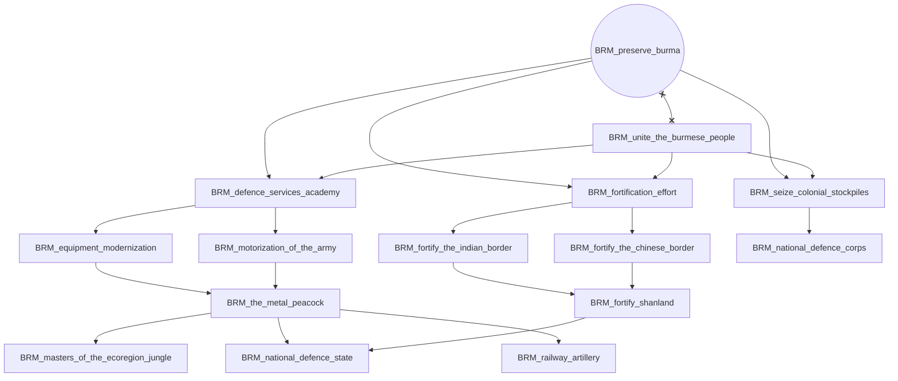
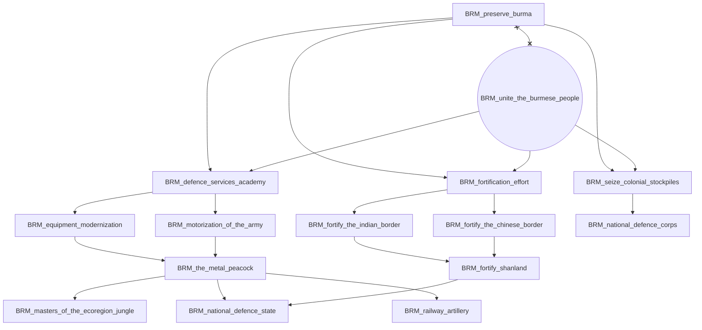

# BRM_preserve_burma

```mermaid
flowchart TD
    n1["BRM_defence_services_academy"]
    n2["BRM_equipment_modernization"]
    n3["BRM_fortification_effort"]
    n4["BRM_fortify_shanland"]
    n5["BRM_fortify_the_chinese_border"]
    n6["BRM_fortify_the_indian_border"]
    n7["BRM_masters_of_the_ecoregion_jungle"]
    n8["BRM_motorization_of_the_army"]
    n9["BRM_national_defence_corps"]
    n10["BRM_national_defence_state"]
    n11(("BRM_preserve_burma"))
    n12["BRM_railway_artillery"]
    n13["BRM_seize_colonial_stockpiles"]
    n14["BRM_the_metal_peacock"]
    n15["BRM_unite_the_burmese_people"]
    n11 --> n1
    n15 --> n1
    n1 --> n2
    n11 --> n3
    n15 --> n3
    n6 --> n4
    n5 --> n4
    n3 --> n5
    n3 --> n6
    n14 --> n7
    n1 --> n8
    n13 --> n9
    n14 --> n10
    n4 --> n10
    n14 --> n12
    n11 --> n13
    n15 --> n13
    n2 --> n14
    n8 --> n14
    n11 x--x n15
```

# BRM_unite_the_burmese_people

```mermaid
flowchart TD
    n1["BRM_defence_services_academy"]
    n2["BRM_equipment_modernization"]
    n3["BRM_fortification_effort"]
    n4["BRM_fortify_shanland"]
    n5["BRM_fortify_the_chinese_border"]
    n6["BRM_fortify_the_indian_border"]
    n7["BRM_masters_of_the_ecoregion_jungle"]
    n8["BRM_motorization_of_the_army"]
    n9["BRM_national_defence_corps"]
    n10["BRM_national_defence_state"]
    n11["BRM_preserve_burma"]
    n12["BRM_railway_artillery"]
    n13["BRM_seize_colonial_stockpiles"]
    n14["BRM_the_metal_peacock"]
    n15(("BRM_unite_the_burmese_people"))
    n11 --> n1
    n15 --> n1
    n1 --> n2
    n11 --> n3
    n15 --> n3
    n6 --> n4
    n5 --> n4
    n3 --> n5
    n3 --> n6
    n14 --> n7
    n1 --> n8
    n13 --> n9
    n14 --> n10
    n4 --> n10
    n14 --> n12
    n11 --> n13
    n15 --> n13
    n2 --> n14
    n8 --> n14
    n11 x--x n15
```
