# r56_CAN_army_modernisation

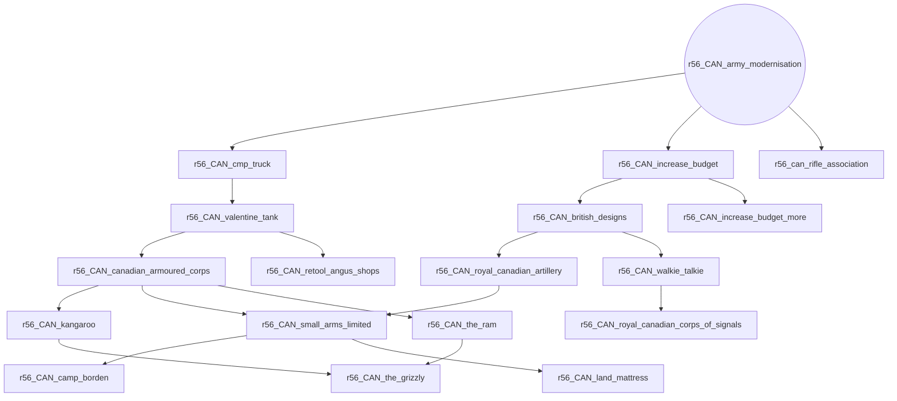

# r56_CAN_depression_recovery

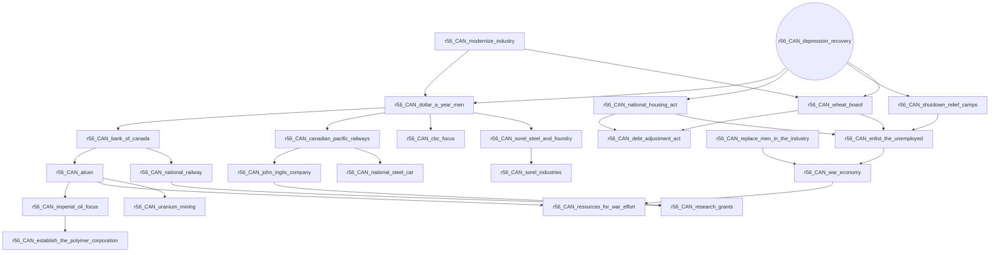

# r56_CAN_emergency_assembly

```mermaid
flowchart TD
    n43{"r56_CAN_a_new_constitution"}
    n44["r56_CAN_a_one_party_state"]
    n45["r56_CAN_a_united_canada"]
    n46["r56_CAN_abandon_anti_war_policy"]
    n47["r56_CAN_acquire_american_ships"]
    n48{"r56_CAN_alliance_with_america"}
    n49["r56_CAN_allow_free_access"]
    n50["r56_CAN_an_independent_democracy"]
    n51{"r56_CAN_anti_democracy"}
    n52["r56_CAN_anti_war_policy"]
    n53["r56_CAN_arcand_in_the_government"]
    n54["r56_CAN_arms_exports"]
    n55["r56_CAN_arrest_the_anti_fascists"]
    n56["r56_CAN_ask_for_newfoundland_and_labrador"]
    n57["r56_CAN_ask_for_newfoundland_and_labrador_democratic"]
    n58{"r56_CAN_assert_canadian_involvment"}
    n59["r56_CAN_build_navy_for_defence"]
    n60["r56_CAN_canadian_nationalism"]
    n61["r56_CAN_canadian_union_of_fascists"]
    n62["r56_CAN_communism"]
    n63["r56_CAN_contact_the_synarchists"]
    n64{"r56_CAN_create_youth_wing"}
    n65["r56_CAN_defence_scheme_no1"]
    n66["r56_CAN_defence_scheme_no2"]
    n67["r56_CAN_demand_newfoundland_and_labrador"]
    n68["r56_CAN_destroy_imperialism"]
    n69["r56_CAN_development_of_new_territories"]
    n70{"r56_CAN_emergency_assembly"}
    n71{"r56_CAN_fascism"}
    n72["r56_CAN_fascist_corporatism"]
    n73["r56_CAN_first_special_service_force"]
    n74["r56_CAN_follow_american_interventionism"]
    n75["r56_CAN_follow_american_neutrality"]
    n76["r56_CAN_follow_mosleys_ideas"]
    n77{"r56_CAN_forge_our_own_future"}
    n78["r56_CAN_form_a_canadian_red_guard"]
    n79{"r56_CAN_form_our_own_alliance"}
    n80["r56_CAN_form_the_blue_shirts"]
    n81["r56_CAN_frogmen_of_burma"]
    n82["r56_CAN_fuel_the_arms_sector"]
    n83["r56_CAN_full_equality_for_women"]
    n84["r56_CAN_get_ready_for_intervention"]
    n85["r56_CAN_imprison_the_trotskyists"]
    n86["r56_CAN_independent_industry"]
    n87["r56_CAN_independent_military"]
    n88["r56_CAN_install_democracy_in_the_americas"]
    n89["r56_CAN_intervene_ACW"]
    n90["r56_CAN_join_our_british_comrades"]
    n91{"r56_CAN_join_the_axis"}
    n92{"r56_CAN_join_the_british"}
    n93["r56_CAN_join_the_communist_international"]
    n94["r56_CAN_liberate_the_british_isles"]
    n95["r56_CAN_modernise_the_nation"]
    n96["r56_CAN_national_social_christian_party"]
    n97["r56_CAN_new_deal"]
    n98["r56_CAN_organize_the_trade_unions"]
    n99["r56_CAN_our_best_friend"]
    n100["r56_CAN_our_own_way"]
    n101["r56_CAN_permanent_joint_defence_board"]
    n102["r56_CAN_plebiscite_committees"]
    n103{"r56_CAN_post_colonial_rule"}
    n104["r56_CAN_protect_the_coast"]
    n105["r56_CAN_public_ownership"]
    n106["r56_CAN_quell_quebec_nationalism"]
    n107["r56_CAN_reduce_the_tariffs"]
    n108{"r56_CAN_reenforce_the_commonwealth"}
    n109{"r56_CAN_repeal_the_padlock_law"}
    n110["r56_CAN_restrict_immigration"]
    n111["r56_CAN_restructure_the_government"]
    n112["r56_CAN_secure_american_democracy"]
    n113["r56_CAN_secure_greenland_and_iceland"]
    n114["r56_CAN_secure_the_economy"]
    n115{"r56_CAN_seek_closer_ties_to_germany"}
    n116["r56_CAN_self_sufficiency"]
    n117["r56_CAN_send_weapons"]
    n118["r56_CAN_shadow_factories"]
    n119{"r56_CAN_strenght_through_conquest"}
    n120["r56_CAN_strict_anti_communism"]
    n121["r56_CAN_strike_america"]
    n122["r56_CAN_strike_britain"]
    n123["r56_CAN_strike_mexico"]
    n124["r56_CAN_strike_the_quebecois_anti_communists"]
    n125{"r56_CAN_support_the_british_union_of_fascists"}
    n126{"r56_CAN_support_the_soviets"}
    n127["r56_CAN_take_down_america"]
    n128["r56_CAN_the_canadian_fuhrer"]
    n129["r56_CAN_the_canadian_youth_congress"]
    n130["r56_CAN_the_mac_paps"]
    n131["r56_CAN_trust_in_the_commonwealth"]
    n132["r56_CAN_unemployment_insurance_scheme"]
    n133["r56_CAN_unite_the_fascist_parties"]
    n134["r56_CAN_unite_with_the_french"]
    n135["r56_CAN_west_coast_military_command"]
    n136["r56_CAN_workers_rights"]
    n137["r56_CAN_young_communist_league_of_canada"]
    n70 --> n43
    n96 --> n44
    n61 --> n44
    n106 --> n45
    n78 --> n46
    n66 --> n47
    n77 --> n48
    n70 --> n48
    n107 --> n49
    n43 --> n50
    n103 --> n50
    n44 --> n51
    n62 --> n52
    n61 --> n53
    n82 --> n54
    n96 --> n55
    n92 --> n56
    n58 --> n57
    n50 --> n58
    n75 --> n59
    n44 --> n60
    n71 --> n61
    n77 --> n62
    n70 --> n62
    n79 --> n63
    n80 --> n64
    n92 --> n65
    n79 --> n65
    n91 --> n65
    n48 --> n66
    n91 --> n67
    n79 --> n67
    n93 --> n68
    n90 --> n68
    n124 --> n68
    n85 --> n68
    n114 --> n69
    n77 --> n71
    n70 --> n71
    n111 --> n72
    n101 --> n73
    n118 --> n73
    n48 --> n74
    n48 --> n75
    n61 --> n76
    n52 --> n78
    n64 --> n79
    n51 --> n79
    n119 --> n79
    n96 --> n80
    n61 --> n80
    n73 --> n81
    n118 --> n81
    n58 --> n82
    n116 --> n82
    n76 --> n83
    n111 --> n83
    n74 --> n84
    n109 --> n85
    n50 --> n86
    n95 --> n87
    n48 --> n88
    n92 --> n89
    n79 --> n89
    n91 --> n89
    n126 --> n90
    n109 --> n90
    n115 --> n91
    n125 --> n92
    n126 --> n93
    n109 --> n93
    n108 --> n94
    n50 --> n95
    n71 --> n96
    n107 --> n97
    n52 --> n98
    n108 --> n99
    n103 --> n100
    n43 --> n100
    n131 --> n101
    n48 --> n101
    n46 --> n102
    n70 --> n103
    n88 --> n104
    n98 --> n105
    n133 --> n106
    n128 --> n106
    n74 --> n107
    n75 --> n107
    n58 --> n108
    n129 --> n109
    n133 --> n110
    n128 --> n110
    n76 --> n111
    n58 --> n112
    n92 --> n113
    n70 --> n114
    n96 --> n115
    n86 --> n116
    n89 --> n117
    n44 --> n119
    n61 --> n120
    n123 --> n121
    n68 --> n122
    n68 --> n123
    n109 --> n124
    n61 --> n125
    n46 --> n126
    n65 --> n127
    n96 --> n128
    n137 --> n129
    n78 --> n130
    n136 --> n132
    n105 --> n132
    n96 --> n133
    n108 --> n134
    n107 --> n135
    n98 --> n136
    n52 --> n137
    n48 x--x n62
    n48 x--x n71
    n50 x--x n100
    n61 x--x n96
    n62 x--x n71
    n65 x--x n89
    n74 x--x n75
    n79 x--x n91
    n79 x--x n92
    n90 x--x n93
    n99 x--x n112
```

# r56_CAN_forge_our_own_future

```mermaid
flowchart TD
    n44["r56_CAN_a_one_party_state"]
    n45["r56_CAN_a_united_canada"]
    n46["r56_CAN_abandon_anti_war_policy"]
    n47["r56_CAN_acquire_american_ships"]
    n48{"r56_CAN_alliance_with_america"}
    n49["r56_CAN_allow_free_access"]
    n51{"r56_CAN_anti_democracy"}
    n52["r56_CAN_anti_war_policy"]
    n53["r56_CAN_arcand_in_the_government"]
    n55["r56_CAN_arrest_the_anti_fascists"]
    n56["r56_CAN_ask_for_newfoundland_and_labrador"]
    n59["r56_CAN_build_navy_for_defence"]
    n60["r56_CAN_canadian_nationalism"]
    n61["r56_CAN_canadian_union_of_fascists"]
    n62["r56_CAN_communism"]
    n63["r56_CAN_contact_the_synarchists"]
    n64{"r56_CAN_create_youth_wing"}
    n65["r56_CAN_defence_scheme_no1"]
    n66["r56_CAN_defence_scheme_no2"]
    n67["r56_CAN_demand_newfoundland_and_labrador"]
    n68["r56_CAN_destroy_imperialism"]
    n70{"r56_CAN_emergency_assembly"}
    n71{"r56_CAN_fascism"}
    n72["r56_CAN_fascist_corporatism"]
    n73["r56_CAN_first_special_service_force"]
    n74["r56_CAN_follow_american_interventionism"]
    n75["r56_CAN_follow_american_neutrality"]
    n76["r56_CAN_follow_mosleys_ideas"]
    n77{"r56_CAN_forge_our_own_future"}
    n78["r56_CAN_form_a_canadian_red_guard"]
    n79{"r56_CAN_form_our_own_alliance"}
    n80["r56_CAN_form_the_blue_shirts"]
    n81["r56_CAN_frogmen_of_burma"]
    n83["r56_CAN_full_equality_for_women"]
    n84["r56_CAN_get_ready_for_intervention"]
    n85["r56_CAN_imprison_the_trotskyists"]
    n88["r56_CAN_install_democracy_in_the_americas"]
    n89["r56_CAN_intervene_ACW"]
    n90["r56_CAN_join_our_british_comrades"]
    n91{"r56_CAN_join_the_axis"}
    n92{"r56_CAN_join_the_british"}
    n93["r56_CAN_join_the_communist_international"]
    n96["r56_CAN_national_social_christian_party"]
    n97["r56_CAN_new_deal"]
    n98["r56_CAN_organize_the_trade_unions"]
    n101["r56_CAN_permanent_joint_defence_board"]
    n102["r56_CAN_plebiscite_committees"]
    n104["r56_CAN_protect_the_coast"]
    n105["r56_CAN_public_ownership"]
    n106["r56_CAN_quell_quebec_nationalism"]
    n107["r56_CAN_reduce_the_tariffs"]
    n109{"r56_CAN_repeal_the_padlock_law"}
    n110["r56_CAN_restrict_immigration"]
    n111["r56_CAN_restructure_the_government"]
    n113["r56_CAN_secure_greenland_and_iceland"]
    n115{"r56_CAN_seek_closer_ties_to_germany"}
    n117["r56_CAN_send_weapons"]
    n118["r56_CAN_shadow_factories"]
    n119{"r56_CAN_strenght_through_conquest"}
    n120["r56_CAN_strict_anti_communism"]
    n121["r56_CAN_strike_america"]
    n122["r56_CAN_strike_britain"]
    n123["r56_CAN_strike_mexico"]
    n124["r56_CAN_strike_the_quebecois_anti_communists"]
    n125{"r56_CAN_support_the_british_union_of_fascists"}
    n126{"r56_CAN_support_the_soviets"}
    n127["r56_CAN_take_down_america"]
    n128["r56_CAN_the_canadian_fuhrer"]
    n129["r56_CAN_the_canadian_youth_congress"]
    n130["r56_CAN_the_mac_paps"]
    n131["r56_CAN_trust_in_the_commonwealth"]
    n132["r56_CAN_unemployment_insurance_scheme"]
    n133["r56_CAN_unite_the_fascist_parties"]
    n135["r56_CAN_west_coast_military_command"]
    n136["r56_CAN_workers_rights"]
    n137["r56_CAN_young_communist_league_of_canada"]
    n96 --> n44
    n61 --> n44
    n106 --> n45
    n78 --> n46
    n66 --> n47
    n77 --> n48
    n70 --> n48
    n107 --> n49
    n44 --> n51
    n62 --> n52
    n61 --> n53
    n96 --> n55
    n92 --> n56
    n75 --> n59
    n44 --> n60
    n71 --> n61
    n77 --> n62
    n70 --> n62
    n79 --> n63
    n80 --> n64
    n92 --> n65
    n79 --> n65
    n91 --> n65
    n48 --> n66
    n91 --> n67
    n79 --> n67
    n93 --> n68
    n90 --> n68
    n124 --> n68
    n85 --> n68
    n77 --> n71
    n70 --> n71
    n111 --> n72
    n101 --> n73
    n118 --> n73
    n48 --> n74
    n48 --> n75
    n61 --> n76
    n52 --> n78
    n64 --> n79
    n51 --> n79
    n119 --> n79
    n96 --> n80
    n61 --> n80
    n73 --> n81
    n118 --> n81
    n76 --> n83
    n111 --> n83
    n74 --> n84
    n109 --> n85
    n48 --> n88
    n92 --> n89
    n79 --> n89
    n91 --> n89
    n126 --> n90
    n109 --> n90
    n115 --> n91
    n125 --> n92
    n126 --> n93
    n109 --> n93
    n71 --> n96
    n107 --> n97
    n52 --> n98
    n131 --> n101
    n48 --> n101
    n46 --> n102
    n88 --> n104
    n98 --> n105
    n133 --> n106
    n128 --> n106
    n74 --> n107
    n75 --> n107
    n129 --> n109
    n133 --> n110
    n128 --> n110
    n76 --> n111
    n92 --> n113
    n96 --> n115
    n89 --> n117
    n44 --> n119
    n61 --> n120
    n123 --> n121
    n68 --> n122
    n68 --> n123
    n109 --> n124
    n61 --> n125
    n46 --> n126
    n65 --> n127
    n96 --> n128
    n137 --> n129
    n78 --> n130
    n136 --> n132
    n105 --> n132
    n96 --> n133
    n107 --> n135
    n98 --> n136
    n52 --> n137
    n48 x--x n62
    n48 x--x n71
    n61 x--x n96
    n62 x--x n71
    n65 x--x n89
    n74 x--x n75
    n77 x--x n131
    n79 x--x n91
    n79 x--x n92
    n90 x--x n93
```

# r56_CAN_modernize_industry

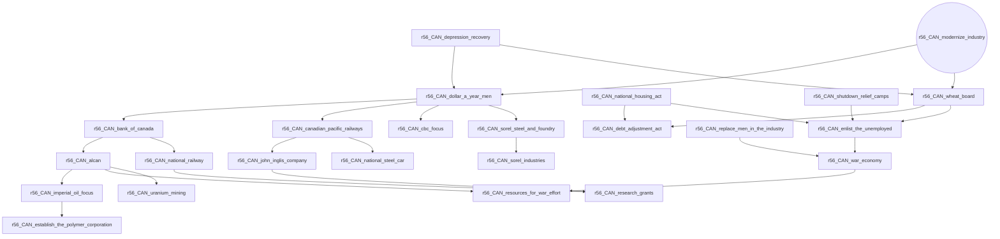

# r56_CAN_rebuilding_the_royal_canadian_navy

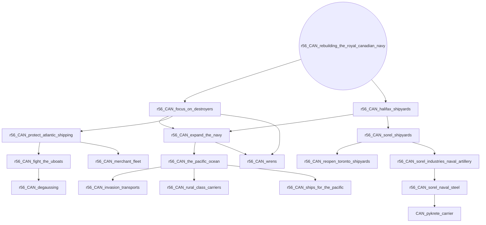

# r56_CAN_start_the_expansion_of_the_rcaf

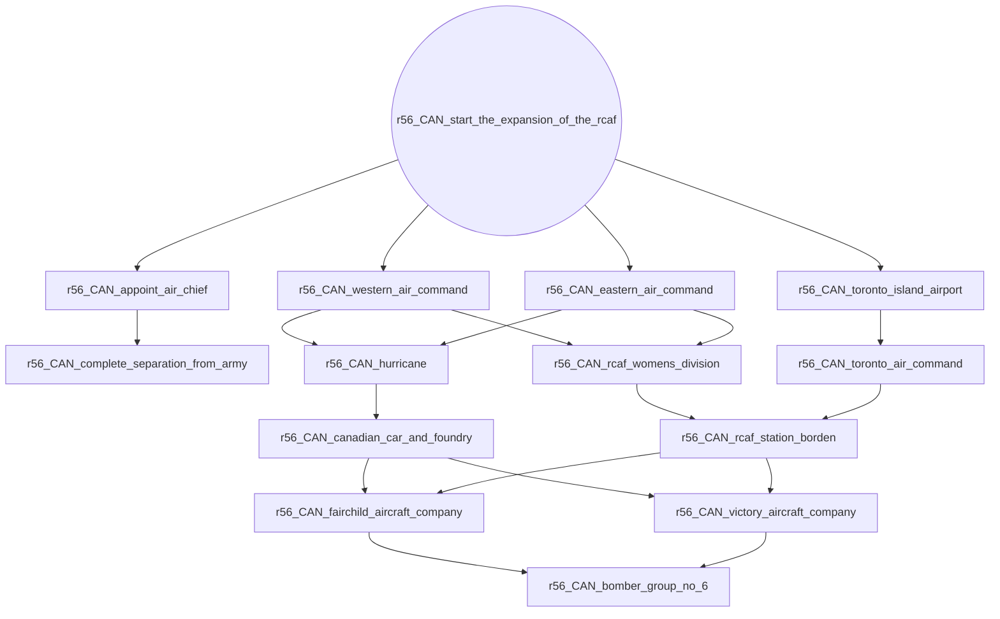

# r56_CAN_strengthen_british_ties

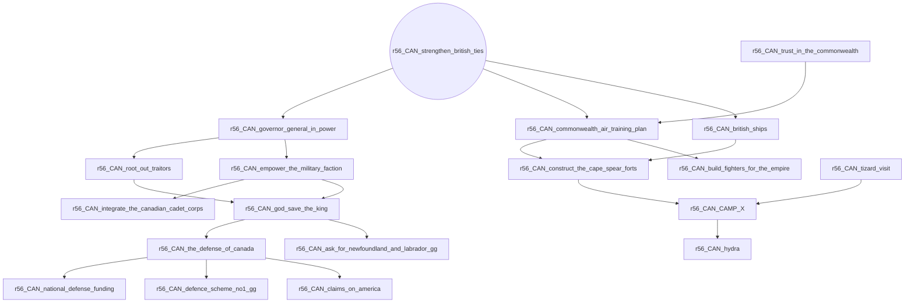

# r56_CAN_suppress_the_separatists

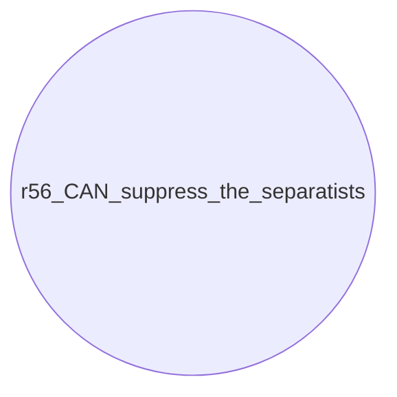

# r56_CAN_trust_in_the_commonwealth

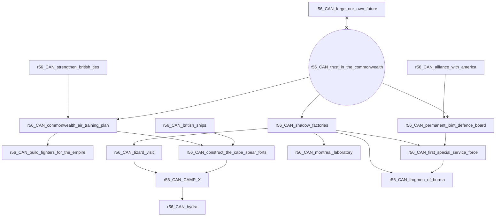

# r56_CAN_war_measures_act

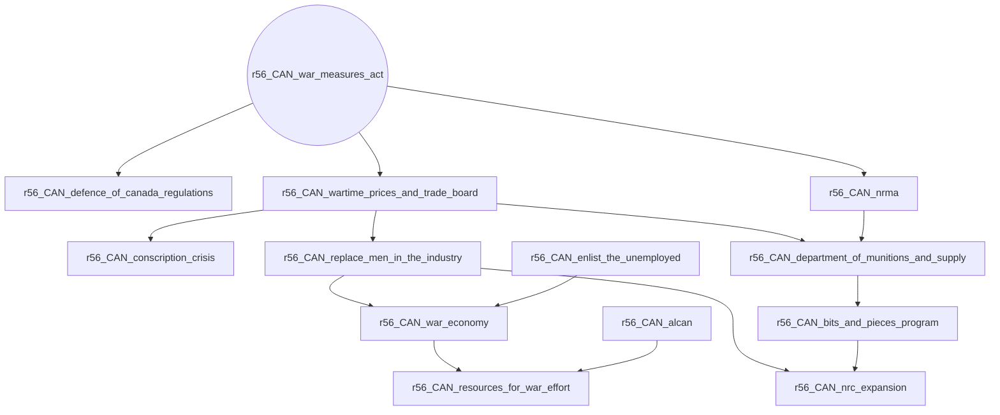
