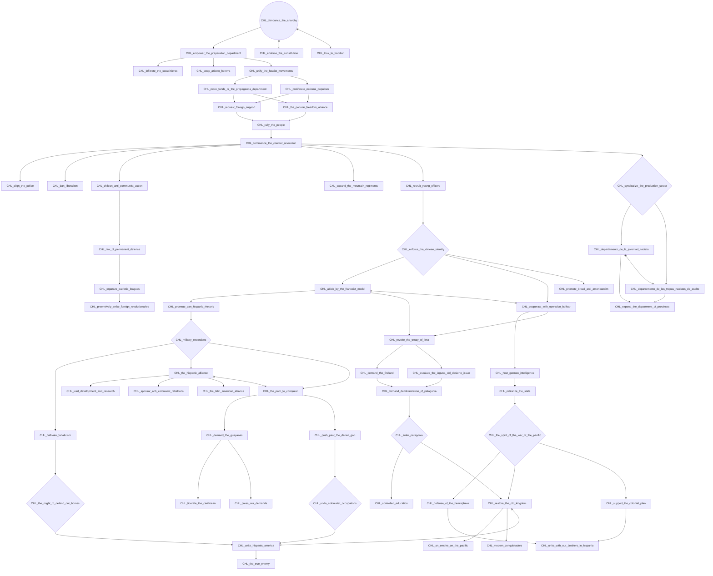
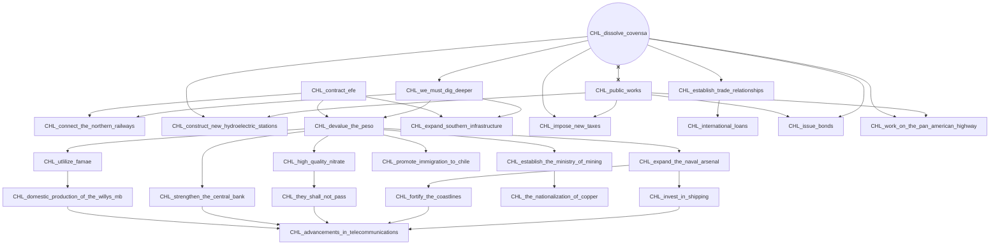
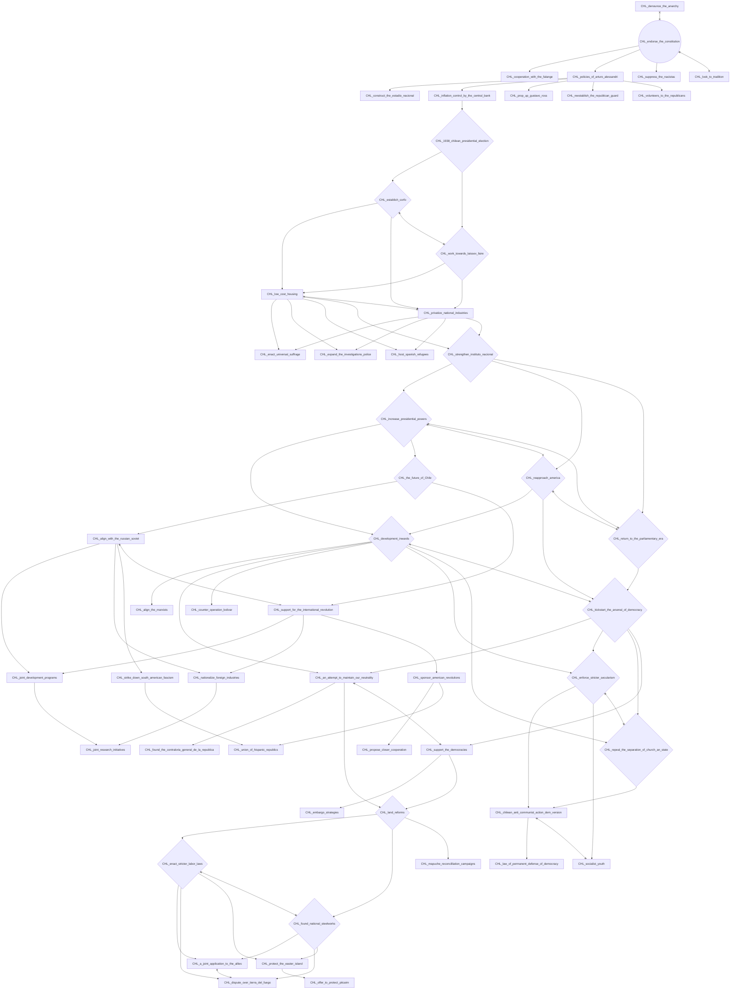
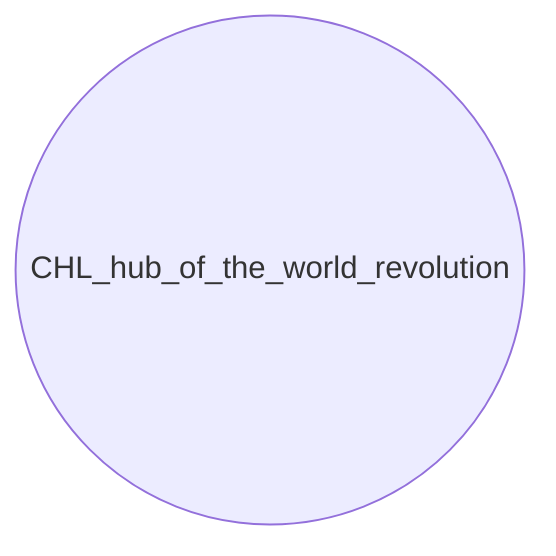
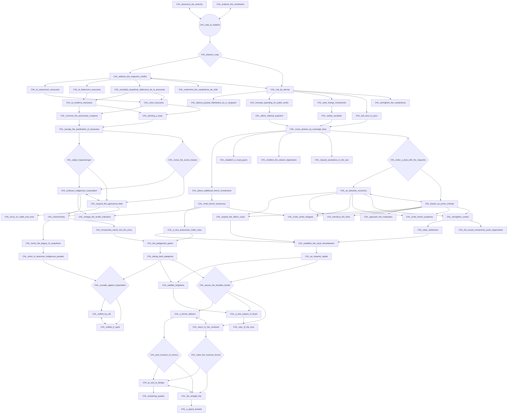
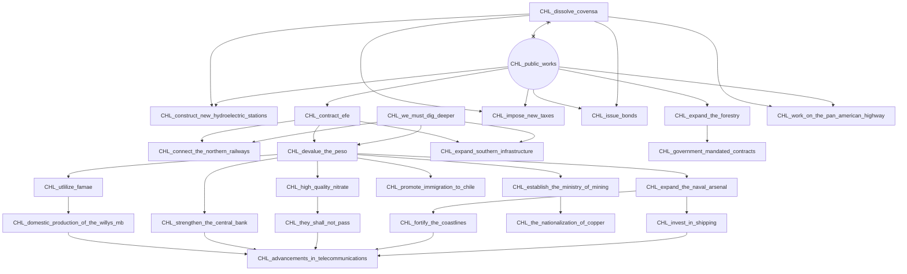

# CHL_denounce_the_anarchy

```mermaid
flowchart TD
    n1["CHL_abide_by_the_francoist_model"]
    n2["CHL_align_the_police"]
    n3["CHL_an_empire_on_the_pacific"]
    n4["CHL_ban_liberalism"]
    n5["CHL_chilean_anti_communist_action"]
    n6["CHL_commence_the_counter_revolution"]
    n7["CHL_controlled_education"]
    n8["CHL_cooperate_with_operation_bolivar"]
    n9["CHL_cultivate_fanaticism"]
    n10["CHL_defense_of_the_hemisphere"]
    n11["CHL_demand_demilitarization_of_patagonia"]
    n12["CHL_demand_the_fireland"]
    n13["CHL_demand_the_guayanas"]
    n14(("CHL_denounce_the_anarchy"))
    n15["CHL_departamento_de_la_juventad_nacista"]
    n16["CHL_departemento_de_las_tropas_nacistas_de_asalto"]
    n17["CHL_empower_the_preparation_department"]
    n18["CHL_endorse_the_constitution"]
    n19{"CHL_enforce_the_chilean_identity"}
    n20{"CHL_enter_patagonia"}
    n21["CHL_escalate_the_laguna_del_desierto_issue"]
    n22["CHL_expand_the_department_of_provinces"]
    n23["CHL_expand_the_mountain_regiments"]
    n24["CHL_host_german_intelligence"]
    n25["CHL_inflitrate_the_carabinieros"]
    n26["CHL_joint_development_and_research"]
    n27["CHL_law_of_permanent_defense"]
    n28["CHL_liberate_the_caribbean"]
    n29["CHL_look_to_tradition"]
    n30["CHL_militarize_the_state"]
    n31{"CHL_military_excercises"}
    n32["CHL_modern_conquistadors"]
    n33["CHL_more_funds_or_the_propaganda_department"]
    n34["CHL_organize_patriotic_leagues"]
    n35["CHL_preemtively_strike_foreign_revolutionaries"]
    n36["CHL_press_our_demands"]
    n37["CHL_proliferate_national_populism"]
    n38["CHL_promote_broad_anti_americansim"]
    n39["CHL_promote_pan_hispanic_rhetoric"]
    n40["CHL_push_past_the_darien_gap"]
    n41["CHL_rally_the_people"]
    n42["CHL_recruit_young_officers"]
    n43["CHL_request_foreign_support"]
    n44["CHL_restore_the_old_kingdom"]
    n45["CHL_revoke_the_treaty_of_lima"]
    n46["CHL_sponsor_anti_colonialist_rebellions"]
    n47["CHL_support_the_colonial_plan"]
    n48["CHL_sway_ariosto_hererra"]
    n49{"CHL_syndicalize_the_production_sector"}
    n50["CHL_the_hispanic_alliance"]
    n51["CHL_the_latin_american_alliance"]
    n52{"CHL_the_might_to_defend_our_homes"}
    n53["CHL_the_path_to_conquest"]
    n54["CHL_the_popular_freedom_alliance"]
    n55{"CHL_the_spirit_of_the_war_of_the_pacific"}
    n56["CHL_the_true_enemy"]
    n57{"CHL_undo_colonialist_occupations"}
    n58["CHL_unify_the_fascist_movements"]
    n59["CHL_unite_hispanic_america"]
    n60["CHL_unite_with_our_brothers_in_hispania"]
    n19 --> n1
    n6 --> n2
    n44 --> n3
    n6 --> n4
    n6 --> n5
    n41 --> n6
    n20 --> n7
    n19 --> n8
    n31 --> n9
    n55 --> n10
    n12 --> n11
    n21 --> n11
    n45 --> n12
    n53 --> n13
    n49 --> n15
    n49 --> n16
    n14 --> n17
    n42 --> n19
    n11 --> n20
    n45 --> n21
    n15 --> n22
    n16 --> n22
    n6 --> n23
    n8 --> n24
    n17 --> n25
    n50 --> n26
    n5 --> n27
    n13 --> n28
    n24 --> n30
    n39 --> n31
    n44 --> n32
    n58 --> n33
    n27 --> n34
    n34 --> n35
    n13 --> n36
    n58 --> n37
    n19 --> n38
    n1 --> n39
    n53 --> n40
    n54 --> n41
    n43 --> n41
    n6 --> n42
    n37 --> n43
    n33 --> n43
    n55 --> n44
    n20 --> n44
    n8 --> n45
    n1 --> n45
    n50 --> n46
    n55 --> n47
    n17 --> n48
    n6 --> n49
    n31 --> n50
    n50 --> n51
    n9 --> n52
    n31 --> n53
    n37 --> n54
    n33 --> n54
    n30 --> n55
    n59 --> n56
    n40 --> n57
    n17 --> n58
    n52 --> n59
    n57 --> n59
    n47 --> n60
    n10 --> n60
    n1 x--x n8
    n14 x--x n18
    n14 x--x n29
    n15 x--x n16
    n44 x--x n59
    n50 x--x n53
```

# CHL_dissolve_covensa

```mermaid
flowchart TD
    n61["CHL_advancements_in_telecommunications"]
    n62["CHL_connect_the_northern_railways"]
    n63["CHL_construct_new_hydroelectric_stations"]
    n64["CHL_contract_efe"]
    n65["CHL_devalue_the_peso"]
    n66(("CHL_dissolve_covensa"))
    n67["CHL_domestic_production_of_the_willys_mb"]
    n68["CHL_establish_the_ministry_of_mining"]
    n69["CHL_establish_trade_relationships"]
    n70["CHL_expand_southern_infrastructure"]
    n71["CHL_expand_the_naval_arsenal"]
    n72["CHL_fortify_the_coastlines"]
    n73["CHL_high_quality_nitrate"]
    n74["CHL_impose_new_taxes"]
    n75["CHL_international_loans"]
    n76["CHL_invest_in_shipping"]
    n77["CHL_issue_bonds"]
    n78["CHL_promote_immigration_to_chile"]
    n79["CHL_public_works"]
    n80["CHL_strengthen_the_central_bank"]
    n81["CHL_the_nationalization_of_copper"]
    n82["CHL_they_shall_not_pass"]
    n83["CHL_utlilize_famae"]
    n84["CHL_we_must_dig_deeper"]
    n85["CHL_work_on_the_pan_american_highway"]
    n67 --> n61
    n80 --> n61
    n82 --> n61
    n72 --> n61
    n76 --> n61
    n64 --> n62
    n84 --> n62
    n66 --> n63
    n79 --> n63
    n64 --> n65
    n84 --> n65
    n83 --> n67
    n65 --> n68
    n66 --> n69
    n64 --> n70
    n84 --> n70
    n65 --> n71
    n71 --> n72
    n65 --> n73
    n66 --> n74
    n79 --> n74
    n69 --> n75
    n71 --> n76
    n79 --> n77
    n66 --> n77
    n65 --> n78
    n65 --> n80
    n68 --> n81
    n73 --> n82
    n65 --> n83
    n66 --> n84
    n66 --> n85
    n79 --> n85
    n66 x--x n79
```

# CHL_endorse_the_constitution

```mermaid
flowchart TD
    n86{"CHL_1938_chilean_presidential_election"}
    n87["CHL_a_joint_application_to_the_allies"]
    n88["CHL_align_the_marxists"]
    n89["CHL_align_with_the_russian_soviet"]
    n90["CHL_an_attempt_to_maintain_our_neutrality"]
    n91["CHL_chilean_anti_communist_action_dem_version"]
    n92["CHL_construct_the_estadio_nacional"]
    n93["CHL_cooperation_with_the_falange"]
    n94["CHL_counter_operation_bolivar"]
    n14["CHL_denounce_the_anarchy"]
    n95{"CHL_development_inwards"}
    n96["CHL_dispute_over_tierra_del_fuego"]
    n97["CHL_embargo_strategies"]
    n98{"CHL_enact_stricter_labor_laws"}
    n99["CHL_enact_universal_suffrage"]
    n18(("CHL_endorse_the_constitution"))
    n100{"CHL_enforce_stricter_secularism"}
    n101{"CHL_establish_corfo"}
    n102["CHL_expand_the_investigations_police"]
    n103{"CHL_found_national_steelworks"}
    n104["CHL_found_the_contraloria_general_de_la_republica"]
    n105["CHL_host_spanish_refugees"]
    n106{"CHL_increase_presidential_powers"}
    n107["CHL_inflation_control_by_the_central_bank"]
    n108["CHL_joint_development_programs"]
    n109["CHL_joint_research_initiatives"]
    n110{"CHL_kickstart_the_arsenal_of_democracy"}
    n111{"CHL_land_reforms"}
    n112["CHL_law_of_permanent_defense_of_democracy"]
    n29["CHL_look_to_tradition"]
    n113["CHL_low_cost_housing"]
    n114["CHL_mapuche_reconcilliation_campaigns"]
    n115["CHL_nationalize_foreign_industries"]
    n116["CHL_offer_to_protect_pitcairn"]
    n117["CHL_policies_of_arturo_alessandri"]
    n118["CHL_privatize_national_industries"]
    n119["CHL_prop_up_gustavo_ross"]
    n120["CHL_propose_closer_cooperation"]
    n121["CHL_protect_the_easter_island"]
    n122{"CHL_reapproach_america"}
    n123["CHL_reestablish_the_republican_guard"]
    n124{"CHL_repeal_the_separation_of_church_an_state"}
    n125{"CHL_return_to_the_parliamentary_era"}
    n126["CHL_socialist_youth"]
    n127["CHL_sponsor_american_revolutions"]
    n128{"CHL_strengthen_instituto_nacional"}
    n129["CHL_strike_down_south_american_fascism"]
    n130["CHL_support_for_the_international_revolution"]
    n131["CHL_support_the_democracies"]
    n132["CHL_suppress_the_nacistas"]
    n133{"CHL_the_future_of_Chile"}
    n134["CHL_union_of_hispanic_republics"]
    n135["CHL_volunteers_to_the_republicans"]
    n136{"CHL_work_towards_laissex_faire"}
    n107 --> n86
    n98 --> n87
    n103 --> n87
    n95 --> n88
    n133 --> n89
    n95 --> n90
    n110 --> n90
    n124 --> n91
    n100 --> n91
    n117 --> n92
    n18 --> n93
    n95 --> n94
    n106 --> n95
    n122 --> n95
    n98 --> n96
    n103 --> n96
    n131 --> n97
    n111 --> n98
    n113 --> n99
    n118 --> n99
    n110 --> n100
    n95 --> n100
    n86 --> n101
    n118 --> n102
    n113 --> n102
    n111 --> n103
    n90 --> n104
    n113 --> n105
    n118 --> n105
    n128 --> n106
    n117 --> n107
    n89 --> n108
    n130 --> n108
    n108 --> n109
    n115 --> n109
    n122 --> n110
    n125 --> n110
    n90 --> n111
    n131 --> n111
    n91 --> n112
    n101 --> n113
    n136 --> n113
    n111 --> n114
    n130 --> n115
    n89 --> n115
    n121 --> n116
    n18 --> n117
    n101 --> n118
    n136 --> n118
    n117 --> n119
    n127 --> n120
    n98 --> n121
    n103 --> n121
    n128 --> n122
    n117 --> n123
    n110 --> n124
    n95 --> n124
    n128 --> n125
    n100 --> n126
    n130 --> n127
    n113 --> n128
    n118 --> n128
    n89 --> n129
    n133 --> n130
    n110 --> n131
    n18 --> n132
    n106 --> n133
    n127 --> n134
    n129 --> n134
    n117 --> n135
    n86 --> n136
    n87 x--x n96
    n89 x--x n130
    n90 x--x n131
    n91 x--x n126
    n14 x--x n18
    n95 x--x n110
    n98 x--x n103
    n18 x--x n29
    n100 x--x n124
    n101 x--x n136
    n106 x--x n122
    n106 x--x n125
    n113 x--x n118
    n122 x--x n125
```

# CHL_hub_of_the_world_revolution

```mermaid
flowchart TD
    n137(("CHL_hub_of_the_world_revolution"))
```

# CHL_look_to_tradition

```mermaid
flowchart TD
    n138["CHL_a_french_alliance"]
    n139["CHL_a_grand_armada"]
    n140["CHL_a_new_araucanian_noble_class"]
    n141["CHL_a_new_empire_of_brazil"]
    n142["CHL_address_the_mapuche_conflict"]
    n143{"CHL_adopt_mapundungun"}
    n144["CHL_alianza_popular_libertadora_as_a_vanguard"]
    n145["CHL_an_absolute_monarchy"]
    n146["CHL_an_imperial_capital"]
    n147["CHL_approach_the_moderates"]
    n148["CHL_attract_additional_french_investments"]
    n149["CHL_avenge_the_pacification_of_araucania"]
    n150{"CHL_claim_the_mexican_throne"}
    n151["CHL_convene_the_araucanian_congress"]
    n152["CHL_crown_antoine_as_sovereign_king"]
    n153{"CHL_crusade_against_imperialism"}
    n14["CHL_denounce_the_anarchy"]
    n154["CHL_electing_a_toqui"]
    n155["CHL_embrace_indigenous_corporatism"]
    n18["CHL_endorse_the_constitution"]
    n156["CHL_enlarge_the_textile_industries"]
    n157["CHL_establish_a_royal_guard"]
    n158["CHL_establish_the_royal_mountaineers"]
    n159["CHL_expand_the_agricultural_field"]
    n160["CHL_expand_the_officer_corps"]
    n161["CHL_focus_on_cattle_and_wool"]
    n162["CHL_honor_the_legacy_of_caupolican"]
    n163["CHL_ibanez_as_prime_minister"]
    n164{"CHL_ibanezs_coup"}
    n165["CHL_incorporate_machi_into_the_army"]
    n166["CHL_increase_spending_on_public_works"]
    n167["CHL_introduce_the_franc"]
    n168["CHL_invite_carlist_refugees"]
    n169["CHL_invite_french_academia"]
    n170["CHL_invite_french_aristocracy"]
    n171["CHL_je_suis_le_deluge"]
    n172{"CHL_joint_invasion_of_mexico"}
    n173["CHL_la_corporacion_araucania"]
    n174["CHL_la_federacion_araucania"]
    n175["CHL_la_moderna_araucania"]
    n29(("CHL_look_to_tradition"))
    n176["CHL_mobilize_the_veteran_legionaries"]
    n177["CHL_outlaw_socialism"]
    n178["CHL_reclaiming_quebec"]
    n179["CHL_request_assistance_in_the_war"]
    n180["CHL_return_to_the_continent"]
    n181{"CHL_revise_the_social_classes"}
    n182["CHL_rule_by_decree"]
    n183["CHL_ruler_of_the_inca"]
    n184["CHL_satellite_kingdoms"]
    n185{"CHL_secure_the_brazilian_border"}
    n186["CHL_seek_foreign_investments"]
    n187["CHL_sell_arica_to_peru"]
    n188["CHL_silverworking"]
    n189["CHL_sociedad_caupolican_defensora_de_la_araucania"]
    n190["CHL_state_catholicism"]
    n191["CHL_strengthen_control"]
    n192["CHL_strengthen_the_carabinieros"]
    n193{"CHL_strike_a_deal_with_the_mapuche"}
    n194["CHL_taking_back_patagonia"]
    n195["CHL_the_patagonian_giants"]
    n196["CHL_the_scouts_monarchist_youth_organization"]
    n197["CHL_the_straight_line"]
    n198["CHL_undermine_the_carabineros_de_chile"]
    n199["CHL_unified_by_will"]
    n200["CHL_unified_in_spirit"]
    n201["CHL_union_araucana"]
    n202["CHL_union_of_american_indigenous_peoples"]
    n203["CHL_utilize_national_populism"]
    n185 --> n138
    n197 --> n139
    n170 --> n140
    n184 --> n141
    n185 --> n141
    n164 --> n142
    n149 --> n143
    n182 --> n144
    n193 --> n145
    n158 --> n146
    n163 --> n147
    n152 --> n148
    n154 --> n149
    n151 --> n149
    n180 --> n150
    n175 --> n151
    n201 --> n151
    n187 --> n152
    n203 --> n152
    n177 --> n152
    n202 --> n153
    n194 --> n153
    n175 --> n154
    n201 --> n154
    n181 --> n155
    n143 --> n155
    n155 --> n156
    n170 --> n156
    n152 --> n157
    n160 --> n158
    n140 --> n158
    n190 --> n158
    n181 --> n159
    n143 --> n159
    n163 --> n160
    n145 --> n160
    n159 --> n161
    n188 --> n162
    n193 --> n163
    n29 --> n164
    n188 --> n165
    n182 --> n166
    n163 --> n167
    n145 --> n167
    n163 --> n168
    n145 --> n168
    n170 --> n168
    n163 --> n169
    n145 --> n169
    n148 --> n170
    n172 --> n171
    n150 --> n171
    n138 --> n172
    n142 --> n173
    n142 --> n174
    n189 --> n175
    n174 --> n175
    n152 --> n176
    n186 --> n177
    n171 --> n178
    n152 --> n179
    n185 --> n180
    n149 --> n181
    n164 --> n182
    n141 --> n183
    n146 --> n184
    n194 --> n184
    n146 --> n185
    n194 --> n185
    n182 --> n186
    n182 --> n187
    n155 --> n188
    n159 --> n188
    n142 --> n189
    n191 --> n190
    n163 --> n191
    n145 --> n191
    n182 --> n192
    n152 --> n193
    n195 --> n194
    n165 --> n195
    n140 --> n195
    n191 --> n196
    n172 --> n197
    n150 --> n197
    n142 --> n198
    n153 --> n199
    n153 --> n200
    n189 --> n201
    n173 --> n201
    n162 --> n202
    n166 --> n203
    n138 x--x n180
    n142 x--x n182
    n145 x--x n163
    n14 x--x n29
    n155 x--x n159
    n18 x--x n29
    n171 x--x n197
    n199 x--x n200
```

# CHL_public_works

```mermaid
flowchart TD
    n61["CHL_advancements_in_telecommunications"]
    n62["CHL_connect_the_northern_railways"]
    n63["CHL_construct_new_hydroelectric_stations"]
    n64["CHL_contract_efe"]
    n65["CHL_devalue_the_peso"]
    n66["CHL_dissolve_covensa"]
    n67["CHL_domestic_production_of_the_willys_mb"]
    n68["CHL_establish_the_ministry_of_mining"]
    n70["CHL_expand_southern_infrastructure"]
    n204["CHL_expand_the_forestry"]
    n71["CHL_expand_the_naval_arsenal"]
    n72["CHL_fortify_the_coastlines"]
    n205["CHL_government_mandated_contracts"]
    n73["CHL_high_quality_nitrate"]
    n74["CHL_impose_new_taxes"]
    n76["CHL_invest_in_shipping"]
    n77["CHL_issue_bonds"]
    n78["CHL_promote_immigration_to_chile"]
    n79(("CHL_public_works"))
    n80["CHL_strengthen_the_central_bank"]
    n81["CHL_the_nationalization_of_copper"]
    n82["CHL_they_shall_not_pass"]
    n83["CHL_utlilize_famae"]
    n84["CHL_we_must_dig_deeper"]
    n85["CHL_work_on_the_pan_american_highway"]
    n67 --> n61
    n80 --> n61
    n82 --> n61
    n72 --> n61
    n76 --> n61
    n64 --> n62
    n84 --> n62
    n66 --> n63
    n79 --> n63
    n79 --> n64
    n64 --> n65
    n84 --> n65
    n83 --> n67
    n65 --> n68
    n64 --> n70
    n84 --> n70
    n79 --> n204
    n65 --> n71
    n71 --> n72
    n204 --> n205
    n65 --> n73
    n66 --> n74
    n79 --> n74
    n71 --> n76
    n79 --> n77
    n66 --> n77
    n65 --> n78
    n65 --> n80
    n68 --> n81
    n73 --> n82
    n65 --> n83
    n66 --> n85
    n79 --> n85
    n66 x--x n79
```
