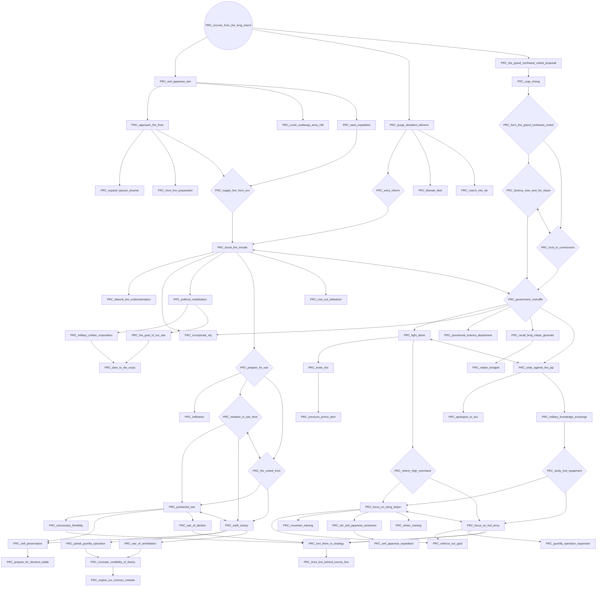
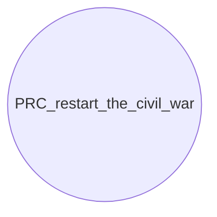
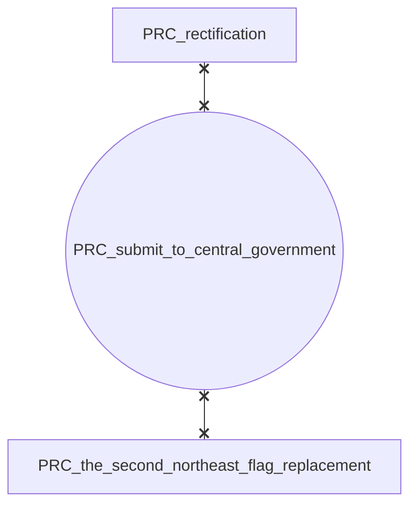
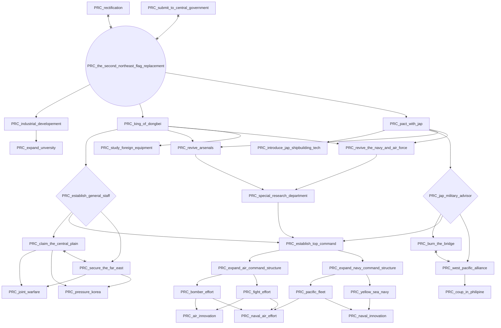

# PRC_recover_from_the_long_march

```mermaid
flowchart TD
    n1["PRC_anti_japanese_aim"]
    n2["PRC_anti_japanese_expedition"]
    n3["PRC_apologise_to_sov"]
    n4["PRC_approach_the_front"]
    n5{"PRC_army_reform"}
    n6["PRC_boost_the_morale"]
    n7["PRC_crush_xueliangs_army_r56"]
    n8["PRC_dare_to_die_corps"]
    n9["PRC_debunk_the_underestimation"]
    n10{"PRC_destroy_mao_and_his_clique"}
    n11["PRC_enforce_our_goal"]
    n12["PRC_expand_taiyuan_arsenal"]
    n13["PRC_exploit_our_enemys_mistake"]
    n14["PRC_fight_alone"]
    n15["PRC_focus_on_dong_beijun"]
    n16["PRC_focus_on_red_army"]
    n17{"PRC_form_the_grand_northwest_united"}
    n18["PRC_front_line_behind_enemy_line"]
    n19["PRC_front_line_preparation"]
    n20{"PRC_government_reshuffle"}
    n21["PRC_guerilla_operation_expansion"]
    n22["PRC_incorporate_xbj"]
    n23["PRC_increase_credibility_of_theory"]
    n24["PRC_infiltration"]
    n25{"PRC_initiative_in_war_time"}
    n26["PRC_invite_shx"]
    n27["PRC_liberate_tibet"]
    n28["PRC_lure_them_in_strategy"]
    n29["PRC_march_into_sik"]
    n30["PRC_military_civilian_corporation"]
    n31["PRC_military_knowledge_exchange"]
    n32["PRC_mountain_training"]
    n33["PRC_neccessary_flexibility"]
    n34["PRC_partial_guerilla_operation"]
    n35["PRC_political_mobilisation"]
    n36["PRC_prepare_for_decisive_battle"]
    n37{"PRC_prepare_for_war"}
    n38["PRC_pressure_prince_dem"]
    n39["PRC_protracted_war"]
    n40["PRC_provisional_science_department"]
    n41["PRC_purge_dissident_element"]
    n42["PRC_recall_feng_clique_generals"]
    n43(("PRC_recover_from_the_long_march"))
    n44{"PRC_reform_high_command"}
    n45["PRC_retake_dongbei"]
    n46["PRC_root_out_defeatism"]
    n47["PRC_self_perservation"]
    n48["PRC_stir_anti_japanese_sentiment"]
    n49{"PRC_study_kmt_equipment"}
    n50{"PRC_supply_line_from_sov"}
    n51["PRC_swift_victory"]
    n52["PRC_the_goal_of_our_war"]
    n53["PRC_the_grand_northwest_united_proposal"]
    n54{"PRC_the_united_front"}
    n55{"PRC_trust_in_communism"}
    n56["PRC_unite_against_the_jap"]
    n57["PRC_urge_zhang"]
    n58["PRC_war_of_annihilation"]
    n59["PRC_war_of_attrition"]
    n60["PRC_west_expedition"]
    n61["PRC_winter_training"]
    n43 --> n1
    n48 --> n2
    n56 --> n3
    n1 --> n4
    n41 --> n5
    n5 --> n6
    n50 --> n6
    n1 --> n7
    n52 --> n8
    n30 --> n8
    n6 --> n9
    n17 --> n10
    n15 --> n11
    n16 --> n11
    n4 --> n12
    n23 --> n13
    n20 --> n14
    n44 --> n15
    n49 --> n15
    n44 --> n16
    n49 --> n16
    n57 --> n17
    n28 --> n18
    n4 --> n19
    n10 --> n20
    n55 --> n20
    n16 --> n21
    n20 --> n22
    n6 --> n22
    n58 --> n23
    n34 --> n23
    n37 --> n24
    n37 --> n25
    n14 --> n26
    n41 --> n27
    n33 --> n28
    n16 --> n28
    n59 --> n28
    n16 --> n28
    n41 --> n29
    n35 --> n30
    n56 --> n31
    n15 --> n32
    n39 --> n33
    n51 --> n34
    n6 --> n35
    n47 --> n36
    n6 --> n37
    n26 --> n38
    n25 --> n39
    n54 --> n39
    n20 --> n40
    n43 --> n41
    n20 --> n42
    n14 --> n44
    n42 --> n45
    n6 --> n46
    n39 --> n47
    n51 --> n47
    n15 --> n48
    n31 --> n49
    n60 --> n50
    n4 --> n50
    n54 --> n51
    n25 --> n51
    n35 --> n52
    n43 --> n53
    n37 --> n54
    n17 --> n55
    n20 --> n56
    n53 --> n57
    n51 --> n58
    n39 --> n59
    n1 --> n60
    n15 --> n61
    n6 x--x n20
    n10 x--x n55
    n14 x--x n56
    n15 x--x n16
    n25 x--x n54
    n39 x--x n51
```

# PRC_rectification

```mermaid
flowchart TD
    n62["KMT_great_leap_forawrd"]
    n63["KMT_hundred_flowers_campaign"]
    n64["PRC_156_project"]
    n65["PRC_adopt_soviet_education_system"]
    n66["PRC_aid_the_workers"]
    n67["PRC_anti_soviet_revisionist_aim"]
    n68["PRC_armament_reorganization"]
    n69["PRC_assistance_in_naval_industry"]
    n70["PRC_battlefield_four"]
    n71{"PRC_begin_cultural_revolution"}
    n72["PRC_bomber_focus"]
    n73["PRC_cas_effort"]
    n74["PRC_coerce_korea"]
    n75["PRC_cult_of_personality"]
    n76["PRC_demand_return_of_trade_ports"]
    n77["PRC_economic_reform"]
    n78["PRC_eliminate_iliteracy"]
    n79["PRC_equipment_update"]
    n80{"PRC_establish_air_force"}
    n81{"PRC_establish_navy"}
    n82["PRC_excavation_NE"]
    n83["PRC_excavation_NW"]
    n84["PRC_excavation_S"]
    n85["PRC_exert_influence_in_central_asia"]
    n86["PRC_exert_influence_in_india_and_mongolia"]
    n87["PRC_exert_influence_in_sea"]
    n88["PRC_fighter_focus"]
    n89{"PRC_found_our_nation"}
    n90["PRC_generalissimo_lin"]
    n91["PRC_hire_sov_experts"]
    n92["PRC_import_sov_machinery"]
    n93["PRC_industrialization_NW"]
    n94["PRC_industrialization_S"]
    n95["PRC_institution_reorganization"]
    n96["PRC_invest_in_new_companies"]
    n97["PRC_land_reform"]
    n98["PRC_liberate_the_soviet_people"]
    n99["PRC_mongolia_issue"]
    n100["PRC_nav_effort"]
    n101["PRC_ndcprc"]
    n102["PRC_pioneering_the_north_east"]
    n103["PRC_pla"]
    n104(("PRC_rectification"))
    n105["PRC_resources_prospection"]
    n106["PRC_sea_ambition"]
    n107["PRC_sov_cooperation"]
    n108["PRC_sov_military_advisor"]
    n109["PRC_state_controlled_education"]
    n110["PRC_study_sov_aircrafts"]
    n111["PRC_study_sov_equipments"]
    n112["PRC_study_soviet_ships"]
    n113["PRC_submit_to_central_government"]
    n114["PRC_suppress_counterrevolutionaries"]
    n115["PRC_tbos"]
    n116["PRC_the_first_five_year_plan"]
    n117["PRC_the_new_communism_beacon"]
    n118["PRC_the_permanent_revolution"]
    n119["PRC_the_red_pacific"]
    n120["PRC_the_second_northeast_flag_replacement"]
    n75 --> n62
    n114 --> n63
    n107 --> n64
    n116 --> n64
    n95 --> n65
    n107 --> n65
    n85 --> n66
    n86 --> n66
    n117 --> n67
    n90 --> n68
    n107 --> n69
    n106 --> n70
    n119 --> n70
    n62 --> n71
    n98 --> n71
    n80 --> n72
    n88 --> n73
    n99 --> n74
    n97 --> n75
    n114 --> n75
    n87 --> n76
    n71 --> n77
    n95 --> n78
    n101 --> n79
    n101 --> n80
    n101 --> n81
    n105 --> n82
    n105 --> n83
    n105 --> n84
    n87 --> n85
    n87 --> n86
    n117 --> n87
    n80 --> n88
    n104 --> n89
    n71 --> n90
    n64 --> n91
    n64 --> n92
    n116 --> n93
    n116 --> n94
    n107 --> n95
    n117 --> n95
    n64 --> n96
    n89 --> n97
    n67 --> n98
    n117 --> n99
    n72 --> n100
    n78 --> n101
    n116 --> n102
    n89 --> n103
    n93 --> n105
    n94 --> n105
    n102 --> n105
    n81 --> n106
    n89 --> n107
    n110 --> n108
    n112 --> n108
    n117 --> n109
    n95 --> n109
    n111 --> n110
    n107 --> n111
    n69 --> n112
    n89 --> n114
    n101 --> n115
    n89 --> n116
    n89 --> n117
    n85 --> n118
    n86 --> n118
    n81 --> n119
    n72 x--x n88
    n77 x--x n90
    n104 x--x n113
    n104 x--x n120
    n106 x--x n119
    n107 x--x n117
```

# PRC_restart_the_civil_war

```mermaid
flowchart TD
    n121(("PRC_restart_the_civil_war"))
```

# PRC_submit_to_central_government

```mermaid
flowchart TD
    n104["PRC_rectification"]
    n113(("PRC_submit_to_central_government"))
    n120["PRC_the_second_northeast_flag_replacement"]
    n104 x--x n113
    n113 x--x n120
```

# PRC_the_second_northeast_flag_replacement

```mermaid
flowchart TD
    n122["PRC_air_innovation"]
    n123["PRC_bomber_effort"]
    n124["PRC_burn_the_bridge"]
    n125["PRC_claim_the_central_plain"]
    n126["PRC_coup_in_philipine"]
    n127{"PRC_establish_general_staff"}
    n128["PRC_establish_top_command"]
    n129["PRC_expand_air_command_structure"]
    n130["PRC_expand_navy_command_structure"]
    n131["PRC_expand_unversity"]
    n132["PRC_fight_effort"]
    n133["PRC_industrial_developement"]
    n134["PRC_introduce_jap_shipbuilding_tech"]
    n135{"PRC_jap_military_advisor"}
    n136["PRC_joint_warfare"]
    n137["PRC_king_of_dongbei"]
    n138["PRC_naval_air_effort"]
    n139["PRC_naval_innovation"]
    n140["PRC_pacific_fleet"]
    n141["PRC_pact_with_jap"]
    n142["PRC_pressure_korea"]
    n104["PRC_rectification"]
    n143["PRC_revive_arsenals"]
    n144["PRC_revive_the_navy_and_air_force"]
    n145["PRC_secure_the_far_east"]
    n146["PRC_special_research_department"]
    n147["PRC_study_foreign_equipment"]
    n113["PRC_submit_to_central_government"]
    n120(("PRC_the_second_northeast_flag_replacement"))
    n148["PRC_west_pacific_alliance"]
    n149["PRC_yellow_sea_navy"]
    n123 --> n122
    n132 --> n122
    n129 --> n123
    n135 --> n124
    n127 --> n125
    n148 --> n126
    n137 --> n127
    n146 --> n128
    n127 --> n128
    n135 --> n128
    n128 --> n129
    n128 --> n130
    n133 --> n131
    n129 --> n132
    n120 --> n133
    n141 --> n134
    n141 --> n135
    n125 --> n136
    n145 --> n136
    n120 --> n137
    n140 --> n138
    n132 --> n138
    n123 --> n138
    n149 --> n139
    n140 --> n139
    n130 --> n140
    n120 --> n141
    n145 --> n142
    n125 --> n142
    n141 --> n143
    n137 --> n143
    n141 --> n144
    n137 --> n144
    n127 --> n145
    n143 --> n146
    n144 --> n146
    n137 --> n147
    n135 --> n148
    n130 --> n149
    n124 x--x n148
    n125 x--x n145
    n104 x--x n120
    n113 x--x n120
```
