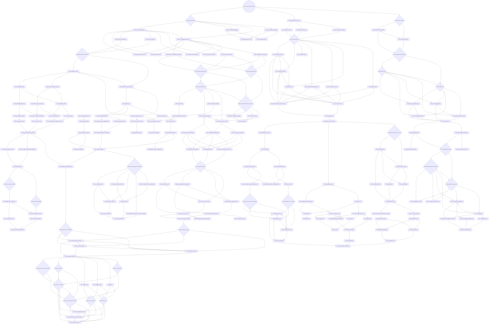

# PRC_put_an_end_to_the_sufan

```mermaid
flowchart TD
    n1{"PRC_CSCEC_civs"}
    n2{"PRC_CSCEC_mils"}
    n3["PRC_a_modern_army"]
    n4["PRC_a_new_central_committee"]
    n5["PRC_a_stronger_united_front"]
    n6["PRC_a_truly_united_front"]
    n7{"PRC_adopt_sun_yat_sens_principles"}
    n8["PRC_aggressive_pursuit_of_diplomacy"]
    n9["PRC_agricultural_reform"]
    n10["PRC_agricultural_reform_boom"]
    n11["PRC_air_force_capstone"]
    n12["PRC_allow_autonomous_regions"]
    n13["PRC_allow_special_goods_trade"]
    n14["PRC_anti_air_effort"]
    n15["PRC_appeal_for_foreign_aid"]
    n16["PRC_appoint_chang_qiankun"]
    n17["PRC_army_doctrines"]
    n18["PRC_army_reforms"]
    n19["PRC_army_tank_research"]
    n20["PRC_asian_democratic_union"]
    n21["PRC_ask_for_soviet_lend_lease"]
    n22{"PRC_assume_leadership"}
    n23["PRC_asymmetric_warfare"]
    n24["PRC_avenge_the_century_of_humiliation"]
    n25["PRC_aviation_infrastructure"]
    n26["PRC_ban_special_goods_trade"]
    n27["PRC_best_of_the_best"]
    n28["PRC_bolshevik_aid"]
    n29["PRC_bolshevik_urban_industrialization"]
    n30["PRC_bolshevik_urbanization"]
    n31["PRC_bolshevik_urbanization_2"]
    n32["PRC_bolshevik_urbanization_completed"]
    n33["PRC_bolshevik_world_revolution"]
    n34["PRC_bring_war_to_neighboring_warlords"]
    n35["PRC_burn_the_paper_tigers"]
    n36["PRC_capital_ships"]
    n37["PRC_carriers"]
    n38["PRC_central_military_commision"]
    n39["PRC_centralized_army_command"]
    n40["PRC_closer_ties_to_sov"]
    n41["PRC_connecting_the_country"]
    n42["PRC_consolidate_politcal_power"]
    n43["PRC_construct_the_banqiao_dam"]
    n44["PRC_conventional_warfare"]
    n45["PRC_cooperate_ulanhu"]
    n46["PRC_cruisers"]
    n47{"PRC_dare_to_struggle"}
    n48{"PRC_dare_to_win"}
    n49["PRC_deepen_the_dixie_mission"]
    n50["PRC_demand_warlord_loyalty"]
    n51["PRC_destroyers"]
    n52["PRC_develop_the_army"]
    n53["PRC_develop_yanan_soviet"]
    n54["PRC_dissent_in_the_united_front"]
    n55["PRC_dockyard_construction_efforts"]
    n56["PRC_eight_points_for_attention"]
    n57["PRC_embrace_stalinism"]
    n58["PRC_emergency_prodction_protocols"]
    n59["PRC_emergency_supply_protocols"]
    n60["PRC_empower_the_guerillas"]
    n61["PRC_enforce_maoism"]
    n62["PRC_equipment_from_copper_coins"]
    n63["PRC_establish_domestic_aircraft_production"]
    n64["PRC_establish_friendly_bases"]
    n65["PRC_establish_pla_air_force"]
    n66["PRC_establish_pla_navy"]
    n67{"PRC_establish_shorter_market_plans"}
    n68["PRC_establish_yanan_university"]
    n69["PRC_every_peasant_a_soldier"]
    n70["PRC_expedite_land_revolution"]
    n71["PRC_expel_the_occupiers"]
    n72["PRC_extend_emergency_measures"]
    n73["PRC_finalize_industrial_plan"]
    n74["PRC_form_central_social_affairs_department"]
    n75{"PRC_form_the_5th_research_institute"}
    n76["PRC_found_the_academy_of_science"]
    n77["PRC_gain_the_peoples_trust"]
    n78["PRC_great_production_movement"]
    n79{"PRC_guide_central_committee"}
    n80["PRC_halt_land_revolution"]
    n81["PRC_he_long_second_army"]
    n82["PRC_holding_half_the_sky"]
    n83["PRC_hundred_regiments_offensive"]
    n84["PRC_increase_domestic_production_capacity"]
    n85["PRC_indirect_fire"]
    n86{"PRC_industrialization_efforts"}
    n87{"PRC_initialize_five_year_plan"}
    n88["PRC_invite_otto_braun"]
    n89["PRC_invite_pavel_mif"]
    n90["PRC_invite_soviet_general"]
    n91{"PRC_invite_the_dixie_mission"}
    n92{"PRC_know_the_enemy"}
    n93["PRC_large_plane_focus"]
    n94["PRC_launch_sabotage_campaigns"]
    n95["PRC_leadership_of_mao"]
    n96["PRC_lessons_learnt"]
    n97["PRC_lessons_of_the_west"]
    n98["PRC_light_plane_focus"]
    n99["PRC_long_march_to_recovery"]
    n100["PRC_mao_zedong_ascends"]
    n101["PRC_master_the_terrain"]
    n102["PRC_medium_plane_focus"]
    n103["PRC_mobilization_of_the_people"]
    n104{"PRC_move_capital"}
    n105["PRC_naval_capstone"]
    n106["PRC_naval_guns"]
    n107["PRC_naval_infrastructure_effort"]
    n108["PRC_naval_mio"]
    n109["PRC_naval_ocean_navy"]
    n110["PRC_night_attack"]
    n111["PRC_on_guerilla_warfare"]
    n112["PRC_one_with_the_people"]
    n113["PRC_overthrow_the_ussr"]
    n114["PRC_part_of_the_comintern"]
    n115["PRC_party_control"]
    n116["PRC_peaceful_reunification"]
    n117{"PRC_peoples_liberation_army_sea"}
    n118["PRC_petition_for_freedom"]
    n119["PRC_pilot_training"]
    n120["PRC_playing_both_sides"]
    n121["PRC_preemptive_strike"]
    n122["PRC_prepare_for_596"]
    n123{"PRC_prepare_for_the_inevitable"}
    n124["PRC_prepare_for_third_phase"]
    n125{"PRC_promote_guerilla_warfare"}
    n126["PRC_promote_paper_bills"]
    n127{"PRC_promote_regular_army"}
    n128["PRC_promote_the_silver_dollar"]
    n129["PRC_promote_womens_suffrage"]
    n130["PRC_propaganda_efforts"]
    n131["PRC_purge_the_world_of_fascism"]
    n132(("PRC_put_an_end_to_the_sufan"))
    n133["PRC_question_the_faction_leadership"]
    n134["PRC_raid_weapon_depots"]
    n135["PRC_raiding_parties"]
    n136["PRC_rally_the_28_bolsheviks"]
    n137{"PRC_rally_the_industry"}
    n138["PRC_rally_the_peasants"]
    n139["PRC_reach_out_to_the_west"]
    n140["PRC_reappoint_jinguang_as_admiral"]
    n141["PRC_rebuild_28_bolshevik"]
    n142["PRC_reclaim_the_grasp_of_power"]
    n143["PRC_reclaim_tibet"]
    n144{"PRC_red_army_reborn"}
    n145["PRC_reestablish_moscow_sun_yat_sen_university"]
    n146{"PRC_reestablish_the_state_bank"}
    n147{"PRC_reform_the_republic"}
    n148["PRC_reinforce_base_area"]
    n149["PRC_reorganize_divisions"]
    n150["PRC_request_for_aid"]
    n151["PRC_request_guarantees"]
    n152["PRC_resource_extraction_focus"]
    n153["PRC_restore_territorial_integrity"]
    n154["PRC_revolutionary_war_of_the_masses"]
    n155["PRC_role_of_kangda"]
    n156["PRC_rural_recruitment"]
    n157["PRC_rural_region_development"]
    n158["PRC_rural_region_development_two"]
    n159["PRC_rural_survey"]
    n160["PRC_scholarly_revolution"]
    n161["PRC_secure_lend_lease_from_soviet"]
    n162["PRC_secure_the_lands"]
    n163["PRC_secure_the_peoples_support"]
    n164["PRC_seek_support_from_ussr"]
    n165["PRC_sino_allied_pact_of_non_aggression"]
    n166{"PRC_soviet_battle_tactics"}
    n167{"PRC_soviet_technological_cooperation"}
    n168{"PRC_strengthen_the_air_arsenal"}
    n169["PRC_strengthen_the_central_party_school"]
    n170["PRC_strict_training_regiments"]
    n171["PRC_subjugate_korea"]
    n172["PRC_submarines"]
    n173["PRC_supreme_infiltration"]
    n174["PRC_taiwan"]
    n175["PRC_tech_agreement_with_ussr"]
    n176{"PRC_the_battle_behind_the_front_lines"}
    n177["PRC_the_chinese_century"]
    n178["PRC_the_eastward_expedition"]
    n179["PRC_the_end_of_capitalism"]
    n180["PRC_the_fight_of_a_people"]
    n181{"PRC_the_first_premier"}
    n182["PRC_the_internal_enemy"]
    n183["PRC_the_long_march_towards_progress"]
    n184{"PRC_the_march_to_victory"}
    n185["PRC_the_northeast_aviation_university_sea"]
    n186{"PRC_the_party_builds_the_nation"}
    n187["PRC_the_peoples_republic"]
    n188["PRC_the_pla_naval_school"]
    n189["PRC_the_unwilling_diarchy_focus"]
    n190["PRC_the_westward_expedition"]
    n191["PRC_three_rules_of_discipline"]
    n192["PRC_to_serve_the_people"]
    n193["PRC_to_steal_an_army"]
    n194["PRC_to_support_the_army"]
    n195["PRC_to_unify_a_country"]
    n196["PRC_towards_one_china"]
    n197{"PRC_two_soviets_together"}
    n198["PRC_urbanization"]
    n199["PRC_urbanization_two"]
    n200["PRC_usurp_control_over_yanan"]
    n201["PRC_with_inspiration_from_nkvd"]
    n202["PRC_yanan_rectification_movement"]
    n203["PRC_zhang_guotao_ascends"]
    n146 --> n1
    n146 --> n2
    n17 --> n3
    n15 --> n3
    n203 --> n4
    n28 --> n5
    n167 --> n6
    n187 --> n7
    n141 --> n8
    n159 --> n9
    n9 --> n10
    n93 --> n11
    n98 --> n11
    n102 --> n11
    n123 --> n12
    n184 --> n12
    n2 --> n13
    n1 --> n13
    n25 --> n14
    n19 --> n15
    n122 --> n15
    n119 --> n16
    n19 --> n17
    n122 --> n17
    n166 --> n18
    n84 --> n19
    n47 --> n20
    n48 --> n20
    n186 --> n20
    n147 --> n20
    n88 --> n21
    n164 --> n21
    n50 --> n22
    n161 --> n22
    n121 --> n22
    n144 --> n23
    n47 --> n24
    n48 --> n24
    n186 --> n24
    n147 --> n24
    n119 --> n25
    n2 --> n26
    n1 --> n26
    n117 --> n27
    n142 --> n28
    n30 --> n29
    n28 --> n30
    n30 --> n31
    n31 --> n32
    n29 --> n32
    n167 --> n33
    n189 --> n34
    n92 --> n35
    n107 --> n36
    n188 --> n36
    n36 --> n37
    n46 --> n37
    n105 --> n38
    n11 --> n38
    n3 --> n38
    n18 --> n39
    n170 --> n39
    n22 --> n40
    n67 --> n41
    n87 --> n41
    n100 --> n42
    n203 --> n42
    n67 --> n43
    n87 --> n43
    n144 --> n44
    n144 --> n45
    n107 --> n46
    n188 --> n46
    n174 --> n47
    n171 --> n47
    n143 --> n47
    n174 --> n48
    n171 --> n48
    n143 --> n48
    n91 --> n49
    n42 --> n50
    n129 --> n50
    n4 --> n50
    n108 --> n51
    n55 --> n51
    n155 --> n52
    n149 --> n52
    n110 --> n52
    n190 --> n53
    n178 --> n53
    n163 --> n54
    n66 --> n55
    n189 --> n56
    n35 --> n56
    n32 --> n57
    n180 --> n57
    n141 --> n57
    n22 --> n58
    n22 --> n59
    n64 --> n60
    n74 --> n61
    n68 --> n61
    n144 --> n62
    n25 --> n63
    n16 --> n63
    n111 --> n64
    n124 --> n65
    n124 --> n66
    n86 --> n67
    n202 --> n68
    n97 --> n69
    n72 --> n69
    n137 --> n70
    n189 --> n71
    n35 --> n71
    n59 --> n72
    n58 --> n72
    n199 --> n73
    n158 --> n73
    n76 --> n73
    n202 --> n74
    n185 --> n75
    n198 --> n76
    n157 --> n76
    n189 --> n77
    n159 --> n78
    n138 --> n79
    n136 --> n79
    n137 --> n80
    n144 --> n81
    n60 --> n82
    n202 --> n83
    n57 --> n83
    n52 --> n84
    n144 --> n85
    n9 --> n86
    n78 --> n86
    n86 --> n87
    n28 --> n88
    n88 --> n89
    n201 --> n90
    n61 --> n91
    n132 --> n92
    n75 --> n93
    n168 --> n93
    n176 --> n94
    n79 --> n95
    n193 --> n96
    n154 --> n96
    n40 --> n97
    n139 --> n97
    n75 --> n98
    n168 --> n98
    n132 --> n99
    n166 --> n100
    n176 --> n100
    n99 --> n101
    n75 --> n102
    n168 --> n102
    n189 --> n103
    n187 --> n104
    n109 --> n105
    n107 --> n106
    n108 --> n107
    n66 --> n108
    n140 --> n109
    n106 --> n109
    n112 --> n110
    n95 --> n111
    n117 --> n112
    n49 --> n113
    n167 --> n114
    n33 --> n115
    n165 --> n115
    n123 --> n116
    n184 --> n116
    n124 --> n117
    n6 --> n118
    n114 --> n118
    n65 --> n119
    n5 --> n120
    n42 --> n121
    n129 --> n121
    n4 --> n121
    n192 --> n122
    n83 --> n123
    n96 --> n124
    n77 --> n125
    n103 --> n125
    n34 --> n125
    n2 --> n126
    n1 --> n126
    n77 --> n127
    n103 --> n127
    n34 --> n127
    n2 --> n128
    n1 --> n128
    n100 --> n129
    n111 --> n130
    n163 --> n130
    n179 --> n131
    n113 --> n131
    n54 --> n133
    n130 --> n134
    n64 --> n134
    n162 --> n135
    n94 --> n135
    n35 --> n136
    n132 --> n137
    n35 --> n138
    n22 --> n139
    n188 --> n140
    n89 --> n141
    n79 --> n142
    n187 --> n143
    n191 --> n144
    n101 --> n144
    n148 --> n144
    n167 --> n145
    n80 --> n146
    n70 --> n146
    n7 --> n147
    n104 --> n147
    n181 --> n147
    n99 --> n148
    n27 --> n149
    n144 --> n150
    n21 --> n151
    n78 --> n152
    n189 --> n153
    n35 --> n153
    n150 --> n154
    n81 --> n154
    n62 --> n154
    n23 --> n154
    n44 --> n154
    n85 --> n154
    n27 --> n155
    n112 --> n155
    n130 --> n156
    n54 --> n156
    n87 --> n157
    n67 --> n157
    n157 --> n158
    n26 --> n159
    n13 --> n159
    n126 --> n159
    n128 --> n159
    n145 --> n160
    n115 --> n160
    n118 --> n160
    n42 --> n161
    n129 --> n161
    n4 --> n161
    n176 --> n162
    n95 --> n163
    n142 --> n164
    n95 --> n164
    n167 --> n165
    n125 --> n166
    n127 --> n166
    n57 --> n167
    n14 --> n168
    n134 --> n169
    n156 --> n169
    n166 --> n170
    n187 --> n171
    n51 --> n172
    n180 --> n173
    n187 --> n174
    n197 --> n175
    n125 --> n176
    n127 --> n176
    n47 --> n177
    n48 --> n177
    n186 --> n177
    n147 --> n177
    n92 --> n178
    n175 --> n179
    n120 --> n180
    n187 --> n181
    n190 --> n182
    n178 --> n182
    n97 --> n183
    n69 --> n184
    n16 --> n185
    n7 --> n186
    n104 --> n186
    n181 --> n186
    n196 --> n187
    n12 --> n187
    n116 --> n187
    n55 --> n188
    n92 --> n189
    n92 --> n190
    n99 --> n191
    n52 --> n192
    n150 --> n193
    n81 --> n193
    n62 --> n193
    n23 --> n193
    n44 --> n193
    n85 --> n193
    n72 --> n194
    n133 --> n195
    n123 --> n196
    n184 --> n196
    n61 --> n197
    n87 --> n198
    n67 --> n198
    n198 --> n199
    n189 --> n200
    n35 --> n200
    n88 --> n201
    n164 --> n201
    n82 --> n202
    n195 --> n202
    n169 --> n202
    n166 --> n203
    n176 --> n203
    n1 x--x n2
    n6 x--x n114
    n12 x--x n116
    n12 x--x n196
    n13 x--x n26
    n20 x--x n24
    n20 x--x n177
    n23 x--x n44
    n23 x--x n85
    n24 x--x n177
    n27 x--x n112
    n35 x--x n189
    n40 x--x n139
    n44 x--x n85
    n49 x--x n175
    n58 x--x n59
    n67 x--x n87
    n70 x--x n80
    n93 x--x n98
    n93 x--x n102
    n95 x--x n142
    n98 x--x n102
    n100 x--x n203
    n116 x--x n196
    n126 x--x n128
    n147 x--x n186
    n157 x--x n198
    n166 x--x n176
```
