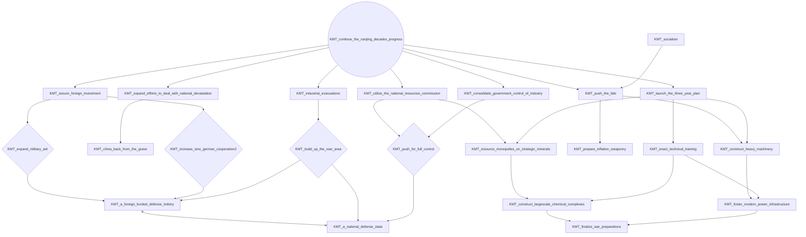
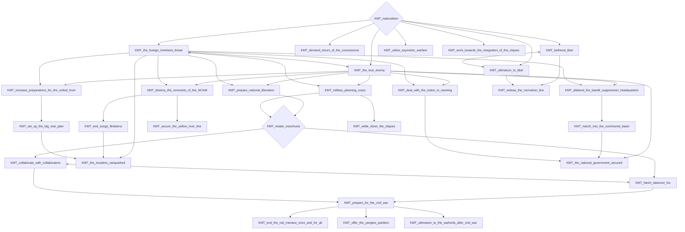
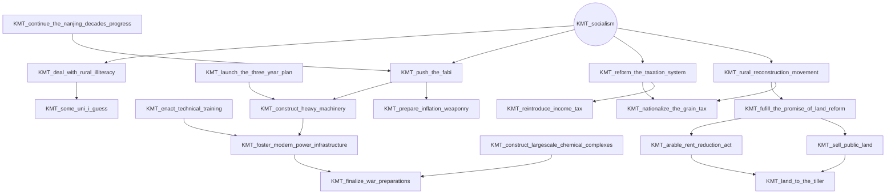
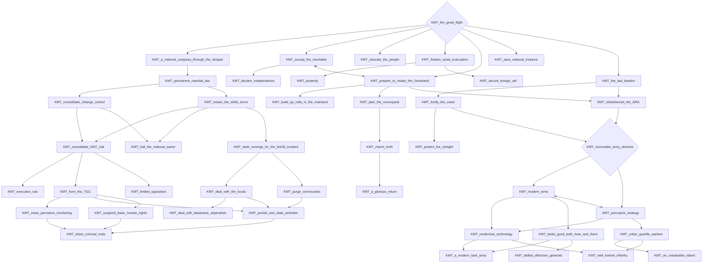

# KMT_continue_the_nanjing_decades_progress

```mermaid
flowchart TD
    n1["KMT_a_foreign_funded_defense_indstry"]
    n2["KMT_a_naitonal_defense_state"]
    n3{"KMT_build_up_the_rear_area"}
    n4["KMT_china_back_from_the_grave"]
    n5["KMT_consolidate_government_control_of_industry"]
    n6["KMT_construct_heavy_machinery"]
    n7["KMT_construct_largescale_chemical_complexes"]
    n8(("KMT_continue_the_nanjing_decades_progress"))
    n9["KMT_enact_technical_training"]
    n10["KMT_expand_efforts_to_deal_with_national_devastation"]
    n11{"KMT_expand_military_aid"}
    n12["KMT_finalize_war_preparations"]
    n13["KMT_foster_modern_power_infrastructure"]
    n14{"KMT_increase_sino_german_cooperation2"}
    n15["KMT_industrial_evacuations"]
    n16["KMT_launch_the_three_year_plan"]
    n17["KMT_prepare_inflation_weaponry"]
    n18{"KMT_push_for_full_control"}
    n19["KMT_push_the_fabi"]
    n20["KMT_resource_monopolies_on_strategic_minerals"]
    n21["KMT_secure_foreign_investment"]
    n22["KMT_socialism"]
    n23["KMT_utilize_the_national_resources_commission"]
    n3 --> n1
    n14 --> n1
    n11 --> n1
    n18 --> n2
    n3 --> n2
    n15 --> n3
    n10 --> n4
    n8 --> n5
    n16 --> n6
    n19 --> n6
    n9 --> n7
    n20 --> n7
    n16 --> n9
    n8 --> n10
    n21 --> n11
    n13 --> n12
    n7 --> n12
    n9 --> n13
    n6 --> n13
    n21 --> n14
    n8 --> n15
    n8 --> n16
    n19 --> n17
    n5 --> n18
    n23 --> n18
    n22 --> n19
    n8 --> n19
    n16 --> n20
    n23 --> n20
    n8 --> n21
    n8 --> n23
    n1 x--x n2
```

# KMT_democracy

```mermaid
flowchart TD
    n24["KMT_a_balanced_regime"]
    n25["KMT_anti_soviet_isolation_tactics"]
    n26["KMT_birth_the_dai_clique"]
    n27["KMT_break_income_inequality"]
    n28{"KMT_bring_the_presidents_role_into_perspective"}
    n29["KMT_build_a_state_within_the_state"]
    n30["KMT_buy_and_sell_japanese"]
    n31["KMT_carte_blanche_in_manchuria"]
    n32["KMT_china_above_all"]
    n33["KMT_china_at_the_mercy_of_the_cc_clique"]
    n34["KMT_consolidate_the_new_regime"]
    n35["KMT_control_chinese_life"]
    n36["KMT_counter_asian_imperialism"]
    n37["KMT_counter_soviet_imperialism"]
    n38["KMT_counter_western_imperialism"]
    n39["KMT_create_the_cbis"]
    n40(("KMT_democracy"))
    n41["KMT_dictatorship_through_democracy"]
    n42{"KMT_discipline_the_military"}
    n43{"KMT_dismantle_the_security_apparatus"}
    n44["KMT_early_federalist_reforms"]
    n45{"KMT_elect_the_national_assembly_and_legislative_yuan"}
    n46{"KMT_elect_the_national_constituent_assembly"}
    n47["KMT_empower_the_mbis"]
    n48{"KMT_empower_the_secret_police"}
    n49["KMT_en_masse_participation_in_democracy"]
    n50["KMT_end_the_peoples_tutelage"]
    n51{"KMT_ensure_a_loyal_society"}
    n52["KMT_entrench_dang_guo_sentiment"]
    n53["KMT_establish_a_strong_national_character"]
    n54["KMT_establish_true_popular_rule"]
    n55{"KMT_expand_clandestine_operations"}
    n56["KMT_expand_dais_apparatus"]
    n57["KMT_expand_executive_authority"]
    n58["KMT_expand_ideological_indoctrination"]
    n59["KMT_expand_nepotism"]
    n60["KMT_expand_presidential_power"]
    n61{"KMT_expand_secret_police_authority"}
    n62{"KMT_expand_securocratic_measures"}
    n63["KMT_expand_the_nationalist_focus"]
    n64["KMT_extol_the_3_principles"]
    n65["KMT_focus_the_economy_on_the_worker"]
    n66["KMT_form_a_propaganda_department"]
    n67["KMT_formalize_the_second_in_command"]
    n68["KMT_fufill_sun_yat_sens_legacy"]
    n69["KMT_gut_the_deep_state_new"]
    n70["KMT_hold_a_provisional_national_congress"]
    n71["KMT_hold_the_political_consultative_conference"]
    n72["KMT_ignore_communist_bickering"]
    n73["KMT_imbue_them_in_the_people"]
    n74["KMT_increase_anti_communist_repressions"]
    n75["KMT_indochinese_liberation"]
    n76["KMT_invite_japanese_investors"]
    n77["KMT_korean_liberation"]
    n78["KMT_labor_for_expertise"]
    n79["KMT_lands_for_bases"]
    n80["KMT_lands_or_war"]
    n81["KMT_manchuria_for_continued_economic_influence"]
    n82["KMT_national_militarism"]
    n83["KMT_outdo_europe"]
    n84{"KMT_preempt_kmt_factionalism"}
    n85["KMT_preempt_the_inevitable"]
    n86["KMT_propaganda_and_misinformation"]
    n87["KMT_purge_suriviving_communists"]
    n88["KMT_reassert_the_mongolian_claim"]
    n89["KMT_reconvenve_the_national_consitutent_assembly"]
    n90{"KMT_redefine_democracy"}
    n91["KMT_reestablish_military_primacy"]
    n92["KMT_reforge_the_kuomintangs_inner_circle"]
    n93["KMT_reinvigorate_the_blueshirts"]
    n94["KMT_resources_for_research"]
    n95["KMT_revise_sun_yat_sens_teachings"]
    n96["KMT_revive_the_new_life_movement"]
    n97["KMT_rule_by_violence"]
    n98["KMT_scientist_exchange_programmes"]
    n99["KMT_shift_power_to_the_party_legislature"]
    n100["KMT_smite_corruption"]
    n101["KMT_social_democracy_at_its_finest"]
    n102["KMT_state_guided_modernization"]
    n103["KMT_strengthen_constitutional_stability"]
    n104["KMT_suppress_dissent"]
    n105{"KMT_temporary_measures_against_the_communist_rebellion"}
    n106["KMT_the_anti_imperial_league"]
    n107["KMT_the_chinese_awakening"]
    n108{"KMT_the_dragon_swallows_the_sun"}
    n109["KMT_the_idealist_coaltion"]
    n110["KMT_the_masters_of_asia"]
    n111["KMT_the_party_state_holds_on"]
    n112{"KMT_the_path_of_peace"}
    n113{"KMT_the_path_of_war"}
    n114["KMT_the_return_of_taiwan"]
    n115["KMT_the_sixth_national_congress"]
    n116["KMT_the_taiwan_accords"]
    n117["KMT_the_true_enemies_of_china"]
    n118["KMT_true_reconciliation"]
    n119["KMT_unify_the_fractured_kmt"]
    n120["KMT_utilize_our_riches"]
    n121["KMT_wang_jingweis_rise"]
    n122["KMT_write_a_new_constitution"]
    n28 --> n24
    n37 --> n25
    n92 --> n26
    n86 --> n26
    n65 --> n27
    n43 --> n28
    n111 --> n29
    n116 --> n30
    n113 --> n31
    n112 --> n31
    n31 --> n32
    n80 --> n32
    n48 --> n33
    n62 --> n33
    n121 --> n34
    n73 --> n35
    n51 --> n35
    n106 --> n36
    n106 --> n37
    n106 --> n38
    n70 --> n39
    n60 --> n41
    n29 --> n41
    n47 --> n42
    n45 --> n43
    n109 --> n44
    n50 --> n45
    n40 --> n46
    n70 --> n47
    n97 --> n48
    n62 --> n48
    n44 --> n49
    n89 --> n50
    n52 --> n50
    n39 --> n51
    n72 --> n52
    n83 --> n53
    n63 --> n53
    n103 --> n53
    n95 --> n54
    n119 --> n54
    n56 --> n54
    n33 --> n54
    n69 --> n54
    n47 --> n55
    n48 --> n56
    n62 --> n56
    n70 --> n57
    n93 --> n58
    n40 --> n59
    n105 --> n60
    n61 --> n60
    n45 --> n61
    n90 --> n62
    n64 --> n63
    n107 --> n64
    n111 --> n64
    n109 --> n65
    n118 --> n65
    n51 --> n66
    n84 --> n66
    n69 --> n67
    n56 --> n67
    n45 --> n68
    n48 --> n69
    n97 --> n69
    n40 --> n70
    n46 --> n71
    n46 --> n72
    n96 --> n73
    n40 --> n74
    n38 --> n75
    n116 --> n76
    n36 --> n77
    n116 --> n78
    n112 --> n79
    n113 --> n80
    n112 --> n81
    n90 --> n82
    n102 --> n83
    n39 --> n84
    n34 --> n85
    n42 --> n86
    n55 --> n86
    n117 --> n87
    n37 --> n88
    n71 --> n89
    n86 --> n90
    n66 --> n90
    n35 --> n90
    n105 --> n91
    n58 --> n92
    n40 --> n93
    n116 --> n94
    n122 --> n95
    n40 --> n96
    n90 --> n97
    n116 --> n98
    n28 --> n99
    n40 --> n100
    n49 --> n101
    n103 --> n101
    n27 --> n101
    n107 --> n102
    n107 --> n103
    n109 --> n103
    n93 --> n104
    n74 --> n104
    n45 --> n105
    n45 --> n106
    n90 --> n106
    n45 --> n107
    n98 --> n108
    n30 --> n108
    n94 --> n108
    n78 --> n108
    n76 --> n108
    n116 --> n108
    n45 --> n109
    n81 --> n110
    n31 --> n110
    n79 --> n110
    n45 --> n111
    n108 --> n112
    n108 --> n113
    n36 --> n114
    n70 --> n115
    n85 --> n116
    n34 --> n117
    n45 --> n118
    n122 --> n119
    n32 --> n120
    n110 --> n120
    n40 --> n121
    n90 --> n122
    n24 x--x n99
    n28 x--x n60
    n31 x--x n81
    n33 x--x n56
    n43 x--x n61
    n62 x--x n97
    n66 x--x n86
    n71 x--x n72
    n107 x--x n109
    n107 x--x n111
    n107 x--x n118
    n109 x--x n111
    n109 x--x n118
    n111 x--x n118
    n112 x--x n113
```

# KMT_hold_the_national_defense_conference

```mermaid
flowchart TD
    n123["KMT_adress_the_nras_politicization"]
    n124{"KMT_airbase_expansion"}
    n125["KMT_armored_pincer_strikes"]
    n126["KMT_bomber_focus2"]
    n127["KMT_break_the_first_island_chain"]
    n128["KMT_break_the_second_island_chain"]
    n129["KMT_cas_effort2"]
    n130["KMT_centralize_military_direction"]
    n131["KMT_coastal_fortifications"]
    n132["KMT_dare_to_die_corps2"]
    n133["KMT_demand_taiwan2"]
    n134["KMT_draw_the_nine_dash_line"]
    n135["KMT_drive_them_back"]
    n136["KMT_en_masse_conscription"]
    n137["KMT_end_whampoa_primacy"]
    n138["KMT_enforce_the_nine_dash_line"]
    n139["KMT_expand_military_schooling"]
    n140["KMT_expand_the_jiangman_shipyard_group"]
    n141["KMT_expand_the_navy"]
    n142["KMT_fighter_focus2"]
    n143["KMT_finish_the_big_rear_plan"]
    n144{"KMT_forge_a_modern_offensive_force"}
    n145["KMT_found_the_roc_armed_forces"]
    n146(("KMT_hold_the_national_defense_conference"))
    n147["KMT_launch_a_major_fortification_programme"]
    n148["KMT_lure_them_in_strategy2"]
    n149["KMT_major_operational_planning"]
    n150["KMT_mobilize_the_chinese_volk_in_the_face_of_death"]
    n151["KMT_mobilize_the_industries"]
    n152["KMT_mobilize_the_railways"]
    n153["KMT_modernize_the_army_new"]
    n154["KMT_modernize_whampoa_academy"]
    n155["KMT_nav_effort2"]
    n156["KMT_naval_equipment2"]
    n157["KMT_prepare_for_foreign_inasion"]
    n158["KMT_reorganize_the_ROCAF"]
    n159["KMT_reorganize_the_command_structures"]
    n160["KMT_reuse_captured_weaponary2"]
    n161["KMT_strengthen_the_logistical_department"]
    n162["KMT_study_foreign_ship2"]
    n163{"KMT_taiwan_fleet_hub2"}
    n164{"KMT_the_big_rear_plan"}
    n165["KMT_the_flying_tigers"]
    n166["KMT_the_grand_infantry_offensive"]
    n167["KMT_the_tianlong_jet_engine"]
    n168["KMT_utilize_meritocratic_incentives"]
    n146 --> n123
    n158 --> n124
    n144 --> n125
    n124 --> n126
    n163 --> n127
    n127 --> n128
    n142 --> n129
    n159 --> n130
    n136 --> n130
    n146 --> n131
    n157 --> n132
    n141 --> n133
    n163 --> n134
    n144 --> n135
    n146 --> n136
    n145 --> n137
    n134 --> n138
    n153 --> n139
    n146 --> n140
    n131 --> n141
    n140 --> n141
    n124 --> n142
    n164 --> n143
    n153 --> n144
    n146 --> n145
    n146 --> n147
    n164 --> n148
    n145 --> n149
    n160 --> n150
    n143 --> n150
    n146 --> n151
    n153 --> n152
    n157 --> n152
    n146 --> n153
    n139 --> n154
    n126 --> n155
    n134 --> n156
    n127 --> n156
    n146 --> n157
    n146 --> n158
    n146 --> n159
    n132 --> n160
    n145 --> n161
    n141 --> n162
    n133 --> n163
    n157 --> n164
    n158 --> n165
    n144 --> n166
    n124 --> n167
    n139 --> n168
    n125 x--x n166
    n126 x--x n142
    n127 x--x n134
    n135 x--x n148
```

# KMT_nationalism

```mermaid
flowchart TD
    n169["KMT_befriend_tibet"]
    n170["KMT_collaborate_with_collaborators"]
    n171["KMT_deal_with_the_traitor_in_nanning"]
    n172["KMT_demand_return_of_the_concessions"]
    n173["KMT_destroy_the_remnants_of_the_NCAM"]
    n174["KMT_disband_the_bandit_suppression_headquarters"]
    n175["KMT_end_songs_flirtations"]
    n176["KMT_end_the_red_menace_once_and_for_all"]
    n177["KMT_harsh_takeover_foc"]
    n178["KMT_increase_preparations_for_the_united_front"]
    n179["KMT_march_into_the_communist_basin"]
    n180["KMT_military_planning_corps"]
    n181{"KMT_nationalism"}
    n182["KMT_offer_the_yangtze_partition"]
    n183["KMT_prepare_for_the_civil_war"]
    n184["KMT_prepare_national_liberation"]
    n185["KMT_redraw_the_mcmahon_line"]
    n186{"KMT_retake_manchuria"}
    n187["KMT_secure_the_yellow_river_line"]
    n188["KMT_set_up_the_big_rear_plan"]
    n189["KMT_the_foreign_imminent_threat"]
    n190["KMT_the_invaders_vanquished"]
    n191["KMT_the_national_government_secured"]
    n192["KMT_the_true_enemy"]
    n193["KMT_ultimatum_to_the_warlords_after_civil_war"]
    n194["KMT_ultimatum_to_tibet"]
    n195["KMT_utilize_asymetric_warfare"]
    n196["KMT_wittle_down_the_cliques"]
    n197["KMT_work_towards_the_integration_of_the_cliques"]
    n181 --> n169
    n186 --> n170
    n192 --> n171
    n189 --> n171
    n181 --> n172
    n192 --> n173
    n189 --> n173
    n192 --> n174
    n189 --> n174
    n173 --> n175
    n183 --> n176
    n186 --> n177
    n192 --> n178
    n189 --> n178
    n174 --> n179
    n192 --> n180
    n189 --> n180
    n183 --> n182
    n177 --> n183
    n170 --> n183
    n192 --> n184
    n189 --> n184
    n169 --> n185
    n194 --> n185
    n184 --> n186
    n180 --> n186
    n173 --> n187
    n178 --> n188
    n181 --> n189
    n189 --> n190
    n175 --> n190
    n188 --> n190
    n192 --> n191
    n179 --> n191
    n171 --> n191
    n181 --> n192
    n183 --> n193
    n181 --> n194
    n181 --> n195
    n180 --> n196
    n181 --> n197
    n169 x--x n194
    n170 x--x n177
    n189 x--x n192
```

# KMT_socialism

```mermaid
flowchart TD
    n198["KMT_arable_rent_reduction_act"]
    n6["KMT_construct_heavy_machinery"]
    n7["KMT_construct_largescale_chemical_complexes"]
    n8["KMT_continue_the_nanjing_decades_progress"]
    n199["KMT_deal_with_rural_illiteracy"]
    n9["KMT_enact_technical_training"]
    n12["KMT_finalize_war_preparations"]
    n13["KMT_foster_modern_power_infrastructure"]
    n200["KMT_fufill_the_promise_of_land_reform"]
    n201["KMT_land_to_the_tiller"]
    n16["KMT_launch_the_three_year_plan"]
    n202["KMT_nationalize_the_grain_tax"]
    n17["KMT_prepare_inflation_weaponry"]
    n19["KMT_push_the_fabi"]
    n203["KMT_reform_the_taxation_system"]
    n204["KMT_reintroduce_income_tax"]
    n205["KMT_rural_reconstruction_movement"]
    n206["KMT_sell_public_land"]
    n22(("KMT_socialism"))
    n207["KMT_some_uni_i_guess"]
    n200 --> n198
    n16 --> n6
    n19 --> n6
    n22 --> n199
    n13 --> n12
    n7 --> n12
    n9 --> n13
    n6 --> n13
    n205 --> n200
    n198 --> n201
    n206 --> n201
    n203 --> n202
    n205 --> n202
    n19 --> n17
    n22 --> n19
    n8 --> n19
    n22 --> n203
    n203 --> n204
    n22 --> n205
    n200 --> n206
    n199 --> n207
```

# KMT_the_great_flight

```mermaid
flowchart TD
    n208["KMT_a_glorious_return"]
    n209["KMT_a_modern_tank_army"]
    n210["KMT_a_national_congress_through_the_despair"]
    n211["KMT_accept_the_inevitable"]
    n212["KMT_an_untakeable_island"]
    n213["KMT_austerity"]
    n214["KMT_build_up_cells_in_the_mainland"]
    n215["KMT_consolidate_KMT_rule"]
    n216["KMT_consolidate_chiangs_control"]
    n217["KMT_deal_with_taiwanese_seperatists"]
    n218["KMT_deal_with_the_locals"]
    n219["KMT_declare_independence"]
    n220["KMT_educate_the_people"]
    n221["KMT_executive_rule"]
    n222["KMT_finalize_asset_evacuation"]
    n223["KMT_form_the_TGC"]
    n224["KMT_fortify_the_coast"]
    n225["KMT_hail_the_national_savior"]
    n226["KMT_limited_opposition"]
    n227["KMT_march_forth"]
    n228["KMT_mass_pervasive_monitoring"]
    n229["KMT_modern_arms"]
    n230["KMT_modernize_technology"]
    n231["KMT_permanent_marshal_law"]
    n232["KMT_plan_the_reconquest"]
    n233["KMT_porcupine_strategy"]
    n234["KMT_prepare_to_retake_the_homeland"]
    n235["KMT_protect_the_streight"]
    n236["KMT_punish_anti_state_activities"]
    n237["KMT_purge_communists"]
    n238["KMT_rebolshevize_the_NRA"]
    n239{"KMT_reconsider_army_doctrine"}
    n240["KMT_restart_the_white_terror"]
    n241["KMT_save_national_treasure"]
    n242["KMT_secure_foreign_aid"]
    n243["KMT_seek_revenge_for_the_feb28_incident"]
    n244["KMT_sham_criminal_trials"]
    n245["KMT_skilled_offensive_generals"]
    n246["KMT_suspend_basic_human_rights"]
    n247["KMT_tanks_good_both_here_and_there"]
    n248{"KMT_the_great_flight"}
    n249["KMT_the_last_bastion"]
    n250["KMT_urban_guerilla_warfare"]
    n251["KMT_well_trained_infantry"]
    n227 --> n208
    n247 --> n209
    n230 --> n209
    n248 --> n210
    n248 --> n211
    n250 --> n212
    n222 --> n213
    n234 --> n214
    n240 --> n215
    n216 --> n215
    n231 --> n216
    n218 --> n217
    n243 --> n218
    n211 --> n219
    n248 --> n220
    n215 --> n221
    n248 --> n222
    n215 --> n223
    n249 --> n224
    n240 --> n225
    n216 --> n225
    n215 --> n226
    n232 --> n227
    n223 --> n228
    n239 --> n229
    n233 --> n230
    n229 --> n230
    n210 --> n231
    n234 --> n232
    n239 --> n233
    n248 --> n234
    n224 --> n235
    n218 --> n236
    n237 --> n236
    n223 --> n236
    n243 --> n237
    n234 --> n238
    n249 --> n238
    n238 --> n239
    n224 --> n239
    n231 --> n240
    n248 --> n241
    n222 --> n242
    n240 --> n243
    n228 --> n244
    n246 --> n244
    n236 --> n244
    n247 --> n245
    n223 --> n246
    n229 --> n247
    n248 --> n249
    n233 --> n250
    n250 --> n251
    n230 --> n251
    n211 x--x n234
    n229 x--x n233
```
