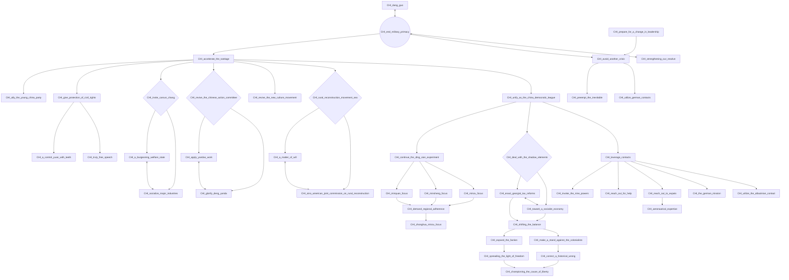
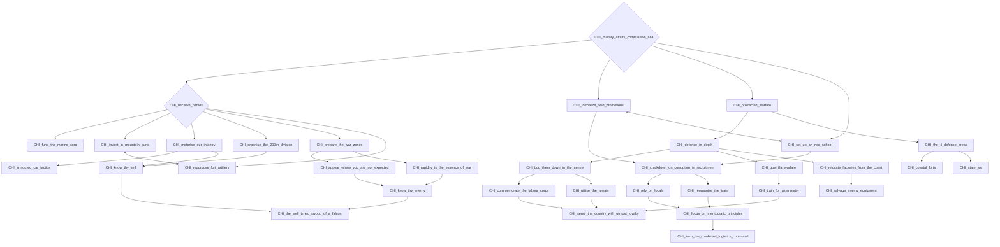
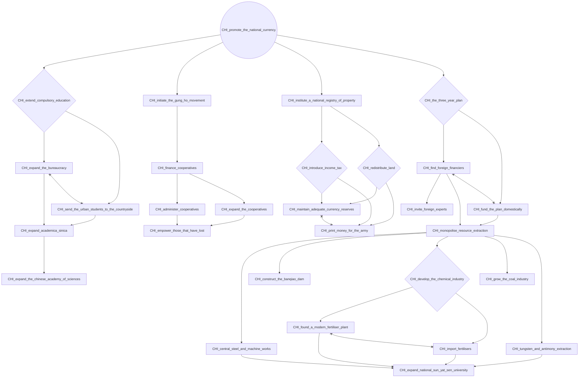
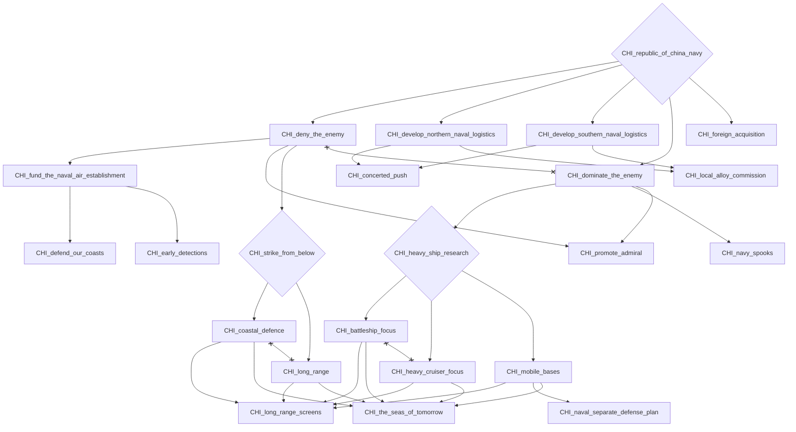
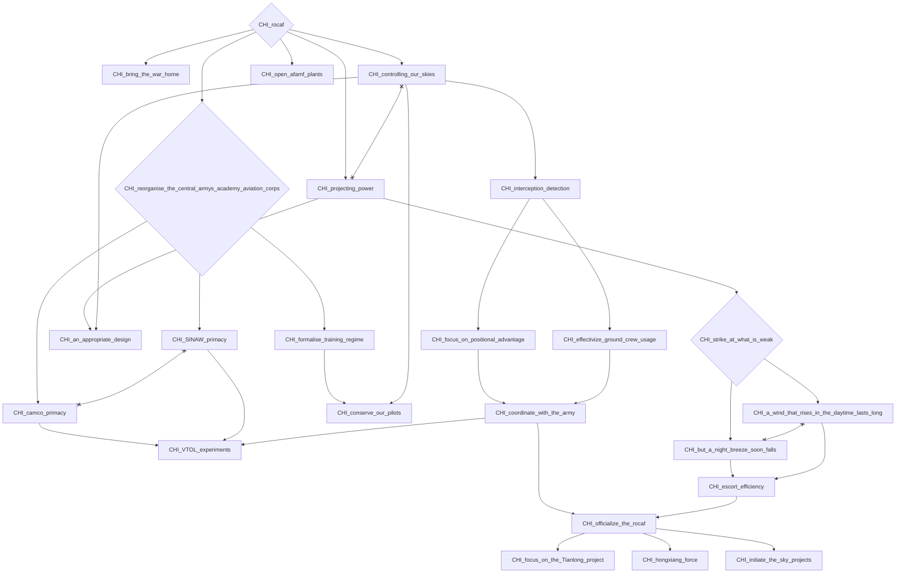
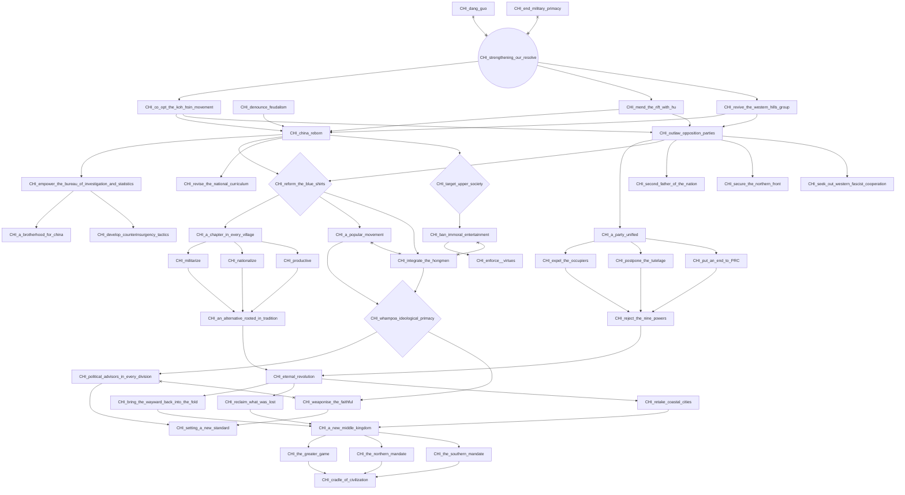

# CHI_dang_guo

```mermaid
flowchart TD
    n1["CHI_a_brotherhood_for_china"]
    n2["CHI_a_chapter_in_every_village"]
    n3["CHI_a_functioning_bureaucracy_first"]
    n4{"CHI_a_generalissimo_for_all_of_china"}
    n5["CHI_a_new_middle_kingdom"]
    n6["CHI_a_popular_movement"]
    n7["CHI_a_world_freed_from_communism"]
    n8["CHI_affirm_civilian_primacy"]
    n9["CHI_allocate_lend_lease"]
    n10["CHI_an_alternative_rooted_in_tradition"]
    n11["CHI_appoint_sympathetic_judges"]
    n12{"CHI_arrest_the_seven_gentlemen"}
    n13["CHI_avoid_another_crisis"]
    n14["CHI_ban_immoral_entertainment"]
    n15["CHI_bring_the_revolution_further"]
    n16["CHI_bring_the_wayward_back_into_the_fold"]
    n17["CHI_burma_campaign"]
    n18["CHI_censure_the_opposition"]
    n19["CHI_china_reborn"]
    n20["CHI_clear_out_sycophants"]
    n21["CHI_close_whampoa"]
    n22["CHI_co_opt_the_koh_hsin_movement"]
    n23["CHI_collaborate_with_allied_forces"]
    n24["CHI_crack_down_on_illicit_goods"]
    n25["CHI_cradle_of_civilization"]
    n26["CHI_crush_the_communists"]
    n27{"CHI_dang_guo"}
    n28{"CHI_decree_the_end_to_corruption"}
    n29["CHI_demonstrate_our_resolve"]
    n30["CHI_denounce_feudalism"]
    n31["CHI_develop_counterinsurgency_tactics"]
    n32["CHI_draw_support_from_the_big_families"]
    n33["CHI_empower_the_bureau_of_investigation_and_statistics"]
    n34["CHI_empower_the_mtac"]
    n35["CHI_end_military_primacy"]
    n36["CHI_end_the_humiliation"]
    n37["CHI_enforce__virtues"]
    n38["CHI_eternal_revolution"]
    n39["CHI_expand_the_tongzi_jun"]
    n40["CHI_expropriate_industrialists"]
    n41["CHI_extend_jurisdiction_to_the_provinces"]
    n42["CHI_facilitate_operation_zet"]
    n43["CHI_form_saco"]
    n44["CHI_form_the_chinese_womens_national_war_relief_society"]
    n45{"CHI_from_many_to_one"}
    n46["CHI_impair_the_control_yuan"]
    n47["CHI_indo_chinese_campaign"]
    n48{"CHI_infiltrate_the_examination_yuan"}
    n49["CHI_inspect_the_troops"]
    n50["CHI_integrate_the_hongmen"]
    n51["CHI_international_instructors"]
    n52["CHI_international_squadron"]
    n53["CHI_introduce_the_baojia_system"]
    n54["CHI_joining_the_international_community"]
    n55["CHI_lay_the_foundation_for_a_united_china"]
    n56["CHI_legitimise_du"]
    n57["CHI_liberate_the_peoples_of_asia"]
    n58["CHI_look_for_allies"]
    n59["CHI_mend_the_rift_with_hu"]
    n60["CHI_militarize"]
    n61["CHI_nationalize"]
    n62["CHI_negotiate_the_nine_powers_treaty"]
    n63{"CHI_one_nation_undivided"}
    n64["CHI_our_people_in_the_legislative"]
    n65["CHI_outlaw_opposition_parties"]
    n66["CHI_petition_territorial_restoration"]
    n67["CHI_political_advisors_in_every_division"]
    n68["CHI_politicise_the_process"]
    n69["CHI_preempt_the_inevitable"]
    n70["CHI_preemptive_strike"]
    n71["CHI_prepare_for_a_change_in_leadership"]
    n72["CHI_proclaim_a_new_chapter"]
    n73["CHI_productive"]
    n74["CHI_prosecute_cronyism"]
    n75["CHI_punish_the_signatories"]
    n76["CHI_reclaim_the_north"]
    n77["CHI_reclaim_what_was_lost"]
    n78{"CHI_reform_the_blue_shirts"}
    n79{"CHI_reinforce_connections_with_shanghai_elites"}
    n80["CHI_reject_the_nine_powers"]
    n81["CHI_request_handover_of_coastal_cities"]
    n82["CHI_request_soviet_advisors"]
    n83["CHI_reshuffle_the_green_gang"]
    n84["CHI_retake_coastal_cities"]
    n85["CHI_retreat_to_taiwan"]
    n86["CHI_revise_the_national_curriculum"]
    n87["CHI_revive_the_western_hills_group"]
    n88{"CHI_scout_for_air_experts"}
    n89{"CHI_secure_the_soviet_border"}
    n90["CHI_sell_lend_lease"]
    n91{"CHI_send_the_first_lady_abroad"}
    n92["CHI_setting_a_new_standard"]
    n93["CHI_start_looking_outwards"]
    n94["CHI_strengthening_our_resolve"]
    n95["CHI_subjugate_korea"]
    n96["CHI_take_advantage_of_dus_contacts"]
    n97["CHI_take_control_of_the_executive_yuan"]
    n98{"CHI_target_upper_society"}
    n99["CHI_the_burma_road"]
    n100["CHI_the_freedom_to_abject"]
    n101["CHI_the_greater_game"]
    n102["CHI_the_hanoi_route"]
    n103["CHI_the_hump_sea"]
    n104["CHI_the_northern_mandate"]
    n105["CHI_the_northwest_highway"]
    n106["CHI_the_sky_cannot_have_two_suns"]
    n107["CHI_the_southern_mandate"]
    n108["CHI_tour_the_north"]
    n109["CHI_tour_the_south"]
    n110["CHI_tour_the_west"]
    n111["CHI_towards_a_popular_army"]
    n112["CHI_towards_a_professional_army"]
    n113["CHI_turn_a_blind_eye"]
    n114["CHI_unify_the_admissions_process"]
    n115["CHI_utilize_german_contacts"]
    n116["CHI_victory_over_the_invaders"]
    n117["CHI_weaponise_the_faithful"]
    n118["CHI_weaponise_the_hongmen"]
    n119{"CHI_whampoa_ideological_primacy"}
    n120["CHI_women_in_the_war_effort"]
    n33 --> n1
    n78 --> n2
    n48 --> n3
    n108 --> n4
    n110 --> n4
    n109 --> n4
    n16 --> n5
    n77 --> n5
    n84 --> n5
    n78 --> n6
    n54 --> n7
    n21 --> n8
    n89 --> n9
    n91 --> n9
    n60 --> n10
    n61 --> n10
    n73 --> n10
    n97 --> n11
    n64 --> n11
    n28 --> n12
    n71 --> n13
    n35 --> n13
    n98 --> n14
    n57 --> n15
    n38 --> n16
    n23 --> n17
    n46 --> n18
    n30 --> n19
    n22 --> n19
    n59 --> n19
    n87 --> n19
    n97 --> n20
    n64 --> n21
    n91 --> n23
    n28 --> n24
    n101 --> n25
    n104 --> n25
    n107 --> n25
    n116 --> n26
    n30 --> n28
    n71 --> n28
    n63 --> n29
    n27 --> n30
    n33 --> n31
    n12 --> n32
    n19 --> n33
    n66 --> n34
    n26 --> n34
    n81 --> n34
    n75 --> n36
    n15 --> n36
    n14 --> n37
    n80 --> n38
    n10 --> n38
    n63 --> n39
    n11 --> n40
    n48 --> n41
    n46 --> n41
    n89 --> n42
    n17 --> n43
    n47 --> n43
    n49 --> n44
    n64 --> n44
    n49 --> n45
    n97 --> n46
    n64 --> n46
    n23 --> n47
    n58 --> n48
    n53 --> n49
    n39 --> n49
    n78 --> n50
    n88 --> n51
    n88 --> n52
    n63 --> n53
    n4 --> n54
    n71 --> n55
    n79 --> n56
    n93 --> n57
    n55 --> n58
    n2 --> n60
    n2 --> n61
    n72 --> n62
    n30 --> n63
    n58 --> n64
    n116 --> n66
    n119 --> n67
    n48 --> n68
    n13 --> n69
    n68 --> n70
    n3 --> n70
    n100 --> n70
    n8 --> n70
    n106 --> n70
    n27 --> n71
    n68 --> n72
    n3 --> n72
    n100 --> n72
    n8 --> n72
    n2 --> n73
    n12 --> n74
    n57 --> n75
    n95 --> n76
    n38 --> n77
    n19 --> n78
    n65 --> n78
    n30 --> n79
    n71 --> n79
    n116 --> n81
    n89 --> n82
    n79 --> n83
    n38 --> n84
    n26 --> n85
    n19 --> n86
    n91 --> n88
    n29 --> n89
    n89 --> n90
    n91 --> n90
    n29 --> n91
    n117 --> n92
    n67 --> n92
    n72 --> n93
    n4 --> n95
    n56 --> n96
    n58 --> n97
    n19 --> n98
    n91 --> n99
    n46 --> n100
    n11 --> n100
    n5 --> n101
    n91 --> n102
    n91 --> n103
    n5 --> n104
    n89 --> n105
    n112 --> n106
    n111 --> n106
    n5 --> n107
    n106 --> n108
    n106 --> n109
    n106 --> n110
    n45 --> n111
    n45 --> n112
    n28 --> n113
    n66 --> n114
    n26 --> n114
    n81 --> n114
    n13 --> n115
    n110 --> n116
    n108 --> n116
    n109 --> n116
    n72 --> n116
    n119 --> n117
    n83 --> n118
    n50 --> n119
    n6 --> n119
    n44 --> n120
    n3 x--x n68
    n6 x--x n50
    n9 x--x n90
    n14 x--x n50
    n24 x--x n113
    n27 x--x n35
    n27 x--x n94
    n30 x--x n71
    n32 x--x n74
    n39 x--x n53
    n51 x--x n52
    n54 x--x n95
    n56 x--x n83
    n67 x--x n117
    n111 x--x n112
```

# CHI_end_military_primacy

# CHI_military_affairs_commission_sea

# CHI_promote_the_national_currency

# CHI_republic_of_china_navy

# CHI_rocaf

# CHI_strengthening_our_resolve

