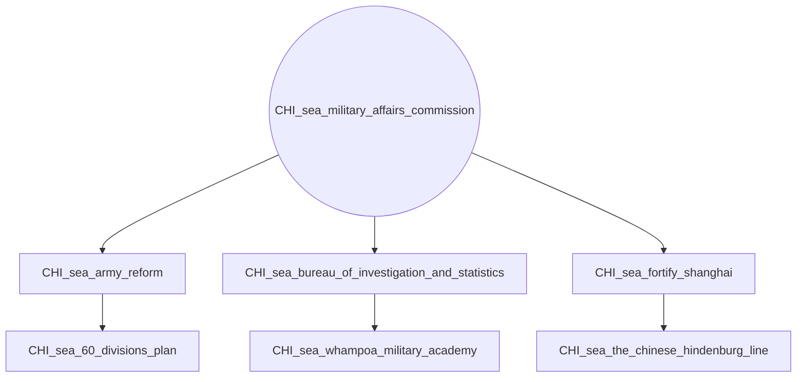
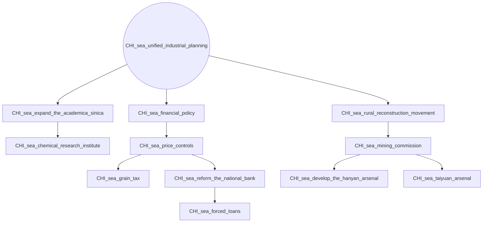
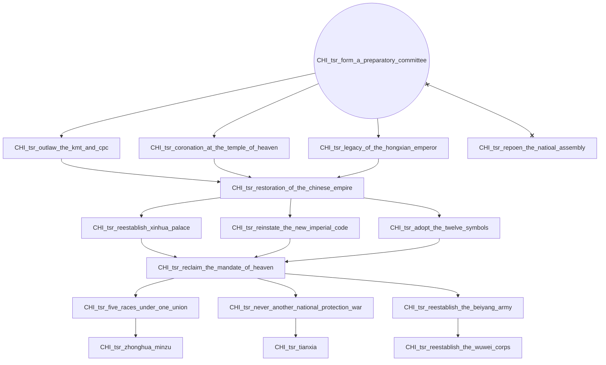
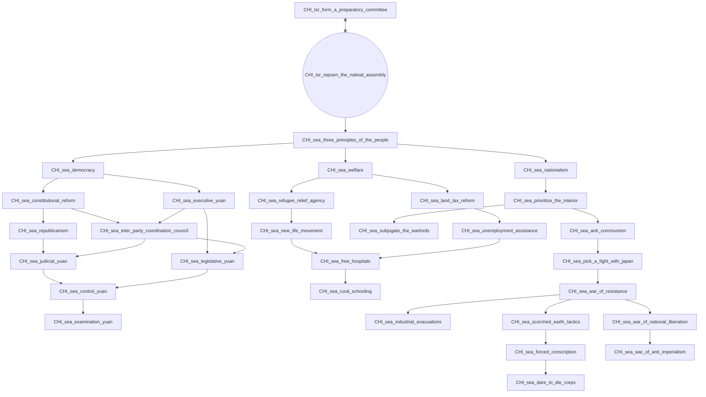
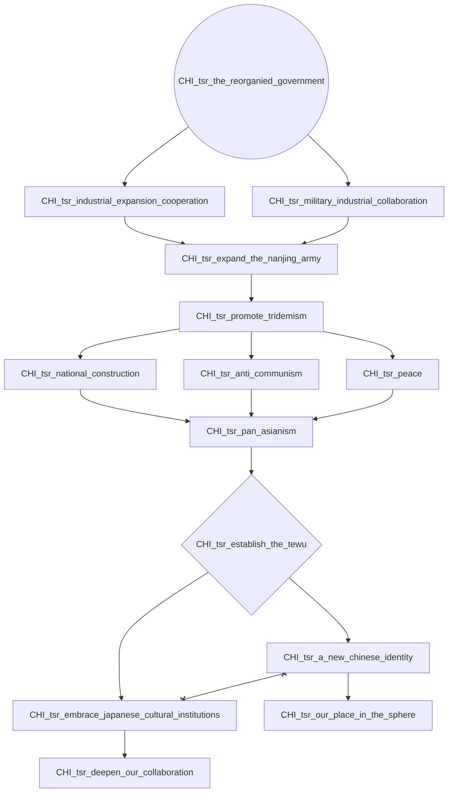

# CHI_sea_military_affairs_commission

# CHI_sea_unified_industrial_planning

# CHI_tsr_form_a_preparatory_committee

# CHI_tsr_repoen_the_natioal_assembly

# CHI_tsr_the_reorganied_government

