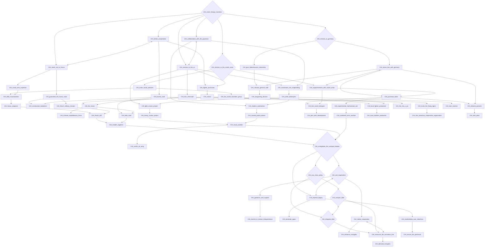

# CHI_invite_foreign_investors

```mermaid
flowchart TD
    n1{"CHI_anti_imperialism"}
    n2["CHI_british_cooperation"]
    n3["CHI_burma_road"]
    n4["CHI_camco"]
    n5["CHI_carrier_air_wing"]
    n6["CHI_chinese_expeditionary_force"]
    n7["CHI_chinese_general_staff"]
    n8["CHI_chinese_panzers"]
    n9["CHI_closer_ties_with_germany"]
    n10["CHI_coastal_patrol_planes"]
    n11["CHI_collaboration_with_the_japanese"]
    n12["CHI_combined_arms_warfare"]
    n13["CHI_commit_to_korean_independence"]
    n14{"CHI_conquer_tibet"}
    n15["CHI_construction_battalions"]
    n16["CHI_demand_mongolia"]
    n17["CHI_dominate_japan"]
    n18["CHI_elite_mountaineers"]
    n19["CHI_experimental_mechanised_unit"]
    n20["CHI_fighter_purchases"]
    n21["CHI_french_drill"]
    n22["CHI_french_military_mission"]
    n23["CHI_give_falkenhausen_citizenship"]
    n24["CHI_guarantee_the_hanoi_route"]
    n25["CHI_guidance_and_support"]
    n26["CHI_heavy_cruiser_project"]
    n27["CHI_heavy_weapons"]
    n28["CHI_hire_chennault"]
    n29["CHI_hire_soviet_designer"]
    n30["CHI_imperial_legacy"]
    n31["CHI_indian_cooperation"]
    n32["CHI_influence_mongolia"]
    n33{"CHI_integrate_tibet"}
    n34["CHI_investment_into_shipbuilding"]
    n35{"CHI_invite_foreign_investors"}
    n36["CHI_invite_soviet_advisers"]
    n37["CHI_invite_the_flying_tigers"]
    n38["CHI_joint_tank_development"]
    n39["CHI_ledo_road"]
    n40["CHI_light_cruiser_project"]
    n41["CHI_local_bomber_production"]
    n42["CHI_local_fighter_production"]
    n43{"CHI_mission_to_germany"}
    n44{"CHI_mission_to_the_soviet_union"}
    n45["CHI_mission_to_the_us"]
    n46["CHI_modern_logistics"]
    n47["CHI_modern_submarines"]
    n48["CHI_naval_aviation"]
    n49{"CHI_one_china_policy"}
    n50["CHI_order_destroyers"]
    n51["CHI_overlordship_over_indochina"]
    n52["CHI_purchase_tanks"]
    n53["CHI_rapprochement_with_soviet_union"]
    n54["CHI_reach_out_to_france"]
    n55{"CHI_renegotiate_the_unequal_treaties"}
    n56["CHI_renounce_the_mcmahon_line"]
    n57["CHI_secure_the_peninsula"]
    n58["CHI_sino_american_cooperative_organization"]
    n59["CHI_small_arms_expertise"]
    n60["CHI_tank_plant"]
    n61["CHI_the_chu_x_po"]
    n62["CHI_the_hump"]
    n63["CHI_the_soviet_volunteer_group"]
    n64["CHI_train_marines"]
    n65["CHI_wargaming_division"]
    n55 --> n1
    n35 --> n2
    n2 --> n3
    n20 --> n4
    n48 --> n5
    n62 --> n6
    n23 --> n7
    n9 --> n7
    n52 --> n8
    n9 --> n8
    n43 --> n9
    n47 --> n10
    n35 --> n11
    n19 --> n12
    n25 --> n13
    n49 --> n14
    n24 --> n15
    n3 --> n15
    n56 --> n16
    n30 --> n17
    n36 --> n18
    n59 --> n18
    n52 --> n19
    n2 --> n20
    n45 --> n20
    n27 --> n21
    n22 --> n21
    n24 --> n22
    n43 --> n23
    n54 --> n24
    n1 --> n25
    n40 --> n26
    n18 --> n27
    n45 --> n28
    n52 --> n29
    n53 --> n29
    n55 --> n30
    n1 --> n31
    n31 --> n32
    n49 --> n33
    n45 --> n34
    n11 --> n34
    n44 --> n36
    n28 --> n37
    n29 --> n38
    n3 --> n39
    n62 --> n39
    n45 --> n40
    n50 --> n40
    n42 --> n41
    n3 --> n42
    n4 --> n42
    n35 --> n43
    n35 --> n44
    n35 --> n45
    n21 --> n46
    n39 --> n46
    n11 --> n47
    n50 --> n47
    n26 --> n48
    n10 --> n48
    n55 --> n49
    n34 --> n50
    n30 --> n51
    n9 --> n52
    n53 --> n52
    n44 --> n53
    n35 --> n54
    n46 --> n55
    n12 --> n55
    n48 --> n55
    n33 --> n56
    n14 --> n56
    n51 --> n57
    n37 --> n58
    n54 --> n59
    n8 --> n60
    n4 --> n61
    n4 --> n62
    n28 --> n62
    n36 --> n63
    n50 --> n64
    n7 --> n65
    n1 x--x n30
    n2 x--x n54
    n9 x--x n53
    n11 x--x n45
    n14 x--x n33
    n31 x--x n56
```
