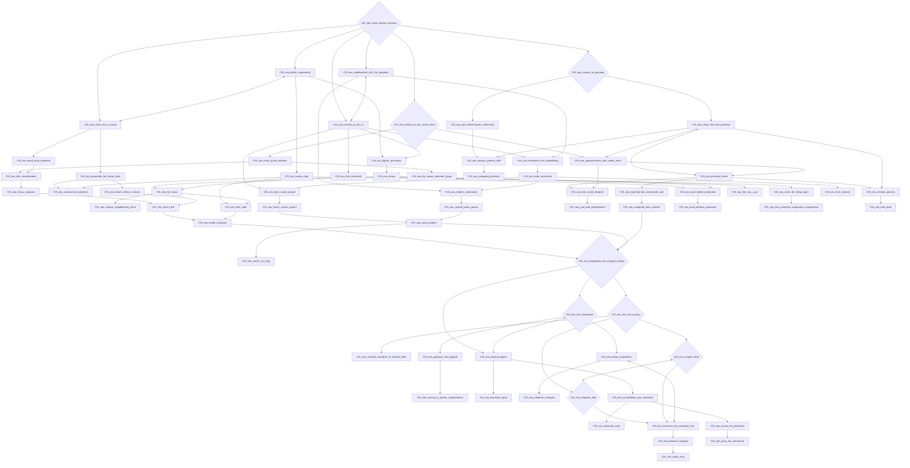

# CHI_sea_invite_foreign_investors

```mermaid
flowchart TD
    n1["CHI_ncns_request_handover_of_coastal_cities"]
    n2["CHI_sea_annex_tuva"]
    n3{"CHI_sea_anti_imperialism"}
    n4["CHI_sea_british_cooperation"]
    n5["CHI_sea_burma_road"]
    n6["CHI_sea_camco"]
    n7["CHI_sea_carrier_air_wing"]
    n8["CHI_sea_chinese_expeditionary_force"]
    n9["CHI_sea_chinese_general_staff"]
    n10["CHI_sea_chinese_panzers"]
    n11["CHI_sea_closer_ties_with_germany"]
    n12["CHI_sea_coastal_patrol_planes"]
    n13["CHI_sea_collaboration_with_the_japanese"]
    n14["CHI_sea_combined_arms_warfare"]
    n15["CHI_sea_commit_to_korean_independence"]
    n16{"CHI_sea_conquer_tibet"}
    n17["CHI_sea_construction_battalions"]
    n18["CHI_sea_demand_mongolia"]
    n19["CHI_sea_dominate_japan"]
    n20["CHI_sea_dominate_siam"]
    n21["CHI_sea_elite_mountaineers"]
    n22["CHI_sea_experimental_mechanised_unit"]
    n23["CHI_sea_fighter_purchases"]
    n24["CHI_sea_french_drill"]
    n25["CHI_sea_french_military_mission"]
    n26["CHI_sea_give_falkenhausen_citizenship"]
    n27["CHI_sea_guarantee_the_hanoi_route"]
    n28["CHI_sea_guidance_and_support"]
    n29["CHI_sea_heavy_cruiser_project"]
    n30["CHI_sea_heavy_weapons"]
    n31["CHI_sea_hire_chennault"]
    n32["CHI_sea_hire_soviet_designer"]
    n33["CHI_sea_imperial_legacy"]
    n34["CHI_sea_indian_cooperation"]
    n35["CHI_sea_influence_mongolia"]
    n36{"CHI_sea_integrate_tibet"}
    n37["CHI_sea_investment_into_shipbuilding"]
    n38{"CHI_sea_invite_foreign_investors"}
    n39["CHI_sea_invite_soviet_advisers"]
    n40["CHI_sea_invite_the_flying_tigers"]
    n41["CHI_sea_joint_tank_development"]
    n42["CHI_sea_ledo_road"]
    n43["CHI_sea_light_cruiser_project"]
    n44["CHI_sea_local_bomber_production"]
    n45["CHI_sea_local_fighter_production"]
    n46{"CHI_sea_mission_to_germany"}
    n47{"CHI_sea_mission_to_the_soviet_union"}
    n48["CHI_sea_mission_to_the_us"]
    n49["CHI_sea_modern_logistics"]
    n50["CHI_sea_modern_submarines"]
    n51["CHI_sea_naval_aviation"]
    n52{"CHI_sea_one_china_policy"}
    n53["CHI_sea_order_destroyers"]
    n54["CHI_sea_overlordship_over_indochina"]
    n55["CHI_sea_purchase_tanks"]
    n56["CHI_sea_push_into_manchuria"]
    n57["CHI_sea_rapprochement_with_soviet_union"]
    n58["CHI_sea_reach_out_to_france"]
    n59{"CHI_sea_renegotiate_the_unequal_treaties"}
    n60["CHI_sea_renounce_the_mcmahon_line"]
    n61["CHI_sea_secure_the_peninsula"]
    n62["CHI_sea_sino_american_cooperative_organization"]
    n63["CHI_sea_small_arms_expertise"]
    n64["CHI_sea_tank_plant"]
    n65["CHI_sea_the_chu_x_po"]
    n66["CHI_sea_the_hump"]
    n67["CHI_sea_the_soviet_volunteer_group"]
    n68["CHI_sea_train_marines"]
    n69["CHI_sea_wargaming_division"]
    n52 --> n1
    n18 --> n2
    n59 --> n3
    n38 --> n4
    n4 --> n5
    n23 --> n6
    n51 --> n7
    n66 --> n8
    n26 --> n9
    n11 --> n9
    n55 --> n10
    n11 --> n10
    n46 --> n11
    n50 --> n12
    n38 --> n13
    n22 --> n14
    n28 --> n15
    n52 --> n16
    n27 --> n17
    n5 --> n17
    n60 --> n18
    n33 --> n19
    n54 --> n20
    n39 --> n21
    n63 --> n21
    n55 --> n22
    n4 --> n23
    n48 --> n23
    n30 --> n24
    n25 --> n24
    n27 --> n25
    n46 --> n26
    n58 --> n27
    n3 --> n28
    n43 --> n29
    n21 --> n30
    n48 --> n31
    n55 --> n32
    n57 --> n32
    n59 --> n33
    n3 --> n34
    n34 --> n35
    n52 --> n36
    n48 --> n37
    n13 --> n37
    n47 --> n39
    n31 --> n40
    n32 --> n41
    n5 --> n42
    n66 --> n42
    n48 --> n43
    n53 --> n43
    n45 --> n44
    n5 --> n45
    n6 --> n45
    n38 --> n46
    n38 --> n47
    n38 --> n48
    n24 --> n49
    n42 --> n49
    n13 --> n50
    n53 --> n50
    n29 --> n51
    n12 --> n51
    n59 --> n52
    n37 --> n53
    n33 --> n54
    n11 --> n55
    n57 --> n55
    n61 --> n56
    n47 --> n57
    n38 --> n58
    n49 --> n59
    n14 --> n59
    n51 --> n59
    n36 --> n60
    n16 --> n60
    n54 --> n61
    n40 --> n62
    n58 --> n63
    n10 --> n64
    n6 --> n65
    n6 --> n66
    n31 --> n66
    n39 --> n67
    n53 --> n68
    n9 --> n69
    n3 x--x n33
    n4 x--x n58
    n11 x--x n57
    n13 x--x n48
    n16 x--x n36
    n34 x--x n60
```
