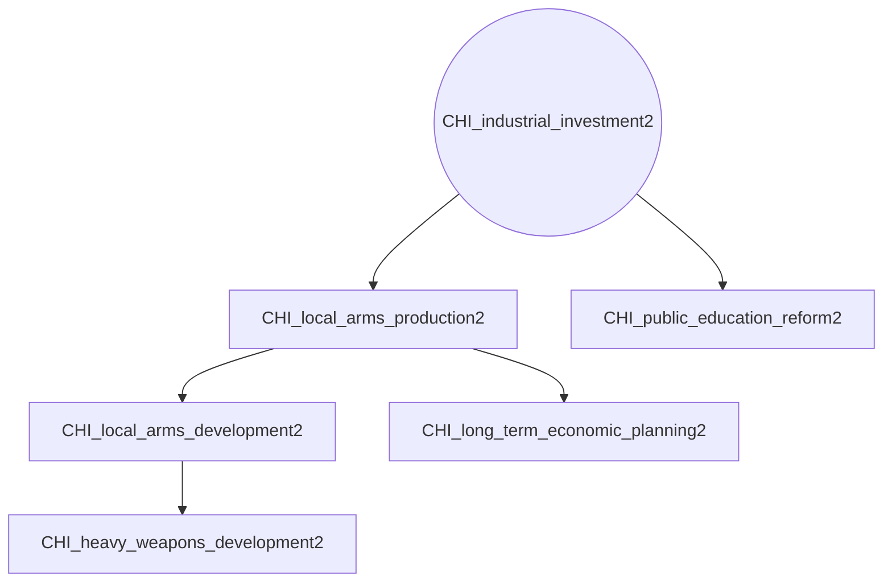
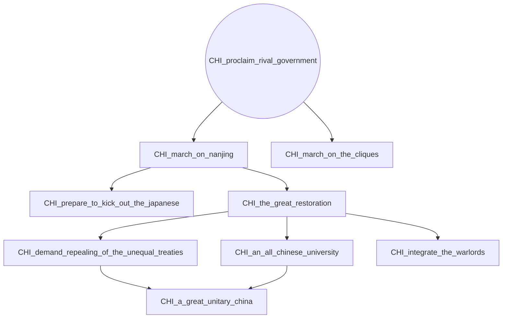
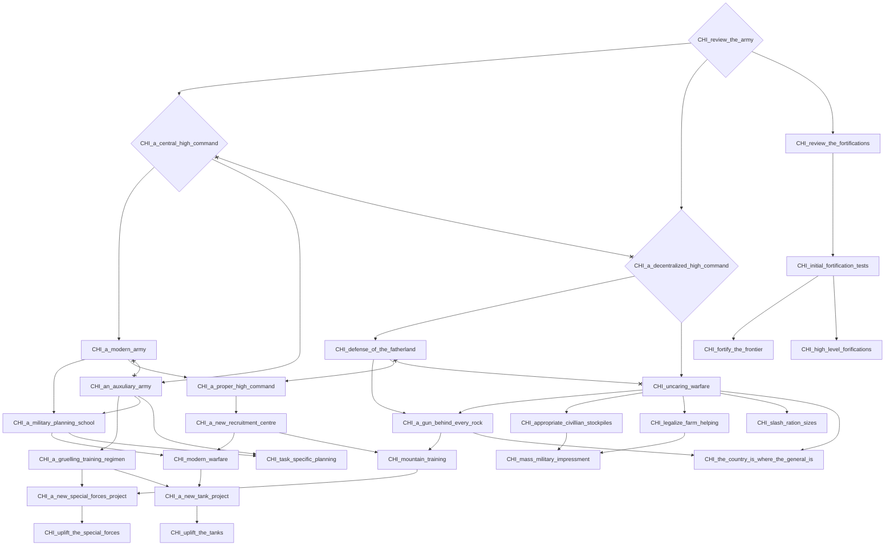
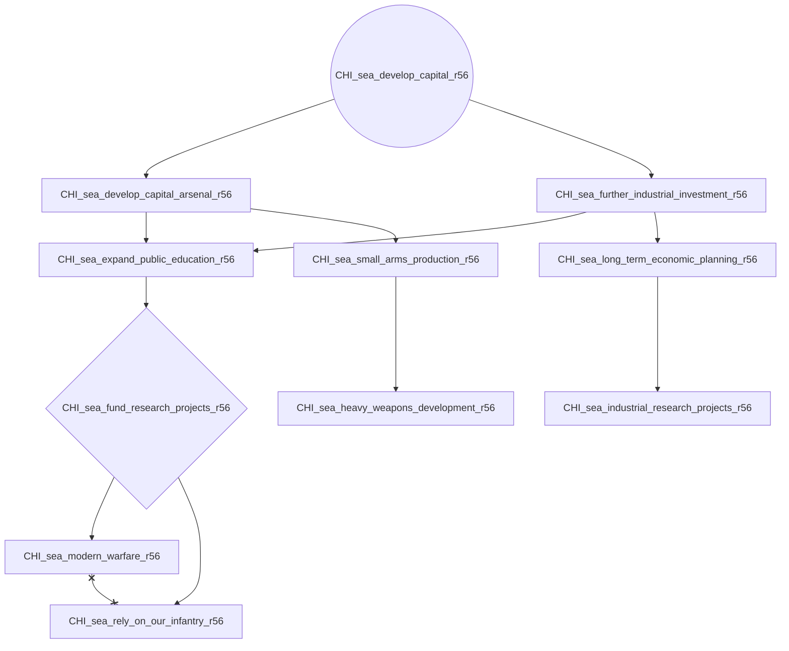
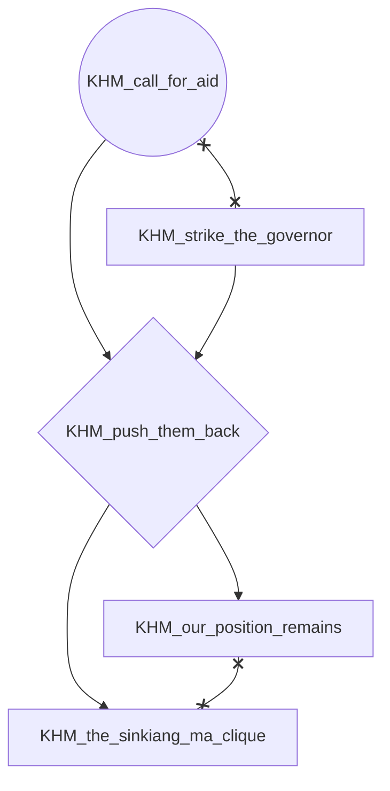
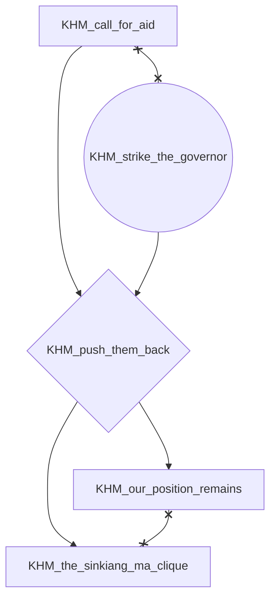

# CHI_industrial_investment2



# CHI_maintain_the_status_quo

```mermaid
flowchart TD
    n7["CHI_a_concerted_effort_to_the_japanese_sphere"]
    n8["CHI_a_grand_army_for_the_warlord"]
    n9["CHI_allow_civillian_pillaging"]
    n10{"CHI_an_oath_of_loyalty"}
    n11["CHI_bribe_chinese_officials"]
    n12["CHI_centralise_authority_around_the_warlord"]
    n13["CHI_contacts_in_the_roc"]
    n14{"CHI_cooperation_with_the_nationalists"}
    n15["CHI_denounce_the_japanese_empire"]
    n16{"CHI_maintain_the_status_quo"}
    n17{"CHI_mass_drug_export"}
    n18["CHI_proliferate_the_chinese_drug_trade"]
    n19["CHI_recruit_the_disenfanchised"]
    n20["CHI_request_kmt_protection"]
    n21["CHI_secure_internal_politics2"]
    n22["CHI_secure_kmt_funds"]
    n23["CHI_seize_assets_for_the_military"]
    n24["CHI_seize_chinese_assets"]
    n25["CHI_seize_japanese_assets"]
    n26["CHI_seize_western_assets"]
    n27["CHI_siphon_local_trade"]
    n28["KHM_expand_the_madrasas"]
    n29["KHM_indian_expeditionary_forces_plan"]
    n30["KHM_promote_anti_communism"]
    n31["KHM_raise_additional_dungan_regiments"]
    n32["SIC_anti_communism"]
    n33["SIC_armor_efforts"]
    n34["SIC_develop_chongqing"]
    n35["SIC_develop_xikang"]
    n36["SIC_drive_out_the_japanese"]
    n37["SIC_push_back_the_tibetans"]
    n38["SIC_sichuan_still_stands"]
    n39["SIC_the_armies_of_yang_sen"]
    n40["SIC_the_domain_of_liu_wenhui"]
    n41["SIC_the_governor_of_sichuan"]
    n42["SIC_the_sichuan_clique"]
    n43["SIK_a_new_nationality_policy"]
    n44["SIK_a_new_xinjiang"]
    n45["SIK_a_soviet_airforce"]
    n46["SIK_a_united_sinkiang_clique"]
    n47["SIK_cooperate_with_the_nkvd"]
    n48["SIK_cooperate_with_the_ussr"]
    n49["SIK_ensure_a_clean_government"]
    n50["SIK_establish_the_xinjiangneft"]
    n51["SIK_invest_in_the_dushanzi_oil_fields"]
    n52{"SIK_king_of_sinkiang"}
    n53{"SIK_march_into_khotan"}
    n54["SIK_military_cooperation"]
    n55["SIK_office_of_sinkiang_border_commissioner"]
    n56["SIK_protector_of_the_kyrgiz"]
    n57["SIK_pursue_further_soviet_integration"]
    n58["SIK_reaffirm_soviet_connections"]
    n59["SIK_reestablish_the_guominjun"]
    n60["SIK_rejoin_the_central_government"]
    n61["SIK_settle_dzungarian_tribes"]
    n62["SIK_six_great_policies"]
    n63["SIK_soviet_intervention"]
    n64["SIK_three_year_plan_for_reconstruction"]
    n65["SIK_transformation_of_nature"]
    n66["SIK_utilize_asperovs_contacts"]
    n67["XIC_a_new_path_for_china_r56"]
    n68["XIC_anti_japanese_national_salvation_agreement"]
    n69{"XIC_consolidate_authority_in_shaanxi_r56"}
    n70["XIC_discussions_in_luochuan"]
    n71["XIC_finish_the_encirclement_campaign_r56"]
    n72{"XIC_force_an_end_to_the_fighting_r56"}
    n73["XIC_form_the_anti_japanese_comrades_association"]
    n74["XIC_invite_chiang_for_troop_inspections"]
    n75["XIC_invite_zuolin_loyalsits"]
    n76["XIC_non_agression_pact_with_the_cpc"]
    n77["XIC_reclaim_the_lost_birthright"]
    n78["XIC_recruit_mancurian_bandits"]
    n79["XIC_reestablish_the_zhili_army"]
    n80["XIC_request_relocation_to_northeastern_command"]
    n81["XIC_restore_the_glory_of_the_fengtian_army"]
    n82["XIC_restore_the_homeland"]
    n83["XIC_return_to_nanjing_r56"]
    n84["XIC_revive_the_beiyang_government"]
    n85["XIC_send_a_representative_to_sheng_shicai"]
    n86["XIC_sixth_encirclement_campaign"]
    n87["XIC_synthesis_with_the_communists_r56"]
    n88["XIC_the_fushi_conference"]
    n89["XIC_towards_peace_across_china_r56"]
    n90["XIC_withdraw_forces_from_yanan"]
    n91["XSM_a_hui_army"]
    n92["XSM_ma_qis_natural_successor"]
    n93["XSM_rebuild_the_ninghai_army"]
    n94["XSM_recruit_salar_officers"]
    n95["XSM_send_ma_lin_on_hajj"]
    n96["XSM_solidifying_control"]
    n97["XSM_sway_the_people"]
    n98{"XSM_sweep_out_communists"}
    n99["XSM_the_civilian_governor_remains"]
    n100["XSM_the_military_governor"]
    n101["YUN_a_land_of_mountains"]
    n102["YUN_eduational_reforms"]
    n103["YUN_expand_local_infrastructure"]
    n104["YUN_political_reforms"]
    n105["YUN_rally_around_long_yun"]
    n106["YUN_strengthen_burmic_ties"]
    n107["YUN_strive_for_self_sufficiency"]
    n108["YUN_the_democratic_fortress"]
    n109["r56_XSM_a_united_ma_state"]
    n110["r56_XSM_demand_submission"]
    n111["r56_XSM_sideline_family_conflicts"]
    n112{"r56_XSM_strengthening_our_position"}
    n113["r56_XSM_strike_at_the_detractors"]
    n17 --> n7
    n19 --> n8
    n10 --> n8
    n16 --> n9
    n15 --> n10
    n12 --> n10
    n16 --> n11
    n16 --> n12
    n16 --> n13
    n16 --> n15
    n27 --> n17
    n13 --> n17
    n17 --> n18
    n23 --> n19
    n16 --> n20
    n20 --> n22
    n9 --> n23
    n10 --> n24
    n15 --> n25
    n12 --> n26
    n16 --> n27
    n111 --> n28
    n111 --> n29
    n28 --> n30
    n30 --> n31
    n39 --> n32
    n34 --> n33
    n41 --> n34
    n40 --> n35
    n32 --> n36
    n35 --> n37
    n33 --> n38
    n42 --> n39
    n42 --> n40
    n42 --> n41
    n14 --> n42
    n16 --> n42
    n46 --> n43
    n57 --> n43
    n64 --> n44
    n47 --> n44
    n54 --> n45
    n53 --> n46
    n66 --> n47
    n16 --> n48
    n63 --> n49
    n57 --> n49
    n48 --> n50
    n50 --> n51
    n46 --> n52
    n43 --> n52
    n54 --> n53
    n55 --> n53
    n48 --> n54
    n16 --> n55
    n63 --> n56
    n53 --> n57
    n52 --> n58
    n52 --> n59
    n52 --> n60
    n46 --> n61
    n55 --> n62
    n53 --> n63
    n66 --> n64
    n63 --> n65
    n57 --> n65
    n44 --> n65
    n48 --> n66
    n69 --> n67
    n88 --> n68
    n71 --> n69
    n16 --> n70
    n14 --> n70
    n16 --> n71
    n14 --> n71
    n89 --> n72
    n68 --> n73
    n73 --> n74
    n90 --> n74
    n80 --> n75
    n70 --> n76
    n81 --> n77
    n79 --> n78
    n80 --> n79
    n86 --> n80
    n79 --> n81
    n75 --> n81
    n77 --> n82
    n72 --> n83
    n69 --> n83
    n82 --> n84
    n70 --> n85
    n16 --> n86
    n14 --> n86
    n72 --> n87
    n76 --> n88
    n85 --> n88
    n16 --> n89
    n14 --> n89
    n68 --> n90
    n100 --> n91
    n99 --> n92
    n96 --> n93
    n95 --> n94
    n98 --> n95
    n99 --> n96
    n95 --> n96
    n100 --> n97
    n97 --> n98
    n91 --> n98
    n98 --> n99
    n16 --> n100
    n14 --> n100
    n105 --> n101
    n104 --> n102
    n107 --> n102
    n105 --> n103
    n101 --> n104
    n16 --> n105
    n14 --> n105
    n108 --> n106
    n103 --> n107
    n102 --> n108
    n110 --> n109
    n113 --> n109
    n112 --> n110
    n16 --> n111
    n111 --> n112
    n112 --> n113
    n7 x--x n18
    n16 x--x n21
    n20 x--x n24
    n46 x--x n57
    n46 x--x n63
    n57 x--x n63
    n58 x--x n59
    n58 x--x n60
    n59 x--x n60
    n67 x--x n83
    n67 x--x n87
    n70 x--x n86
    n71 x--x n89
    n83 x--x n87
    n95 x--x n99
    n110 x--x n113
```



# CHI_proclaim_rival_government



# CHI_review_the_army



# CHI_sea_develop_capital_r56



# CHI_secure_internal_politics2

```mermaid
flowchart TD
    n162["CHI_a_bulwark_of_defense"]
    n163["CHI_a_cleansing_of_the_new_state"]
    n164["CHI_a_coalition_gov_for_national_survival"]
    n165["CHI_a_constitutional_monarchy"]
    n166["CHI_a_declaration_from_the_clergy"]
    n167["CHI_a_declaration_of_statehood"]
    n168["CHI_a_final_blow_to_the_kmt"]
    n169["CHI_a_final_warning"]
    n170["CHI_a_friendship_with_the_warlords"]
    n171["CHI_a_god_honorig_legal_code"]
    n172["CHI_a_great_purge"]
    n173["CHI_a_great_turkestan"]
    n174["CHI_a_japanese_national_government"]
    n175["CHI_a_largescale_economy"]
    n176["CHI_a_model_province_indeed"]
    n177["CHI_a_modern_economy"]
    n178["CHI_a_modern_national_army"]
    n179["CHI_a_modern_workplace"]
    n180["CHI_a_national_chinese_empire"]
    n181["CHI_a_new_alternative_form_of_nationalism"]
    n182["CHI_a_new_chinese_empire"]
    n183["CHI_a_new_federalist_national_government"]
    n184["CHI_a_new_peoples_republic"]
    n185["CHI_a_new_republic"]
    n186["CHI_a_new_socalled_religion"]
    n187["CHI_a_place_in_the_comintern"]
    n188["CHI_a_radical_hui"]
    n189["CHI_a_religion_of_peace"]
    n190["CHI_a_soviet_tank_advisors"]
    n191["CHI_a_time_for_integration"]
    n192["CHI_a_true_chinese_republic"]
    n193["CHI_a_turkestani_national_state"]
    n194["CHI_a_unitary_education"]
    n195["CHI_a_victory_for_islam"]
    n196{"CHI_abandon_china"}
    n197["CHI_absolute_obedience"]
    n198["CHI_additional_gongchang"]
    n199["CHI_adopt_the_penal_code"]
    n200["CHI_advanced_metal_extraction"]
    n201{"CHI_alignment_with_the_kmt"}
    n202["CHI_american_money"]
    n203["CHI_an_alliance_with_the_rightists"]
    n204{"CHI_an_alternative_to_the_KMT"}
    n205["CHI_an_alternative_to_the_two"]
    n206["CHI_an_appeal_for_autonomy"]
    n207["CHI_an_economy_for_the_proletariat"]
    n208["CHI_an_enabling_act"]
    n209["CHI_an_integritable_workforce"]
    n210["CHI_an_islamic_state"]
    n211["CHI_an_olive_branch_to_the_communists"]
    n212["CHI_an_organized_resistance_militia"]
    n213["CHI_announce_full_communism"]
    n214["CHI_anti_KMT_propaganda"]
    n215["CHI_appropriate_the_fuhrerprinzip"]
    n216["CHI_army_reform"]
    n217["CHI_arrest_kmt_officers"]
    n218["CHI_arrest_kmt_officials"]
    n219{"CHI_assemble_the_regency_council"}
    n220{"CHI_autonomy_for_the_fractured_states"}
    n221["CHI_beacon_of_communism"]
    n222["CHI_beacon_of_federalism"]
    n223["CHI_beacon_of_socialism"]
    n224["CHI_begin_invitation_of_the_kwantung_army"]
    n225["CHI_begin_jihad_against_the_oppressors"]
    n226["CHI_begin_local_industrialisation"]
    n227["CHI_begin_operations"]
    n228["CHI_begin_preparations_for_jihad"]
    n229["CHI_begin_the_cultural_revolution"]
    n230["CHI_begin_the_desinofication_of_root"]
    n231["CHI_begin_the_quest_for_developental_aid"]
    n232["CHI_begin_the_war"]
    n233["CHI_break_the_back_of_the_kmt_forces"]
    n234["CHI_break_the_confucionists"]
    n235["CHI_break_the_kmt_stranglehold"]
    n236["CHI_british_money"]
    n237["CHI_cai"]
    n238["CHI_cater_to_the_past"]
    n239["CHI_chinese_defense_industry"]
    n240["CHI_christian_democracy"]
    n241["CHI_collapse_the_coalition"]
    n242["CHI_collect_funds_for_the_jihad"]
    n243["CHI_commander_political_training"]
    n244["CHI_commence_nra_takeover"]
    n245["CHI_communist_administrators2"]
    n246["CHI_consolidate_control_over_china"]
    n247["CHI_consolidate_imperial_power"]
    n248["CHI_consolidate_the_national_unity_government"]
    n249["CHI_construct_minarets"]
    n250{"CHI_convene_the_national_unity_congress"}
    n251["CHI_conversion_by_the_sword"]
    n252["CHI_cooperation_with_the_communists"]
    n14{"CHI_cooperation_with_the_nationalists"}
    n253["CHI_core_tenants_of_the_faith"]
    n254["CHI_crackdown_on_the_kmt"]
    n255["CHI_crush_the_farmers"]
    n256["CHI_crush_the_workers"]
    n257["CHI_dabble_in_the_opium_trade"]
    n258["CHI_deal_with_anti_japanese_hatred"]
    n259["CHI_declare_victory_over_the_fiends"]
    n260["CHI_demand_transferance_of_national_power"]
    n261["CHI_demand_workplace_integrity"]
    n262{"CHI_democratic_centralism"}
    n263["CHI_denounce_the_roc"]
    n264["CHI_destroy_foreign_thought"]
    n265["CHI_devolop_a_cult_of_personality"]
    n266["CHI_display_the_cruelty_of_chaing_and_mao"]
    n267["CHI_donations_for_the_national_army"]
    n268["CHI_donations_for_the_welfare_of_the_people"]
    n269["CHI_drive_out_the_foreign_devils"]
    n270["CHI_economic_mobilization"]
    n271["CHI_eliminate_all_dissent"]
    n272["CHI_embrace_corruption"]
    n273["CHI_empower_party_democracy"]
    n274["CHI_empower_the_capitalists"]
    n275["CHI_empower_the_federal_states"]
    n276["CHI_empower_the_military"]
    n277["CHI_empower_the_regional_pla"]
    n278["CHI_enforce_local_military_budgets"]
    n279["CHI_enforce_loyalty_to_the_revolution"]
    n280["CHI_enforced_social_values"]
    n281["CHI_enshrine_the_national_savior"]
    n282["CHI_enshrine_the_yuan"]
    n283["CHI_entice_british_investments"]
    n284["CHI_envoy_to_germany"]
    n285["CHI_expand_regional_identity"]
    n286["CHI_extol_chinese_nationalism"]
    n287["CHI_federalism_the_savior_of_china"]
    n288["CHI_federalist_victory"]
    n289["CHI_finalize_the_gonglu"]
    n290{"CHI_fire_the_flames_of_islam"}
    n291["CHI_foster_a_chinese_volksgemeinschaft"]
    n292["CHI_free_china_from_imperialism"]
    n293["CHI_french_money"]
    n294["CHI_full_autarky"]
    n295{"CHI_full_control_over_the_apparatus_of_education"}
    n296["CHI_full_hezhong"]
    n297["CHI_full_membership_in_the_republic"]
    n298["CHI_fully_embrace_the_opium_trade"]
    n299["CHI_further_increase_resource_output"]
    n300["CHI_further_japanese_guns"]
    n301["CHI_government_of_national_salvation"]
    n302["CHI_guo"]
    n303["CHI_help_the_cim"]
    n304["CHI_hoist_the_red_flag"]
    n305["CHI_hold_free_elections"]
    n306["CHI_ideological_education2"]
    n307["CHI_implement_new_methods"]
    n308["CHI_import_western_technology"]
    n309["CHI_increase_metal_output"]
    n310["CHI_increase_workplace_efficiency"]
    n311["CHI_infiltrate_hui_communities"]
    n312["CHI_instate_sharia_law"]
    n313["CHI_invest_in_the_royal_army"]
    n314["CHI_investments_from_nanjing"]
    n315["CHI_japanese_military_support"]
    n316["CHI_japanese_money"]
    n317["CHI_join_the_chinese_soviet"]
    n318["CHI_join_the_republican_government"]
    n319["CHI_joint_ultimatum_to_prc"]
    n320["CHI_judiciary_reforms2"]
    n321["CHI_labor_reform2"]
    n322["CHI_land_redistribution2"]
    n323["CHI_land_value_tax2"]
    n324["CHI_land_value_tax_3"]
    n325["CHI_lay_claim_to_muslim_china"]
    n326["CHI_learn_from_the_maoists"]
    n327["CHI_lkmt_victory"]
    n328{"CHI_lobby_for_western_recognition"}
    n329["CHI_loyalty_has_its_rewards"]
    n16{"CHI_maintain_the_status_quo"}
    n330["CHI_make_a_detailed_home_plan"]
    n331["CHI_march_on_chaing"]
    n332["CHI_meet_with_the_army"]
    n333["CHI_military_training_in_japan"]
    n334["CHI_min"]
    n335["CHI_minzhu_minsheng"]
    n336["CHI_modern_innovations"]
    n337["CHI_modernize_the_armed_forces"]
    n338["CHI_national_defense_fund"]
    n339["CHI_national_defense_state"]
    n340["CHI_national_regeneration_league_victory"]
    n341["CHI_nationalist_socialist_indoctrination"]
    n342["CHI_nationalize_corrupt_buisnesses"]
    n343["CHI_nationalize_foreign_assets"]
    n344{"CHI_new_model_province2"}
    n345["CHI_one_china_two_systems"]
    n346["CHI_only_we_can_save_china"]
    n347["CHI_open_domestic_politics"]
    n348{"CHI_opposition"}
    n349["CHI_our_own_military"]
    n350["CHI_our_own_military_industrial_complex"]
    n351{"CHI_oust_KMT_influence"}
    n352["CHI_oust_kmt_troublemakers"]
    n353["CHI_party_founding_act"]
    n354["CHI_pillage_the_occupied_lands"]
    n355["CHI_preempt_corruption"]
    n356{"CHI_prepare_for_national_unification"}
    n357["CHI_prepare_for_national_unification2"]
    n358{"CHI_prepare_for_the_second_northern_expedition"}
    n359["CHI_prepare_for_the_three_year_plan"]
    n360["CHI_prepare_supply_lines"]
    n361["CHI_prepare_to_unite_the_kingdom"]
    n362["CHI_professionalize_the_army"]
    n363["CHI_professionalize_the_army_mp"]
    n364["CHI_project_gaosu_gonglu"]
    n365["CHI_project_gongchang"]
    n366["CHI_propaganda_against_the_kmt"]
    n367["CHI_provide_funds_for_local_infrastructure"]
    n368["CHI_province_work_force_conscription"]
    n369["CHI_public_works2"]
    n370["CHI_purge_the_decadence"]
    n371["CHI_purge_the_reactionary"]
    n372["CHI_question_of_the_constitution"]
    n373["CHI_question_of_the_system"]
    n374["CHI_radicalize_anti_japanese_retoric"]
    n375["CHI_radicalize_chinese_nationalism"]
    n376["CHI_ramp_up_anti_communist_retoric"]
    n377["CHI_reach_out_to_moscow"]
    n378["CHI_reach_out_to_nanjing"]
    n379["CHI_reach_out_to_the_local_elites"]
    n380["CHI_ready_the_army_of_jihad"]
    n381["CHI_reempower_religious_ideas"]
    n382["CHI_reinstate_the_jizya"]
    n383["CHI_reinvest_the_collectivisations"]
    n384["CHI_reinvigorate_the_national_economy"]
    n385["CHI_reorganize_the_party_along_lenninist_lines"]
    n386["CHI_republic_without_democracy"]
    n387["CHI_request_military_aid"]
    n388["CHI_request_official_recognition"]
    n389["CHI_resurrect_the_anti_chaing_coalition"]
    n390["CHI_rewrite_the_constitiution"]
    n391["CHI_royal_splendour"]
    n392["CHI_rural_militias2"]
    n393["CHI_sanchun"]
    n394["CHI_sanqiang"]
    n395["CHI_santong"]
    n396["CHI_secular_institutions"]
    n21{"CHI_secure_internal_politics2"}
    n397{"CHI_secure_warlord_support"}
    n398["CHI_seek_japanese_support"]
    n399{"CHI_seek_recognition_from_the_occident"}
    n400["CHI_seek_support_from_the_democrats"]
    n401["CHI_seize_merchant_property"]
    n402["CHI_seize_the_colonial_possessions"]
    n403["CHI_seize_the_mantle_of_national_governance"]
    n404["CHI_shaping_the_state_in_ones_own_image"]
    n405["CHI_sideline_the_radicals"]
    n406["CHI_socialism_not_communism"]
    n407["CHI_society_as_allah_ordained_it"]
    n408["CHI_stabilize_the_economy"]
    n409["CHI_stabilze_the_economy"]
    n410["CHI_staff_the_royal_court"]
    n411["CHI_state_atheism"]
    n412["CHI_state_confutionism"]
    n413["CHI_state_funding_for_religious_schools"]
    n414["CHI_state_owned_corporations"]
    n415["CHI_strengthen_the_conservatives"]
    n416["CHI_strengthen_the_radicals"]
    n417["CHI_strike_forth"]
    n418["CHI_submit_to_tokyo"]
    n419["CHI_support_chinese_religion"]
    n420["CHI_supreme_leader_of_all_china"]
    n421["CHI_swap_out_non_hui_nobility"]
    n422["CHI_synthetic_oil_production"]
    n423["CHI_take_leadership_of_islam"]
    n424["CHI_technological_cooperation2"]
    n425["CHI_the_caliphate_of_china"]
    n426["CHI_the_fate_of_the_overrun_lands"]
    n427{"CHI_the_jihad_successfull"}
    n428["CHI_the_national_unity_government"]
    n429["CHI_the_revolution_successfull"]
    n430["CHI_the_second_thrid_congress_of_the_kmt"]
    n431["CHI_the_territories_to_free"]
    n432["CHI_the_three_principles_of_the_nation"]
    n433["CHI_the_warlord_stays"]
    n434["CHI_there_is_only_one_language_chaing_speaks"]
    n435["CHI_total_mobilization_for_the_emporer"]
    n436["CHI_totaltarianism_after_allahs_word"]
    n437["CHI_train_everywhere_always"]
    n438["CHI_transfer_factories_to_the_proletariat"]
    n439["CHI_troops_for_mao"]
    n440["CHI_ultimatum_to_the_warlord"]
    n441["CHI_unbridled_capitalism"]
    n442["CHI_undo_the_damage_of_the_cim"]
    n443["CHI_unite_the_province"]
    n444["CHI_upgrade_the_gonglu"]
    n445["CHI_use_anti_chinese_intel_from_japan"]
    n446["CHI_wang"]
    n447["CHI_wen"]
    n448{"CHI_western_victory"}
    n449["CHI_work_out_provincial_workforce_regulations"]
    n450["CHI_wu"]
    n451["CHI_xie"]
    n452["CHI_xin"]
    n453["CHI_zhi"]
    n32["SIC_anti_communism"]
    n33["SIC_armor_efforts"]
    n34["SIC_develop_chongqing"]
    n35["SIC_develop_xikang"]
    n36["SIC_drive_out_the_japanese"]
    n37["SIC_push_back_the_tibetans"]
    n38["SIC_sichuan_still_stands"]
    n39["SIC_the_armies_of_yang_sen"]
    n40["SIC_the_domain_of_liu_wenhui"]
    n41["SIC_the_governor_of_sichuan"]
    n42["SIC_the_sichuan_clique"]
    n67["XIC_a_new_path_for_china_r56"]
    n68["XIC_anti_japanese_national_salvation_agreement"]
    n69{"XIC_consolidate_authority_in_shaanxi_r56"}
    n70["XIC_discussions_in_luochuan"]
    n71["XIC_finish_the_encirclement_campaign_r56"]
    n72{"XIC_force_an_end_to_the_fighting_r56"}
    n73["XIC_form_the_anti_japanese_comrades_association"]
    n74["XIC_invite_chiang_for_troop_inspections"]
    n75["XIC_invite_zuolin_loyalsits"]
    n76["XIC_non_agression_pact_with_the_cpc"]
    n77["XIC_reclaim_the_lost_birthright"]
    n78["XIC_recruit_mancurian_bandits"]
    n79["XIC_reestablish_the_zhili_army"]
    n80["XIC_request_relocation_to_northeastern_command"]
    n81["XIC_restore_the_glory_of_the_fengtian_army"]
    n82["XIC_restore_the_homeland"]
    n83["XIC_return_to_nanjing_r56"]
    n84["XIC_revive_the_beiyang_government"]
    n85["XIC_send_a_representative_to_sheng_shicai"]
    n86["XIC_sixth_encirclement_campaign"]
    n87["XIC_synthesis_with_the_communists_r56"]
    n88["XIC_the_fushi_conference"]
    n89["XIC_towards_peace_across_china_r56"]
    n90["XIC_withdraw_forces_from_yanan"]
    n91["XSM_a_hui_army"]
    n92["XSM_ma_qis_natural_successor"]
    n93["XSM_rebuild_the_ninghai_army"]
    n94["XSM_recruit_salar_officers"]
    n95["XSM_send_ma_lin_on_hajj"]
    n96["XSM_solidifying_control"]
    n97["XSM_sway_the_people"]
    n98{"XSM_sweep_out_communists"}
    n99["XSM_the_civilian_governor_remains"]
    n100["XSM_the_military_governor"]
    n101["YUN_a_land_of_mountains"]
    n102["YUN_eduational_reforms"]
    n103["YUN_expand_local_infrastructure"]
    n104["YUN_political_reforms"]
    n105["YUN_rally_around_long_yun"]
    n106["YUN_strengthen_burmic_ties"]
    n107["YUN_strive_for_self_sufficiency"]
    n108["YUN_the_democratic_fortress"]
    n14 --> n162
    n218 --> n163
    n217 --> n163
    n356 --> n164
    n219 --> n165
    n391 --> n166
    n254 --> n166
    n285 --> n167
    n166 --> n168
    n318 --> n169
    n389 --> n170
    n253 --> n171
    n252 --> n172
    n427 --> n173
    n418 --> n174
    n198 --> n175
    n289 --> n176
    n175 --> n176
    n179 --> n176
    n422 --> n176
    n283 --> n177
    n270 --> n178
    n336 --> n178
    n307 --> n179
    n451 --> n180
    n302 --> n180
    n447 --> n180
    n218 --> n181
    n217 --> n181
    n167 --> n181
    n219 --> n182
    n250 --> n182
    n275 --> n183
    n404 --> n184
    n399 --> n185
    n328 --> n185
    n234 --> n186
    n442 --> n186
    n319 --> n187
    n213 --> n187
    n311 --> n188
    n366 --> n188
    n290 --> n189
    n387 --> n190
    n14 --> n191
    n204 --> n192
    n230 --> n193
    n436 --> n194
    n199 --> n194
    n227 --> n195
    n351 --> n196
    n172 --> n197
    n365 --> n198
    n312 --> n199
    n309 --> n200
    n189 --> n201
    n231 --> n202
    n389 --> n203
    n348 --> n204
    n266 --> n205
    n275 --> n206
    n350 --> n207
    n340 --> n208
    n261 --> n209
    n427 --> n210
    n389 --> n211
    n225 --> n212
    n262 --> n213
    n353 --> n214
    n446 --> n215
    n334 --> n215
    n239 --> n216
    n344 --> n216
    n235 --> n217
    n235 --> n218
    n381 --> n219
    n374 --> n219
    n183 --> n220
    n438 --> n221
    n279 --> n221
    n296 --> n222
    n449 --> n222
    n226 --> n222
    n414 --> n223
    n282 --> n223
    n398 --> n224
    n290 --> n225
    n367 --> n226
    n325 --> n227
    n425 --> n228
    n210 --> n228
    n173 --> n228
    n193 --> n228
    n452 --> n229
    n453 --> n229
    n447 --> n229
    n332 --> n230
    n167 --> n230
    n448 --> n231
    n384 --> n231
    n431 --> n232
    n212 --> n233
    n366 --> n233
    n229 --> n234
    n285 --> n235
    n231 --> n236
    n394 --> n237
    n204 --> n238
    n344 --> n239
    n162 --> n239
    n448 --> n240
    n164 --> n241
    n228 --> n242
    n408 --> n242
    n162 --> n243
    n243 --> n244
    n362 --> n244
    n323 --> n245
    n174 --> n246
    n410 --> n247
    n412 --> n247
    n428 --> n248
    n417 --> n249
    n375 --> n250
    n374 --> n250
    n271 --> n251
    n382 --> n251
    n351 --> n252
    n21 --> n14
    n240 --> n253
    n247 --> n254
    n263 --> n254
    n376 --> n255
    n255 --> n256
    n272 --> n257
    n163 --> n258
    n330 --> n259
    n232 --> n259
    n220 --> n260
    n355 --> n261
    n385 --> n262
    n182 --> n263
    n165 --> n263
    n269 --> n264
    n204 --> n265
    n376 --> n266
    n291 --> n267
    n356 --> n267
    n291 --> n268
    n229 --> n269
    n451 --> n269
    n337 --> n270
    n436 --> n271
    n344 --> n272
    n415 --> n273
    n416 --> n273
    n396 --> n274
    n288 --> n275
    n415 --> n276
    n197 --> n277
    n367 --> n278
    n213 --> n279
    n199 --> n280
    n163 --> n281
    n181 --> n281
    n406 --> n282
    n391 --> n283
    n335 --> n284
    n196 --> n285
    n385 --> n286
    n292 --> n287
    n305 --> n288
    n444 --> n289
    n196 --> n290
    n14 --> n290
    n342 --> n291
    n341 --> n291
    n169 --> n292
    n231 --> n293
    n237 --> n294
    n262 --> n295
    n275 --> n296
    n317 --> n297
    n257 --> n298
    n441 --> n299
    n224 --> n300
    n376 --> n301
    n395 --> n302
    n171 --> n303
    n416 --> n304
    n214 --> n305
    n372 --> n305
    n322 --> n306
    n310 --> n307
    n409 --> n308
    n359 --> n309
    n359 --> n310
    n225 --> n311
    n427 --> n312
    n391 --> n313
    n14 --> n314
    n316 --> n315
    n224 --> n315
    n398 --> n316
    n320 --> n317
    n245 --> n317
    n260 --> n318
    n296 --> n318
    n388 --> n319
    n306 --> n320
    n369 --> n321
    n252 --> n322
    n322 --> n323
    n213 --> n324
    n406 --> n324
    n421 --> n325
    n440 --> n325
    n317 --> n326
    n305 --> n327
    n390 --> n328
    n439 --> n329
    n437 --> n330
    n400 --> n331
    n211 --> n331
    n170 --> n331
    n203 --> n331
    n285 --> n332
    n224 --> n333
    n395 --> n334
    n340 --> n335
    n337 --> n336
    n240 --> n337
    n396 --> n337
    n314 --> n338
    n239 --> n339
    n162 --> n339
    n386 --> n340
    n305 --> n340
    n428 --> n341
    n335 --> n341
    n335 --> n342
    n401 --> n343
    n14 --> n344
    n399 --> n345
    n328 --> n345
    n356 --> n346
    n358 --> n346
    n281 --> n347
    n351 --> n348
    n333 --> n349
    n300 --> n349
    n315 --> n349
    n383 --> n350
    n21 --> n351
    n205 --> n352
    n256 --> n352
    n192 --> n353
    n417 --> n354
    n344 --> n355
    n341 --> n356
    n285 --> n357
    n430 --> n358
    n344 --> n359
    n338 --> n359
    n325 --> n360
    n254 --> n361
    n162 --> n362
    n216 --> n363
    n359 --> n364
    n359 --> n365
    n225 --> n366
    n368 --> n367
    n288 --> n368
    n252 --> n369
    n279 --> n370
    n385 --> n371
    n373 --> n372
    n192 --> n373
    n265 --> n374
    n238 --> n374
    n265 --> n375
    n398 --> n376
    n430 --> n377
    n276 --> n378
    n273 --> n378
    n231 --> n379
    n228 --> n380
    n238 --> n381
    n408 --> n382
    n312 --> n382
    n323 --> n383
    n285 --> n384
    n430 --> n385
    n250 --> n386
    n377 --> n387
    n377 --> n388
    n356 --> n389
    n358 --> n389
    n274 --> n390
    n410 --> n391
    n369 --> n392
    n432 --> n393
    n432 --> n394
    n432 --> n395
    n448 --> n396
    n189 --> n397
    n348 --> n398
    n171 --> n399
    n389 --> n400
    n438 --> n401
    n414 --> n401
    n230 --> n402
    n331 --> n403
    n277 --> n404
    n282 --> n405
    n262 --> n406
    n271 --> n407
    n194 --> n407
    n280 --> n407
    n251 --> n407
    n427 --> n408
    n379 --> n409
    n182 --> n410
    n165 --> n410
    n295 --> n411
    n182 --> n412
    n165 --> n412
    n171 --> n413
    n324 --> n414
    n406 --> n414
    n327 --> n415
    n327 --> n416
    n380 --> n417
    n224 --> n418
    n295 --> n419
    n349 --> n420
    n352 --> n420
    n246 --> n420
    n397 --> n421
    n200 --> n422
    n249 --> n423
    n14 --> n424
    n427 --> n425
    n180 --> n426
    n188 --> n427
    n233 --> n427
    n340 --> n428
    n186 --> n429
    n264 --> n429
    n304 --> n430
    n273 --> n430
    n244 --> n431
    n182 --> n432
    n305 --> n433
    n220 --> n434
    n313 --> n435
    n450 --> n435
    n312 --> n436
    n244 --> n437
    n324 --> n438
    n213 --> n438
    n277 --> n439
    n201 --> n440
    n390 --> n441
    n229 --> n442
    n244 --> n443
    n364 --> n444
    n224 --> n445
    n395 --> n446
    n393 --> n447
    n305 --> n448
    n368 --> n449
    n394 --> n450
    n393 --> n451
    n394 --> n452
    n393 --> n453
    n39 --> n32
    n34 --> n33
    n41 --> n34
    n40 --> n35
    n32 --> n36
    n35 --> n37
    n33 --> n38
    n42 --> n39
    n42 --> n40
    n42 --> n41
    n14 --> n42
    n16 --> n42
    n69 --> n67
    n88 --> n68
    n71 --> n69
    n16 --> n70
    n14 --> n70
    n16 --> n71
    n14 --> n71
    n89 --> n72
    n68 --> n73
    n73 --> n74
    n90 --> n74
    n80 --> n75
    n70 --> n76
    n81 --> n77
    n79 --> n78
    n80 --> n79
    n86 --> n80
    n79 --> n81
    n75 --> n81
    n77 --> n82
    n72 --> n83
    n69 --> n83
    n82 --> n84
    n70 --> n85
    n16 --> n86
    n14 --> n86
    n72 --> n87
    n76 --> n88
    n85 --> n88
    n16 --> n89
    n14 --> n89
    n68 --> n90
    n100 --> n91
    n99 --> n92
    n96 --> n93
    n95 --> n94
    n98 --> n95
    n99 --> n96
    n95 --> n96
    n100 --> n97
    n97 --> n98
    n91 --> n98
    n98 --> n99
    n16 --> n100
    n14 --> n100
    n105 --> n101
    n104 --> n102
    n107 --> n102
    n105 --> n103
    n101 --> n104
    n16 --> n105
    n14 --> n105
    n108 --> n106
    n103 --> n107
    n102 --> n108
    n162 x--x n290
    n162 x--x n344
    n164 x--x n346
    n164 x--x n389
    n165 x--x n182
    n173 x--x n210
    n173 x--x n425
    n182 x--x n386
    n185 x--x n345
    n189 x--x n225
    n192 x--x n238
    n192 x--x n265
    n196 x--x n252
    n196 x--x n348
    n204 x--x n398
    n210 x--x n425
    n213 x--x n406
    n238 x--x n265
    n240 x--x n396
    n252 x--x n348
    n14 x--x n351
    n260 x--x n434
    n272 x--x n355
    n285 x--x n290
    n290 x--x n344
    n16 x--x n21
    n346 x--x n389
    n411 x--x n419
    n421 x--x n440
    n67 x--x n83
    n67 x--x n87
    n70 x--x n86
    n71 x--x n89
    n83 x--x n87
    n95 x--x n99
```

# KHM_call_for_aid



# KHM_strike_the_governor


