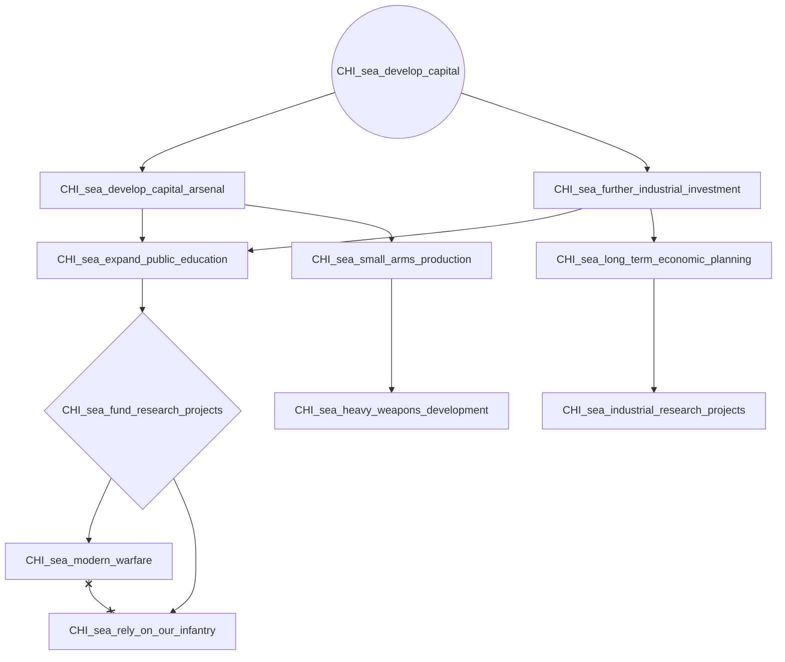
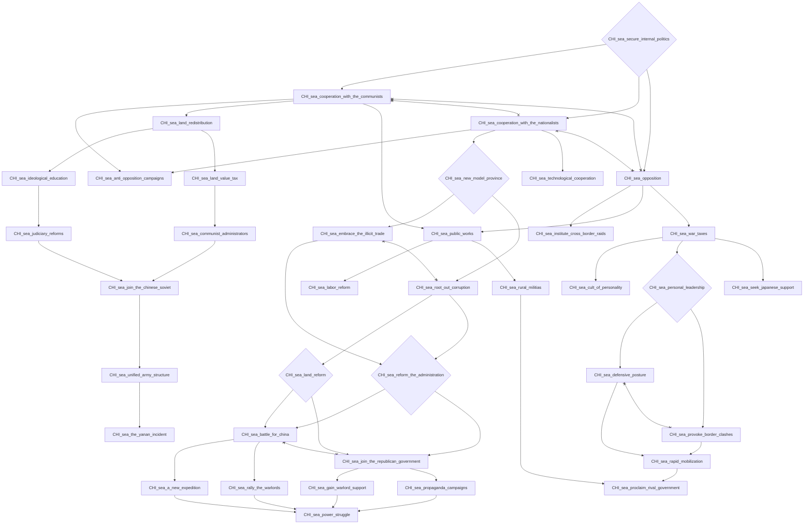
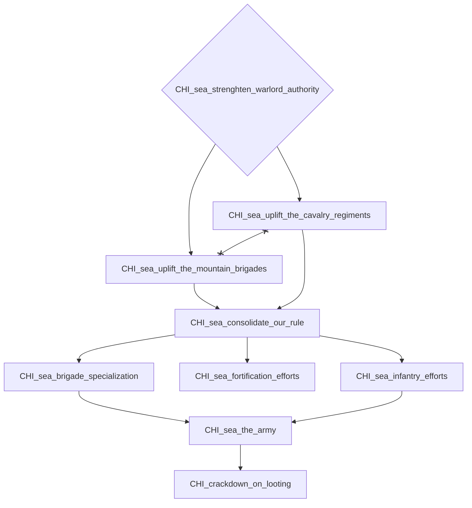
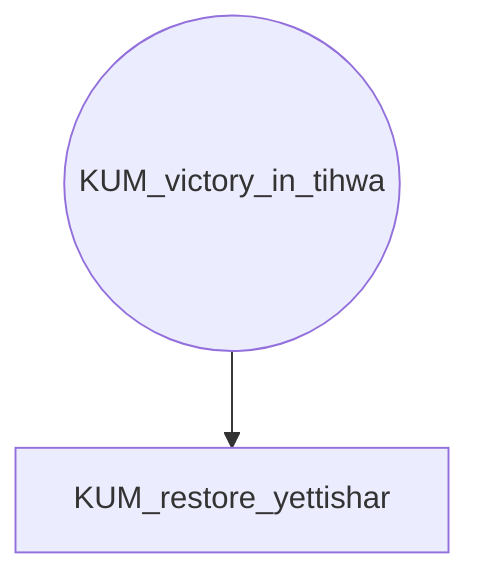
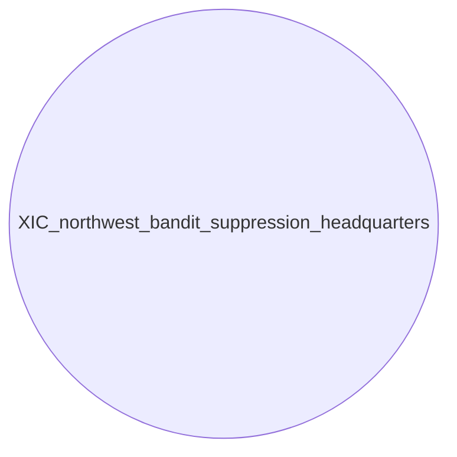
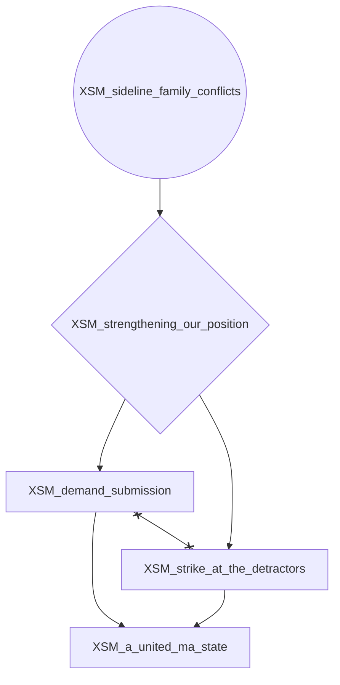

# CHI_sea_develop_capital

# CHI_sea_secure_internal_politics

# CHI_sea_strenghten_warlord_authority

# KUM_victory_in_tihwa

# XIC_northwest_bandit_suppression_headquarters

# XSM_sideline_family_conflicts

