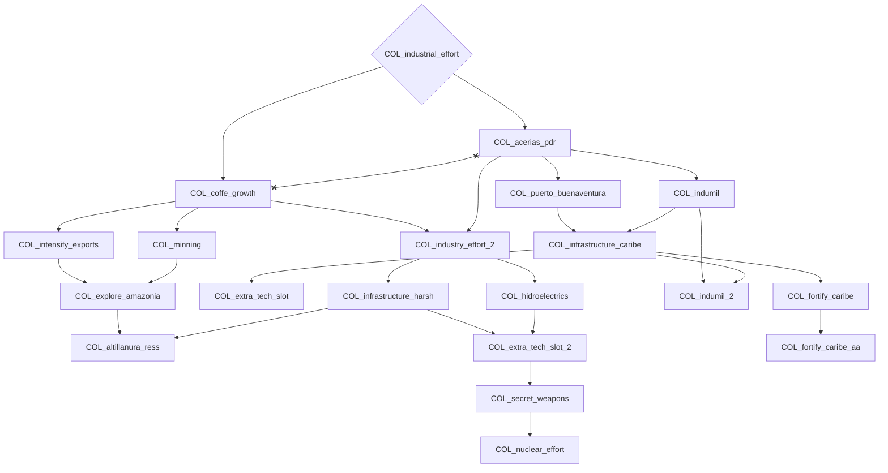
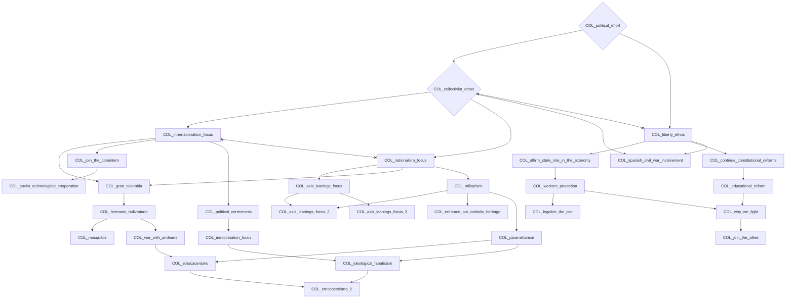

# COL_industrial_effort

```mermaid
flowchart TD
    n1["COL_acerias_pdr"]
    n2["COL_altillanura_ress"]
    n3["COL_coffe_growth"]
    n4["COL_explore_amazonia"]
    n5["COL_extra_tech_slot"]
    n6["COL_extra_tech_slot_2"]
    n7["COL_fortify_caribe"]
    n8["COL_fortify_caribe_aa"]
    n9["COL_hidroelectrics"]
    n10["COL_indumil"]
    n11["COL_indumil_2"]
    n12{"COL_industrial_effort"}
    n13["COL_industry_effort_2"]
    n14["COL_infrastructure_caribe"]
    n15["COL_infrastructure_harsh"]
    n16["COL_intensify_exports"]
    n17["COL_minning"]
    n18["COL_nuclear_effort"]
    n19["COL_puerto_buenaventura"]
    n20["COL_secret_weapons"]
    n12 --> n1
    n4 --> n2
    n15 --> n2
    n12 --> n3
    n16 --> n4
    n17 --> n4
    n14 --> n5
    n15 --> n6
    n9 --> n6
    n14 --> n7
    n7 --> n8
    n13 --> n9
    n1 --> n10
    n10 --> n11
    n14 --> n11
    n3 --> n13
    n1 --> n13
    n19 --> n14
    n10 --> n14
    n13 --> n15
    n3 --> n16
    n3 --> n17
    n20 --> n18
    n1 --> n19
    n6 --> n20
    n1 x--x n3
```

# COL_political_effort

```mermaid
flowchart TD
    n21["COL_affirm_state_role_in_the_economy"]
    n22["COL_axis_leanings_focus"]
    n23["COL_axis_leanings_focus_2"]
    n24["COL_axis_leanings_focus_3"]
    n25{"COL_collectivist_ethos"}
    n26["COL_continue_constitutional_reforms"]
    n27["COL_educational_reform"]
    n28["COL_embrace_our_catholic_heritage"]
    n29["COL_etnocacerismo"]
    n30["COL_etnocacerismo_2"]
    n31["COL_gran_colombia"]
    n32["COL_hermano_bolivariano"]
    n33["COL_ideological_fanaticism"]
    n34["COL_indoctrination_focus"]
    n35["COL_internationalism_focus"]
    n36["COL_join_the_allies"]
    n37["COL_join_the_comintern"]
    n38["COL_legalize_the_pcc"]
    n39["COL_liberty_ethos"]
    n40["COL_militarism"]
    n41["COL_mosquitos"]
    n42["COL_nationalism_focus"]
    n43["COL_paramilitarism"]
    n44["COL_political_correctness"]
    n45{"COL_political_effort"}
    n46["COL_soviet_technological_cooperation"]
    n47["COL_spanish_civil_war_involvement"]
    n48["COL_war_with_andeans"]
    n49["COL_why_we_fight"]
    n50["COL_workers_protection"]
    n39 --> n21
    n42 --> n22
    n22 --> n23
    n40 --> n23
    n22 --> n24
    n45 --> n25
    n39 --> n26
    n26 --> n27
    n40 --> n28
    n43 --> n29
    n48 --> n29
    n29 --> n30
    n33 --> n30
    n42 --> n31
    n35 --> n31
    n31 --> n32
    n43 --> n33
    n34 --> n33
    n44 --> n34
    n25 --> n35
    n49 --> n36
    n35 --> n37
    n50 --> n38
    n45 --> n39
    n42 --> n40
    n32 --> n41
    n25 --> n42
    n40 --> n43
    n35 --> n44
    n37 --> n46
    n25 --> n47
    n39 --> n47
    n32 --> n48
    n27 --> n49
    n50 --> n49
    n21 --> n50
    n25 x--x n39
    n35 x--x n42
```
