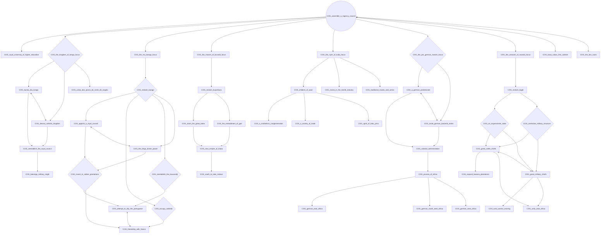
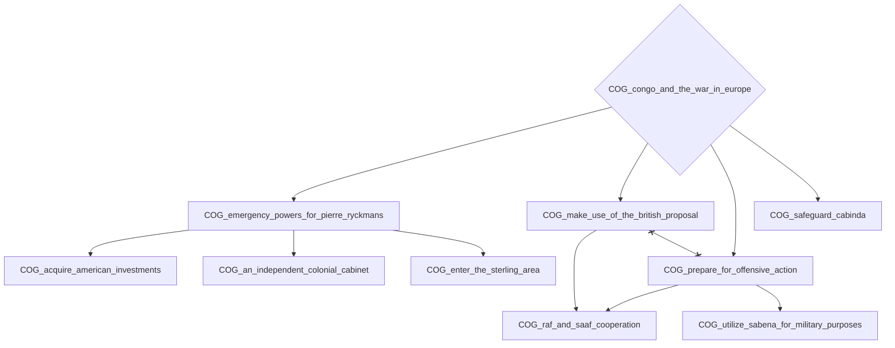
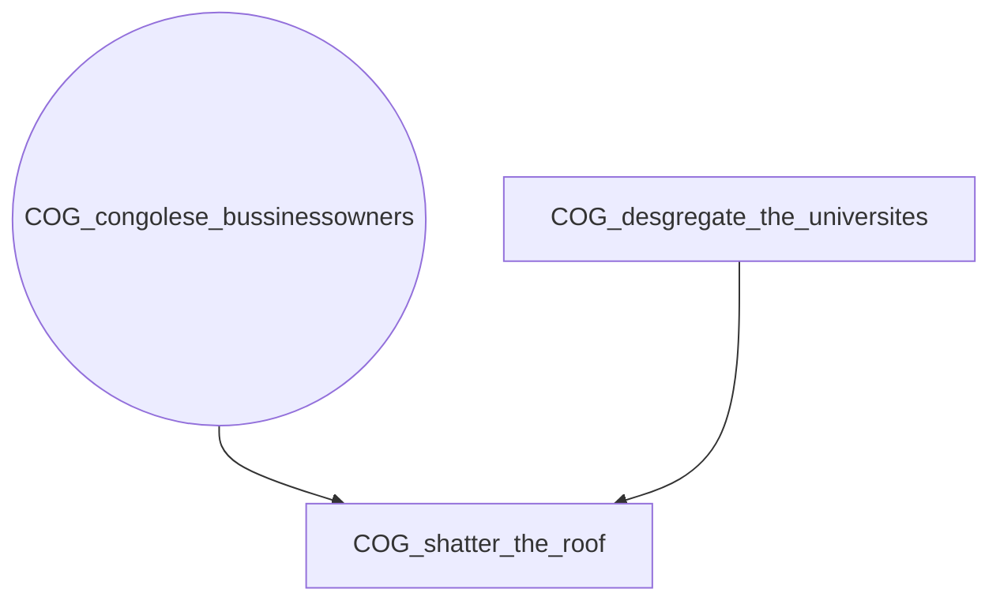
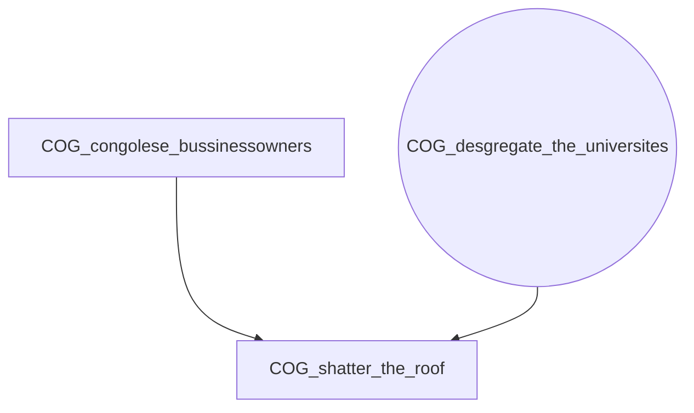
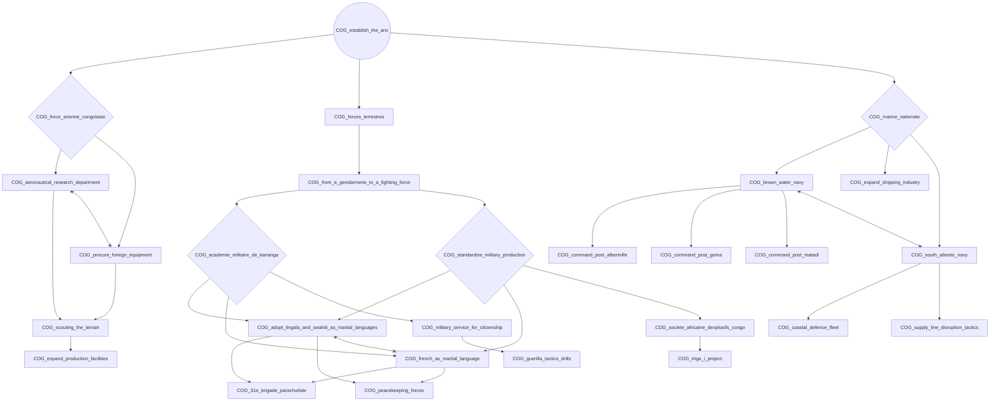
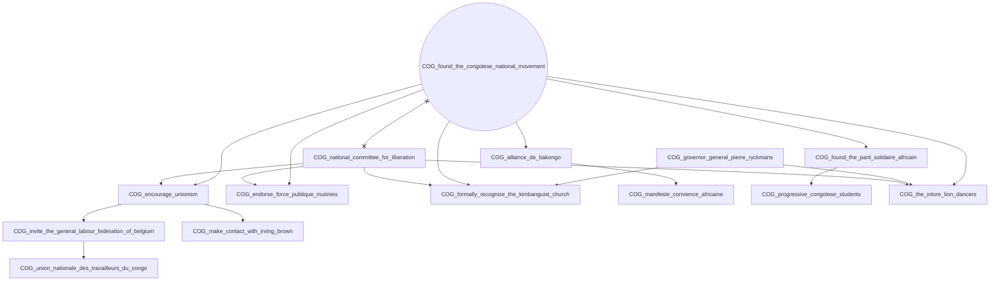
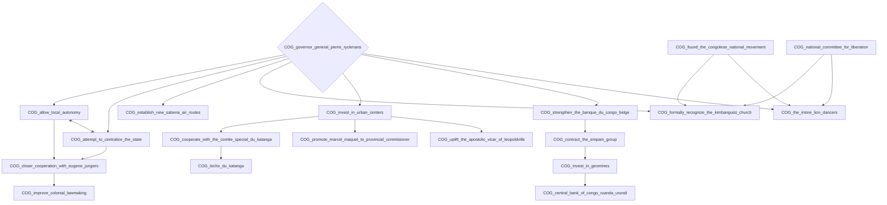
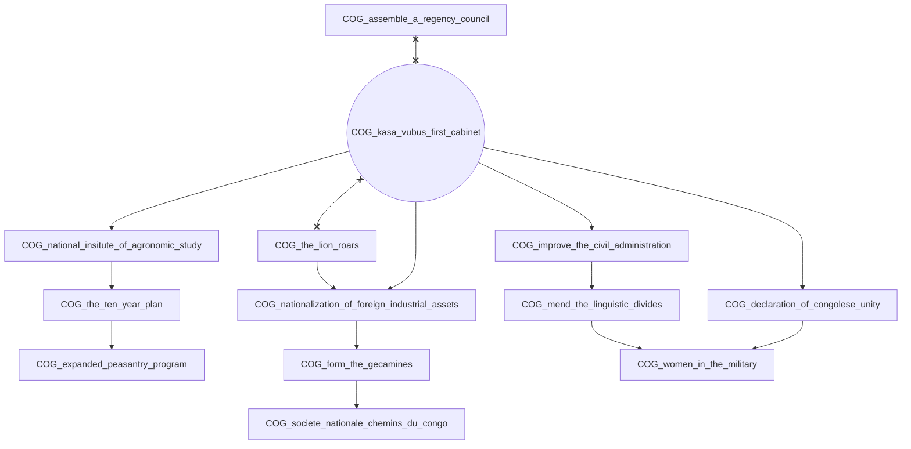
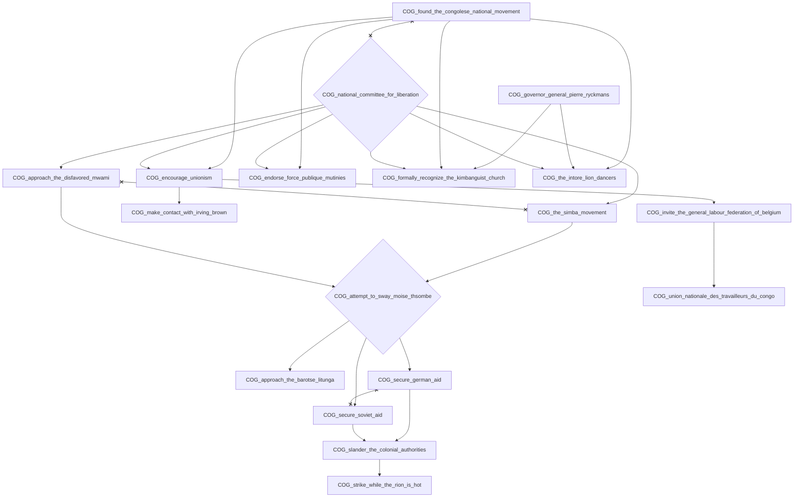
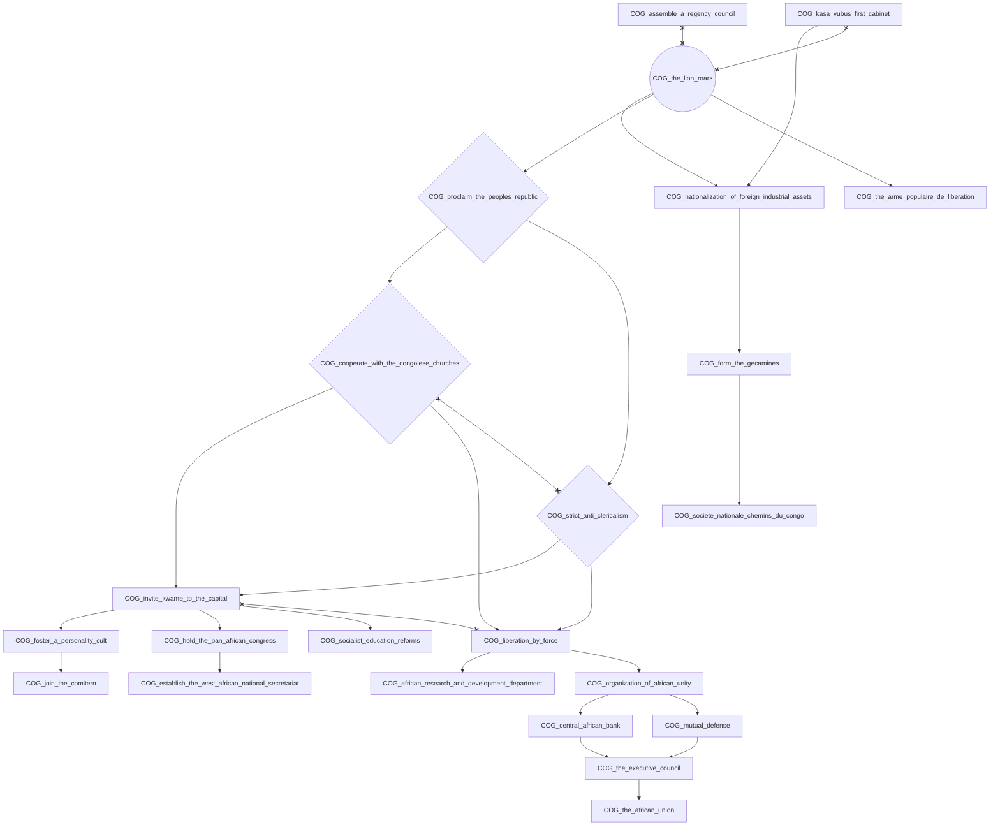

# COG_assemble_a_regency_council

# COG_congo_and_the_war_in_europe

# COG_congolese_bussinessowners

# COG_desgregate_the_universites

# COG_establish_the_anc

# COG_found_the_congolese_national_movement

# COG_governor_general_pierre_ryckmans

# COG_kasa_vubus_first_cabinet

# COG_national_committee_for_liberation

# COG_the_lion_roars

