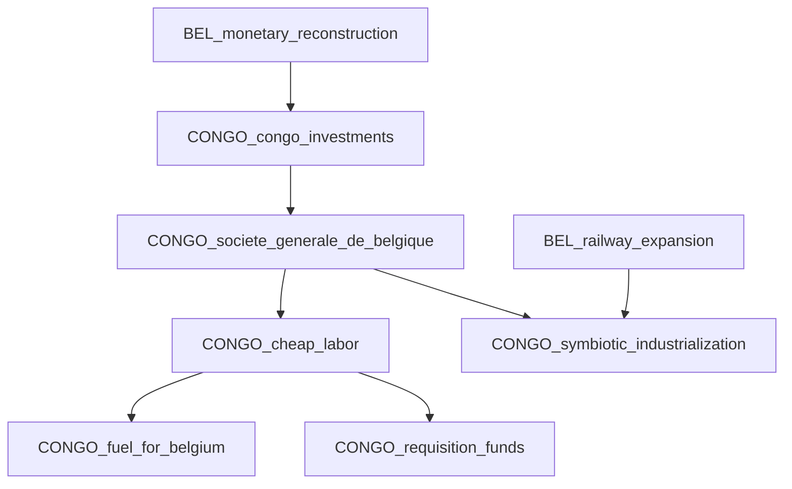

# CONGO_belgian_congo

```mermaid
flowchart TD
    n1["CONGO_african_union"]
    n2["CONGO_antwerp_diamond_district"]
    n3["CONGO_appoint_van_overstraeten"]
    n4["CONGO_aviation_militaire_de_la_force_publique"]
    n5["CONGO_bakwanga_mine"]
    n6(("CONGO_belgian_congo"))
    n7["CONGO_belgian_devaluation"]
    n8["CONGO_belgian_officer_corps"]
    n9["CONGO_ccci"]
    n10["CONGO_chefs_coutumiers"]
    n11["CONGO_colonial_ambitions"]
    n12["CONGO_compagnie_belge_maritime_du_congo"]
    n13["CONGO_congo_army"]
    n14["CONGO_congo_free_state"]
    n15["CONGO_congo_investments"]
    n16["CONGO_congolese_generals"]
    n17{"CONGO_congos_place_in_the_world"}
    n18["CONGO_copper_cartridges"]
    n19["CONGO_develop_infrastructure"]
    n20["CONGO_dominion_of_congo"]
    n21["CONGO_establish_cometro"]
    n22["CONGO_establish_university_of_louvain"]
    n23["CONGO_even_a_hospital_can_do_better"]
    n24["CONGO_expand_force_publique_recruitment"]
    n25["CONGO_expand_matadi_seaport"]
    n26["CONGO_expand_metallurgical_industry"]
    n27["CONGO_expand_ndolo_and_elisabethville_airports"]
    n28["CONGO_expand_tungsten_mines"]
    n29["CONGO_expand_villages"]
    n30["CONGO_expanded_rubber_plantations"]
    n31["CONGO_force_publique"]
    n32["CONGO_forminiere"]
    n33["CONGO_free_enterprise_fund"]
    n34["CONGO_french_congo"]
    n35["CONGO_gold_and_diamonds"]
    n36["CONGO_great_war_of_africa"]
    n37["CONGO_heat_resistant_cobalt"]
    n38["CONGO_humanitarian_aid"]
    n39["CONGO_improved_employment_contracts"]
    n40["CONGO_interfaith_school_subsidies"]
    n41["CONGO_jungle_fighting"]
    n42["CONGO_jungle_industry"]
    n43["CONGO_kasai_secessionist_state"]
    n44["CONGO_legacy_of_lake_tanganyika"]
    n45["CONGO_modernize_force_publique"]
    n46["CONGO_new_vegetable_produce_markets"]
    n47["CONGO_office_des_transports_coloniaux"]
    n48["CONGO_overseas_department_of_belgium"]
    n49["CONGO_prince_leopold_mine"]
    n50["CONGO_purchasing_commission"]
    n51["CONGO_rawji_group"]
    n52["CONGO_regional_specialization"]
    n53["CONGO_republic_of_congo"]
    n54["CONGO_research_grants"]
    n55["CONGO_ruanda_urundi"]
    n56["CONGO_rubber_plantations"]
    n57["CONGO_secure_international_funding"]
    n58["CONGO_separate_corporations_from_politics"]
    n59["CONGO_shinkolobwe_mine"]
    n60["CONGO_smuggle_diamonds"]
    n61["CONGO_smuggle_uranium"]
    n62["CONGO_societe_generale_de_belgique"]
    n63["CONGO_societe_miniere_de_bakwanga"]
    n64["CONGO_soviet_interest"]
    n65["CONGO_the_heart_of_africa"]
    n66["CONGO_uranium_development_trust"]
    n67["CONGO_weapon_repair_workshops"]
    n68{"CONGO_whispers_of_independence"}
    n53 --> n1
    n63 --> n2
    n13 --> n3
    n31 --> n4
    n32 --> n5
    n65 --> n7
    n13 --> n8
    n62 --> n9
    n65 --> n9
    n52 --> n10
    n34 --> n11
    n19 --> n12
    n46 --> n12
    n31 --> n13
    n17 --> n14
    n8 --> n16
    n52 --> n17
    n26 --> n18
    n10 --> n19
    n17 --> n20
    n17 --> n21
    n6 --> n22
    n24 --> n23
    n13 --> n24
    n12 --> n25
    n49 --> n26
    n4 --> n27
    n55 --> n28
    n6 --> n29
    n56 --> n30
    n65 --> n31
    n62 --> n32
    n65 --> n32
    n6 --> n33
    n65 --> n34
    n2 --> n35
    n53 --> n36
    n26 --> n37
    n52 --> n38
    n19 --> n39
    n7 --> n40
    n45 --> n41
    n65 --> n42
    n5 --> n43
    n12 --> n44
    n31 --> n45
    n10 --> n46
    n19 --> n47
    n17 --> n48
    n9 --> n49
    n52 --> n50
    n6 --> n51
    n65 --> n52
    n68 --> n53
    n26 --> n54
    n60 --> n54
    n65 --> n55
    n42 --> n56
    n6 --> n57
    n40 --> n58
    n52 --> n59
    n5 --> n60
    n59 --> n61
    n49 --> n63
    n5 --> n63
    n17 --> n64
    n15 --> n65
    n6 --> n65
    n59 --> n66
    n6 --> n67
    n17 --> n68
    n14 x--x n20
    n14 x--x n48
    n14 x--x n53
    n20 x--x n48
    n20 x--x n53
    n48 x--x n53
```

# orphans

```mermaid
flowchart TD
    n69["BEL_monetary_reconstruction"]
    n70["BEL_railway_expansion"]
    n71["CONGO_cheap_labor"]
    n15["CONGO_congo_investments"]
    n72["CONGO_fuel_for_belgium"]
    n73["CONGO_requisition_funds"]
    n62["CONGO_societe_generale_de_belgique"]
    n74["CONGO_symbiotic_industrialization"]
    n62 --> n71
    n69 --> n15
    n71 --> n72
    n71 --> n73
    n15 --> n62
    n62 --> n74
    n70 --> n74
```
