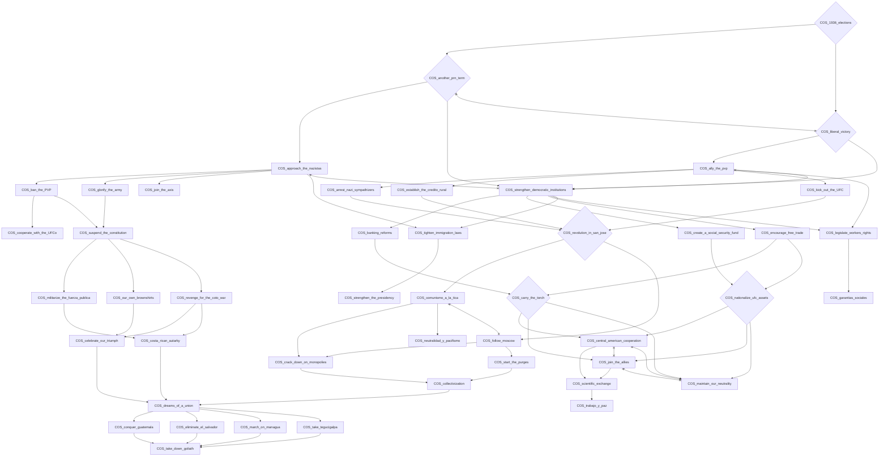

# COS_1936_elections

```mermaid
flowchart TD
    n1{"COS_1936_elections"}
    n2["COS_ally_the_pvp"]
    n3{"COS_another_prn_term"}
    n4["COS_approach_the_nazistas"]
    n5["COS_arrest_nazi_sympathizers"]
    n6["COS_ban_the_PVP"]
    n7["COS_banking_reforms"]
    n8{"COS_carry_the_torch"}
    n9["COS_celebrate_our_triumph"]
    n10["COS_central_american_cooperation"]
    n11["COS_collectivization"]
    n12["COS_comunismo_a_la_tica"]
    n13["COS_conquer_guatemala"]
    n14["COS_cooperate_with_the_UFCo"]
    n15["COS_costa_rican_autarky"]
    n16["COS_crack_down_on_monopolies"]
    n17["COS_create_a_social_security_fund"]
    n18["COS_dreams_of_a_union"]
    n19["COS_eliminate_el_salvador"]
    n20["COS_encourage_free_trade"]
    n21["COS_establish_the_credito_rural"]
    n22["COS_follow_moscow"]
    n23["COS_garantias_sociales"]
    n24["COS_glorify_the_army"]
    n25["COS_join_the_allies"]
    n26["COS_join_the_axis"]
    n27["COS_kick_out_the_UFC"]
    n28["COS_legislate_workers_rights"]
    n29{"COS_liberal_victory"}
    n30["COS_maintain_our_neutrality"]
    n31["COS_march_on_managua"]
    n32["COS_militarize_the_fuerza_publica"]
    n33{"COS_nationalize_ufc_assets"}
    n34["COS_neutralidad_y_pacifismo"]
    n35["COS_our_own_brownshirts"]
    n36["COS_revenge_for_the_coto_war"]
    n37{"COS_revolution_in_san_jose"}
    n38["COS_scientific_exchange"]
    n39["COS_start_the_purges"]
    n40["COS_strengthen_democratic_institutions"]
    n41["COS_strengthen_the_presidency"]
    n42["COS_suspend_the_constitution"]
    n43["COS_take_down_goliath"]
    n44["COS_take_tegucigalpa"]
    n45["COS_tighten_immigration_laws"]
    n46["COS_trabajo_y_paz"]
    n29 --> n2
    n1 --> n3
    n3 --> n4
    n2 --> n5
    n4 --> n6
    n40 --> n7
    n7 --> n8
    n20 --> n8
    n35 --> n9
    n36 --> n9
    n8 --> n10
    n33 --> n10
    n39 --> n11
    n16 --> n11
    n37 --> n12
    n18 --> n13
    n6 --> n14
    n32 --> n15
    n36 --> n15
    n12 --> n16
    n22 --> n16
    n40 --> n17
    n11 --> n18
    n9 --> n18
    n15 --> n18
    n18 --> n19
    n40 --> n20
    n2 --> n21
    n37 --> n22
    n28 --> n23
    n4 --> n24
    n8 --> n25
    n33 --> n25
    n4 --> n26
    n2 --> n27
    n40 --> n28
    n2 --> n28
    n1 --> n29
    n8 --> n30
    n33 --> n30
    n18 --> n31
    n42 --> n32
    n17 --> n33
    n20 --> n33
    n12 --> n34
    n42 --> n35
    n42 --> n36
    n27 --> n37
    n21 --> n37
    n5 --> n37
    n10 --> n38
    n25 --> n38
    n22 --> n39
    n3 --> n40
    n29 --> n40
    n45 --> n41
    n6 --> n42
    n24 --> n42
    n31 --> n43
    n44 --> n43
    n13 --> n43
    n19 --> n43
    n18 --> n44
    n4 --> n45
    n40 --> n45
    n38 --> n46
    n2 x--x n40
    n3 x--x n29
    n4 x--x n40
    n10 x--x n25
    n10 x--x n30
    n12 x--x n22
    n25 x--x n30
```
