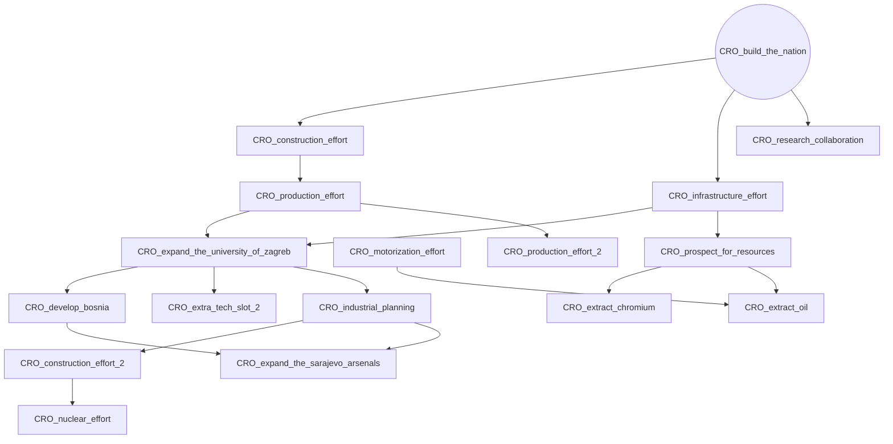
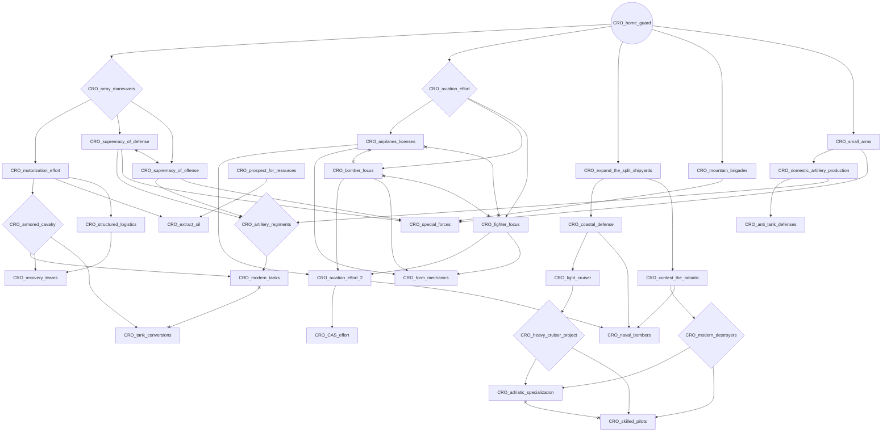
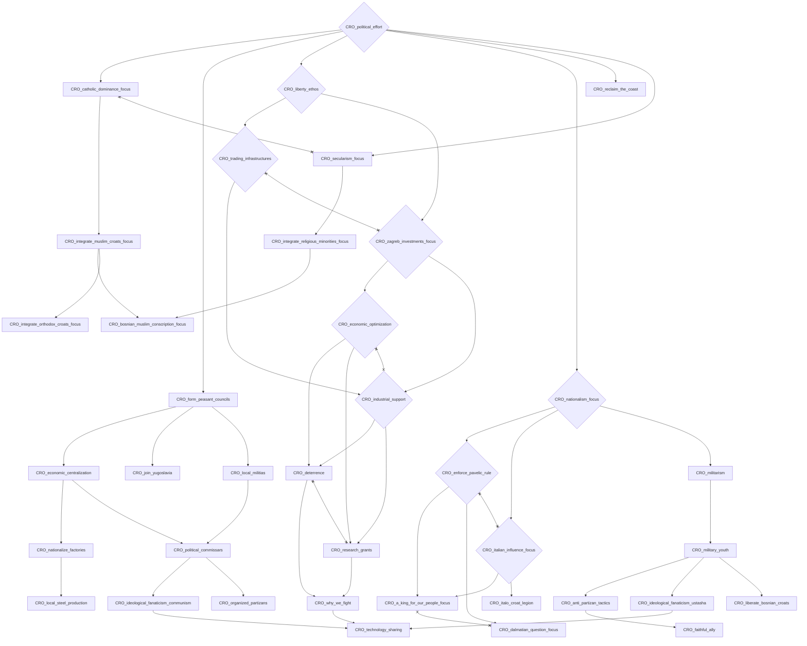

# CRO_build_the_nation

```mermaid
flowchart TD
    n1(("CRO_build_the_nation"))
    n2["CRO_construction_effort"]
    n3["CRO_construction_effort_2"]
    n4["CRO_develop_bosnia"]
    n5["CRO_expand_the_sarajevo_arsenals"]
    n6["CRO_expand_the_university_of_zagreb"]
    n7["CRO_extra_tech_slot_2"]
    n8["CRO_extract_chromium"]
    n9["CRO_extract_oil"]
    n10["CRO_industrial_planning"]
    n11["CRO_infrastructure_effort"]
    n12["CRO_motorization_effort"]
    n13["CRO_nuclear_effort"]
    n14["CRO_production_effort"]
    n15["CRO_production_effort_2"]
    n16["CRO_prospect_for_resources"]
    n17["CRO_research_collaboration"]
    n1 --> n2
    n10 --> n3
    n6 --> n4
    n4 --> n5
    n10 --> n5
    n11 --> n6
    n14 --> n6
    n6 --> n7
    n16 --> n8
    n16 --> n9
    n12 --> n9
    n6 --> n10
    n1 --> n11
    n3 --> n13
    n2 --> n14
    n14 --> n15
    n11 --> n16
    n1 --> n17
```

# CRO_home_guard

```mermaid
flowchart TD
    n18["CRO_CAS_effort"]
    n19["CRO_adriatic_specialization"]
    n20["CRO_airplanes_licenses"]
    n21["CRO_anti_tank_defenses"]
    n22{"CRO_armored_cavalry"}
    n23{"CRO_army_maneuvers"}
    n24{"CRO_artillery_regiments"}
    n25{"CRO_aviation_effort"}
    n26["CRO_aviation_effort_2"]
    n27["CRO_bomber_focus"]
    n28["CRO_coastal_defense"]
    n29["CRO_contest_the_adriatic"]
    n30["CRO_domestic_artillery_production"]
    n31["CRO_expand_the_split_shipyards"]
    n9["CRO_extract_oil"]
    n32["CRO_fighter_focus"]
    n33["CRO_form_mechanics"]
    n34{"CRO_heavy_cruiser_project"}
    n35(("CRO_home_guard"))
    n36["CRO_light_cruiser"]
    n37{"CRO_modern_destroyers"}
    n38["CRO_modern_tanks"]
    n12["CRO_motorization_effort"]
    n39["CRO_mountain_brigades"]
    n40["CRO_naval_bombers"]
    n16["CRO_prospect_for_resources"]
    n41["CRO_recovery_teams"]
    n42["CRO_skilled_pilots"]
    n43["CRO_small_arms"]
    n44["CRO_special_forces"]
    n45["CRO_structured_logistics"]
    n46["CRO_supremacy_of_defense"]
    n47["CRO_supremacy_of_offense"]
    n48["CRO_tank_conversions"]
    n26 --> n18
    n37 --> n19
    n34 --> n19
    n25 --> n20
    n30 --> n21
    n12 --> n22
    n35 --> n23
    n47 --> n24
    n46 --> n24
    n30 --> n24
    n35 --> n25
    n27 --> n26
    n32 --> n26
    n20 --> n26
    n25 --> n27
    n31 --> n28
    n31 --> n29
    n43 --> n30
    n35 --> n31
    n16 --> n9
    n12 --> n9
    n25 --> n32
    n20 --> n33
    n32 --> n33
    n27 --> n33
    n36 --> n34
    n28 --> n36
    n29 --> n37
    n22 --> n38
    n24 --> n38
    n23 --> n12
    n35 --> n39
    n29 --> n40
    n28 --> n40
    n26 --> n40
    n45 --> n41
    n22 --> n41
    n37 --> n42
    n34 --> n42
    n35 --> n43
    n39 --> n44
    n43 --> n44
    n46 --> n44
    n47 --> n44
    n12 --> n45
    n23 --> n46
    n23 --> n47
    n22 --> n48
    n19 x--x n42
    n20 x--x n27
    n20 x--x n32
    n27 x--x n32
    n38 x--x n48
    n46 x--x n47
```

# CRO_political_effort

```mermaid
flowchart TD
    n49["CRO_a_king_for_our_people_focus"]
    n50["CRO_anti_partizan_tactics"]
    n51["CRO_bosnian_muslim_conscription_focus"]
    n52["CRO_catholic_dominance_focus"]
    n53["CRO_dalmatian_question_focus"]
    n54["CRO_deterrence"]
    n55["CRO_economic_centralization"]
    n56{"CRO_economic_optimization"}
    n57{"CRO_enforce_pavelic_rule"}
    n58["CRO_faithful_ally"]
    n59["CRO_form_peasant_councils"]
    n60["CRO_ideological_fanaticism_communism"]
    n61["CRO_ideological_fanaticism_ustasha"]
    n62{"CRO_industrial_support"}
    n63["CRO_integrate_muslim_croats_focus"]
    n64["CRO_integrate_orthodox_croats_focus"]
    n65["CRO_integrate_religious_minorities_focus"]
    n66{"CRO_italian_influence_focus"}
    n67["CRO_italo_croat_legion"]
    n68["CRO_join_yugoslavia"]
    n69["CRO_liberate_bosnian_croats"]
    n70{"CRO_liberty_ethos"}
    n71["CRO_local_militias"]
    n72["CRO_local_steel_production"]
    n73["CRO_militarism"]
    n74["CRO_military_youth"]
    n75{"CRO_nationalism_focus"}
    n76["CRO_nationalize_factories"]
    n77["CRO_organized_partizans"]
    n78["CRO_political_commissars"]
    n79{"CRO_political_effort"}
    n80["CRO_reclaim_the_coast"]
    n81["CRO_research_grants"]
    n82["CRO_secularism_focus"]
    n83["CRO_technology_sharing"]
    n84{"CRO_trading_infrastructures"}
    n85["CRO_why_we_fight"]
    n86{"CRO_zagreb_investments_focus"}
    n66 --> n49
    n57 --> n49
    n74 --> n50
    n63 --> n51
    n65 --> n51
    n79 --> n52
    n57 --> n53
    n56 --> n54
    n62 --> n54
    n59 --> n55
    n86 --> n56
    n75 --> n57
    n50 --> n58
    n79 --> n59
    n78 --> n60
    n74 --> n61
    n84 --> n62
    n86 --> n62
    n52 --> n63
    n63 --> n64
    n82 --> n65
    n75 --> n66
    n66 --> n67
    n59 --> n68
    n74 --> n69
    n79 --> n70
    n59 --> n71
    n76 --> n72
    n75 --> n73
    n73 --> n74
    n79 --> n75
    n55 --> n76
    n78 --> n77
    n55 --> n78
    n71 --> n78
    n79 --> n80
    n56 --> n81
    n62 --> n81
    n79 --> n82
    n60 --> n83
    n61 --> n83
    n85 --> n83
    n70 --> n84
    n54 --> n85
    n81 --> n85
    n70 --> n86
    n49 x--x n53
    n52 x--x n82
    n54 x--x n81
    n56 x--x n62
    n57 x--x n66
    n84 x--x n86
```
