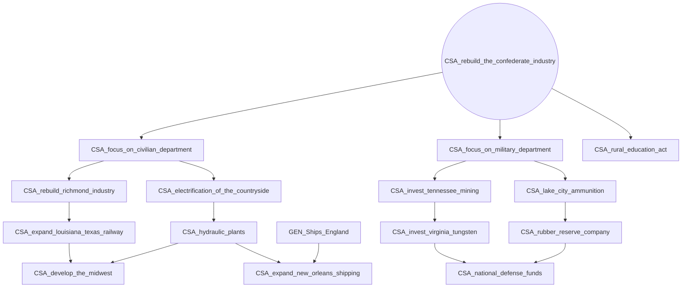
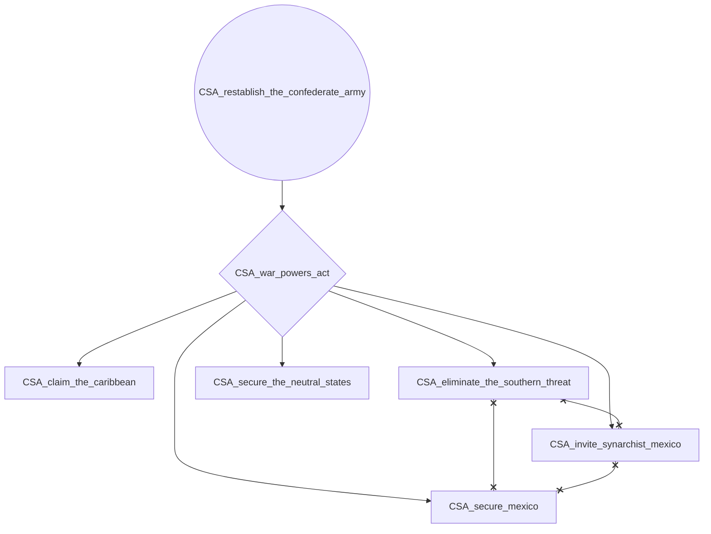

# CSA_rebuild_the_confederate_industry

```mermaid
flowchart TD
    n1["CSA_develop_the_midwest"]
    n2["CSA_electrification_of_the_countryside"]
    n3["CSA_expand_louisiana_texas_railway"]
    n4["CSA_expand_new_orleans_shipping"]
    n5["CSA_focus_on_civilian_department"]
    n6["CSA_focus_on_military_department"]
    n7["CSA_hydraulic_plants"]
    n8["CSA_invest_tennessee_mining"]
    n9["CSA_invest_virginia_tungsten"]
    n10["CSA_lake_city_ammunition"]
    n11["CSA_national_defense_funds"]
    n12["CSA_rebuild_richmond_industry"]
    n13(("CSA_rebuild_the_confederate_industry"))
    n14["CSA_rubber_reserve_company"]
    n15["CSA_rural_education_act"]
    n16["GEN_Ships_England"]
    n7 --> n1
    n3 --> n1
    n5 --> n2
    n12 --> n3
    n16 --> n4
    n7 --> n4
    n13 --> n5
    n13 --> n6
    n2 --> n7
    n6 --> n8
    n8 --> n9
    n6 --> n10
    n14 --> n11
    n9 --> n11
    n5 --> n12
    n10 --> n14
    n13 --> n15
```

# CSA_restablish_the_confederate_army

```mermaid
flowchart TD
    n17["CSA_claim_the_caribbean"]
    n18["CSA_eliminate_the_southern_threat"]
    n19["CSA_invite_synarchist_mexico"]
    n20(("CSA_restablish_the_confederate_army"))
    n21["CSA_secure_mexico"]
    n22["CSA_secure_the_neutral_states"]
    n23{"CSA_war_powers_act"}
    n23 --> n17
    n23 --> n18
    n23 --> n19
    n23 --> n21
    n23 --> n22
    n20 --> n23
    n18 x--x n19
    n18 x--x n21
    n19 x--x n21
```
