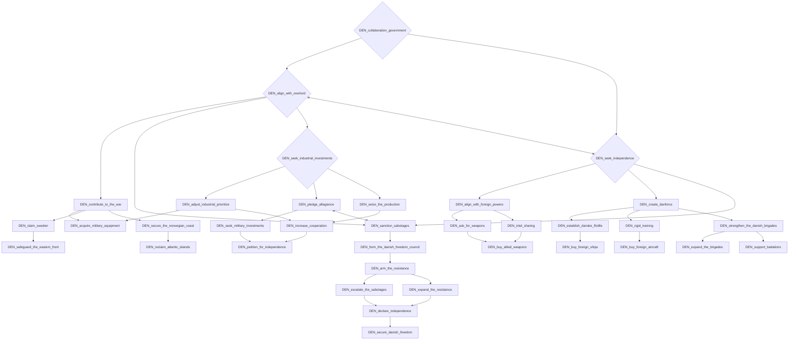
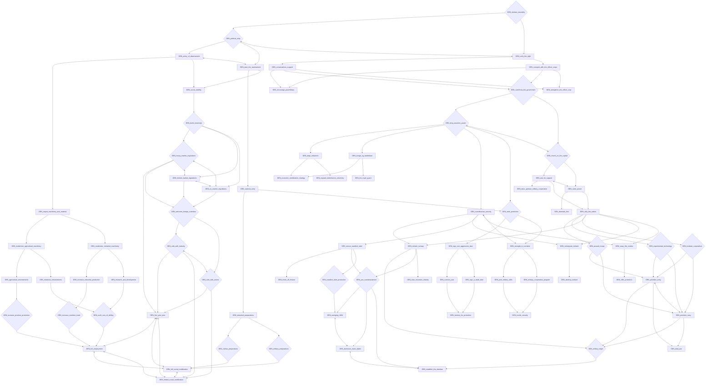
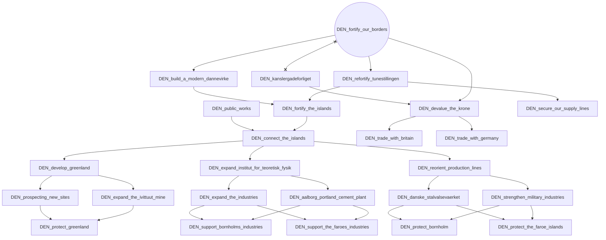
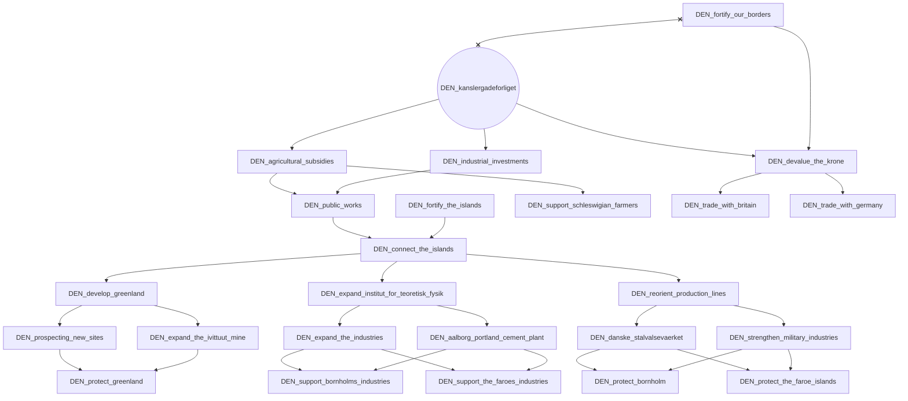
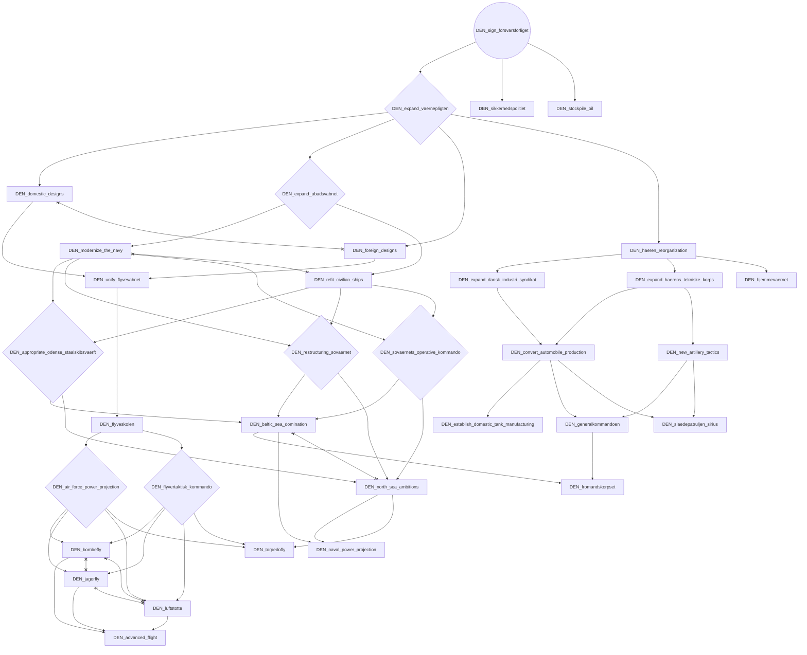

# DEN_collaboration_government

```mermaid
flowchart TD
    n1["DEN_acquire_military_equipment"]
    n2["DEN_adjust_industrial_prioritize"]
    n3["DEN_align_with_foreign_powers"]
    n4{"DEN_align_with_overlord"}
    n5["DEN_arm_the_resistance"]
    n6["DEN_ask_for_weapons"]
    n7["DEN_buy_allied_weapons"]
    n8["DEN_buy_foreign_aircraft"]
    n9["DEN_buy_foreign_ships"]
    n10["DEN_claim_sweden"]
    n11{"DEN_collaboration_government"}
    n12["DEN_contribute_to_the_war"]
    n13["DEN_create_danforce"]
    n14["DEN_declare_independence"]
    n15["DEN_escalate_the_sabotages"]
    n16["DEN_establish_danske_flotille"]
    n17["DEN_expand_the_brigades"]
    n18["DEN_expand_the_resistance"]
    n19["DEN_form_the_danish_freedom_council"]
    n20["DEN_increase_cooperation"]
    n21["DEN_intel_sharing"]
    n22["DEN_petition_for_independence"]
    n23["DEN_pledge_allegiance"]
    n24["DEN_reclaim_atlantic_islands"]
    n25["DEN_rigid_training"]
    n26["DEN_safeguard_the_eastern_front"]
    n27["DEN_sanction_sabotages"]
    n28["DEN_secure_danish_freedom"]
    n29["DEN_secure_the_norwegian_coast"]
    n30{"DEN_seek_independence"}
    n31{"DEN_seek_industrial_investments"}
    n32["DEN_seek_military_investments"]
    n33["DEN_seize_the_production"]
    n34["DEN_strengthen_the_danish_brigades"]
    n35["DEN_support_battalions"]
    n2 --> n1
    n12 --> n1
    n31 --> n2
    n30 --> n3
    n11 --> n4
    n19 --> n5
    n3 --> n6
    n21 --> n7
    n6 --> n7
    n25 --> n8
    n16 --> n9
    n12 --> n10
    n4 --> n12
    n30 --> n13
    n15 --> n14
    n18 --> n14
    n5 --> n15
    n13 --> n16
    n34 --> n17
    n5 --> n18
    n27 --> n19
    n33 --> n20
    n2 --> n20
    n3 --> n21
    n32 --> n22
    n20 --> n22
    n31 --> n23
    n29 --> n24
    n13 --> n25
    n10 --> n26
    n30 --> n27
    n4 --> n27
    n14 --> n28
    n12 --> n29
    n11 --> n30
    n4 --> n31
    n23 --> n32
    n31 --> n33
    n13 --> n34
    n34 --> n35
    n4 x--x n30
    n23 x--x n27
```

# DEN_declare_neutrality

```mermaid
flowchart TD
    n36["DEN_agricultural_reinvestments"]
    n37["DEN_align_industries"]
    n38["DEN_ask_for_support"]
    n39{"DEN_assault_troops"}
    n40["DEN_avenging_1864"]
    n41{"DEN_build_motorveje"}
    n42{"DEN_civilian_preparations"}
    n43["DEN_conservatives_support"]
    n44["DEN_conspire_with_the_officer_corps"]
    n45["DEN_dano_german_military_cooperation"]
    n46{"DEN_declare_neutrality"}
    n47["DEN_denmark_first"]
    n48["DEN_develop_iceland"]
    n49["DEN_dominium_maris_baltici"]
    n50["DEN_economic_mobilization_strategy"]
    n51["DEN_encourage_paramilitary"]
    n52["DEN_establish_the_danelaw"]
    n53["DEN_expand_kobenhavns_university"]
    n54{"DEN_experimental_technology"}
    n55["DEN_finish_off_finland"]
    n56["DEN_five_year_plan"]
    n57["DEN_full_employment"]
    n58["DEN_full_social_mobilization"]
    n59{"DEN_heavy_market_regulations"}
    n60["DEN_import_machinery_and_material"]
    n61["DEN_increase_industrial_production"]
    n62{"DEN_increase_maritime_trade"}
    n63{"DEN_increase_produce_production"}
    n64["DEN_industrial_preparations"]
    n65["DEN_industrial_reinvestments"]
    n66{"DEN_institute_corporatism"}
    n67["DEN_joint_military_drills"]
    n68{"DEN_king_assumes_power"}
    n69["DEN_konge_og_faedreland"]
    n70["DEN_limited_market_regulations"]
    n71["DEN_limited_social_mobilization"]
    n72{"DEN_march_on_the_capital"}
    n73["DEN_military_cooperation_program"]
    n74{"DEN_military_might"}
    n75{"DEN_military_preparations"}
    n76["DEN_modernize_agricultural_machinery"]
    n77["DEN_modernize_industrial_machinery"]
    n78["DEN_national_unity"]
    n79["DEN_no_market_regulations"]
    n80["DEN_nordic_security"]
    n81{"DEN_north_sea_oil_drilling"}
    n82["DEN_offer_protection"]
    n83{"DEN_overthrow_the_government"}
    n84{"DEN_pan_scandinavianism"}
    n85["DEN_policy_of_disarmament"]
    n86{"DEN_political_unity"}
    n87["DEN_prioritize_army"]
    n88["DEN_prioritize_navy"]
    n89["DEN_rally_the_nation"]
    n90["DEN_reclaim_norway"]
    n91["DEN_reintegrate_iceland"]
    n92["DEN_research_and_development"]
    n93["DEN_scandinavian_security"]
    n94["DEN_science_pact"]
    n95["DEN_secure_swedish_steel"]
    n96{"DEN_seek_protection"}
    n97["DEN_seize_power"]
    n98{"DEN_side_with_industry"}
    n99{"DEN_side_with_unions"}
    n100["DEN_sign_a_trade_deal"]
    n101["DEN_sign_non_aggression_deal"]
    n102["DEN_social_stability"]
    n103["DEN_start_the_rearmament"]
    n104["DEN_strength_in_numbers"]
    n105["DEN_strengthen_the_officer_corp"]
    n106["DEN_sway_the_nordics"]
    n107{"DEN_swedish_steel_production"}
    n108["DEN_territory_for_protection"]
    n109["DEN_the_royal_guard"]
    n110["DEN_total_war"]
    n111["DEN_train_mountain_infantry"]
    n112["DEN_unify_the_right"]
    n113{"DEN_welcome_foreign_scientists"}
    n76 --> n36
    n68 --> n37
    n72 --> n38
    n89 --> n39
    n84 --> n40
    n107 --> n40
    n102 --> n41
    n64 --> n42
    n112 --> n43
    n112 --> n44
    n38 --> n45
    n97 --> n47
    n91 --> n48
    n84 --> n49
    n69 --> n50
    n37 --> n50
    n43 --> n51
    n44 --> n51
    n84 --> n52
    n74 --> n52
    n37 --> n53
    n89 --> n54
    n95 --> n55
    n59 --> n56
    n99 --> n56
    n98 --> n56
    n63 --> n57
    n62 --> n57
    n81 --> n57
    n42 --> n58
    n75 --> n58
    n41 --> n59
    n85 --> n60
    n77 --> n61
    n61 --> n62
    n36 --> n63
    n78 --> n64
    n76 --> n65
    n89 --> n66
    n104 --> n67
    n83 --> n68
    n68 --> n69
    n41 --> n70
    n99 --> n71
    n98 --> n71
    n83 --> n72
    n104 --> n73
    n88 --> n74
    n87 --> n74
    n90 --> n74
    n64 --> n75
    n60 --> n76
    n60 --> n77
    n103 --> n78
    n41 --> n79
    n73 --> n80
    n67 --> n80
    n92 --> n81
    n65 --> n81
    n106 --> n82
    n43 --> n83
    n44 --> n83
    n95 --> n84
    n90 --> n84
    n86 --> n85
    n46 --> n86
    n66 --> n87
    n54 --> n87
    n39 --> n87
    n66 --> n88
    n54 --> n88
    n39 --> n88
    n97 --> n89
    n38 --> n89
    n93 --> n90
    n89 --> n90
    n93 --> n91
    n89 --> n91
    n77 --> n92
    n68 --> n93
    n101 --> n94
    n93 --> n95
    n78 --> n96
    n68 --> n96
    n72 --> n97
    n113 --> n98
    n113 --> n99
    n101 --> n100
    n96 --> n101
    n85 --> n102
    n103 --> n102
    n86 --> n103
    n96 --> n104
    n43 --> n105
    n44 --> n105
    n93 --> n106
    n89 --> n106
    n95 --> n107
    n100 --> n108
    n94 --> n108
    n69 --> n109
    n88 --> n110
    n87 --> n110
    n90 --> n111
    n46 --> n112
    n59 --> n113
    n70 --> n113
    n79 --> n113
    n38 x--x n97
    n40 x--x n49
    n49 x--x n52
    n56 x--x n57
    n56 x--x n58
    n56 x--x n71
    n57 x--x n58
    n57 x--x n71
    n58 x--x n71
    n59 x--x n70
    n59 x--x n79
    n68 x--x n72
    n70 x--x n79
    n85 x--x n103
    n86 x--x n112
    n87 x--x n88
    n93 x--x n104
    n98 x--x n99
```

# DEN_fortify_our_borders

```mermaid
flowchart TD
    n114["DEN_aalborg_portland_cement_plant"]
    n115["DEN_build_a_modern_dannevirke"]
    n116["DEN_connect_the_islands"]
    n117["DEN_danske_stalvalsevaerket"]
    n118["DEN_devalue_the_krone"]
    n119["DEN_develop_greenland"]
    n120["DEN_expand_institut_for_teoretisk_fysik"]
    n121["DEN_expand_the_industries"]
    n122["DEN_expand_the_ivittuut_mine"]
    n123(("DEN_fortify_our_borders"))
    n124["DEN_fortify_the_islands"]
    n125["DEN_kanslergadeforliget"]
    n126["DEN_prospecting_new_sites"]
    n127["DEN_protect_bornholm"]
    n128["DEN_protect_greenland"]
    n129["DEN_protect_the_faroe_islands"]
    n130["DEN_public_works"]
    n131["DEN_refortify_tunestillingen"]
    n132["DEN_reorient_production_lines"]
    n133["DEN_secure_our_supply_lines"]
    n134["DEN_strengthen_military_industries"]
    n135["DEN_support_bornholms_industries"]
    n136["DEN_support_the_faroes_industries"]
    n137["DEN_trade_with_britain"]
    n138["DEN_trade_with_germany"]
    n120 --> n114
    n123 --> n115
    n130 --> n116
    n124 --> n116
    n132 --> n117
    n125 --> n118
    n123 --> n118
    n116 --> n119
    n116 --> n120
    n120 --> n121
    n119 --> n122
    n115 --> n124
    n131 --> n124
    n119 --> n126
    n117 --> n127
    n134 --> n127
    n126 --> n128
    n122 --> n128
    n117 --> n129
    n134 --> n129
    n123 --> n131
    n116 --> n132
    n131 --> n133
    n132 --> n134
    n121 --> n135
    n114 --> n135
    n121 --> n136
    n114 --> n136
    n118 --> n137
    n118 --> n138
    n123 x--x n125
```

# DEN_kanslergadeforliget

```mermaid
flowchart TD
    n114["DEN_aalborg_portland_cement_plant"]
    n139["DEN_agricultural_subsidies"]
    n116["DEN_connect_the_islands"]
    n117["DEN_danske_stalvalsevaerket"]
    n118["DEN_devalue_the_krone"]
    n119["DEN_develop_greenland"]
    n120["DEN_expand_institut_for_teoretisk_fysik"]
    n121["DEN_expand_the_industries"]
    n122["DEN_expand_the_ivittuut_mine"]
    n123["DEN_fortify_our_borders"]
    n124["DEN_fortify_the_islands"]
    n140["DEN_industrial_investments"]
    n125(("DEN_kanslergadeforliget"))
    n126["DEN_prospecting_new_sites"]
    n127["DEN_protect_bornholm"]
    n128["DEN_protect_greenland"]
    n129["DEN_protect_the_faroe_islands"]
    n130["DEN_public_works"]
    n132["DEN_reorient_production_lines"]
    n134["DEN_strengthen_military_industries"]
    n135["DEN_support_bornholms_industries"]
    n141["DEN_support_schleswigian_farmers"]
    n136["DEN_support_the_faroes_industries"]
    n137["DEN_trade_with_britain"]
    n138["DEN_trade_with_germany"]
    n120 --> n114
    n125 --> n139
    n130 --> n116
    n124 --> n116
    n132 --> n117
    n125 --> n118
    n123 --> n118
    n116 --> n119
    n116 --> n120
    n120 --> n121
    n119 --> n122
    n125 --> n140
    n119 --> n126
    n117 --> n127
    n134 --> n127
    n126 --> n128
    n122 --> n128
    n117 --> n129
    n134 --> n129
    n139 --> n130
    n140 --> n130
    n116 --> n132
    n132 --> n134
    n121 --> n135
    n114 --> n135
    n139 --> n141
    n121 --> n136
    n114 --> n136
    n118 --> n137
    n118 --> n138
    n123 x--x n125
```

# DEN_sign_forsvarsforliget

```mermaid
flowchart TD
    n142["DEN_advanced_flight"]
    n143{"DEN_air_force_power_projection"}
    n144{"DEN_appropriate_odense_staalskibsvaerft"}
    n145["DEN_baltic_sea_domination"]
    n146["DEN_bombefly"]
    n147["DEN_convert_automobile_production"]
    n148["DEN_domestic_designs"]
    n149["DEN_establish_domestic_tank_manufacturing"]
    n150["DEN_expand_dansk_industri_syndikat"]
    n151["DEN_expand_haerens_tekniske_korps"]
    n152{"DEN_expand_ubadsvabnet"}
    n153{"DEN_expand_vaernepligten"}
    n154{"DEN_flyvertaktisk_kommando"}
    n155["DEN_flyveskolen"]
    n156["DEN_foreign_designs"]
    n157["DEN_fromandskorpset"]
    n158["DEN_generalkommandoen"]
    n159["DEN_haeren_reorganization"]
    n160["DEN_hjemmevaernet"]
    n161["DEN_jagerfly"]
    n162["DEN_luftstotte"]
    n163["DEN_modernize_the_navy"]
    n164["DEN_naval_power_projection"]
    n165["DEN_new_artillery_tactics"]
    n166["DEN_north_sea_ambitions"]
    n167["DEN_refit_civilian_ships"]
    n168{"DEN_restructuring_sovaernet"}
    n169(("DEN_sign_forsvarsforliget"))
    n170["DEN_sikkerhedspolitiet"]
    n171["DEN_slaedepatruljen_sirius"]
    n172{"DEN_sovaernets_operative_kommando"}
    n173["DEN_stockpile_oil"]
    n174["DEN_torpedofly"]
    n175["DEN_unify_flyvevabnet"]
    n161 --> n142
    n162 --> n142
    n146 --> n142
    n155 --> n143
    n167 --> n144
    n163 --> n144
    n172 --> n145
    n168 --> n145
    n144 --> n145
    n154 --> n146
    n143 --> n146
    n150 --> n147
    n151 --> n147
    n153 --> n148
    n147 --> n149
    n159 --> n150
    n159 --> n151
    n153 --> n152
    n169 --> n153
    n155 --> n154
    n175 --> n155
    n153 --> n156
    n145 --> n157
    n158 --> n157
    n165 --> n158
    n147 --> n158
    n153 --> n159
    n159 --> n160
    n154 --> n161
    n143 --> n161
    n154 --> n162
    n143 --> n162
    n152 --> n163
    n145 --> n164
    n166 --> n164
    n151 --> n165
    n172 --> n166
    n168 --> n166
    n144 --> n166
    n152 --> n167
    n167 --> n168
    n163 --> n168
    n169 --> n170
    n165 --> n171
    n147 --> n171
    n167 --> n172
    n163 --> n172
    n169 --> n173
    n154 --> n174
    n143 --> n174
    n166 --> n174
    n148 --> n175
    n156 --> n175
    n145 x--x n166
    n146 x--x n161
    n146 x--x n162
    n148 x--x n156
    n161 x--x n162
    n163 x--x n167
```
