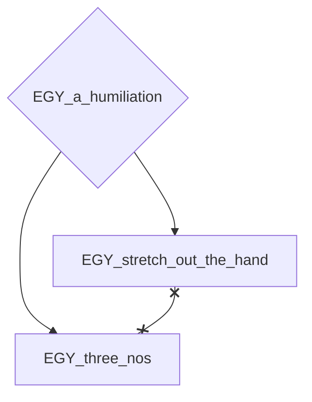
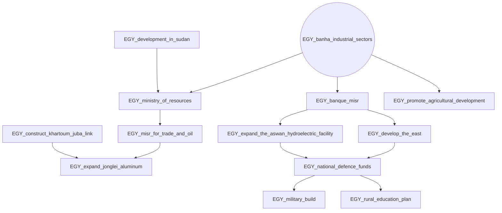
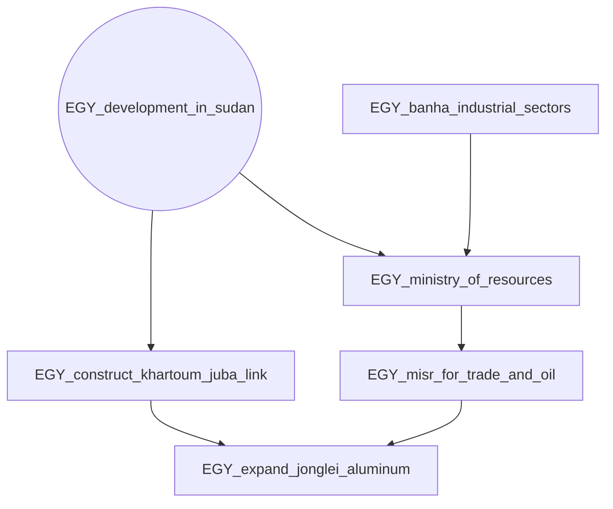
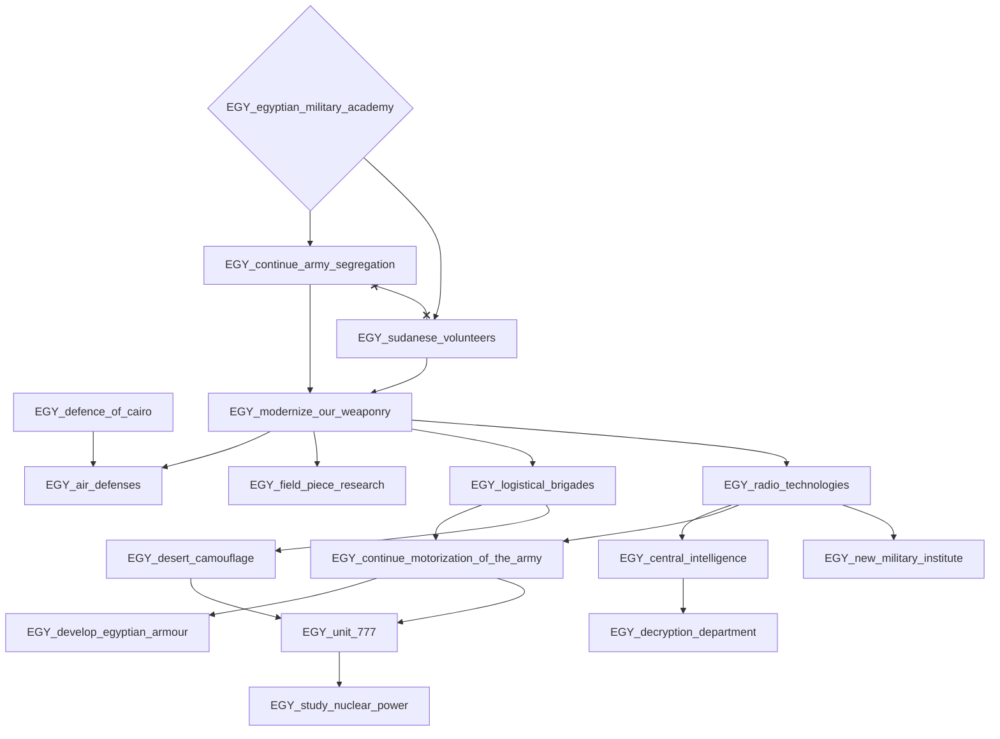
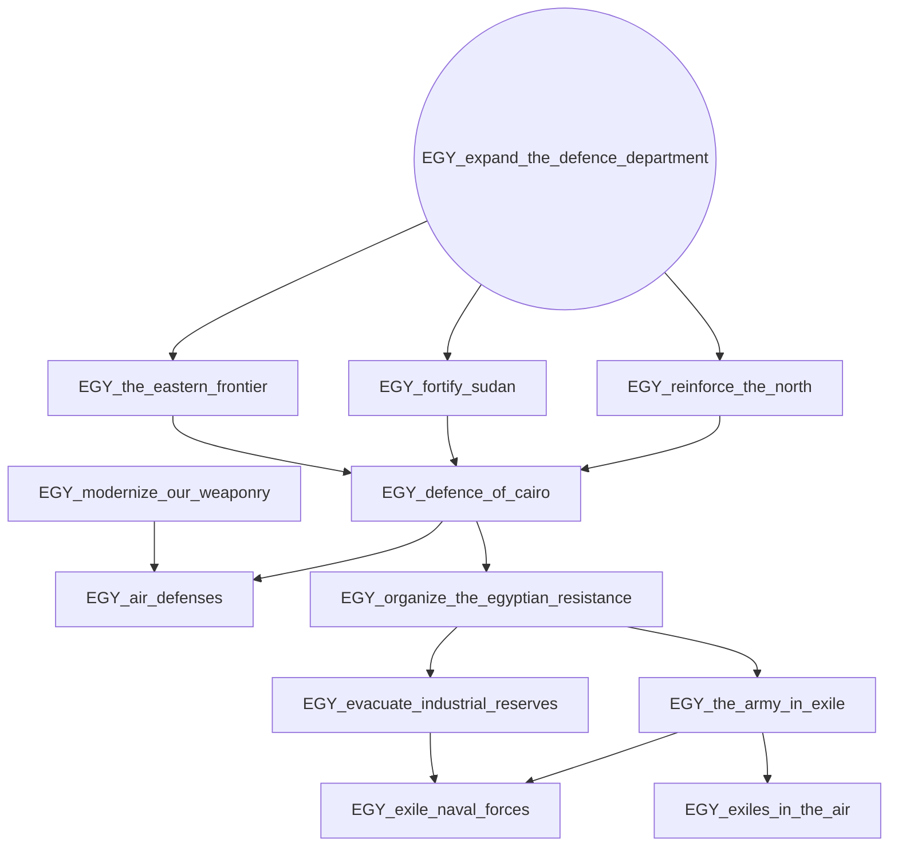
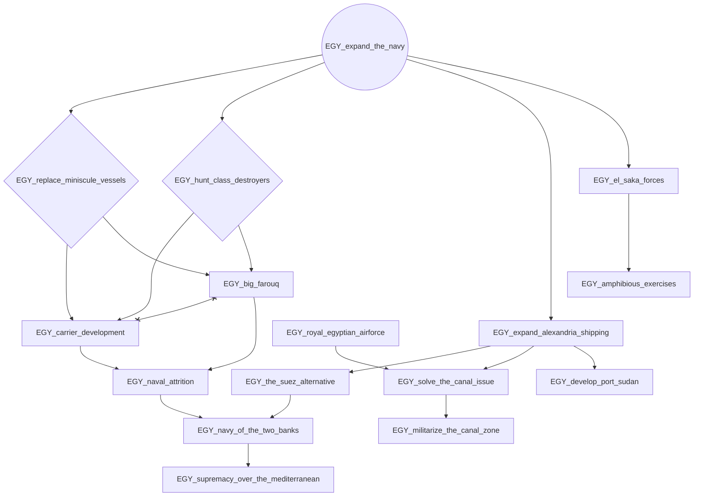
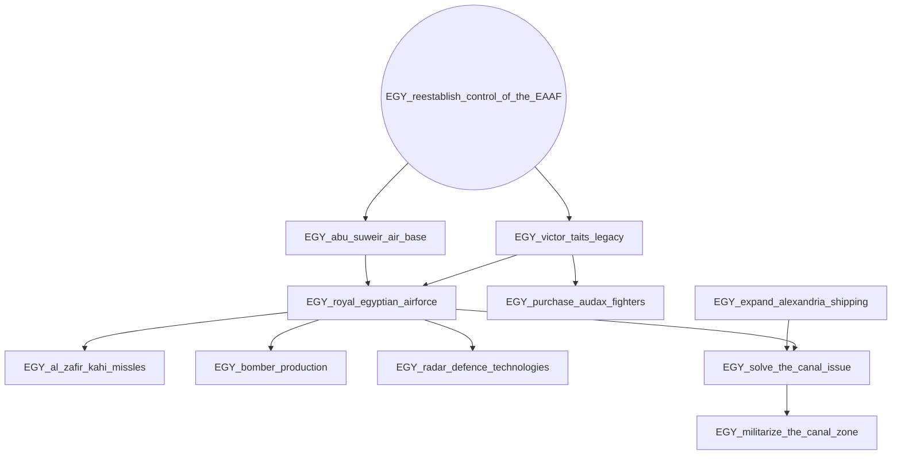
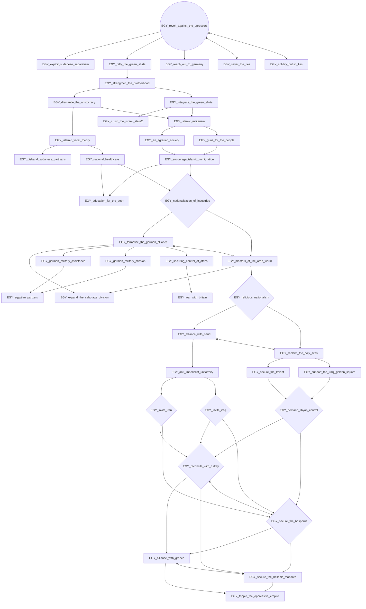
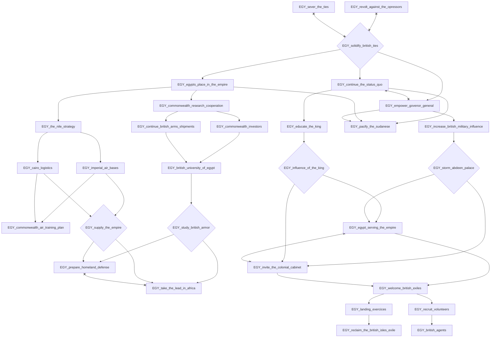

# EGY_a_humiliation

# EGY_banha_industrial_sectors

# EGY_development_in_sudan

# EGY_egyptian_military_academy

# EGY_expand_the_defence_department

# EGY_expand_the_navy

# EGY_reestablish_control_of_the_EAAF

# EGY_revolt_against_the_opressors

# EGY_sever_the_ties

```mermaid
flowchart TD
    n107["EGY_academic_sciences"]
    n108["EGY_adopt_collectivization_policies"]
    n109["EGY_anti_invasion"]
    n110["EGY_anti_israeli_coalition"]
    n111["EGY_avenge_the_battle_of_tell_el_kebir"]
    n112["EGY_bring_the_rest_of_arabia_into_the_fold"]
    n113["EGY_claim_the_albanian_throne"]
    n114["EGY_continue_international_neutrality"]
    n115["EGY_crush_the_arabian_revolt"]
    n116["EGY_crush_the_israeli_state"]
    n117["EGY_defender_of_the_arab_world_focus"]
    n118{"EGY_diplomatic_mission_to_the_soviet_union"}
    n119["EGY_dissolve_parliament"]
    n120["EGY_dominate_the_balkans"]
    n121{"EGY_emphasise_the_need_for_reform"}
    n122["EGY_end_the_regency"]
    n123["EGY_expand_royal_land_rights"]
    n124["EGY_expand_the_iron_guard"]
    n125["EGY_finalize_albanian_irredentism"]
    n126["EGY_food_importation"]
    n127{"EGY_found_the_new_kingdom"}
    n128["EGY_fund_algerian_independence"]
    n129["EGY_imperial_factories"]
    n130["EGY_intervene_in_the_turkish_civil_war"]
    n131["EGY_intervention_force"]
    n132["EGY_invite_NKVD_officers"]
    n133["EGY_invite_foreign_investors"]
    n134["EGY_invite_german_advisors"]
    n135["EGY_invite_ottoman_intellectuals"]
    n136["EGY_isolation_and_surveillance"]
    n137["EGY_join_the_allies"]
    n138["EGY_join_the_central_powers"]
    n139["EGY_join_the_comintern"]
    n140["EGY_joint_naval_development"]
    n141["EGY_liberalization_of_trade_policies"]
    n142["EGY_lift_restrictions_on_political_parties"]
    n143["EGY_mansoura_agreement"]
    n144{"EGY_middle_eastern_diplomacy"}
    n145["EGY_militarize_the_saadabad_pact"]
    n146["EGY_ministry_of_awqaf"]
    n147["EGY_mobilize_the_fellahs"]
    n148{"EGY_modernize_al_azhar"}
    n149["EGY_monopoly_over_financial_endowments"]
    n150{"EGY_move_back_to_the_ottomans"}
    n151["EGY_national_education"]
    n152["EGY_nationalize_the_blue_shirts"]
    n153["EGY_pact_of_middle_eastern_solidarity"]
    n154["EGY_permit_regional_elections"]
    n155["EGY_placate_the_army"]
    n156["EGY_pre_empt_the_ethiopian_threat"]
    n157["EGY_publicize_the_universities"]
    n158["EGY_radicalize_the_iron_guard"]
    n159["EGY_realize_the_nightmare_of_meiji"]
    n160["EGY_reclaim_the_eastern_trade_route"]
    n161{"EGY_reclaim_the_sehzade"}
    n162["EGY_reestablish_the_ottoman_alliance"]
    n163["EGY_reinforce_the_cyrenaica_claim"]
    n164["EGY_rekindle_the_unstable_alliance"]
    n165["EGY_restore_the_1930_constitution"]
    n166["EGY_restore_the_khedive"]
    n167{"EGY_revive_the_eyalet"}
    n96["EGY_revolt_against_the_opressors"]
    n168["EGY_rightful_successor_to_the_empire"]
    n169{"EGY_royalist_propaganda"}
    n170{"EGY_seek_american_material_aid"}
    n171["EGY_seek_democratic_allies"]
    n101{"EGY_sever_the_ties"}
    n102["EGY_solidify_british_ties"]
    n172["EGY_solidify_control_of_the_levant"]
    n173["EGY_soviet_tank_factories"]
    n174["EGY_strengthen_farouks_rule"]
    n175["EGY_support_communist_china"]
    n176["EGY_support_the_palestinian_liberation_movement"]
    n177["EGY_support_womens_suffrage"]
    n178["EGY_the_flying_lions"]
    n179["EGY_the_free_officers_movement"]
    n180["EGY_the_guardian_of_africa"]
    n181["EGY_the_iron_intelligence_department"]
    n182["EGY_the_king_of_sudan"]
    n183["EGY_the_kings_fleet"]
    n184["EGY_the_new_egyptian_model"]
    n185["EGY_the_non_alligned_movement"]
    n186["EGY_the_rashad_mission"]
    n187["EGY_topple_the_fascist_threat"]
    n188["EGY_treaty_of_konya"]
    n189{"EGY_unify_with_lebanon_and_syria"}
    n190["EGY_unify_with_libya"]
    n191["EGY_united_arab_republic"]
    n192["EGY_voice_of_the_arabs"]
    n123 --> n107
    n139 --> n108
    n114 --> n109
    n189 --> n110
    n138 --> n111
    n153 --> n111
    n145 --> n111
    n191 --> n112
    n169 --> n113
    n144 --> n114
    n168 --> n115
    n184 --> n116
    n158 --> n116
    n112 --> n117
    n155 --> n118
    n112 --> n118
    n174 --> n119
    n165 --> n119
    n161 --> n120
    n101 --> n121
    n101 --> n122
    n122 --> n123
    n107 --> n124
    n119 --> n124
    n127 --> n125
    n137 --> n126
    n113 --> n127
    n192 --> n128
    n161 --> n129
    n167 --> n129
    n150 --> n130
    n127 --> n131
    n139 --> n132
    n141 --> n133
    n179 --> n134
    n161 --> n135
    n167 --> n135
    n166 --> n136
    n170 --> n137
    n161 --> n138
    n167 --> n138
    n118 --> n139
    n178 --> n140
    n126 --> n140
    n143 --> n141
    n146 --> n142
    n121 --> n143
    n124 --> n144
    n161 --> n145
    n167 --> n145
    n143 --> n146
    n166 --> n147
    n179 --> n148
    n157 --> n149
    n133 --> n149
    n147 --> n150
    n136 --> n150
    n148 --> n151
    n143 --> n152
    n161 --> n153
    n167 --> n153
    n146 --> n154
    n192 --> n154
    n149 --> n155
    n177 --> n155
    n182 --> n156
    n141 --> n157
    n127 --> n158
    n111 --> n159
    n111 --> n160
    n172 --> n161
    n115 --> n161
    n130 --> n162
    n184 --> n163
    n171 --> n164
    n174 --> n165
    n101 --> n166
    n162 --> n167
    n150 --> n168
    n124 --> n169
    n155 --> n170
    n112 --> n170
    n127 --> n171
    n168 --> n172
    n108 --> n173
    n132 --> n173
    n122 --> n174
    n173 --> n175
    n148 --> n176
    n154 --> n177
    n142 --> n177
    n137 --> n178
    n121 --> n179
    n164 --> n180
    n186 --> n181
    n122 --> n182
    n166 --> n182
    n123 --> n183
    n127 --> n184
    n170 --> n185
    n118 --> n185
    n158 --> n186
    n140 --> n187
    n144 --> n188
    n192 --> n189
    n192 --> n190
    n189 --> n191
    n190 --> n191
    n128 --> n191
    n179 --> n192
    n110 x--x n176
    n113 x--x n114
    n121 x--x n121
    n121 x--x n122
    n121 x--x n166
    n122 x--x n166
    n130 x--x n168
    n137 x--x n139
    n137 x--x n185
    n138 x--x n145
    n138 x--x n153
    n139 x--x n185
    n143 x--x n179
    n145 x--x n153
    n158 x--x n171
    n158 x--x n184
    n96 x--x n101
    n171 x--x n184
    n101 x--x n102
```

# EGY_solidify_british_ties

