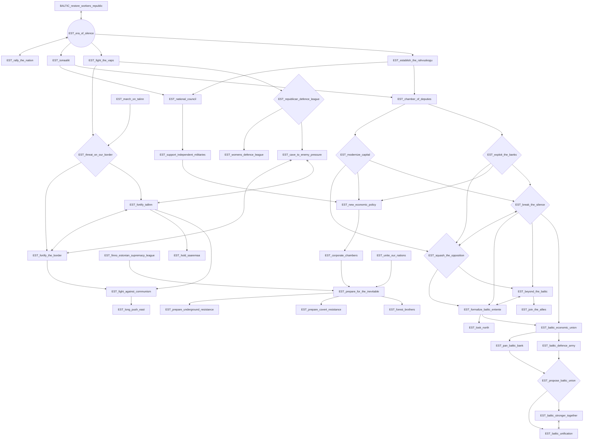
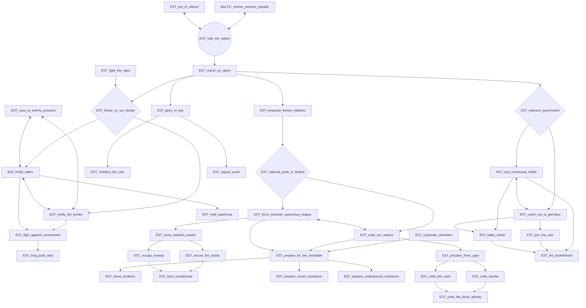

# EST_era_of_silence

```mermaid
flowchart TD
    n1["BALTIC_restore_workers_republic"]
    n2["EST_baltic_defence_army"]
    n3["EST_baltic_economic_union"]
    n4["EST_baltic_stronger_together"]
    n5["EST_baltic_unification"]
    n6["EST_beyond_the_baltic"]
    n7{"EST_break_the_silence"}
    n8["EST_cave_to_enemy_pressure"]
    n9["EST_chamber_of_deputies"]
    n10["EST_corporate_chambers"]
    n11(("EST_era_of_silence"))
    n12["EST_establish_the_rahvuskogu"]
    n13{"EST_exploit_the_banks"}
    n14["EST_fight_against_communism"]
    n15["EST_fight_the_vaps"]
    n16["EST_finno_estonian_supremacy_league"]
    n17["EST_forest_brothers"]
    n18["EST_formalize_baltic_entente"]
    n19["EST_fortify_tallinn"]
    n20["EST_fortify_the_border"]
    n21["EST_hold_saaremaa"]
    n22["EST_ismaaliit"]
    n23["EST_join_the_allies"]
    n24["EST_long_push_east"]
    n25["EST_look_north"]
    n26["EST_march_on_talinn"]
    n27{"EST_modernize_capital"}
    n28["EST_national_council"]
    n29["EST_new_economic_policy"]
    n30["EST_pan_baltic_bank"]
    n31["EST_prepare_covert_resistance"]
    n32["EST_prepare_for_the_inevitable"]
    n33["EST_prepare_underground_resistance"]
    n34{"EST_propose_baltic_union"}
    n35["EST_rally_the_nation"]
    n36{"EST_republican_defence_league"}
    n37{"EST_squash_the_opposition"}
    n38["EST_support_independent_militaries"]
    n39{"EST_threat_on_our_border"}
    n40["EST_unite_our_nations"]
    n41["EST_womens_defence_league"]
    n3 --> n2
    n18 --> n3
    n7 --> n3
    n34 --> n4
    n34 --> n5
    n7 --> n6
    n37 --> n6
    n27 --> n7
    n13 --> n7
    n36 --> n8
    n12 --> n9
    n22 --> n9
    n29 --> n10
    n11 --> n12
    n9 --> n13
    n20 --> n14
    n19 --> n14
    n11 --> n15
    n32 --> n17
    n7 --> n18
    n37 --> n18
    n39 --> n19
    n39 --> n20
    n19 --> n21
    n11 --> n22
    n6 --> n23
    n14 --> n24
    n18 --> n25
    n9 --> n27
    n22 --> n28
    n12 --> n28
    n38 --> n29
    n13 --> n29
    n27 --> n29
    n3 --> n30
    n32 --> n31
    n10 --> n32
    n40 --> n32
    n16 --> n32
    n32 --> n33
    n30 --> n34
    n2 --> n34
    n15 --> n36
    n27 --> n37
    n13 --> n37
    n28 --> n38
    n26 --> n39
    n15 --> n39
    n36 --> n41
    n1 x--x n11
    n4 x--x n5
    n6 x--x n18
    n7 x--x n37
    n8 x--x n19
    n8 x--x n20
    n11 x--x n35
    n19 x--x n20
```

# EST_rally_the_nation

```mermaid
flowchart TD
    n1["BALTIC_restore_workers_republic"]
    n42["EST_anti_communist_militia"]
    n43["EST_baltic_shield"]
    n8["EST_cave_to_enemy_pressure"]
    n10["EST_corporate_chambers"]
    n44["EST_empower_finnish_militants"]
    n11["EST_era_of_silence"]
    n14["EST_fight_against_communism"]
    n15["EST_fight_the_vaps"]
    n16["EST_finno_estonian_supremacy_league"]
    n17["EST_forest_brothers"]
    n45["EST_form_scandinavia"]
    n19["EST_fortify_tallinn"]
    n20["EST_fortify_the_border"]
    n46["EST_glory_of_war"]
    n21["EST_hold_saaremaa"]
    n47["EST_join_the_axis"]
    n24["EST_long_push_east"]
    n26["EST_march_on_talinn"]
    n48["EST_mobilize_the_vets"]
    n49{"EST_national_pride_in_finland"}
    n50["EST_occupy_norway"]
    n31["EST_prepare_covert_resistance"]
    n32["EST_prepare_for_the_inevitable"]
    n33["EST_prepare_underground_resistance"]
    n51["EST_proclaim_finno_ugra"]
    n35(("EST_rally_the_nation"))
    n52["EST_reach_out_to_germany"]
    n53["EST_secure_the_straits"]
    n54["EST_sieze_swedish_assets"]
    n55["EST_the_brotherhood"]
    n39{"EST_threat_on_our_border"}
    n56["EST_unite_karelia"]
    n40["EST_unite_our_nations"]
    n57["EST_unite_the_finnic_identity"]
    n58["EST_unite_the_sami"]
    n59["EST_vapsid_youth"]
    n60{"EST_veterans_government"}
    n60 --> n42
    n42 --> n43
    n52 --> n43
    n26 --> n44
    n20 --> n14
    n19 --> n14
    n49 --> n16
    n32 --> n17
    n53 --> n45
    n50 --> n45
    n39 --> n19
    n39 --> n20
    n26 --> n46
    n19 --> n21
    n52 --> n47
    n14 --> n24
    n35 --> n26
    n46 --> n48
    n44 --> n49
    n54 --> n50
    n32 --> n31
    n10 --> n32
    n40 --> n32
    n16 --> n32
    n32 --> n33
    n40 --> n51
    n60 --> n52
    n54 --> n53
    n16 --> n54
    n42 --> n55
    n47 --> n55
    n43 --> n55
    n26 --> n39
    n15 --> n39
    n51 --> n56
    n49 --> n40
    n56 --> n57
    n58 --> n57
    n51 --> n58
    n46 --> n59
    n26 --> n60
    n1 x--x n35
    n42 x--x n52
    n8 x--x n19
    n8 x--x n20
    n11 x--x n35
    n16 x--x n40
    n19 x--x n20
```
