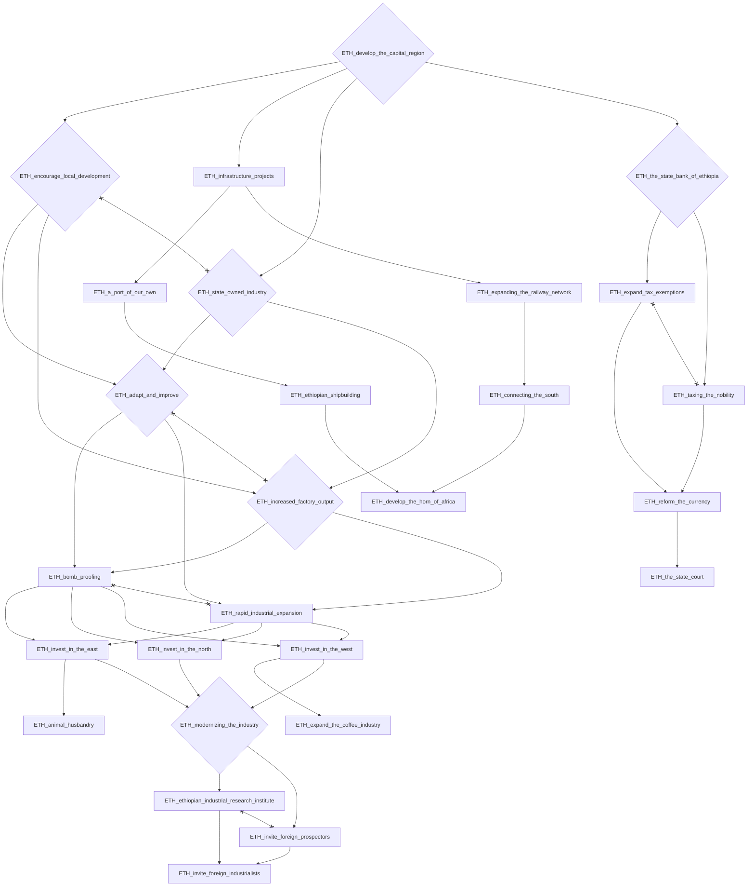
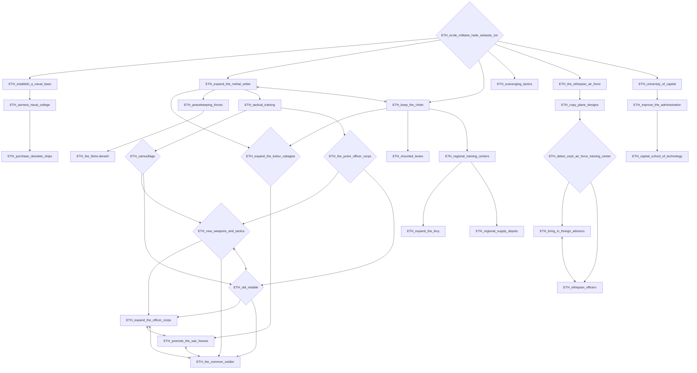
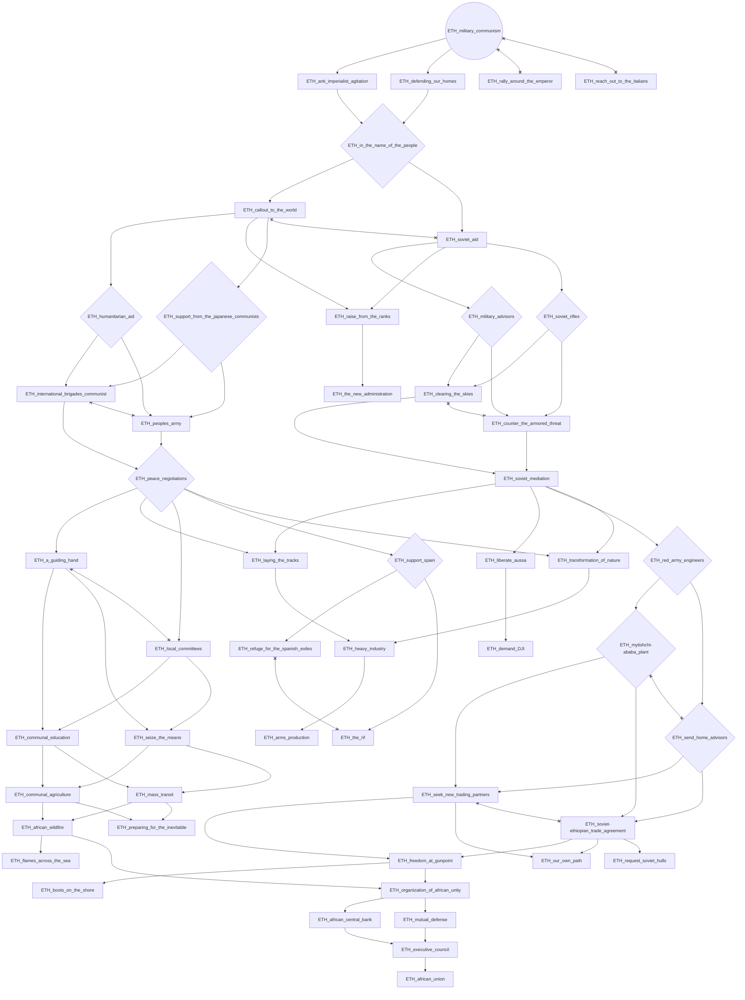
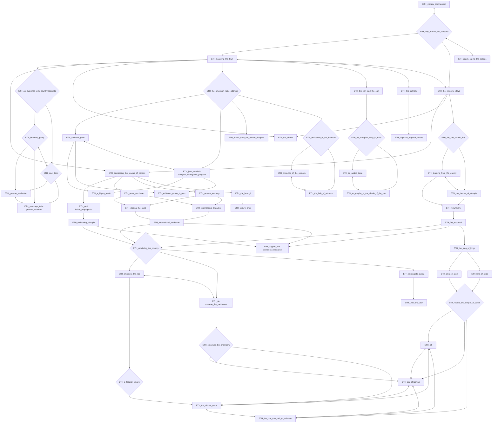
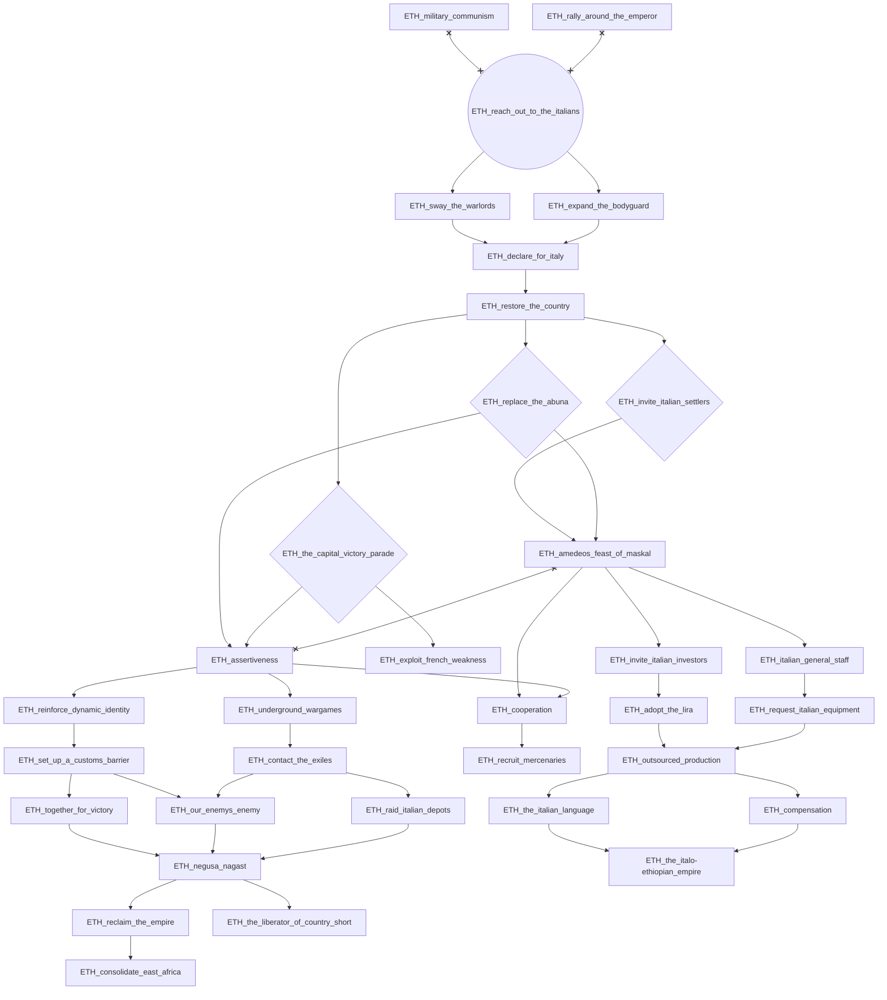
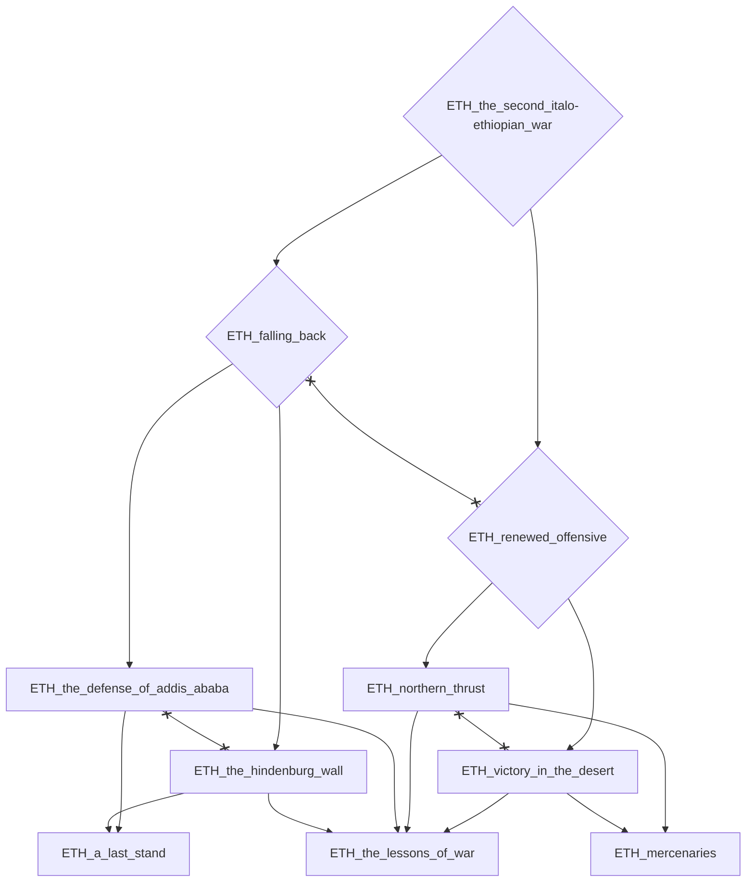

# ETH_develop_the_capital_region

# ETH_ecole_militaire_haile_selassie_1er

# ETH_military_communism

# ETH_rally_around_the_emperor

# ETH_reach_out_to_the_italians

# ETH_the_second_italo-ethiopian_war

