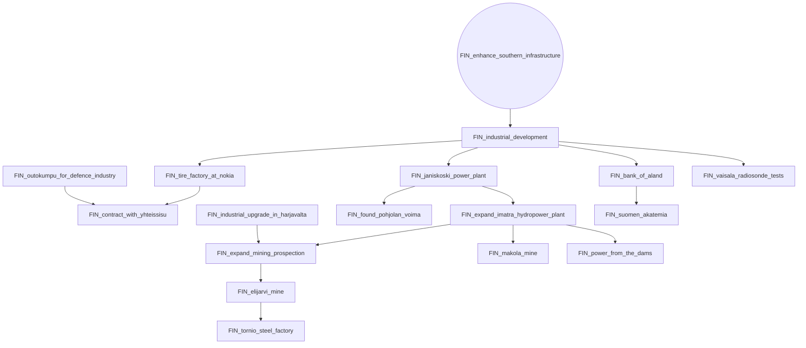
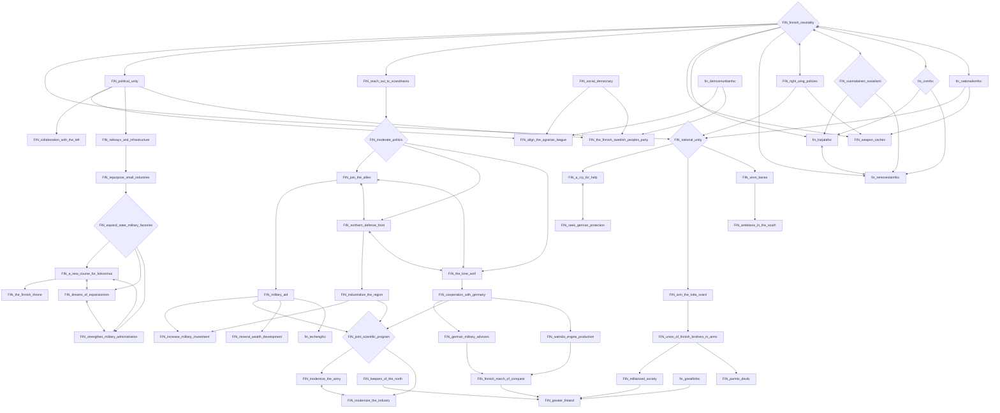
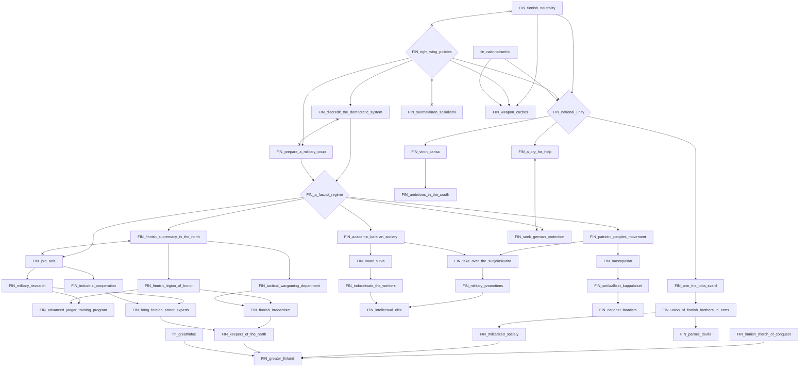
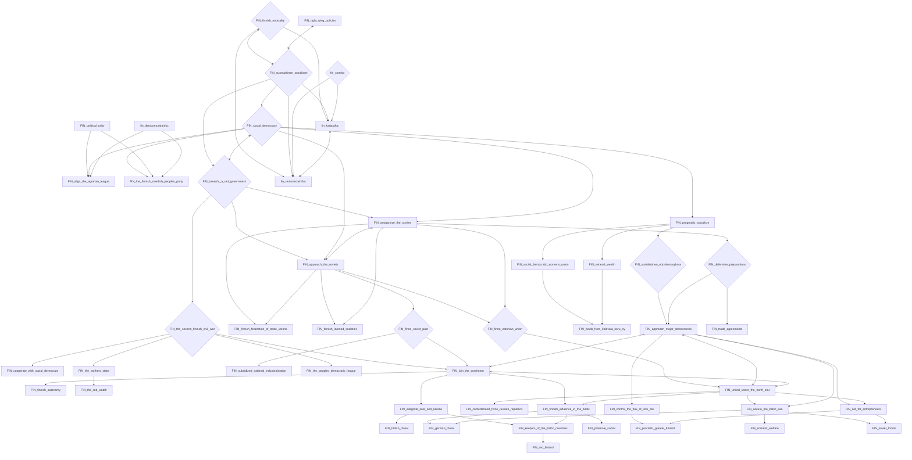
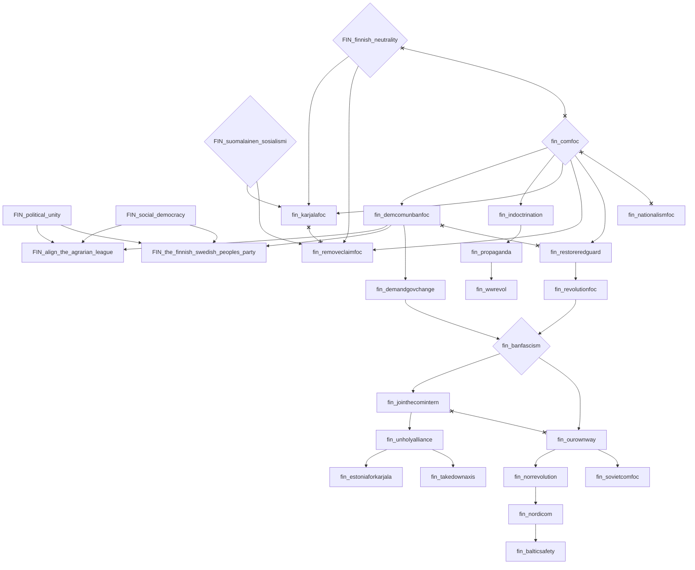
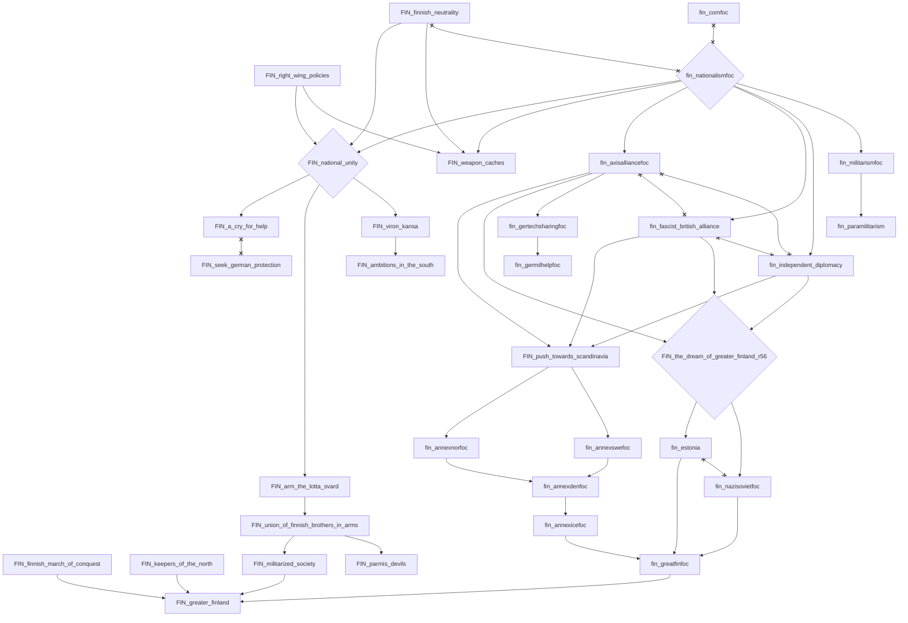

# FIN_enhance_southern_infrastructure

```mermaid
flowchart TD
    n1["FIN_bank_of_aland"]
    n2["FIN_contract_with_yhteissisu"]
    n3["FIN_elijarvi_mine"]
    n4(("FIN_enhance_southern_infrastructure"))
    n5["FIN_expand_imatra_hydropower_plant"]
    n6["FIN_expand_mining_prospection"]
    n7["FIN_found_pohjolan_voima"]
    n8["FIN_industrial_development"]
    n9["FIN_industrial_upgrade_in_harjavalta"]
    n10["FIN_janiskoski_power_plant"]
    n11["FIN_makola_mine"]
    n12["FIN_outokumpu_for_defence_industry"]
    n13["FIN_power_from_the_dams"]
    n14["FIN_suomen_akatemia"]
    n15["FIN_tire_factory_at_nokia"]
    n16["FIN_tornio_steel_factory"]
    n17["FIN_vaisala_radiosonde_tests"]
    n8 --> n1
    n15 --> n2
    n12 --> n2
    n6 --> n3
    n10 --> n5
    n5 --> n6
    n9 --> n6
    n10 --> n7
    n4 --> n8
    n8 --> n10
    n5 --> n11
    n5 --> n13
    n1 --> n14
    n8 --> n15
    n3 --> n16
    n8 --> n17
```

# FIN_finnish_neutrality

```mermaid
flowchart TD
    n18["FIN_a_cry_for_help"]
    n19["FIN_a_new_course_for_kokoomus"]
    n20["FIN_align_the_agrarian_league"]
    n21["FIN_ambitions_in_the_south"]
    n22["FIN_arm_the_lotta_svard"]
    n23["FIN_collaboration_with_the_left"]
    n24["FIN_cooperation_with_germany"]
    n25["FIN_dreams_of_expansionism"]
    n26{"FIN_expand_state_military_factories"}
    n27["FIN_finnish_march_of_conquest"]
    n28{"FIN_finnish_neutrality"}
    n29["FIN_german_military_advisors"]
    n30["FIN_greater_finland"]
    n31["FIN_increase_military_investment"]
    n32["FIN_industrialize_the_region"]
    n33["FIN_join_the_allies"]
    n34{"FIN_joint_scientific_program"}
    n35["FIN_keepers_of_the_north"]
    n36["FIN_militarized_society"]
    n37["FIN_military_aid"]
    n38["FIN_mineral_wealth_development"]
    n39{"FIN_moderate_politics"}
    n40["FIN_modernize_the_army"]
    n41["FIN_modernize_the_industry"]
    n42{"FIN_national_unity"}
    n43["FIN_northern_defense_front"]
    n44["FIN_parmis_devils"]
    n45["FIN_political_unity"]
    n46["FIN_railways_and_infrastructure"]
    n47["FIN_reach_out_to_scandinavia"]
    n48["FIN_repurpose_small_industries"]
    n49["FIN_right_wing_policies"]
    n50["FIN_seek_german_protection"]
    n51["FIN_social_democracy"]
    n52["FIN_strengthen_military_administration"]
    n53{"FIN_suomalainen_sosialismi"}
    n54["FIN_the_finnish_swedish_peoples_party"]
    n55["FIN_the_finnish_throne"]
    n56["FIN_the_lone_wolf"]
    n57["FIN_union_of_finnish_brothers_in_arms"]
    n58["FIN_viron_kansa"]
    n59["FIN_wartsila_engine_production"]
    n60["FIN_weapon_caches"]
    n61{"fin_comfoc"}
    n62["fin_demcomunbanfoc"]
    n63["fin_greatfinfoc"]
    n64["fin_karjalafoc"]
    n65["fin_nationalismfoc"]
    n66["fin_removeclaimfoc"]
    n67["fin_techengfoc"]
    n42 --> n18
    n26 --> n19
    n45 --> n20
    n51 --> n20
    n62 --> n20
    n58 --> n21
    n42 --> n22
    n45 --> n23
    n56 --> n24
    n26 --> n25
    n48 --> n26
    n59 --> n27
    n29 --> n27
    n24 --> n29
    n27 --> n30
    n36 --> n30
    n35 --> n30
    n63 --> n30
    n37 --> n31
    n32 --> n31
    n43 --> n32
    n39 --> n33
    n32 --> n34
    n24 --> n34
    n37 --> n34
    n57 --> n36
    n33 --> n37
    n37 --> n38
    n47 --> n39
    n34 --> n40
    n34 --> n41
    n28 --> n42
    n49 --> n42
    n65 --> n42
    n39 --> n43
    n57 --> n44
    n28 --> n45
    n45 --> n46
    n28 --> n47
    n46 --> n48
    n26 --> n52
    n51 --> n54
    n45 --> n54
    n62 --> n54
    n19 --> n55
    n39 --> n56
    n22 --> n57
    n42 --> n58
    n24 --> n59
    n28 --> n60
    n49 --> n60
    n65 --> n60
    n28 --> n64
    n53 --> n64
    n61 --> n64
    n28 --> n66
    n53 --> n66
    n61 --> n66
    n37 --> n67
    n18 x--x n50
    n19 x--x n25
    n19 x--x n52
    n25 x--x n52
    n28 x--x n49
    n28 x--x n53
    n28 x--x n61
    n28 x--x n65
    n33 x--x n43
    n33 x--x n56
    n40 x--x n41
    n43 x--x n56
    n64 x--x n66
```

# FIN_increase_military_budget

```mermaid
flowchart TD
    n68["FIN_acquire_andros_dockyards"]
    n69{"FIN_coastal_defense"}
    n2["FIN_contract_with_yhteissisu"]
    n70["FIN_conversion_of_civilian_vessels"]
    n71["FIN_deep_sea_raiders"]
    n72["FIN_defense_in_depth"]
    n73{"FIN_dominate_the_skies"}
    n3["FIN_elijarvi_mine"]
    n74["FIN_expand_air_bases"]
    n75["FIN_expand_air_force_academy"]
    n5["FIN_expand_imatra_hydropower_plant"]
    n6["FIN_expand_mining_prospection"]
    n76["FIN_expand_production_lines"]
    n77["FIN_expand_ship_building_industry"]
    n78["FIN_expansion_towards_the_atlantic"]
    n79["FIN_extra_refresher_exercises"]
    n80{"FIN_finnish_radio_intelligence"}
    n81["FIN_foreign_aircraft"]
    n82["FIN_foreign_armor"]
    n83["FIN_helsinki_air_defense"]
    n84(("FIN_increase_military_budget"))
    n9["FIN_industrial_upgrade_in_harjavalta"]
    n85["FIN_innovative_designs"]
    n86["FIN_integrate_oy_tikkakoski"]
    n87["FIN_jaeger_movement"]
    n88{"FIN_long_range_patrols"}
    n89["FIN_mannerheim_line"]
    n90["FIN_marine_jaeger_divisions"]
    n91["FIN_modernize_production_lines"]
    n92["FIN_motti_tactics"]
    n93{"FIN_national_aircraft_production"}
    n94["FIN_national_armor_focus"]
    n95["FIN_national_firepower"]
    n96{"FIN_naval_airforce"}
    n97["FIN_operation_kilpapurjehdus"]
    n12["FIN_outokumpu_for_defence_industry"]
    n98["FIN_oy_alkoholiliike"]
    n99["FIN_pilot_training"]
    n100["FIN_rapid_raiders"]
    n101["FIN_salpa_line"]
    n102{"FIN_salvaged_and_retooled"}
    n103["FIN_sea_mines_strategy"]
    n104["FIN_sissi"]
    n105["FIN_strengthen_the_naval_bases"]
    n106["FIN_suomen_ilmavoimat"]
    n107["FIN_suomen_maavoimat"]
    n108["FIN_suomen_merivoimat"]
    n109{"FIN_support_for_ground_forces"}
    n110["FIN_the_cold_front"]
    n111["FIN_the_merchant_fleet"]
    n15["FIN_tire_factory_at_nokia"]
    n16["FIN_tornio_steel_factory"]
    n112["FIN_underground_resistance_cells"]
    n113{"FIN_utilize_the_sami"}
    n114["FIN_winter_warfare"]
    n108 --> n68
    n108 --> n69
    n15 --> n2
    n12 --> n2
    n111 --> n70
    n69 --> n70
    n69 --> n71
    n89 --> n72
    n93 --> n73
    n6 --> n3
    n106 --> n74
    n99 --> n75
    n5 --> n6
    n9 --> n6
    n109 --> n76
    n73 --> n76
    n105 --> n77
    n68 --> n77
    n103 --> n78
    n77 --> n78
    n107 --> n79
    n92 --> n80
    n74 --> n81
    n102 --> n82
    n89 --> n83
    n74 --> n83
    n12 --> n9
    n94 --> n85
    n12 --> n86
    n79 --> n87
    n114 --> n88
    n92 --> n88
    n107 --> n89
    n69 --> n90
    n73 --> n91
    n109 --> n91
    n96 --> n91
    n87 --> n92
    n102 --> n92
    n110 --> n92
    n74 --> n93
    n99 --> n93
    n102 --> n94
    n80 --> n94
    n86 --> n95
    n106 --> n96
    n108 --> n96
    n107 --> n97
    n107 --> n12
    n12 --> n98
    n106 --> n99
    n69 --> n100
    n72 --> n101
    n79 --> n102
    n100 --> n103
    n71 --> n103
    n88 --> n104
    n80 --> n104
    n113 --> n104
    n108 --> n105
    n84 --> n106
    n84 --> n107
    n84 --> n108
    n93 --> n109
    n79 --> n110
    n108 --> n111
    n3 --> n16
    n107 --> n112
    n114 --> n113
    n110 --> n114
    n71 x--x n100
    n73 x--x n109
    n76 x--x n91
    n94 x--x n104
```

# FIN_right_wing_policies

```mermaid
flowchart TD
    n18["FIN_a_cry_for_help"]
    n115{"FIN_a_fascist_regime"}
    n116["FIN_academic_karelian_society"]
    n117["FIN_advanced_jaeger_training_program"]
    n21["FIN_ambitions_in_the_south"]
    n22["FIN_arm_the_lotta_svard"]
    n118["FIN_bring_foreign_armor_experts"]
    n119["FIN_discredit_the_democratic_system"]
    n120["FIN_finnish_irredentism"]
    n121["FIN_finnish_legion_of_honor"]
    n27["FIN_finnish_march_of_conquest"]
    n28["FIN_finnish_neutrality"]
    n122["FIN_finnish_supremacy_in_the_north"]
    n30["FIN_greater_finland"]
    n123["FIN_indoctrinate_the_workers"]
    n124["FIN_industrial_cooperation"]
    n125["FIN_intellectual_elite"]
    n126["FIN_join_axis"]
    n35["FIN_keepers_of_the_north"]
    n127["FIN_maan_turva"]
    n36["FIN_militarized_society"]
    n128["FIN_military_promotions"]
    n129["FIN_military_research"]
    n130["FIN_mustapaidat"]
    n131["FIN_national_fanatism"]
    n42{"FIN_national_unity"}
    n44["FIN_parmis_devils"]
    n132["FIN_patriotic_peoples_movement"]
    n133["FIN_prepare_a_military_coup"]
    n49{"FIN_right_wing_policies"}
    n50["FIN_seek_german_protection"]
    n134["FIN_sotilaalliset_kappalaiset"]
    n53["FIN_suomalainen_sosialismi"]
    n135["FIN_tactical_wargaming_department"]
    n136["FIN_take_over_the_suojeluskunta"]
    n57["FIN_union_of_finnish_brothers_in_arms"]
    n58["FIN_viron_kansa"]
    n60["FIN_weapon_caches"]
    n63["fin_greatfinfoc"]
    n65["fin_nationalismfoc"]
    n42 --> n18
    n119 --> n115
    n133 --> n115
    n115 --> n116
    n129 --> n117
    n121 --> n117
    n58 --> n21
    n42 --> n22
    n129 --> n118
    n124 --> n118
    n49 --> n119
    n121 --> n120
    n135 --> n120
    n122 --> n121
    n115 --> n122
    n27 --> n30
    n36 --> n30
    n35 --> n30
    n63 --> n30
    n127 --> n123
    n126 --> n124
    n128 --> n125
    n123 --> n125
    n115 --> n126
    n120 --> n35
    n118 --> n35
    n116 --> n127
    n57 --> n36
    n136 --> n128
    n126 --> n129
    n132 --> n130
    n134 --> n131
    n28 --> n42
    n49 --> n42
    n65 --> n42
    n57 --> n44
    n115 --> n132
    n49 --> n133
    n115 --> n50
    n130 --> n134
    n122 --> n135
    n132 --> n136
    n116 --> n136
    n22 --> n57
    n42 --> n58
    n28 --> n60
    n49 --> n60
    n65 --> n60
    n18 x--x n50
    n119 x--x n133
    n28 x--x n49
    n122 x--x n126
    n49 x--x n53
```

# FIN_suomalainen_sosialismi

```mermaid
flowchart TD
    n137["FIN_aid_for_entrepreneurs"]
    n20["FIN_align_the_agrarian_league"]
    n138["FIN_antagonize_the_soviets"]
    n139["FIN_approach_major_democracies"]
    n140["FIN_approach_the_soviets"]
    n141["FIN_british_threat"]
    n142["FIN_confederated_finno_russian_republics"]
    n143["FIN_control_the_flux_of_iron_ore"]
    n144["FIN_cooperate_with_social_democrats"]
    n145{"FIN_defensive_preparations"}
    n146["FIN_finnish_autonomy"]
    n147["FIN_finnish_federation_of_trade_unions"]
    n148["FIN_finnish_influence_in_the_baltic"]
    n149["FIN_finnish_learned_societies"]
    n28{"FIN_finnish_neutrality"}
    n150{"FIN_finno_estonian_union"}
    n151{"FIN_finno_soviet_pact"}
    n152["FIN_funds_from_kalevala_koru_oy"]
    n153["FIN_german_threat"]
    n154["FIN_integrate_kola_and_karelia"]
    n155["FIN_join_the_comintern"]
    n156["FIN_keepers_of_the_baltic_countries"]
    n157["FIN_mineral_wealth"]
    n45["FIN_political_unity"]
    n158["FIN_pragmatic_socialism"]
    n159["FIN_preserve_sapmi"]
    n160["FIN_proclaim_greater_finland"]
    n161["FIN_red_finland"]
    n49["FIN_right_wing_policies"]
    n162["FIN_secure_the_baltic_sea"]
    n51{"FIN_social_democracy"}
    n163["FIN_social_democratic_womens_union"]
    n164["FIN_socialist_welfare"]
    n165{"FIN_sosialistinen_eduskuntaryhma"}
    n166["FIN_soviet_threat"]
    n167["FIN_subsidized_national_industrialization"]
    n53{"FIN_suomalainen_sosialismi"}
    n54["FIN_the_finnish_swedish_peoples_party"]
    n168["FIN_the_peoples_democratic_league"]
    n169["FIN_the_red_watch"]
    n170{"FIN_the_second_finnish_civil_war"}
    n171["FIN_the_workers_state"]
    n172{"FIN_towards_a_red_government"}
    n173["FIN_trade_agreements"]
    n174["FIN_united_under_the_north_star"]
    n61{"fin_comfoc"}
    n62["fin_demcomunbanfoc"]
    n64["fin_karjalafoc"]
    n66["fin_removeclaimfoc"]
    n139 --> n137
    n174 --> n137
    n45 --> n20
    n51 --> n20
    n62 --> n20
    n172 --> n138
    n51 --> n138
    n165 --> n139
    n145 --> n139
    n172 --> n140
    n51 --> n140
    n154 --> n141
    n174 --> n142
    n139 --> n143
    n170 --> n144
    n138 --> n145
    n155 --> n146
    n138 --> n147
    n140 --> n147
    n155 --> n148
    n174 --> n148
    n140 --> n149
    n138 --> n149
    n140 --> n150
    n138 --> n150
    n140 --> n151
    n163 --> n152
    n157 --> n152
    n148 --> n153
    n162 --> n153
    n155 --> n154
    n170 --> n155
    n151 --> n155
    n154 --> n156
    n148 --> n156
    n158 --> n157
    n51 --> n158
    n148 --> n159
    n143 --> n160
    n137 --> n160
    n156 --> n161
    n174 --> n162
    n139 --> n162
    n53 --> n51
    n158 --> n163
    n162 --> n164
    n158 --> n165
    n162 --> n166
    n137 --> n166
    n151 --> n167
    n51 --> n54
    n45 --> n54
    n62 --> n54
    n170 --> n168
    n171 --> n169
    n172 --> n170
    n170 --> n171
    n53 --> n172
    n145 --> n173
    n150 --> n174
    n28 --> n64
    n53 --> n64
    n61 --> n64
    n28 --> n66
    n53 --> n66
    n61 --> n66
    n138 x--x n140
    n139 x--x n155
    n139 x--x n174
    n28 x--x n53
    n155 x--x n174
    n49 x--x n53
    n51 x--x n172
    n64 x--x n66
```

# fin_comfoc

```mermaid
flowchart TD
    n20["FIN_align_the_agrarian_league"]
    n28{"FIN_finnish_neutrality"}
    n45["FIN_political_unity"]
    n51["FIN_social_democracy"]
    n53{"FIN_suomalainen_sosialismi"}
    n54["FIN_the_finnish_swedish_peoples_party"]
    n175["fin_balticsafety"]
    n176{"fin_banfascism"}
    n61{"fin_comfoc"}
    n177["fin_demandgovchange"]
    n62["fin_demcomunbanfoc"]
    n178["fin_estoniaforkarjala"]
    n179["fin_indoctrination"]
    n180["fin_jointhecomintern"]
    n64["fin_karjalafoc"]
    n65["fin_nationalismfoc"]
    n181["fin_nordicom"]
    n182["fin_norrevolution"]
    n183["fin_ourownway"]
    n184["fin_propaganda"]
    n66["fin_removeclaimfoc"]
    n185["fin_restoreredguard"]
    n186["fin_revolutionfoc"]
    n187["fin_sovietcomfoc"]
    n188["fin_takedownaxis"]
    n189["fin_unholyalliance"]
    n190["fin_wwrevol"]
    n45 --> n20
    n51 --> n20
    n62 --> n20
    n51 --> n54
    n45 --> n54
    n62 --> n54
    n181 --> n175
    n186 --> n176
    n177 --> n176
    n62 --> n177
    n61 --> n62
    n189 --> n178
    n61 --> n179
    n176 --> n180
    n28 --> n64
    n53 --> n64
    n61 --> n64
    n182 --> n181
    n183 --> n182
    n176 --> n183
    n179 --> n184
    n28 --> n66
    n53 --> n66
    n61 --> n66
    n61 --> n185
    n185 --> n186
    n183 --> n187
    n189 --> n188
    n180 --> n189
    n184 --> n190
    n28 x--x n61
    n61 x--x n65
    n62 x--x n185
    n180 x--x n183
    n64 x--x n66
```

# fin_nationalismfoc

```mermaid
flowchart TD
    n18["FIN_a_cry_for_help"]
    n21["FIN_ambitions_in_the_south"]
    n22["FIN_arm_the_lotta_svard"]
    n27["FIN_finnish_march_of_conquest"]
    n28["FIN_finnish_neutrality"]
    n30["FIN_greater_finland"]
    n35["FIN_keepers_of_the_north"]
    n36["FIN_militarized_society"]
    n42{"FIN_national_unity"}
    n44["FIN_parmis_devils"]
    n191["FIN_push_towards_scandinavia"]
    n49["FIN_right_wing_policies"]
    n50["FIN_seek_german_protection"]
    n192{"FIN_the_dream_of_greater_finland_r56"}
    n57["FIN_union_of_finnish_brothers_in_arms"]
    n58["FIN_viron_kansa"]
    n60["FIN_weapon_caches"]
    n193["fin_annexdenfoc"]
    n194["fin_annexicefoc"]
    n195["fin_annexnorfoc"]
    n196["fin_annexswefoc"]
    n197["fin_axisalliancefoc"]
    n61["fin_comfoc"]
    n198["fin_estonia"]
    n199["fin_fascist_british_alliance"]
    n200["fin_germilhelpfoc"]
    n201["fin_gertechsharingfoc"]
    n63["fin_greatfinfoc"]
    n202["fin_independent_diplomacy"]
    n203["fin_militarismfoc"]
    n65{"fin_nationalismfoc"}
    n204["fin_nazisovietfoc"]
    n205["fin_paramilitarism"]
    n42 --> n18
    n58 --> n21
    n42 --> n22
    n27 --> n30
    n36 --> n30
    n35 --> n30
    n63 --> n30
    n57 --> n36
    n28 --> n42
    n49 --> n42
    n65 --> n42
    n57 --> n44
    n197 --> n191
    n202 --> n191
    n199 --> n191
    n197 --> n192
    n202 --> n192
    n199 --> n192
    n22 --> n57
    n42 --> n58
    n28 --> n60
    n49 --> n60
    n65 --> n60
    n196 --> n193
    n195 --> n193
    n193 --> n194
    n191 --> n195
    n191 --> n196
    n65 --> n197
    n192 --> n198
    n65 --> n199
    n201 --> n200
    n197 --> n201
    n194 --> n63
    n204 --> n63
    n198 --> n63
    n65 --> n202
    n65 --> n203
    n192 --> n204
    n203 --> n205
    n18 x--x n50
    n28 x--x n65
    n197 x--x n199
    n197 x--x n202
    n61 x--x n65
    n198 x--x n204
    n199 x--x n202
```
