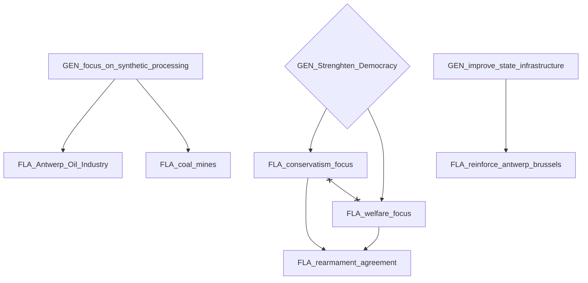

# orphans

```mermaid
flowchart TD
    n1["FLA_Antwerp_Oil_Industry"]
    n2["FLA_coal_mines"]
    n3["FLA_conservatism_focus"]
    n4["FLA_rearmament_agreement"]
    n5["FLA_reinforce_antwerp_brussels"]
    n6["FLA_welfare_focus"]
    n7{"GEN_Strenghten_Democracy"}
    n8["GEN_focus_on_synthetic_processing"]
    n9["GEN_improve_state_infrastructure"]
    n8 --> n1
    n8 --> n2
    n7 --> n3
    n6 --> n4
    n3 --> n4
    n9 --> n5
    n7 --> n6
    n3 x--x n6
```
