# FRA_CHEDN

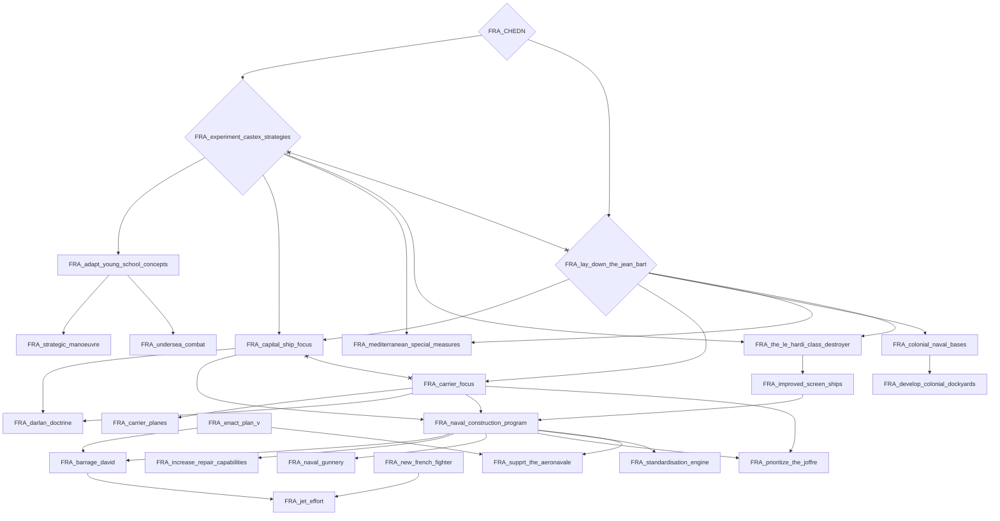

# FRA_action_francaise

```mermaid
flowchart TD
    n26["FRA_a_more_durable_tilsit_treaty"]
    n27(("FRA_action_francaise"))
    n28["FRA_ally_italy"]
    n29["FRA_anti_communism_r56"]
    n30["FRA_anti_german_front"]
    n31["FRA_approach_poland_and_romania"]
    n32["FRA_approach_the_empire_of_brazil"]
    n33["FRA_assist_the_carlist_cause"]
    n34["FRA_brumaire_movement"]
    n35["FRA_cagoule_coup"]
    n36["FRA_camelots_roi"]
    n37{"FRA_claim_rhineland"}
    n38["FRA_claim_the_andorran_throne"]
    n39{"FRA_compromise_with_germany"}
    n40["FRA_constitutional_monarchy"]
    n41["FRA_convince_spain"]
    n42["FRA_counter_the_fascist_infulence"]
    n43{"FRA_crush_germany"}
    n44["FRA_decentralise_the_state"]
    n45{"FRA_demand_wallonia"}
    n46["FRA_destroy_albion"]
    n47{"FRA_diplomatic_freedom"}
    n48["FRA_dismantle_germany"]
    n49["FRA_disunite_germany"]
    n50["FRA_disunite_italy"]
    n51["FRA_embrace_the_counter_revolution"]
    n52["FRA_empire_invite_yugoslavia"]
    n53["FRA_empire_obtain_polish_cryptological_data"]
    n54["FRA_empire_pact_with_spain"]
    n55["FRA_far_right_leagues"]
    n56["FRA_front_liberte"]
    n57{"FRA_intervene_in_the_spanish_civil_war"}
    n58["FRA_invite_portugal"]
    n59["FRA_keep_the_separation_of_church_and_state"]
    n60["FRA_legacy_of_the_grande_armee"]
    n61["FRA_metropolitan_priority"]
    n62["FRA_militarist_society"]
    n63["FRA_napoleon_iii_legacy"]
    n64["FRA_national_integralism"]
    n65{"FRA_nothern_italy_claim"}
    n66["FRA_operation_charlemagna"]
    n67{"FRA_our_natural_borders"}
    n68["FRA_oust_maurras"]
    n69["FRA_pacify_the_spanish_countryside"]
    n70["FRA_pact_with_spain"]
    n71{"FRA_papal_rehabilitation"}
    n72["FRA_plan_xiv"]
    n73["FRA_proclaim_the_dual_monarchy"]
    n74["FRA_public_works"]
    n75["FRA_radicalize_front"]
    n76["FRA_reorganize_the_dutch"]
    n77{"FRA_repeal_the_law_of_exile"}
    n78["FRA_restore_ancient_reights"]
    n79["FRA_restore_the_mexican_monarchy"]
    n80["FRA_return_to_dalmatia"]
    n81["FRA_revise_versailles"]
    n82["FRA_root_out_communism"]
    n83["FRA_second_march_on_moscow"]
    n84["FRA_secure_catalonia"]
    n85["FRA_secure_iberia"]
    n86["FRA_secure_the_crown_of_spain"]
    n87{"FRA_side_with_the_orleanists"}
    n88["FRA_social_nationalism"]
    n89["FRA_split_belgium"]
    n90["FRA_split_switzerland"]
    n91{"FRA_state_reorganisation"}
    n92["FRA_status_quo"]
    n93["FRA_strike_urss"]
    n94{"FRA_support_ppf"}
    n95{"FRA_support_the_legitimatises"}
    n96["FRA_support_the_spanish_nationalists"]
    n97["FRA_take_back_north_america"]
    n98{"FRA_the_new_continental_system"}
    n99{"FRA_ultimatum_to_belgium"}
    n100["FRA_unify_the_metropole"]
    n101{"FRA_union_latins"}
    n102{"FRA_we_want_petain"}
    n103["FRA_woo_italy"]
    n67 --> n26
    n30 --> n28
    n28 --> n29
    n70 --> n29
    n96 --> n30
    n67 --> n31
    n67 --> n32
    n39 --> n32
    n95 --> n33
    n71 --> n34
    n77 --> n34
    n64 --> n36
    n45 --> n37
    n99 --> n37
    n86 --> n38
    n98 --> n39
    n68 --> n40
    n59 --> n40
    n37 --> n41
    n101 --> n41
    n87 --> n42
    n67 --> n43
    n88 --> n44
    n94 --> n45
    n102 --> n45
    n91 --> n45
    n101 --> n45
    n67 --> n46
    n39 --> n46
    n37 --> n48
    n43 --> n49
    n65 --> n50
    n44 --> n51
    n78 --> n51
    n65 --> n52
    n31 --> n53
    n67 --> n54
    n39 --> n54
    n33 --> n57
    n101 --> n58
    n42 --> n59
    n62 --> n60
    n40 --> n61
    n34 --> n62
    n67 --> n63
    n39 --> n63
    n87 --> n64
    n95 --> n64
    n67 --> n65
    n39 --> n65
    n37 --> n66
    n81 --> n66
    n98 --> n67
    n42 --> n68
    n73 --> n69
    n30 --> n70
    n27 --> n71
    n48 --> n72
    n86 --> n73
    n40 --> n74
    n67 --> n76
    n27 --> n77
    n88 --> n78
    n46 --> n79
    n65 --> n80
    n47 --> n81
    n45 --> n81
    n99 --> n81
    n55 --> n82
    n27 --> n82
    n43 --> n83
    n67 --> n84
    n39 --> n84
    n84 --> n85
    n57 --> n86
    n71 --> n87
    n77 --> n87
    n64 --> n88
    n39 --> n89
    n81 --> n90
    n90 --> n93
    n71 --> n95
    n77 --> n95
    n95 --> n96
    n87 --> n96
    n46 --> n97
    n34 --> n98
    n94 --> n99
    n102 --> n99
    n91 --> n99
    n101 --> n99
    n35 --> n100
    n56 --> n100
    n71 --> n100
    n95 --> n101
    n37 --> n103
    n101 --> n103
    n26 x--x n83
    n27 x--x n55
    n27 x--x n75
    n27 x--x n92
    n33 x--x n96
    n34 x--x n87
    n34 x--x n95
    n37 x--x n81
    n39 x--x n67
    n41 x--x n86
    n42 x--x n64
    n45 x--x n99
    n52 x--x n80
    n54 x--x n84
    n63 x--x n65
    n87 x--x n95
```

# FRA_colonial_investments

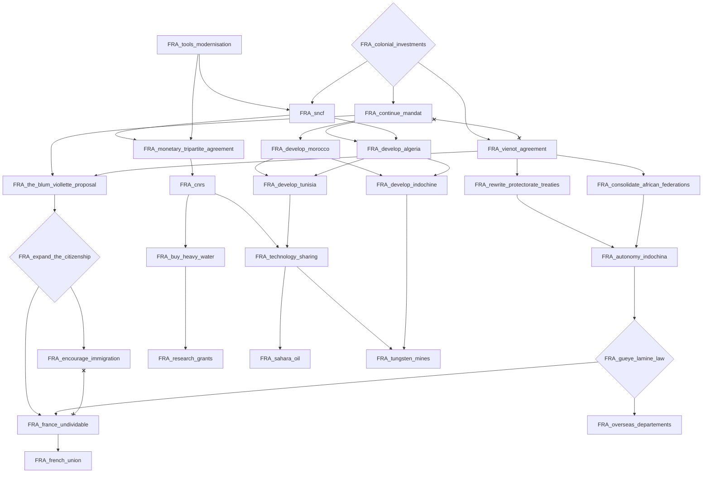

# FRA_continue_the_fight_in_africa

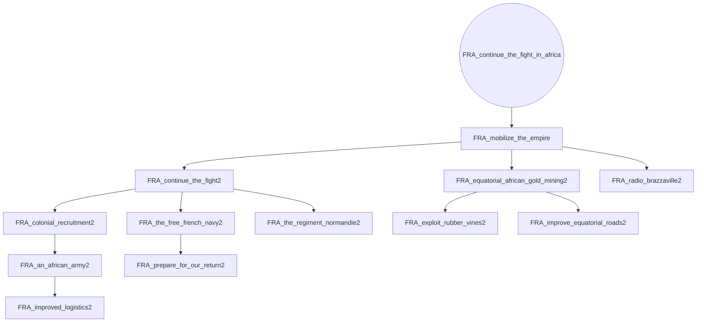

# FRA_de_gaulle_strategy

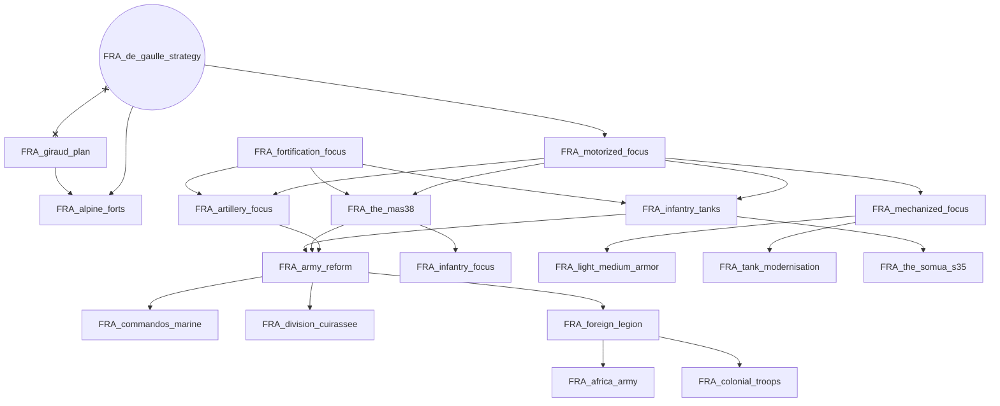

# FRA_far_right_leagues

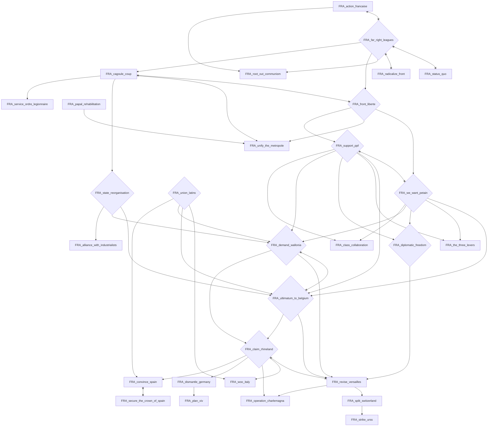

# FRA_form_the_first_strategic_bombing_unit

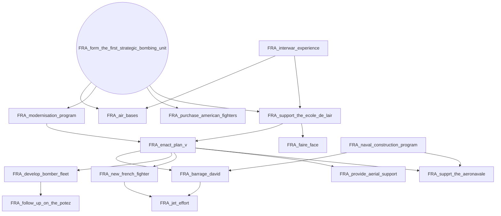

# FRA_giraud_plan

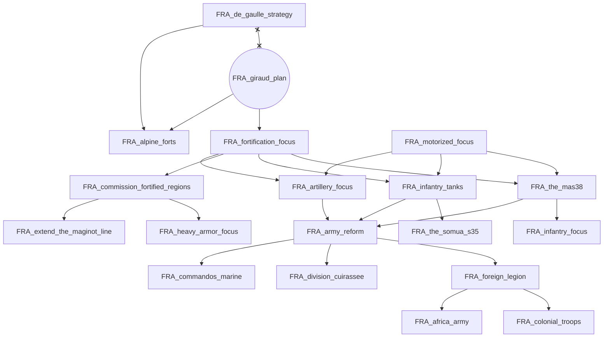

# FRA_interwar_experience

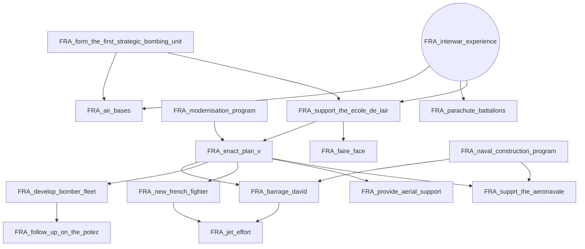

# FRA_radicalize_front

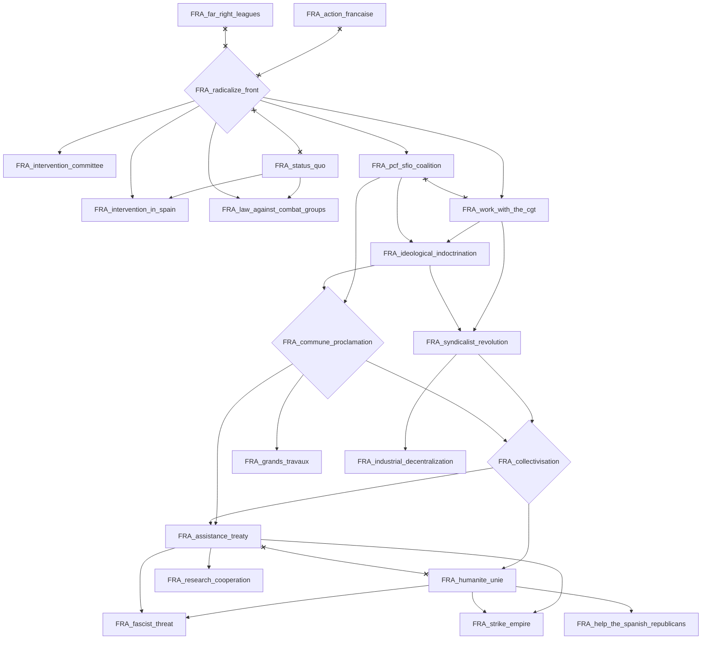

# FRA_rearmament

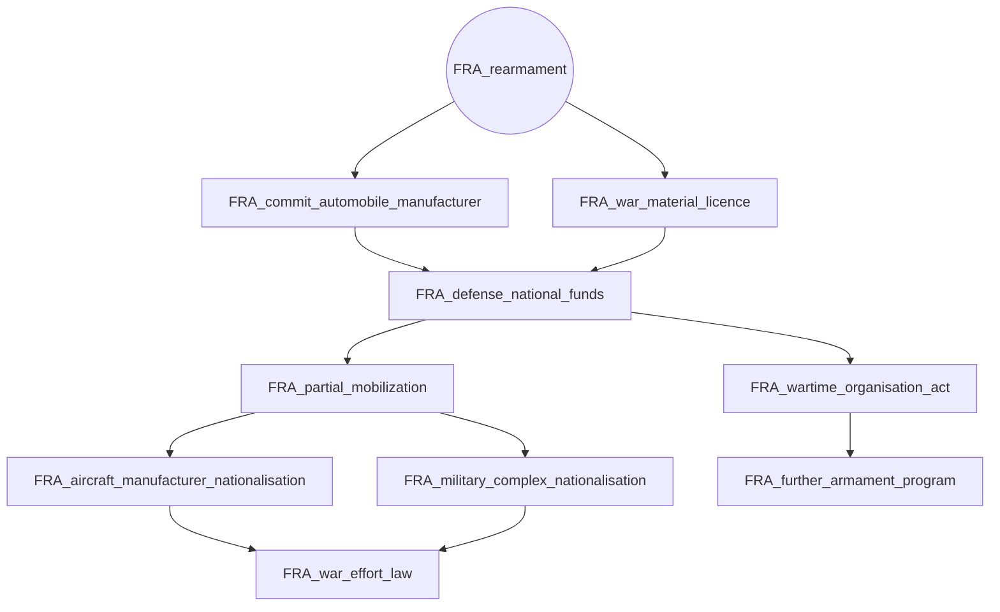

# FRA_status_quo

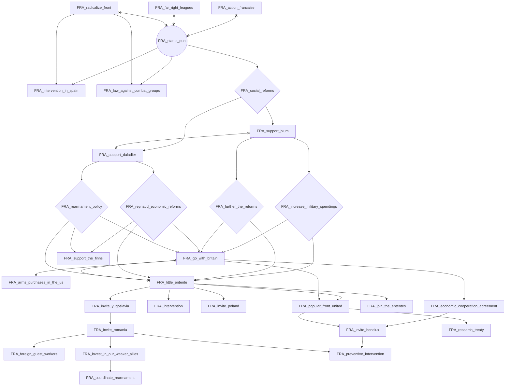

# FRA_the_council_of_rambouillet

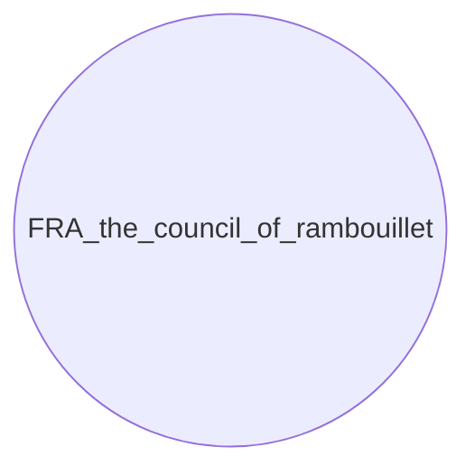

# FRA_tools_modernisation

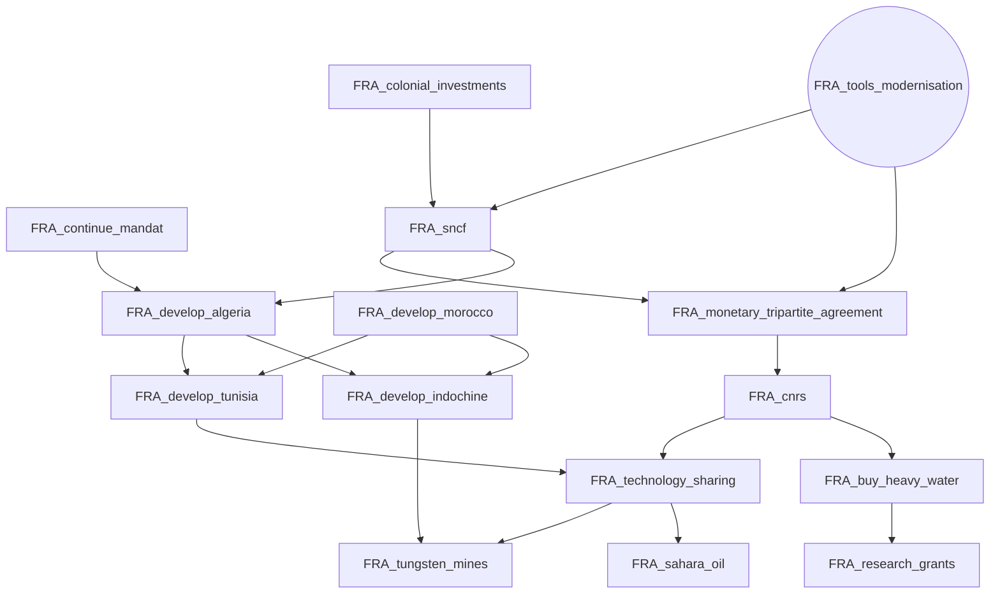
