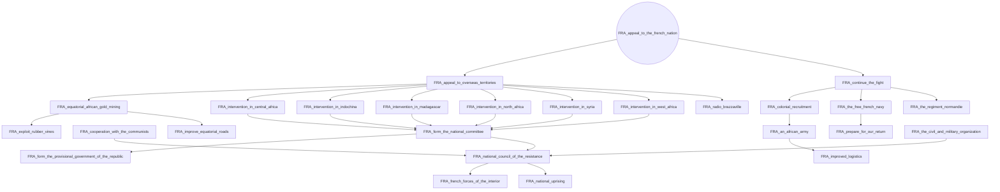
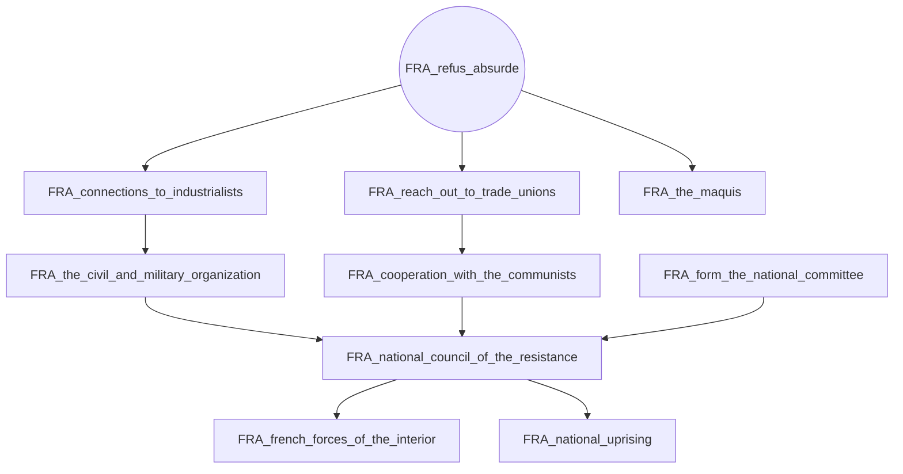

# FRA_appeal_to_the_french_nation

```mermaid
flowchart TD
    n1["FRA_an_african_army"]
    n2["FRA_appeal_to_overseas_territories"]
    n3(("FRA_appeal_to_the_french_nation"))
    n4["FRA_colonial_recruitment"]
    n5["FRA_continue_the_fight"]
    n6["FRA_cooperation_with_the_communists"]
    n7["FRA_equatorial_african_gold_mining"]
    n8["FRA_exploit_rubber_vines"]
    n9["FRA_form_the_national_committee"]
    n10["FRA_form_the_provisional_government_of_the_republic"]
    n11["FRA_french_forces_of_the_interior"]
    n12["FRA_improve_equatorial_roads"]
    n13["FRA_improved_logistics"]
    n14["FRA_intervention_in_central_africa"]
    n15["FRA_intervention_in_indochina"]
    n16["FRA_intervention_in_madagascar"]
    n17["FRA_intervention_in_north_africa"]
    n18["FRA_intervention_in_syria"]
    n19["FRA_intervention_in_west_africa"]
    n20["FRA_national_council_of_the_resistance"]
    n21["FRA_national_uprising"]
    n22["FRA_prepare_for_our_return"]
    n23["FRA_radio_brazzaville"]
    n24["FRA_the_civil_and_military_organization"]
    n25["FRA_the_free_french_navy"]
    n26["FRA_the_regiment_normandie"]
    n4 --> n1
    n3 --> n2
    n5 --> n4
    n3 --> n5
    n2 --> n7
    n7 --> n8
    n16 --> n9
    n18 --> n9
    n15 --> n9
    n17 --> n9
    n19 --> n9
    n14 --> n9
    n9 --> n10
    n20 --> n11
    n7 --> n12
    n1 --> n13
    n2 --> n14
    n2 --> n15
    n2 --> n16
    n2 --> n17
    n2 --> n18
    n2 --> n19
    n24 --> n20
    n6 --> n20
    n9 --> n20
    n20 --> n21
    n25 --> n22
    n2 --> n23
    n5 --> n25
    n5 --> n26
```

# FRA_refus_absurde

```mermaid
flowchart TD
    n27["FRA_connections_to_industrialists"]
    n6["FRA_cooperation_with_the_communists"]
    n9["FRA_form_the_national_committee"]
    n11["FRA_french_forces_of_the_interior"]
    n20["FRA_national_council_of_the_resistance"]
    n21["FRA_national_uprising"]
    n28["FRA_reach_out_to_trade_unions"]
    n29(("FRA_refus_absurde"))
    n24["FRA_the_civil_and_military_organization"]
    n30["FRA_the_maquis"]
    n29 --> n27
    n28 --> n6
    n20 --> n11
    n24 --> n20
    n6 --> n20
    n9 --> n20
    n20 --> n21
    n29 --> n28
    n27 --> n24
    n29 --> n30
```
