# GER_develop_modern_maneuver_warfare

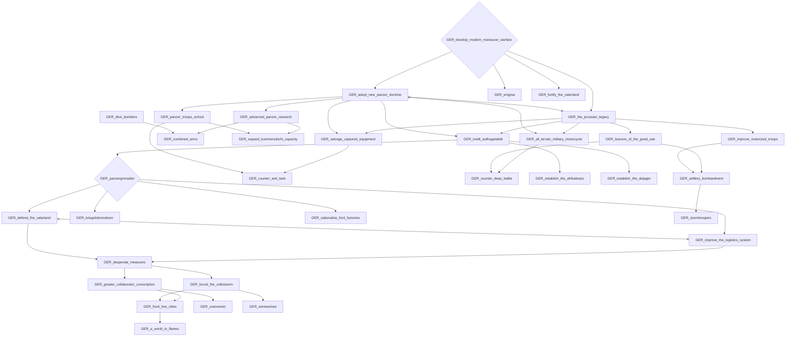

# GER_die_letzte_verschwoerung

```mermaid
flowchart TD
    n34["GER_GER_fate_of_nazism"]
    n35["GER_a_coup_in_all_but_name"]
    n36["GER_a_dictated_parliament"]
    n37["GER_a_europe_around_the_reich"]
    n38["GER_a_europe_of_the_fatherlands"]
    n39["GER_a_germany_of_the_elites"]
    n40{"GER_a_greater_appeal_to_moscow"}
    n41["GER_a_guided_kaiserreich"]
    n42{"GER_a_guiding_hand_in_politics"}
    n43["GER_a_human_face_for_europe"]
    n44["GER_a_juggernaught_back_from_the_grave"]
    n45["GER_a_martial_state"]
    n46["GER_a_new_age_of_peace"]
    n47["GER_a_new_era_of_german_science"]
    n48["GER_a_new_monarch_for_a_new_age"]
    n49["GER_a_new_national_anthem"]
    n50["GER_a_patriotic_german_church"]
    n51["GER_a_powerful_state"]
    n52["GER_a_respectable_germany"]
    n53["GER_a_second_restoration"]
    n54["GER_a_time_for_protectionism"]
    n55["GER_a_true_volksgemeinschaft"]
    n56["GER_abandon_the_post_alltogether"]
    n57["GER_achieve_national_renewal"]
    n58["GER_adenauers_chance"]
    n59["GER_align_the_balkans"]
    n60["GER_all_under_the_grey_emminence"]
    n61["GER_alliance_with_the_junkers"]
    n62["GER_alliance_with_the_united_evangelical_church"]
    n63["GER_an_era_of_german_wealth"]
    n64["GER_an_era_of_honor"]
    n65["GER_an_eye_towards_the_east"]
    n66["GER_an_iron_fist_on_the_state"]
    n67["GER_an_irresistable_moral_guide"]
    n68["GER_an_old_germany_for_a_new_age"]
    n69["GER_an_outstreched_arm_towards_the_east"]
    n70["GER_appeal_for_autonomy"]
    n71["GER_apply_the_reichskonkordat_to_the_republic"]
    n72["GER_approach_the_anglosphere"]
    n73["GER_as_with_the_sa_so_with_the_antifa"]
    n74["GER_ban_internal_operations"]
    n75["GER_ban_the_reactionaries"]
    n76["GER_bring_about_a_new_social_order"]
    n77["GER_bring_about_the_second_revolution"]
    n78["GER_bring_back_einstein"]
    n79["GER_bring_back_the_old_heirarchy"]
    n80["GER_build_a_cult_of_personality"]
    n81["GER_build_a_mass_movement"]
    n82{"GER_build_a_pakt_around_berlin"}
    n83["GER_build_germany_from_the_apartment_up"]
    n84["GER_build_up_worker_and_peasant_councils"]
    n85["GER_campaign_as_a_popular_front"]
    n86["GER_cater_to_the_masses"]
    n87["GER_centralize_the_state"]
    n88{"GER_choose_an_heir_for_wels"}
    n89["GER_claim_leadership_of_german_nationalism"]
    n90["GER_clamp_down_on_the_ruhr"]
    n91["GER_clear_the_facist_lair"]
    n92["GER_collapse_our_institutions"]
    n93["GER_combat_the_reactionary"]
    n94["GER_consolidate_elite_support"]
    n95["GER_consolidate_socialist_reforms"]
    n96["GER_consolidate_the_kaiserreich"]
    n97["GER_consolidate_the_new_system"]
    n98["GER_consolidate_the_party_leadership"]
    n99["GER_construct_the_karl_marx_cultural_instutute"]
    n100["GER_consultations_with_the_experts"]
    n101["GER_control_the_press"]
    n102["GER_coopt_the_sa"]
    n103["GER_corporatism_with_catholic_characteristics"]
    n104["GER_crush_bourgeoise_captialism"]
    n105{"GER_deal_with_inner_party_opposition"}
    n106["GER_deal_with_resistance_in_the_heer"]
    n107["GER_deal_with_the_conciliators"]
    n108{"GER_deal_with_the_officier_corps"}
    n109["GER_declare_the_ecr"]
    n110["GER_declare_the_presidential_republic"]
    n111{"GER_declare_the_volksreich"}
    n112["GER_demand_state_approval_for_clergy"]
    n113["GER_demokratieschutzgesetz"]
    n114["GER_destroy_the_elites"]
    n115{"GER_die_letzte_verschwoerung"}
    n116["GER_distance_from_past_mistakes"]
    n117["GER_divert_military_funding"]
    n118{"GER_dnvp_in_coalition"}
    n119{"GER_dstp_in_coalition"}
    n120{"GER_dvu_in_coalition"}
    n121["GER_embark_on_the_quest_to_absolutism"]
    n122{"GER_embrace_christian_humanism"}
    n123{"GER_embrace_secularism"}
    n124["GER_embrace_true_national_socialism"]
    n125["GER_encircle_the_entente_powers"]
    n126["GER_end_conscription"]
    n127["GER_end_interanal_factionalism"]
    n128{"GER_end_political_parties"}
    n129["GER_end_the_austria_debate"]
    n130["GER_end_the_divide_between_state_and_church"]
    n131["GER_end_the_german_brain_drain"]
    n132{"GER_end_the_party_rift"}
    n133["GER_enforce_a_secularized_curriculum"]
    n134["GER_engrain_antiurbanism"]
    n135["GER_ensure_a_loyal_clergyship"]
    n136["GER_ensure_permanent_food_security"]
    n137["GER_ensure_the_gradual_withering_away_of_religion"]
    n138["GER_entrench_the_gilded_cage"]
    n139["GER_espouse_voelkish_nationalism"]
    n140["GER_establish_the_european_coal_and_steel_community"]
    n141["GER_expand_black_front_influence"]
    n142["GER_expand_liberalization_efforts"]
    n143["GER_expand_pro_state_propaganda"]
    n144["GER_expand_recruitment"]
    n145["GER_expand_the_kaisers_duties"]
    n146["GER_expand_the_reichsverweserschaft"]
    n147["GER_extol_prussian_virtue"]
    n148["GER_federalism_a_hedge_against_radicalism"]
    n149["GER_fight_fascism_in_all_its_forms"]
    n150["GER_fight_for_dvu_stability"]
    n151["GER_fight_the_apo"]
    n152["GER_fight_trade_unions"]
    n153["GER_focus_on_political_education"]
    n154["GER_forge_an_alliance_with_the_church"]
    n155["GER_form_the_league_of_patriots"]
    n156["GER_form_the_presidency"]
    n157["GER_form_the_sed"]
    n158["GER_form_the_stasi_new"]
    n159{"GER_foster_a_progress_cult"}
    n160["GER_foster_christian_democracy"]
    n161["GER_foster_german_democracy"]
    n162["GER_found_the_german_interim_government"]
    n163{"GER_found_the_new_german_state"}
    n164["GER_fufill_the_legacy_of_rohm"]
    n165["GER_full_rehabilitation"]
    n166["GER_fully_rebuild_the_secret_police"]
    n167["GER_german_entry_into_the_comintern"]
    n168["GER_germans_everywhere_united"]
    n169["GER_germany_glorious_as_it_once_was"]
    n170["GER_globalize_the_revolution"]
    n171["GER_glorify_stalins_image"]
    n172["GER_goerdelers_new_party"]
    n173["GER_guarantee_religious_freedom"]
    n174["GER_hail_the_new_fuhrer"]
    n175["GER_heavy_handed_foreign_policy"]
    n176["GER_heed_von_neuraths_concerns"]
    n177["GER_help_the_church_permeate_everyday_german_life"]
    n178{"GER_highten_nationalist_rethoric"}
    n179["GER_hold_new_elections"]
    n180["GER_honor_the_legacy_of_marx"]
    n181["GER_hugenburgs_legacy"]
    n182["GER_implement_state_religion"]
    n183["GER_import_soviet_sciences"]
    n184["GER_improve_railway_economics"]
    n185["GER_increase_factional_defenses"]
    n186["GER_increase_municipal_autonomy"]
    n187["GER_industrial_collectivization"]
    n188["GER_industrial_cooperation_2"]
    n189["GER_inspire_fear_of_the_liberals"]
    n190["GER_install_a_loyal_army_chief"]
    n191["GER_integrate_our_new_lands"]
    n192["GER_integrate_the_dnvp"]
    n193["GER_integrate_the_monarchists"]
    n194["GER_integrate_the_zentrum"]
    n195["GER_international_brigades"]
    n196["GER_international_pro_european_propaganda"]
    n197["GER_intertwine_the_state_and_the_church"]
    n198["GER_introduce_the_jugendweihe"]
    n199["GER_invest_in_the_naval_pet_project"]
    n200["GER_knock_stegerwald_down_a_peg"]
    n201["GER_kpd_in_coalition"]
    n202["GER_land_reform"]
    n203["GER_learn_from_the_enabling_act"]
    n204["GER_legacy_of_stinn"]
    n205["GER_legacy_of_stresemann"]
    n206["GER_legalize_the_kjvd"]
    n207["GER_legalize_the_remaining_communist_parties"]
    n208["GER_legitimize_the_left"]
    n209["GER_liberation_for_the_sudetendeutsche"]
    n210["GER_limited_federalist_reforms"]
    n211["GER_limited_reconciliation"]
    n212["GER_loose_the_abwehr_on_the_opposition"]
    n213["GER_maintian_strict_anti_marxism"]
    n214["GER_mandatory_membership"]
    n215["GER_manipulate_the_churches"]
    n216["GER_militarize_socity"]
    n217["GER_military_depoliticization"]
    n218["GER_military_led_state_building"]
    n219["GER_move_to_restore_brest_litovsk"]
    n220["GER_move_towards_autocracy"]
    n221{"GER_move_towards_responsible_governance"}
    n222["GER_national_economic_coordination"]
    n223["GER_natural_leadership_for_the_best_men"]
    n224["GER_nie_wieder_ist_jetzt"]
    n225["GER_no_compromise_on_socialist_ideals"]
    n226["GER_noble_advisors"]
    n227{"GER_nraf_in_coalition"}
    n228["GER_offer_concessions_to_the_elites"]
    n229["GER_offer_goerdeler_reconciliation"]
    n230["GER_officialize_the_volksarmee"]
    n231["GER_open_the_asia_department"]
    n232["GER_open_up_a_latin_connection"]
    n233["GER_oppose_hitler_ww"]
    n234["GER_organize_german_labor"]
    n235["GER_organize_workers_councils"]
    n236["GER_our_own_lennin"]
    n237["GER_pass_the_beck_constiution"]
    n238["GER_pass_the_beck_constiution_copy"]
    n239["GER_peace_in_the_east"]
    n240["GER_peace_with_our_new_identity"]
    n241["GER_phase_out_the_standing_army"]
    n242["GER_political_commissars_focus"]
    n243["GER_politicize_the_abwehr"]
    n244["GER_politicize_the_trade_unions"]
    n245["GER_positive_christianty"]
    n246["GER_power_to_the_aristocracy"]
    n247["GER_prepare_the_new_era"]
    n248["GER_prioritise_the_rheinland"]
    n249["GER_proper_agrarian_policy"]
    n250["GER_purge_the_military_of_reactionaries"]
    n251["GER_r56_mannheim_project"]
    n252["GER_r56_pool_technical_know_how"]
    n253["GER_r56_shared_r_and_d_programs"]
    n254["GER_radicalize_german_nationalism"]
    n255["GER_radicalize_german_workers"]
    n256["GER_radicalize_rearmament_efforts"]
    n257["GER_radicalize_the_army"]
    n258{"GER_radicalize_the_workers"}
    n259["GER_rally_the_nation"]
    n260["GER_reach_out_to_old_allies"]
    n261["GER_readdress_the_kaiserfrage"]
    n262["GER_ready_the_army_for_the_external_threat"]
    n263["GER_ready_the_political_sturcture"]
    n264{"GER_reaffirm_territorial_claims"}
    n265{"GER_reapproach_the_west"}
    n266["GER_reapproachment_with_moscow"]
    n267["GER_rebuild_the_nation_ww"]
    n268["GER_rebuild_the_prussian_bastion"]
    n269["GER_rebuild_the_shattered_zentrum"]
    n270{"GER_reconcile_the_crown_prince"}
    n271["GER_redistribute_wealth"]
    n272["GER_reestablish_colonial_claims"]
    n273["GER_reform_the_institutions"]
    n274["GER_rehabilitate_mueller"]
    n275["GER_rehabilitate_the_red_tsar"]
    n276{"GER_rekindle_the_franco_german_rivalry"}
    n277["GER_rely_on_divine_right"]
    n278["GER_remilitarize_the_rhineland"]
    n279["GER_remove_fatherlandless_fellows_from_power"]
    n280["GER_renegotiate_versailles_new"]
    n281["GER_resource_trade_2"]
    n282{"GER_restore_discipline_in_the_military"}
    n283["GER_restore_legality_to_germany"]
    n284["GER_restore_the_fahneneid"]
    n285["GER_restore_the_old_estates"]
    n286["GER_restore_the_state_churches"]
    n287["GER_return_the_exiles"]
    n288["GER_return_to_german_brilliance"]
    n289["GER_revitalize_the_nation"]
    n290{"GER_revive_gestapo_remnants"}
    n291["GER_revive_the_attitude_of_1914"]
    n292["GER_revolution_by_every_worker"]
    n293{"GER_revolution_in_german_culture"}
    n294["GER_secure_control_over_the_brigades"]
    n295["GER_secure_the_armys_support"]
    n296["GER_secure_western_science_funding"]
    n297["GER_seize_direct_control"]
    n298["GER_sensible_fiscal_policy"]
    n299["GER_shake_off_the_fascist_yoke"]
    n300["GER_shake_off_the_fascist_yoke_dummy"]
    n301{"GER_solve_the_danzig_issue"}
    n302["GER_spd_in_coalition"]
    n303["GER_spread_ideals_of_soldierly_conscience"]
    n304{"GER_step_back_into_the_international_community"}
    n305["GER_strengthen_german_patriotism"]
    n306["GER_strengthen_soviet_political_support"]
    n307["GER_strengthen_the_responsible_elites"]
    n308["GER_strengthen_the_spd_beurocracy"]
    n309["GER_strike_the_baltic"]
    n310["GER_tech_sharing_2"]
    n311["GER_technocracy_with_strong_limits"]
    n312["GER_thalmanns_cult_of_personality"]
    n313{"GER_the_abwehrs_germany"}
    n314["GER_the_berlin_trials"]
    n315["GER_the_canaris_wilhelm_pakt"]
    n316["GER_the_compromise_for_national_order"]
    n317["GER_the_democratic_hegemon_of_germany"]
    n318["GER_the_end_of_class_warfare"]
    n319["GER_the_fight_against_german_antisemitism"]
    n320["GER_the_fullness_of_german_conservatism"]
    n321["GER_the_kaiser_rises"]
    n322["GER_the_legacy_of_the_sozialistengesetze"]
    n323["GER_the_national_congress_of_councils"]
    n324["GER_the_national_salvation_law"]
    n325["GER_the_new_federalism"]
    n326{"GER_the_new_german_establishment"}
    n327["GER_the_old_man_still_has_it"]
    n328["GER_the_party_under_stegerwald"]
    n329["GER_the_president_for_life"]
    n330["GER_the_revolution_secured"]
    n331["GER_the_second_gleichschaltung"]
    n332["GER_the_socialist_traitor"]
    n333["GER_the_spirit_of_blut_and_boden"]
    n334["GER_the_state_safe_from_within"]
    n335["GER_the_will_of_the_people_unopposed"]
    n336["GER_tighten_naval_intelligence"]
    n337["GER_towards_a_european_research_sphere"]
    n338["GER_towards_a_party_state"]
    n339["GER_towards_european_revolution"]
    n340["GER_towards_mierendorffs_vision"]
    n341["GER_towards_national_militarization"]
    n342["GER_towards_state_atheism"]
    n343["GER_turn_the_opposition_into_regional_issues"]
    n344{"GER_undermine_german_democracy"}
    n345["GER_undermine_international_fascism"]
    n346["GER_undo_the_secularization_of_germany"]
    n347["GER_unite_against_fascism"]
    n348["GER_unite_the_bearocratic_colossus"]
    n349["GER_unite_the_party"]
    n350["GER_unite_the_working_class"]
    n351["GER_upkeep_german_order"]
    n352["GER_uplift_the_antifa"]
    n353["GER_uplift_the_black_front"]
    n354["GER_uplift_the_sa"]
    n355["GER_utilize_pro_democratic_propaganda"]
    n356["GER_utilize_the_zentrum_freeze"]
    n357["GER_vanquish_the_eastern_threat"]
    n358["GER_watch_the_churches"]
    n359["GER_weaken_the_presidents_power"]
    n360["GER_wehrhafte_demokratie"]
    n361["GER_whip_the_party_into_line"]
    n362["GER_wirths_new_zentrum"]
    n363["GER_work_towards_a_demilitarized_europe"]
    n364["GER_work_towards_fiscal_stability"]
    n365["GER_work_towards_national_demilitarization"]
    n366["GER_work_with_the_aristocracy"]
    n367["GER_zentrum_in_coalition"]
    n259 --> n34
    n145 --> n35
    n221 --> n36
    n82 --> n37
    n82 --> n38
    n79 --> n39
    n90 --> n40
    n221 --> n41
    n36 --> n42
    n41 --> n42
    n82 --> n43
    n52 --> n44
    n152 --> n44
    n163 --> n45
    n93 --> n46
    n160 --> n46
    n78 --> n47
    n153 --> n49
    n135 --> n50
    n87 --> n51
    n256 --> n51
    n326 --> n52
    n145 --> n53
    n249 --> n54
    n95 --> n55
    n104 --> n55
    n359 --> n56
    n139 --> n57
    n257 --> n57
    n367 --> n58
    n120 --> n58
    n209 --> n59
    n129 --> n59
    n348 --> n60
    n67 --> n60
    n249 --> n61
    n68 --> n62
    n279 --> n62
    n222 --> n63
    n283 --> n64
    n178 --> n65
    n212 --> n66
    n243 --> n66
    n66 --> n67
    n282 --> n68
    n304 --> n69
    n40 --> n70
    n346 --> n71
    n272 --> n72
    n168 --> n72
    n185 --> n72
    n357 --> n72
    n230 --> n73
    n242 --> n73
    n217 --> n74
    n338 --> n75
    n244 --> n76
    n234 --> n76
    n105 --> n77
    n319 --> n78
    n366 --> n79
    n260 --> n80
    n284 --> n80
    n86 --> n81
    n304 --> n82
    n148 --> n83
    n186 --> n83
    n105 --> n84
    n207 --> n85
    n88 --> n86
    n105 --> n87
    n302 --> n88
    n291 --> n89
    n240 --> n89
    n115 --> n90
    n276 --> n91
    n265 --> n91
    n258 --> n92
    n344 --> n92
    n362 --> n93
    n58 --> n93
    n119 --> n94
    n77 --> n95
    n42 --> n96
    n122 --> n96
    n235 --> n97
    n287 --> n98
    n314 --> n98
    n149 --> n99
    n180 --> n99
    n364 --> n100
    n121 --> n101
    n139 --> n102
    n76 --> n103
    n77 --> n104
    n227 --> n105
    n66 --> n106
    n293 --> n107
    n201 --> n108
    n227 --> n108
    n263 --> n109
    n196 --> n109
    n156 --> n110
    n190 --> n110
    n114 --> n111
    n331 --> n111
    n343 --> n111
    n358 --> n112
    n151 --> n113
    n324 --> n114
    n366 --> n116
    n365 --> n117
    n179 --> n118
    n238 --> n118
    n179 --> n119
    n179 --> n120
    n327 --> n121
    n302 --> n123
    n201 --> n123
    n84 --> n124
    n141 --> n124
    n82 --> n125
    n175 --> n125
    n365 --> n126
    n205 --> n127
    n204 --> n127
    n343 --> n128
    n114 --> n128
    n264 --> n129
    n62 --> n130
    n289 --> n131
    n150 --> n132
    n173 --> n133
    n342 --> n133
    n249 --> n134
    n274 --> n135
    n215 --> n135
    n191 --> n136
    n198 --> n137
    n112 --> n137
    n146 --> n138
    n216 --> n138
    n80 --> n139
    n280 --> n140
    n105 --> n141
    n122 --> n142
    n42 --> n142
    n320 --> n143
    n158 --> n144
    n261 --> n145
    n218 --> n146
    n327 --> n147
    n48 --> n147
    n325 --> n148
    n107 --> n149
    n120 --> n150
    n360 --> n151
    n94 --> n152
    n119 --> n153
    n220 --> n154
    n154 --> n155
    n243 --> n155
    n229 --> n156
    n338 --> n157
    n293 --> n158
    n73 --> n159
    n362 --> n160
    n58 --> n160
    n317 --> n161
    n115 --> n162
    n115 --> n163
    n95 --> n164
    n51 --> n164
    n104 --> n164
    n116 --> n165
    n39 --> n165
    n290 --> n166
    n239 --> n167
    n209 --> n168
    n301 --> n168
    n129 --> n168
    n134 --> n169
    n285 --> n169
    n333 --> n169
    n323 --> n170
    n109 --> n170
    n306 --> n171
    n118 --> n172
    n120 --> n172
    n123 --> n173
    n111 --> n174
    n304 --> n175
    n197 --> n177
    n118 --> n178
    n227 --> n178
    n120 --> n178
    n110 --> n179
    n162 --> n179
    n214 --> n180
    n107 --> n180
    n120 --> n181
    n118 --> n181
    n154 --> n182
    n159 --> n183
    n364 --> n184
    n37 --> n185
    n38 --> n185
    n325 --> n186
    n201 --> n187
    n239 --> n188
    n105 --> n189
    n229 --> n190
    n65 --> n191
    n155 --> n192
    n155 --> n193
    n182 --> n194
    n155 --> n194
    n115 --> n195
    n339 --> n196
    n76 --> n197
    n286 --> n197
    n133 --> n198
    n342 --> n198
    n110 --> n199
    n348 --> n199
    n356 --> n200
    n179 --> n201
    n300 --> n201
    n271 --> n202
    n258 --> n203
    n344 --> n203
    n326 --> n204
    n119 --> n205
    n201 --> n206
    n88 --> n207
    n207 --> n208
    n264 --> n209
    n84 --> n210
    n105 --> n211
    n313 --> n212
    n227 --> n213
    n206 --> n214
    n293 --> n214
    n245 --> n215
    n218 --> n216
    n96 --> n216
    n360 --> n217
    n42 --> n218
    n301 --> n219
    n313 --> n220
    n45 --> n221
    n298 --> n222
    n295 --> n223
    n257 --> n223
    n139 --> n223
    n39 --> n223
    n113 --> n224
    n74 --> n224
    n81 --> n225
    n39 --> n226
    n179 --> n227
    n116 --> n228
    n313 --> n229
    n299 --> n230
    n272 --> n231
    n168 --> n231
    n185 --> n231
    n357 --> n231
    n272 --> n232
    n168 --> n232
    n185 --> n232
    n357 --> n232
    n328 --> n234
    n330 --> n235
    n330 --> n236
    n64 --> n237
    n36 --> n237
    n41 --> n237
    n266 --> n239
    n305 --> n240
    n354 --> n241
    n352 --> n241
    n353 --> n241
    n299 --> n242
    n220 --> n243
    n328 --> n244
    n227 --> n245
    n118 --> n245
    n96 --> n246
    n142 --> n247
    n68 --> n247
    n186 --> n248
    n181 --> n249
    n88 --> n250
    n252 --> n251
    n253 --> n251
    n131 --> n252
    n131 --> n253
    n178 --> n254
    n90 --> n255
    n105 --> n256
    n80 --> n257
    n295 --> n257
    n201 --> n258
    n233 --> n259
    n115 --> n259
    n270 --> n260
    n120 --> n261
    n118 --> n261
    n73 --> n262
    n339 --> n263
    n323 --> n263
    n304 --> n264
    n304 --> n265
    n201 --> n266
    n259 --> n267
    n355 --> n268
    n58 --> n269
    n121 --> n270
    n227 --> n271
    n302 --> n271
    n201 --> n271
    n276 --> n272
    n265 --> n272
    n308 --> n273
    n245 --> n274
    n273 --> n275
    n349 --> n275
    n264 --> n276
    n121 --> n277
    n277 --> n279
    n282 --> n279
    n265 --> n280
    n188 --> n281
    n147 --> n282
    n45 --> n283
    n277 --> n284
    n61 --> n285
    n346 --> n286
    n330 --> n287
    n159 --> n288
    n34 --> n289
    n267 --> n289
    n120 --> n290
    n227 --> n290
    n118 --> n290
    n250 --> n291
    n305 --> n291
    n241 --> n292
    n201 --> n293
    n255 --> n294
    n195 --> n294
    n366 --> n295
    n260 --> n295
    n265 --> n296
    n199 --> n297
    n172 --> n298
    n90 --> n299
    n264 --> n301
    n179 --> n302
    n122 --> n303
    n282 --> n303
    n176 --> n304
    n115 --> n304
    n88 --> n305
    n40 --> n306
    n58 --> n307
    n88 --> n308
    n65 --> n309
    n188 --> n310
    n100 --> n311
    n184 --> n311
    n361 --> n312
    n350 --> n312
    n163 --> n313
    n330 --> n314
    n220 --> n315
    n246 --> n316
    n216 --> n316
    n132 --> n317
    n103 --> n318
    n172 --> n319
    n132 --> n320
    n163 --> n321
    n227 --> n322
    n120 --> n322
    n118 --> n322
    n97 --> n323
    n98 --> n323
    n189 --> n324
    n58 --> n325
    n94 --> n326
    n321 --> n327
    n367 --> n328
    n120 --> n328
    n128 --> n329
    n299 --> n330
    n324 --> n331
    n362 --> n332
    n54 --> n333
    n144 --> n334
    n157 --> n335
    n75 --> n335
    n199 --> n336
    n38 --> n337
    n203 --> n338
    n92 --> n338
    n97 --> n339
    n98 --> n339
    n225 --> n340
    n363 --> n340
    n139 --> n341
    n257 --> n341
    n123 --> n342
    n324 --> n343
    n210 --> n343
    n201 --> n344
    n334 --> n345
    n118 --> n346
    n367 --> n346
    n120 --> n346
    n208 --> n347
    n85 --> n347
    n193 --> n348
    n194 --> n348
    n192 --> n348
    n308 --> n349
    n236 --> n350
    n307 --> n351
    n269 --> n351
    n108 --> n352
    n227 --> n353
    n108 --> n353
    n227 --> n354
    n108 --> n354
    n302 --> n355
    n119 --> n355
    n367 --> n355
    n120 --> n356
    n43 --> n357
    n219 --> n357
    n342 --> n358
    n166 --> n358
    n158 --> n358
    n355 --> n359
    n162 --> n360
    n236 --> n361
    n314 --> n361
    n367 --> n362
    n117 --> n363
    n126 --> n363
    n362 --> n364
    n88 --> n365
    n270 --> n366
    n179 --> n367
    n238 --> n367
    n36 x--x n41
    n37 x--x n38
    n43 x--x n219
    n45 x--x n313
    n70 x--x n306
    n92 x--x n203
    n96 x--x n218
    n115 x--x n278
    n142 x--x n303
    n150 x--x n356
    n158 x--x n166
    n162 x--x n163
    n172 x--x n181
    n173 x--x n342
    n174 x--x n329
    n183 x--x n288
    n204 x--x n205
    n211 x--x n254
    n220 x--x n229
    n250 x--x n365
    n260 x--x n366
    n265 x--x n276
    n272 x--x n280
    n317 x--x n320
    n352 x--x n353
    n352 x--x n354
    n353 x--x n354
```

# GER_expand_the_kaisers_duties_fake

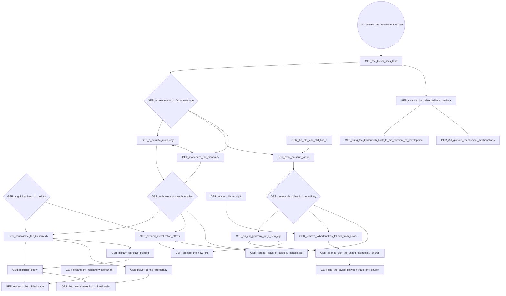

# GER_expanding_the_luftwaffe

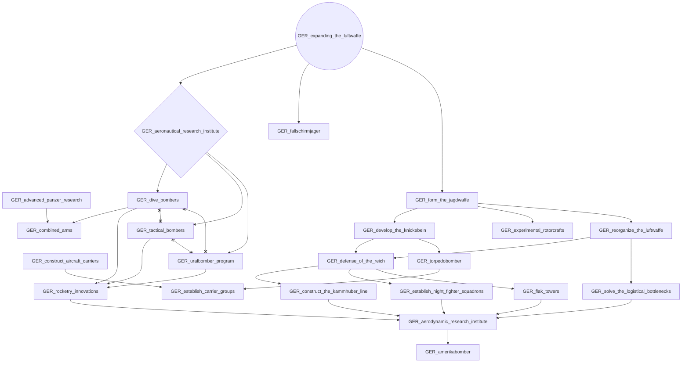

# GER_kill_hitler

```mermaid
flowchart TD
    n395["GER_a_new_reich"]
    n396["GER_alliance_with_austria_hungary"]
    n397["GER_alliance_with_gustaf"]
    n398["GER_alliance_with_soviets"]
    n399["GER_alliance_with_the_ottomans"]
    n400["GER_ally_benelux"]
    n401["GER_ally_chiang_kai_shek"]
    n402["GER_ally_czechoslovakia"]
    n403{"GER_ally_eastern_europe"}
    n404["GER_anti_bolshevist_bloc"]
    n405{"GER_anti_colonialism"}
    n406{"GER_anti_comintern_pact"}
    n407{"GER_anti_expansionism"}
    n408["GER_anti_soviet_friend_baltics"]
    n409{"GER_anti_soviet_friend_finland"}
    n410{"GER_anti_soviet_friend_poland"}
    n411["GER_anti_soviet_war"]
    n412{"GER_asia_department"}
    n413["GER_asia_department_dummy"]
    n414["GER_assassinate_mussolini_r56"]
    n415["GER_aus_ally"]
    n416["GER_befriend_china"]
    n417["GER_befriend_japan"]
    n418["GER_blitzkrieg_across_the_pacific"]
    n419["GER_claim_old_colonies_in_the_east"]
    n420["GER_collectivize_industry"]
    n421["GER_colonies_for_support"]
    n422["GER_contact_ludendorff"]
    n423["GER_cooperate_with_nordics"]
    n424["GER_counter_soviet_agression"]
    n425["GER_create_asian_reichskommissariat"]
    n426["GER_deal_with_the_devil_r56"]
    n427{"GER_decrease_fascist_influence_r56"}
    n428{"GER_defense_and_deterence"}
    n429["GER_dem_anschluss"]
    n430{"GER_dem_anschluss_prep"}
    n431["GER_dem_anti_commie_bloc_hungary"]
    n432["GER_dem_italy_alliance"]
    n433["GER_dem_italy_attack"]
    n434["GER_dem_polish_corridor_deal"]
    n435["GER_dem_polish_corridor_trade"]
    n436["GER_demand_northern_schleswig_r56"]
    n437["GER_destabilize_france"]
    n438["GER_end_british_imperial_hegemony_r56"]
    n439["GER_establish_NVA"]
    n440["GER_establish_bundesrepublik"]
    n441["GER_establish_bundeswehr"]
    n442{"GER_establish_imperial_german_army"}
    n443["GER_european_claims"]
    n444{"GER_expansionism_light"}
    n445["GER_focus_on_fascist_threat_r56"]
    n446["GER_galvanize_german_militarism"]
    n447["GER_german_scientific_haven"]
    n448["GER_gott_mit_uns"]
    n449["GER_help_SOV_revolutionaries_r56"]
    n450{"GER_increase_influence_over_balkans_r56"}
    n451["GER_increase_influence_over_benelux_r56"]
    n452{"GER_increase_influence_over_eastern_europe_r56"}
    n453["GER_inter_communist_fighting"]
    n454["GER_interest_in_the_carribean"]
    n455["GER_japanese_naval_cooperation"]
    n456{"GER_join_allies"}
    n457{"GER_kill_hitler"}
    n458{"GER_lead_communists"}
    n459{"GER_lead_democracies"}
    n460["GER_legacy_of_gluckliche_zwanziger_jahre"]
    n461["GER_mon_FRA_alliance"]
    n462{"GER_mon_allies_alliance"}
    n463["GER_mon_anti_commie_france"]
    n464["GER_negotiate_old_colonies_in_the_east"]
    n465["GER_old_nemensis_r56"]
    n466["GER_poland_trade"]
    n467{"GER_political_turmoil"}
    n468["GER_post_fascism_recovery"]
    n469["GER_prepare_italian_coup_r56"]
    n470{"GER_pressure_austria_r56"}
    n471["GER_prioritize_civilian_industry"]
    n472["GER_prioritize_military_industry"]
    n473["GER_progress_cult"]
    n474["GER_rally_the_monarchists"]
    n475["GER_re_establish_german_control_over_qingdao"]
    n476["GER_realise_belarusian_statehood"]
    n477["GER_realise_ukrainian_statehood"]
    n478["GER_recruit_grenztruppen"]
    n479["GER_rehabilitate_military"]
    n278{"GER_remilitarize_the_rhineland"}
    n480["GER_renegotiate_versailles"]
    n481{"GER_repeal_reichstag_fire_decree"}
    n482{"GER_replace_reichsmark"}
    n483{"GER_request_danzig"}
    n484["GER_restore_klein_venedig"]
    n485{"GER_restore_the_central_powers"}
    n486{"GER_restore_the_empire"}
    n487["GER_restore_weimar"]
    n488["GER_return_of_conservative_exiles"]
    n489["GER_revive_brest_litovsk"]
    n490["GER_safeguard_neutrality"]
    n491["GER_sentinels_of_the_pacific"]
    n492["GER_south_east_asian_natural_wealth"]
    n493["GER_soviet_invasion"]
    n494["GER_soviet_scientists"]
    n495["GER_soviet_support"]
    n496["GER_spread_the_revolution_r56"]
    n497["GER_support_freikorps"]
    n498{"GER_support_landwehr"}
    n499["GER_sway_spain"]
    n500["GER_the_proud_eagle_and_the_resurgent_dragon"]
    n501["GER_the_source_of_fascism_r56"]
    n502["GER_western_communist"]
    n503["GER_western_science_funding"]
    n504["GER_world_revolution"]
    n497 --> n395
    n488 --> n395
    n485 --> n396
    n461 --> n397
    n396 --> n397
    n481 --> n398
    n485 --> n399
    n459 --> n400
    n416 --> n401
    n403 --> n402
    n459 --> n403
    n458 --> n403
    n424 --> n404
    n459 --> n404
    n459 --> n405
    n458 --> n405
    n482 --> n407
    n428 --> n407
    n424 --> n408
    n424 --> n409
    n424 --> n410
    n409 --> n411
    n410 --> n411
    n485 --> n412
    n485 --> n413
    n469 --> n414
    n430 --> n415
    n278 --> n416
    n412 --> n416
    n406 --> n417
    n412 --> n417
    n491 --> n418
    n492 --> n418
    n416 --> n419
    n398 --> n420
    n504 --> n420
    n456 --> n421
    n474 --> n422
    n490 --> n423
    n409 --> n423
    n403 --> n424
    n401 --> n425
    n464 --> n425
    n470 --> n426
    n427 --> n426
    n445 --> n427
    n441 --> n428
    n430 --> n429
    n459 --> n430
    n456 --> n430
    n404 --> n431
    n431 --> n432
    n415 --> n432
    n415 --> n433
    n429 --> n433
    n483 --> n434
    n483 --> n435
    n443 --> n436
    n462 --> n437
    n485 --> n437
    n451 --> n438
    n479 --> n439
    n487 --> n440
    n440 --> n441
    n486 --> n442
    n486 --> n443
    n482 --> n444
    n428 --> n444
    n439 --> n445
    n472 --> n446
    n460 --> n447
    n471 --> n448
    n459 --> n449
    n456 --> n449
    n496 --> n450
    n450 --> n451
    n452 --> n451
    n496 --> n452
    n458 --> n453
    n485 --> n454
    n417 --> n455
    n444 --> n456
    n496 --> n458
    n445 --> n458
    n407 --> n459
    n444 --> n459
    n480 --> n460
    n485 --> n461
    n486 --> n462
    n462 --> n463
    n437 --> n463
    n417 --> n464
    n451 --> n465
    n443 --> n466
    n457 --> n467
    n440 --> n468
    n485 --> n469
    n445 --> n470
    n442 --> n471
    n498 --> n471
    n442 --> n472
    n498 --> n472
    n478 --> n473
    n439 --> n473
    n420 --> n473
    n457 --> n474
    n416 --> n475
    n404 --> n476
    n404 --> n477
    n479 --> n478
    n504 --> n479
    n398 --> n479
    n444 --> n480
    n467 --> n481
    n468 --> n482
    n456 --> n483
    n459 --> n483
    n454 --> n484
    n486 --> n485
    n395 --> n486
    n467 --> n487
    n474 --> n488
    n466 --> n489
    n493 --> n489
    n407 --> n490
    n458 --> n490
    n455 --> n491
    n464 --> n491
    n401 --> n492
    n464 --> n492
    n443 --> n493
    n473 --> n494
    n405 --> n495
    n439 --> n496
    n474 --> n497
    n486 --> n498
    n461 --> n499
    n401 --> n500
    n425 --> n500
    n426 --> n501
    n400 --> n502
    n459 --> n503
    n456 --> n503
    n481 --> n504
    n398 x--x n504
    n400 x--x n405
    n407 x--x n444
    n411 x--x n449
    n415 x--x n429
    n416 x--x n417
    n424 x--x n495
    n426 x--x n451
    n434 x--x n435
    n437 x--x n461
    n456 x--x n459
    n456 x--x n480
    n457 x--x n278
    n459 x--x n480
    n462 x--x n485
    n467 x--x n474
    n471 x--x n472
    n481 x--x n487
```

# GER_oppose_hitler

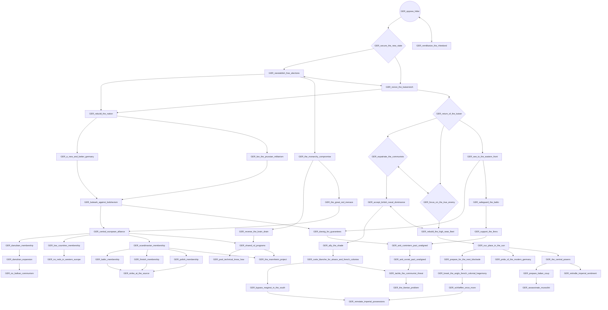

# GER_oppose_hitler_ww

```mermaid
flowchart TD
    n34["GER_GER_fate_of_nazism"]
    n556["GER_accept_british_naval_dominance_ww"]
    n557["GER_african_allies"]
    n558["GER_align_czechoslovakia"]
    n559{"GER_align_italy"}
    n560["GER_align_south_america"]
    n561["GER_all_for_the_front"]
    n562["GER_ally_white_russian_forces"]
    n563["GER_anglo_germanic_cooperation_program"]
    n564{"GER_anglo_germanic_defense_pact"}
    n565["GER_asian_allies"]
    n566["GER_assassinate_mussolini_ww"]
    n567["GER_assemble_red_orchestra"]
    n568["GER_assist_our_eastern_comrades"]
    n569["GER_backdoor_negotiations"]
    n570{"GER_ban_political_uniforms"}
    n571{"GER_break_anglo_french_colonial_hegemony_ww"}
    n572["GER_bring_turkey_into_the_fold"]
    n573{"GER_brothers_in_arms"}
    n574["GER_build_the_eastern_bulwark"]
    n575["GER_bypass_maginot_in_the_south_ww"]
    n576{"GER_carte_blanche_for_alsace_and_french_colonies_ww"}
    n577["GER_carve_up_congo"]
    n578["GER_carve_up_czechoslovakia"]
    n579["GER_central_planning"]
    n580["GER_civil_liberties"]
    n581["GER_closer_sino_germanic_relations"]
    n582{"GER_conquer_italy"}
    n583["GER_czechoslovakia"]
    n584["GER_danzig_for_guarantees_ww"]
    n585["GER_defense_treaty_with_the_soviet"]
    n586["GER_demand_further_polish_concessions"]
    n587["GER_demand_lithuanian_integration"]
    n588{"GER_demand_the_return_of_southern_jutland"}
    n589["GER_democratic_shield"]
    n115["GER_die_letzte_verschwoerung"]
    n590["GER_divide_and_conquer"]
    n591["GER_effective_operations"]
    n592["GER_effectivize_the_volkswerke"]
    n593["GER_embrace_democratic_institutions"]
    n594["GER_embrace_liberal_leanings"]
    n595["GER_end_european_communism"]
    n131["GER_end_the_german_brain_drain"]
    n596["GER_establish_a_customs_union"]
    n597["GER_establish_eastern_grand_duchies"]
    n598["GER_establish_volkskommissariats"]
    n599["GER_establish_western_grand_duchies"]
    n600{"GER_european_confederation"}
    n601["GER_expand_african_reach"]
    n602["GER_expand_pacific_holdings"]
    n603["GER_expand_social_welfare"]
    n604["GER_expatriate_the_communists_ww"]
    n605["GER_extend_mitteleuropas_bounderies"]
    n606["GER_factories_for_resources"]
    n607["GER_fan_prussian_militarism"]
    n608["GER_form_agricultural_cooperatives"]
    n609["GER_form_the_stasi"]
    n610["GER_formalize_the_intelligence_wing"]
    n611["GER_franco_germanic_pact"]
    n612["GER_german_hegemony_in_the_middle_east"]
    n613["GER_glorious_mechanical_machinations"]
    n614["GER_glory_to_the_imperial_army"]
    n615["GER_hegemony_over_europe"]
    n616["GER_hold_joint_military_drills"]
    n617["GER_hungary"]
    n618["GER_incorporate_the_polish_rump_state"]
    n619["GER_industrial_cooperation"]
    n620["GER_industrial_investments"]
    n621["GER_industrialize_volkskommissariats"]
    n622["GER_instigate_middle_eastern_revolutions"]
    n623["GER_instill_german_discipline"]
    n624["GER_integrate_subjects_economies"]
    n625["GER_integrate_volkskommissariats"]
    n626["GER_integrate_western_german_speakers"]
    n627["GER_integrated_economies"]
    n628["GER_intervene_in_spain"]
    n629["GER_invite_scientists_back"]
    n630["GER_labor_rights_and_union_stuff"]
    n631["GER_launch_sino_germanic_joint_research_program"]
    n632["GER_legacy_of_the_spartacus_league"]
    n633["GER_liberate_austria"]
    n634["GER_liberate_italy"]
    n635["GER_liberate_oppressed_people"]
    n636["GER_memel_ultimatum"]
    n637["GER_military_dictatorship"]
    n638{"GER_mitteleuropa"}
    n639["GER_mitteleuropa_cooperation_sphere"]
    n640{"GER_monarchist_sentiment"}
    n641["GER_nationalize_industries"]
    n642["GER_offer_military_production_support"]
    n643["GER_offer_trade_proposal"]
    n233(("GER_oppose_hitler_ww"))
    n644["GER_our_place_in_the_sun_ww"]
    n645{"GER_petition_for_the_return_of_old_colonies"}
    n646["GER_poland"]
    n647["GER_political_commissars"]
    n648["GER_pool_technical_know_how_ww"]
    n649["GER_prepare_for_the_next_naval_blockade"]
    n650{"GER_prepare_italian_coup_ww"}
    n651["GER_proletarian_dictatorship"]
    n652["GER_proletarian_solidarity"]
    n653["GER_protect_the_revolution"]
    n654["GER_prussian_artillery"]
    n655["GER_puppet_finland"]
    n251["GER_r56_mannheim_project"]
    n252["GER_r56_pool_technical_know_how"]
    n253["GER_r56_shared_r_and_d_programs"]
    n259["GER_rally_the_nation"]
    n656["GER_rapid_army_expansion"]
    n657["GER_re_establish_free_elections_ww"]
    n658["GER_re_establish_the_landwehr"]
    n659["GER_re_form_the_freikorps"]
    n660["GER_re_ratify_the_locarno_treaty"]
    n661["GER_reach_out_to_scandinavia"]
    n662["GER_realize_mittelafrika"]
    n663{"GER_realpolitik"}
    n664["GER_rebuild_the_high_seas_fleet_ww"]
    n267["GER_rebuild_the_nation_ww"]
    n665["GER_red_europe"]
    n666["GER_reinstate_imperial_possessions_ww"]
    n667{"GER_reject_the_locarno_treaty"}
    n668["GER_rekindle_imperial_sentiment_ww"]
    n278["GER_remilitarize_the_rhineland"]
    n669["GER_reorganize_nationale_volksarmee"]
    n670["GER_request_the_return_of_french_held_colonies"]
    n671["GER_request_the_return_of_qingdao"]
    n672["GER_resource_trade"]
    n673["GER_ressurect_the_red_front_fighters_league"]
    n674["GER_restore_eastern_imperial_possessions"]
    n675["GER_restore_the_brest_litovsk_borders"]
    n676["GER_restore_the_holy_roman_empire"]
    n677["GER_return_of_the_kaiser_ww"]
    n678["GER_reverse_the_brain_drain_ww"]
    n289["GER_revitalize_the_nation"]
    n679{"GER_revive_the_kaiserreich_ww"}
    n680["GER_root_out_imperialism"]
    n681["GER_safeguard_poland"]
    n682["GER_safeguard_the_baltic_ww"]
    n683["GER_schlieffen_once_more_ww"]
    n684{"GER_see_to_the_eastern_front_ww"}
    n685["GER_send_military_aid"]
    n686["GER_send_volunteers"]
    n687["GER_shared_rd_programs_ww"]
    n688["GER_sign_the_second_treaty_of_berlin"]
    n689["GER_social_ownership"]
    n690["GER_spark_the_flame_of_revolution"]
    n691["GER_spheres_of_influence"]
    n692["GER_start_the_proletarian_revolution"]
    n693["GER_state_controlled_economy"]
    n694["GER_strengthen_the_proletarian_international"]
    n695["GER_strengthen_the_welfare_state"]
    n696["GER_strike_at_the_rising_sun"]
    n697["GER_strike_eastward"]
    n698["GER_strive_for_conservative_values"]
    n699["GER_subduing_the_baltic_states"]
    n700["GER_support_the_finns_ww"]
    n701["GER_support_the_proletarian_uprising"]
    n702["GER_sway_the_balkans"]
    n703["GER_tech_sharing"]
    n704{"GER_tend_to_the_future_of_germany"}
    n705{"GER_the_austrian_question"}
    n706["GER_the_end_to_fascist_europe"]
    n707["GER_the_first_berlin_award"]
    n708["GER_the_german_stakhanovite_movement"]
    n709["GER_the_mannheim_project_ww"]
    n710["GER_the_monarchy_compromise_ww"]
    n711["GER_the_northern_shield"]
    n712{"GER_the_peoples_victory"}
    n713["GER_the_proletarian_legion"]
    n714{"GER_the_second_berlin_award"}
    n715["GER_the_second_naval_race"]
    n716{"GER_the_sino_germanic_pact"}
    n717{"GER_trade_agreements"}
    n718["GER_tributes_for_guarantees"]
    n719["GER_unify_west_africa"]
    n720["GER_wage_war_on_capitalism"]
    n721{"GER_weltpolitik"}
    n722["GER_womens_rights_and_equality"]
    n259 --> n34
    n721 --> n556
    n601 --> n557
    n705 --> n558
    n573 --> n558
    n717 --> n559
    n680 --> n560
    n649 --> n561
    n642 --> n562
    n635 --> n562
    n574 --> n562
    n564 --> n563
    n577 --> n564
    n571 --> n565
    n650 --> n566
    n609 --> n567
    n591 --> n567
    n632 --> n568
    n651 --> n568
    n667 --> n569
    n657 --> n570
    n664 --> n571
    n582 --> n572
    n600 --> n572
    n559 --> n572
    n650 --> n572
    n638 --> n573
    n682 --> n574
    n718 --> n574
    n584 --> n574
    n681 --> n574
    n667 --> n575
    n576 --> n575
    n564 --> n576
    n556 --> n577
    n705 --> n578
    n573 --> n578
    n693 --> n579
    n689 --> n580
    n556 --> n581
    n715 --> n581
    n714 --> n582
    n717 --> n582
    n691 --> n583
    n684 --> n584
    n688 --> n585
    n674 --> n586
    n636 --> n587
    n677 --> n588
    n637 --> n588
    n695 --> n589
    n716 --> n590
    n610 --> n591
    n608 --> n592
    n630 --> n592
    n689 --> n593
    n570 --> n594
    n697 --> n595
    n289 --> n131
    n558 --> n596
    n586 --> n597
    n587 --> n597
    n653 --> n598
    n569 --> n599
    n683 --> n599
    n575 --> n599
    n627 --> n600
    n571 --> n601
    n645 --> n602
    n608 --> n603
    n630 --> n603
    n677 --> n604
    n637 --> n604
    n596 --> n605
    n642 --> n605
    n635 --> n605
    n574 --> n605
    n703 --> n606
    n672 --> n606
    n677 --> n607
    n637 --> n607
    n641 --> n608
    n610 --> n609
    n692 --> n610
    n660 --> n611
    n582 --> n612
    n600 --> n612
    n559 --> n612
    n650 --> n612
    n629 --> n613
    n659 --> n614
    n658 --> n614
    n680 --> n615
    n642 --> n616
    n635 --> n616
    n574 --> n616
    n583 --> n617
    n646 --> n617
    n586 --> n618
    n597 --> n618
    n688 --> n619
    n581 --> n620
    n598 --> n621
    n680 --> n622
    n598 --> n623
    n621 --> n624
    n623 --> n624
    n624 --> n625
    n599 --> n626
    n666 --> n626
    n596 --> n627
    n639 --> n627
    n632 --> n628
    n651 --> n628
    n677 --> n629
    n641 --> n630
    n620 --> n631
    n712 --> n632
    n689 --> n633
    n693 --> n633
    n633 --> n634
    n682 --> n635
    n718 --> n635
    n584 --> n635
    n681 --> n635
    n675 --> n636
    n679 --> n637
    n663 --> n638
    n578 --> n639
    n558 --> n639
    n704 --> n640
    n689 --> n641
    n693 --> n641
    n682 --> n642
    n718 --> n642
    n584 --> n642
    n681 --> n642
    n660 --> n643
    n571 --> n644
    n564 --> n645
    n691 --> n646
    n673 --> n647
    n678 --> n648
    n637 --> n649
    n714 --> n650
    n712 --> n651
    n665 --> n652
    n580 --> n653
    n593 --> n653
    n690 --> n653
    n629 --> n654
    n649 --> n654
    n700 --> n655
    n597 --> n655
    n252 --> n251
    n253 --> n251
    n131 --> n252
    n131 --> n253
    n233 --> n259
    n115 --> n259
    n669 --> n656
    n647 --> n656
    n710 --> n657
    n607 --> n658
    n607 --> n659
    n657 --> n660
    n605 --> n661
    n601 --> n662
    n710 --> n663
    n679 --> n663
    n715 --> n664
    n259 --> n267
    n713 --> n665
    n694 --> n665
    n569 --> n666
    n683 --> n666
    n575 --> n666
    n663 --> n667
    n588 --> n667
    n573 --> n668
    n673 --> n669
    n611 --> n670
    n620 --> n671
    n685 --> n671
    n619 --> n672
    n692 --> n673
    n675 --> n674
    n663 --> n675
    n582 --> n676
    n650 --> n676
    n679 --> n677
    n657 --> n678
    n34 --> n289
    n267 --> n289
    n640 --> n679
    n706 --> n680
    n665 --> n680
    n684 --> n681
    n684 --> n682
    n667 --> n683
    n663 --> n684
    n581 --> n685
    n685 --> n686
    n678 --> n687
    n712 --> n688
    n632 --> n689
    n633 --> n690
    n693 --> n691
    n585 --> n691
    n704 --> n692
    n651 --> n693
    n701 --> n694
    n698 --> n695
    n594 --> n695
    n622 --> n696
    n699 --> n697
    n616 --> n697
    n570 --> n698
    n597 --> n699
    n682 --> n700
    n718 --> n700
    n636 --> n700
    n690 --> n701
    n558 --> n702
    n619 --> n703
    n233 --> n704
    n638 --> n705
    n634 --> n706
    n578 --> n707
    n579 --> n708
    n687 --> n709
    n648 --> n709
    n640 --> n710
    n617 --> n711
    n692 --> n712
    n701 --> n713
    n653 --> n713
    n707 --> n714
    n721 --> n715
    n671 --> n716
    n639 --> n717
    n684 --> n718
    n645 --> n719
    n560 --> n720
    n640 --> n721
    n603 --> n722
    n592 --> n722
    n556 x--x n715
    n558 x--x n578
    n559 x--x n582
    n559 x--x n650
    n569 x--x n575
    n569 x--x n683
    n572 x--x n612
    n573 x--x n705
    n575 x--x n683
    n576 x--x n667
    n582 x--x n650
    n584 x--x n681
    n590 x--x n602
    n590 x--x n644
    n594 x--x n698
    n602 x--x n644
    n632 x--x n651
    n637 x--x n677
    n640 x--x n692
    n233 x--x n278
    n675 x--x n684
    n679 x--x n710
    n682 x--x n718
```

# GER_pass_the_beck_constiution_copy

```mermaid
flowchart TD
    n35["GER_a_coup_in_all_but_name"]
    n46["GER_a_new_age_of_peace"]
    n47["GER_a_new_era_of_german_science"]
    n50["GER_a_patriotic_german_church"]
    n53["GER_a_second_restoration"]
    n54["GER_a_time_for_protectionism"]
    n56["GER_abandon_the_post_alltogether"]
    n58["GER_adenauers_chance"]
    n61["GER_alliance_with_the_junkers"]
    n63["GER_an_era_of_german_wealth"]
    n65["GER_an_eye_towards_the_east"]
    n71["GER_apply_the_reichskonkordat_to_the_republic"]
    n76["GER_bring_about_a_new_social_order"]
    n78["GER_bring_back_einstein"]
    n83["GER_build_germany_from_the_apartment_up"]
    n93["GER_combat_the_reactionary"]
    n100["GER_consultations_with_the_experts"]
    n103["GER_corporatism_with_catholic_characteristics"]
    n112["GER_demand_state_approval_for_clergy"]
    n118{"GER_dnvp_in_coalition"}
    n119["GER_dstp_in_coalition"]
    n120{"GER_dvu_in_coalition"}
    n134["GER_engrain_antiurbanism"]
    n135["GER_ensure_a_loyal_clergyship"]
    n136["GER_ensure_permanent_food_security"]
    n137["GER_ensure_the_gradual_withering_away_of_religion"]
    n145["GER_expand_the_kaisers_duties"]
    n148["GER_federalism_a_hedge_against_radicalism"]
    n158["GER_form_the_stasi_new"]
    n160["GER_foster_christian_democracy"]
    n166["GER_fully_rebuild_the_secret_police"]
    n169["GER_germany_glorious_as_it_once_was"]
    n172["GER_goerdelers_new_party"]
    n177["GER_help_the_church_permeate_everyday_german_life"]
    n178{"GER_highten_nationalist_rethoric"}
    n179["GER_hold_new_elections"]
    n181["GER_hugenburgs_legacy"]
    n184["GER_improve_railway_economics"]
    n186["GER_increase_municipal_autonomy"]
    n191["GER_integrate_our_new_lands"]
    n197["GER_intertwine_the_state_and_the_church"]
    n198["GER_introduce_the_jugendweihe"]
    n211["GER_limited_reconciliation"]
    n215["GER_manipulate_the_churches"]
    n222["GER_national_economic_coordination"]
    n227["GER_nraf_in_coalition"]
    n234["GER_organize_german_labor"]
    n238(("GER_pass_the_beck_constiution_copy"))
    n244["GER_politicize_the_trade_unions"]
    n245["GER_positive_christianty"]
    n248["GER_prioritise_the_rheinland"]
    n249["GER_proper_agrarian_policy"]
    n254["GER_radicalize_german_nationalism"]
    n261["GER_readdress_the_kaiserfrage"]
    n268["GER_rebuild_the_prussian_bastion"]
    n269["GER_rebuild_the_shattered_zentrum"]
    n274["GER_rehabilitate_mueller"]
    n285["GER_restore_the_old_estates"]
    n286["GER_restore_the_state_churches"]
    n290{"GER_revive_gestapo_remnants"}
    n298["GER_sensible_fiscal_policy"]
    n302["GER_spd_in_coalition"]
    n307["GER_strengthen_the_responsible_elites"]
    n309["GER_strike_the_baltic"]
    n311["GER_technocracy_with_strong_limits"]
    n318["GER_the_end_of_class_warfare"]
    n319["GER_the_fight_against_german_antisemitism"]
    n322["GER_the_legacy_of_the_sozialistengesetze"]
    n325["GER_the_new_federalism"]
    n328["GER_the_party_under_stegerwald"]
    n332["GER_the_socialist_traitor"]
    n333["GER_the_spirit_of_blut_and_boden"]
    n342["GER_towards_state_atheism"]
    n346["GER_undo_the_secularization_of_germany"]
    n351["GER_upkeep_german_order"]
    n355["GER_utilize_pro_democratic_propaganda"]
    n358["GER_watch_the_churches"]
    n359["GER_weaken_the_presidents_power"]
    n362["GER_wirths_new_zentrum"]
    n364["GER_work_towards_fiscal_stability"]
    n367["GER_zentrum_in_coalition"]
    n145 --> n35
    n93 --> n46
    n160 --> n46
    n78 --> n47
    n135 --> n50
    n145 --> n53
    n249 --> n54
    n359 --> n56
    n367 --> n58
    n120 --> n58
    n249 --> n61
    n222 --> n63
    n178 --> n65
    n346 --> n71
    n244 --> n76
    n234 --> n76
    n319 --> n78
    n148 --> n83
    n186 --> n83
    n362 --> n93
    n58 --> n93
    n364 --> n100
    n76 --> n103
    n358 --> n112
    n179 --> n118
    n238 --> n118
    n249 --> n134
    n274 --> n135
    n215 --> n135
    n191 --> n136
    n198 --> n137
    n112 --> n137
    n261 --> n145
    n325 --> n148
    n362 --> n160
    n58 --> n160
    n290 --> n166
    n134 --> n169
    n285 --> n169
    n333 --> n169
    n118 --> n172
    n120 --> n172
    n197 --> n177
    n118 --> n178
    n227 --> n178
    n120 --> n178
    n120 --> n181
    n118 --> n181
    n364 --> n184
    n325 --> n186
    n65 --> n191
    n76 --> n197
    n286 --> n197
    n245 --> n215
    n298 --> n222
    n328 --> n234
    n328 --> n244
    n227 --> n245
    n118 --> n245
    n186 --> n248
    n181 --> n249
    n178 --> n254
    n120 --> n261
    n118 --> n261
    n355 --> n268
    n58 --> n269
    n245 --> n274
    n61 --> n285
    n346 --> n286
    n120 --> n290
    n227 --> n290
    n118 --> n290
    n172 --> n298
    n58 --> n307
    n65 --> n309
    n100 --> n311
    n184 --> n311
    n103 --> n318
    n172 --> n319
    n227 --> n322
    n120 --> n322
    n118 --> n322
    n58 --> n325
    n367 --> n328
    n120 --> n328
    n362 --> n332
    n54 --> n333
    n118 --> n346
    n367 --> n346
    n120 --> n346
    n307 --> n351
    n269 --> n351
    n302 --> n355
    n119 --> n355
    n367 --> n355
    n342 --> n358
    n166 --> n358
    n158 --> n358
    n355 --> n359
    n367 --> n362
    n362 --> n364
    n179 --> n367
    n238 --> n367
    n158 x--x n166
    n172 x--x n181
    n211 x--x n254
```

# GER_prioritize_economic_growth

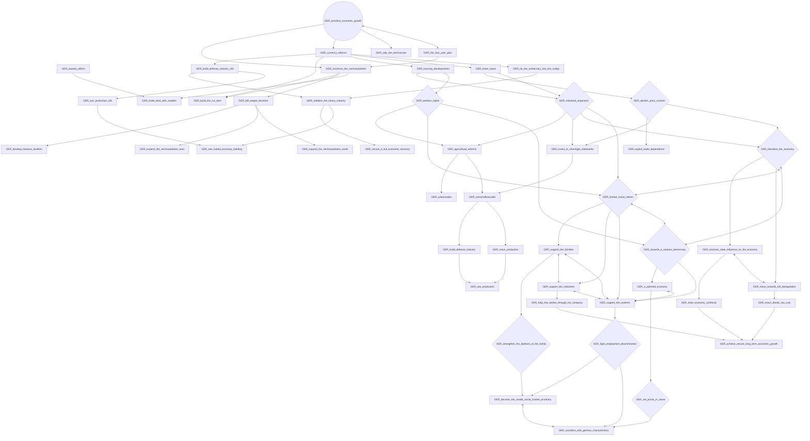

# GER_remilitarize_the_rhineland

```mermaid
flowchart TD
    n37["GER_a_europe_around_the_reich"]
    n38["GER_a_europe_of_the_fatherlands"]
    n43["GER_a_human_face_for_europe"]
    n772["GER_a_strong_successor"]
    n773["GER_absorb_the_abwehr"]
    n59["GER_align_the_balkans"]
    n774["GER_alliance_with_portugal"]
    n775{"GER_alliance_with_spain"}
    n776["GER_alliance_with_the_ussr"]
    n401["GER_ally_chiang_kai_shek"]
    n777["GER_an_invincible_army"]
    n69["GER_an_outstreched_arm_towards_the_east"]
    n778{"GER_anschluss"}
    n406{"GER_anti_comintern_pact"}
    n779["GER_anti_soviet_pact"]
    n72["GER_approach_the_anglosphere"]
    n780["GER_army_indoctrination"]
    n781{"GER_around_maginot"}
    n782["GER_ascension_of_goebbels"]
    n783["GER_ascension_of_goring"]
    n784{"GER_ascension_of_himmler"}
    n785["GER_ascension_of_speer"]
    n786["GER_ascension_of_todt"]
    n412{"GER_asia_department"}
    n787["GER_autonomous_organization_todt"]
    n788["GER_autonomy_in_the_kriegsschulen"]
    n416["GER_befriend_china"]
    n789{"GER_befriend_czechoslovakia"}
    n417["GER_befriend_japan"]
    n790{"GER_befriend_poland"}
    n791["GER_befriend_turkey"]
    n418["GER_blitzkrieg_across_the_pacific"]
    n792{"GER_bribe_senior_officers"}
    n82{"GER_build_a_pakt_around_berlin"}
    n793["GER_challenge_the_monroe_doctrine"]
    n419["GER_claim_old_colonies_in_the_east"]
    n91["GER_clear_the_facist_lair"]
    n425["GER_create_asian_reichskommissariat"]
    n794["GER_crossing_the_atlantic"]
    n795["GER_danzig_for_slovakia"]
    n796{"GER_danzig_or_war"}
    n797["GER_demand_slovenia"]
    n798["GER_demand_sudetenland"]
    n799["GER_demands_to_sweden"]
    n800["GER_demonstration_of_military_achievements"]
    n115["GER_die_letzte_verschwoerung"]
    n801{"GER_employ_philipp_holzmann"}
    n125["GER_encircle_the_entente_powers"]
    n129["GER_end_the_austria_debate"]
    n802["GER_establish_protectorates_in_america"]
    n140["GER_establish_the_european_coal_and_steel_community"]
    n803["GER_expand_claims_in_baltic"]
    n804["GER_expand_gestapo"]
    n805["GER_expand_ss_recruitment"]
    n806["GER_expand_ss_security_duties"]
    n807["GER_expand_the_truppenschulen"]
    n808{"GER_fate_of_czechoslovakia"}
    n809["GER_fate_of_greece"]
    n810{"GER_fate_of_yugoslavia"}
    n811["GER_first_ljubljana_award"]
    n812["GER_first_vienna_award"]
    n813{"GER_form_organization_todt"}
    n814{"GER_form_rome_berlin_axis"}
    n815{"GER_fuhrerprinzip"}
    n816["GER_fund_the_film_department"]
    n168["GER_germans_everywhere_united"]
    n817["GER_glorify_party_rallies"]
    n175["GER_heavy_handed_foreign_policy"]
    n176["GER_heed_von_neuraths_concerns"]
    n818{"GER_hegemony_of_the_ss"}
    n185["GER_increase_factional_defenses"]
    n819{"GER_influence_the_baltics"}
    n820{"GER_influence_the_benelux"}
    n821["GER_influence_the_middle_east"]
    n822["GER_innovative_warfare"]
    n823["GER_integrate_czech_manufacturers"]
    n824["GER_integrate_czechoslovakia"]
    n825{"GER_integration_of_puppet_economies"}
    n826{"GER_invade_italy"}
    n455["GER_japanese_naval_cooperation"]
    n457["GER_kill_hitler"]
    n827["GER_legion_condor"]
    n209["GER_liberation_for_the_sudetendeutsche"]
    n828["GER_loyalty_to_the_fuhrer"]
    n829["GER_ministry_of_public_enlightenment"]
    n830["GER_mittelafrika"]
    n831["GER_molotov_ribbentrop_pact"]
    n219["GER_move_to_restore_brest_litovsk"]
    n464["GER_negotiate_old_colonies_in_the_east"]
    n231["GER_open_the_asia_department"]
    n232["GER_open_up_a_latin_connection"]
    n832["GER_operation_bolivar"]
    n833{"GER_operation_felix"}
    n834["GER_operation_green"]
    n835["GER_operation_isabella"]
    n836["GER_operation_sea_lion"]
    n837["GER_operation_tannenbaum"]
    n838["GER_operation_weserubung"]
    n527["GER_oppose_hitler"]
    n233["GER_oppose_hitler_ww"]
    n839["GER_optimize_reich_labour_service"]
    n840["GER_party_chancellor_bormann"]
    n841["GER_party_chancellor_hess"]
    n842["GER_plenipotentiary_of_armaments"]
    n843["GER_plenipotentiary_of_the_four_year_plan"]
    n844["GER_prepare_for_the_next_blockade_ww"]
    n845{"GER_prioritize_the_four_year_plan"}
    n846{"GER_propaganda_master"}
    n847["GER_puppet_turkey"]
    n848["GER_rally_the_industrialists"]
    n475["GER_re_establish_german_control_over_qingdao"]
    n264{"GER_reaffirm_territorial_claims"}
    n265{"GER_reapproach_the_west"}
    n849{"GER_reassert_eastern_claims"}
    n850["GER_reclaim_former_african_colonies"]
    n272["GER_reestablish_colonial_claims"]
    n851["GER_reintegrate_luxemburg_and_alsace_lorraine"]
    n276{"GER_rekindle_the_franco_german_rivalry"}
    n278{"GER_remilitarize_the_rhineland"}
    n280["GER_renegotiate_versailles_new"]
    n852["GER_reorganize_secret_services"]
    n853{"GER_reorganize_the_wehrmacht"}
    n854["GER_resolve_the_balkan_flank"]
    n855["GER_second_ljubljana_award"]
    n856{"GER_second_vienna_award"}
    n857["GER_secure_finland"]
    n296["GER_secure_western_science_funding"]
    n491["GER_sentinels_of_the_pacific"]
    n858["GER_shatter_usas_hegemony"]
    n301{"GER_solve_the_danzig_issue"}
    n492["GER_south_east_asian_natural_wealth"]
    n304{"GER_step_back_into_the_international_community"}
    n859["GER_strafbataillon"]
    n860["GER_strengthen_the_waffen_ss"]
    n861["GER_subjugate_romanian_economy"]
    n862["GER_subversive_infiltrators"]
    n863["GER_support_a_coup_in_liechtenstein"]
    n864["GER_support_finland"]
    n865["GER_the_final_blow_to_communism"]
    n500["GER_the_proud_eagle_and_the_resurgent_dragon"]
    n866["GER_the_supreme_leader"]
    n867["GER_the_swiss_gold"]
    n868["GER_the_triumphant_will"]
    n869{"GER_total_control_over_domestic_affairs"}
    n337["GER_towards_a_european_research_sphere"]
    n870{"GER_treaty_with_the_ussr"}
    n871["GER_uplift_the_rosenberg_office"]
    n872["GER_utilize_the_nordliche_gesellschaft"]
    n357["GER_vanquish_the_eastern_threat"]
    n873["GER_war_preparations"]
    n874{"GER_war_with_france"}
    n875["GER_war_with_greece"]
    n876["GER_war_with_the_ussr"]
    n877{"GER_wunderwaffe"}
    n82 --> n37
    n82 --> n38
    n82 --> n43
    n818 --> n772
    n877 --> n772
    n825 --> n772
    n846 --> n772
    n869 --> n772
    n804 --> n773
    n209 --> n59
    n129 --> n59
    n775 --> n774
    n833 --> n774
    n814 --> n775
    n826 --> n775
    n870 --> n776
    n416 --> n401
    n800 --> n777
    n304 --> n69
    n853 --> n778
    n278 --> n406
    n406 --> n779
    n272 --> n72
    n168 --> n72
    n185 --> n72
    n357 --> n72
    n792 --> n780
    n790 --> n781
    n796 --> n781
    n815 --> n782
    n815 --> n783
    n815 --> n784
    n815 --> n785
    n815 --> n786
    n813 --> n787
    n792 --> n788
    n278 --> n416
    n412 --> n416
    n778 --> n789
    n406 --> n417
    n412 --> n417
    n808 --> n790
    n789 --> n790
    n876 --> n791
    n491 --> n418
    n492 --> n418
    n278 --> n792
    n304 --> n82
    n794 --> n793
    n416 --> n419
    n276 --> n91
    n265 --> n91
    n401 --> n425
    n464 --> n425
    n836 --> n794
    n790 --> n795
    n849 --> n796
    n778 --> n797
    n778 --> n798
    n838 --> n799
    n176 --> n800
    n853 --> n800
    n785 --> n801
    n82 --> n125
    n175 --> n125
    n264 --> n129
    n793 --> n802
    n858 --> n802
    n280 --> n140
    n849 --> n803
    n784 --> n804
    n176 --> n805
    n853 --> n805
    n784 --> n806
    n788 --> n807
    n812 --> n808
    n855 --> n809
    n811 --> n810
    n797 --> n811
    n854 --> n811
    n798 --> n812
    n786 --> n813
    n808 --> n814
    n856 --> n814
    n278 --> n815
    n829 --> n816
    n209 --> n168
    n301 --> n168
    n129 --> n168
    n839 --> n817
    n840 --> n817
    n304 --> n175
    n278 --> n176
    n773 --> n818
    n860 --> n818
    n37 --> n185
    n38 --> n185
    n849 --> n819
    n790 --> n820
    n796 --> n820
    n847 --> n821
    n791 --> n821
    n780 --> n822
    n788 --> n822
    n824 --> n823
    n808 --> n823
    n789 --> n824
    n843 --> n825
    n781 --> n826
    n820 --> n826
    n417 --> n455
    n278 --> n827
    n264 --> n209
    n818 --> n828
    n877 --> n828
    n825 --> n828
    n846 --> n828
    n869 --> n828
    n782 --> n829
    n850 --> n830
    n853 --> n831
    n301 --> n219
    n417 --> n464
    n272 --> n231
    n168 --> n231
    n185 --> n231
    n357 --> n231
    n272 --> n232
    n168 --> n232
    n185 --> n232
    n357 --> n232
    n794 --> n832
    n814 --> n833
    n826 --> n833
    n836 --> n834
    n833 --> n835
    n775 --> n835
    n874 --> n836
    n874 --> n837
    n796 --> n838
    n790 --> n838
    n841 --> n839
    n840 --> n839
    n815 --> n840
    n815 --> n841
    n801 --> n842
    n845 --> n843
    n873 --> n844
    n783 --> n845
    n816 --> n846
    n776 --> n847
    n839 --> n848
    n841 --> n848
    n416 --> n475
    n304 --> n264
    n304 --> n265
    n778 --> n849
    n826 --> n850
    n874 --> n850
    n276 --> n272
    n265 --> n272
    n874 --> n851
    n264 --> n276
    n265 --> n280
    n873 --> n852
    n278 --> n853
    n778 --> n854
    n810 --> n855
    n808 --> n856
    n789 --> n856
    n838 --> n857
    n872 --> n857
    n265 --> n296
    n455 --> n491
    n464 --> n491
    n794 --> n858
    n264 --> n301
    n401 --> n492
    n464 --> n492
    n176 --> n304
    n115 --> n304
    n780 --> n859
    n806 --> n860
    n790 --> n861
    n796 --> n861
    n852 --> n862
    n778 --> n863
    n779 --> n864
    n876 --> n865
    n401 --> n500
    n425 --> n500
    n777 --> n866
    n874 --> n867
    n778 --> n868
    n817 --> n869
    n848 --> n869
    n38 --> n337
    n831 --> n870
    n176 --> n871
    n853 --> n871
    n819 --> n872
    n43 --> n357
    n219 --> n357
    n176 --> n873
    n781 --> n874
    n838 --> n874
    n810 --> n875
    n406 --> n876
    n787 --> n877
    n842 --> n877
    n37 x--x n38
    n43 x--x n219
    n772 x--x n828
    n774 x--x n835
    n775 x--x n833
    n776 x--x n876
    n779 x--x n831
    n780 x--x n788
    n781 x--x n820
    n787 x--x n842
    n787 x--x n843
    n416 x--x n417
    n789 x--x n798
    n790 x--x n796
    n797 x--x n854
    n115 x--x n278
    n803 x--x n819
    n804 x--x n806
    n814 x--x n826
    n176 x--x n853
    n457 x--x n278
    n837 x--x n867
    n838 x--x n872
    n527 x--x n278
    n233 x--x n278
    n840 x--x n841
    n842 x--x n843
    n265 x--x n276
    n272 x--x n280
    n855 x--x n875
```

# GER_shake_off_the_fascist_yoke_dummy

```mermaid
flowchart TD
    n75["GER_ban_the_reactionaries"]
    n92["GER_collapse_our_institutions"]
    n99["GER_construct_the_karl_marx_cultural_instutute"]
    n107["GER_deal_with_the_conciliators"]
    n108{"GER_deal_with_the_officier_corps"}
    n112["GER_demand_state_approval_for_clergy"]
    n123{"GER_embrace_secularism"}
    n133["GER_enforce_a_secularized_curriculum"]
    n137["GER_ensure_the_gradual_withering_away_of_religion"]
    n144["GER_expand_recruitment"]
    n149["GER_fight_fascism_in_all_its_forms"]
    n157["GER_form_the_sed"]
    n158["GER_form_the_stasi_new"]
    n166["GER_fully_rebuild_the_secret_police"]
    n167["GER_german_entry_into_the_comintern"]
    n173["GER_guarantee_religious_freedom"]
    n179["GER_hold_new_elections"]
    n180["GER_honor_the_legacy_of_marx"]
    n187["GER_industrial_collectivization"]
    n188["GER_industrial_cooperation_2"]
    n198["GER_introduce_the_jugendweihe"]
    n201["GER_kpd_in_coalition"]
    n202["GER_land_reform"]
    n203["GER_learn_from_the_enabling_act"]
    n206["GER_legalize_the_kjvd"]
    n214["GER_mandatory_membership"]
    n227{"GER_nraf_in_coalition"}
    n239["GER_peace_in_the_east"]
    n241["GER_phase_out_the_standing_army"]
    n258{"GER_radicalize_the_workers"}
    n266["GER_reapproachment_with_moscow"]
    n271["GER_redistribute_wealth"]
    n281["GER_resource_trade_2"]
    n292["GER_revolution_by_every_worker"]
    n293{"GER_revolution_in_german_culture"}
    n300(("GER_shake_off_the_fascist_yoke_dummy"))
    n302["GER_spd_in_coalition"]
    n310["GER_tech_sharing_2"]
    n334["GER_the_state_safe_from_within"]
    n335["GER_the_will_of_the_people_unopposed"]
    n338["GER_towards_a_party_state"]
    n342["GER_towards_state_atheism"]
    n344{"GER_undermine_german_democracy"}
    n345["GER_undermine_international_fascism"]
    n352["GER_uplift_the_antifa"]
    n353["GER_uplift_the_black_front"]
    n354["GER_uplift_the_sa"]
    n358["GER_watch_the_churches"]
    n338 --> n75
    n258 --> n92
    n344 --> n92
    n149 --> n99
    n180 --> n99
    n293 --> n107
    n201 --> n108
    n227 --> n108
    n358 --> n112
    n302 --> n123
    n201 --> n123
    n173 --> n133
    n342 --> n133
    n198 --> n137
    n112 --> n137
    n158 --> n144
    n107 --> n149
    n338 --> n157
    n293 --> n158
    n239 --> n167
    n123 --> n173
    n214 --> n180
    n107 --> n180
    n201 --> n187
    n239 --> n188
    n133 --> n198
    n342 --> n198
    n179 --> n201
    n300 --> n201
    n271 --> n202
    n258 --> n203
    n344 --> n203
    n201 --> n206
    n206 --> n214
    n293 --> n214
    n266 --> n239
    n354 --> n241
    n352 --> n241
    n353 --> n241
    n201 --> n258
    n201 --> n266
    n227 --> n271
    n302 --> n271
    n201 --> n271
    n188 --> n281
    n241 --> n292
    n201 --> n293
    n188 --> n310
    n144 --> n334
    n157 --> n335
    n75 --> n335
    n203 --> n338
    n92 --> n338
    n123 --> n342
    n201 --> n344
    n334 --> n345
    n108 --> n352
    n227 --> n353
    n108 --> n353
    n227 --> n354
    n108 --> n354
    n342 --> n358
    n166 --> n358
    n158 --> n358
    n92 x--x n203
    n158 x--x n166
    n173 x--x n342
    n352 x--x n353
    n352 x--x n354
    n353 x--x n354
```

# GER_strengthen_the_kriegsmarine

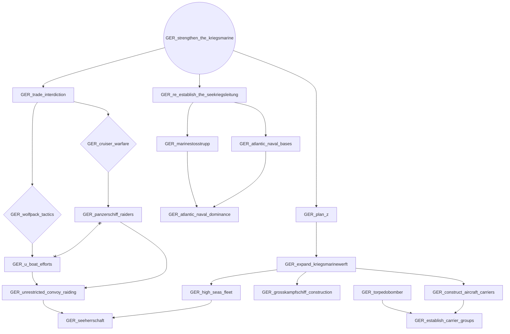

# GER_the_four_year_plan

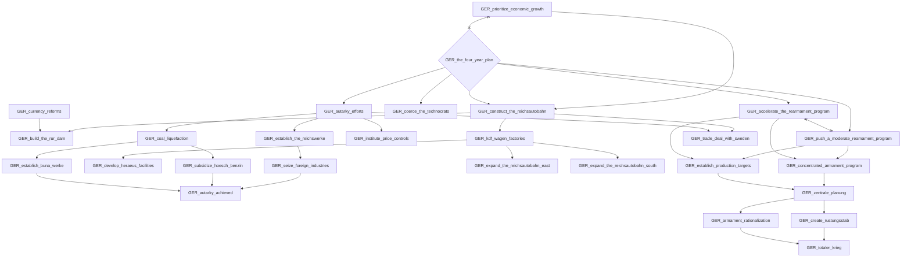
