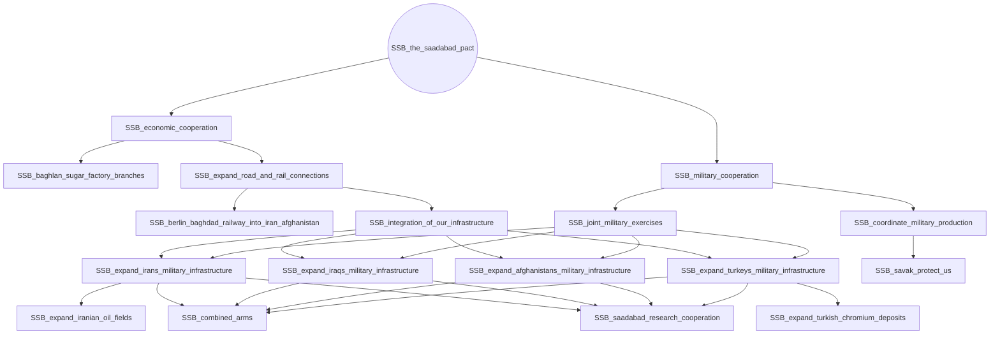

# SSB_the_saadabad_pact

```mermaid
flowchart TD
    n1["SSB_baghlan_sugar_factory_branches"]
    n2["SSB_berlin_baghdad_railway_into_iran_afghanistan"]
    n3["SSB_combined_arms"]
    n4["SSB_coordinate_military_production"]
    n5["SSB_economic_cooperation"]
    n6["SSB_expand_afghanistans_military_infrastructure"]
    n7["SSB_expand_iranian_oil_fields"]
    n8["SSB_expand_irans_military_infrastructure"]
    n9["SSB_expand_iraqs_military_infrastructure"]
    n10["SSB_expand_road_and_rail_connections"]
    n11["SSB_expand_turkeys_military_infrastructure"]
    n12["SSB_expand_turkish_chromium_deposits"]
    n13["SSB_integration_of_our_infrastructure"]
    n14["SSB_joint_military_exercises"]
    n15["SSB_military_cooperation"]
    n16["SSB_saadabad_research_cooperation"]
    n17["SSB_savak_protect_us"]
    n18(("SSB_the_saadabad_pact"))
    n5 --> n1
    n10 --> n2
    n11 --> n3
    n6 --> n3
    n9 --> n3
    n8 --> n3
    n15 --> n4
    n18 --> n5
    n14 --> n6
    n13 --> n6
    n8 --> n7
    n14 --> n8
    n13 --> n8
    n14 --> n9
    n13 --> n9
    n5 --> n10
    n14 --> n11
    n13 --> n11
    n11 --> n12
    n10 --> n13
    n15 --> n14
    n18 --> n15
    n11 --> n16
    n6 --> n16
    n9 --> n16
    n8 --> n16
    n4 --> n17
```
